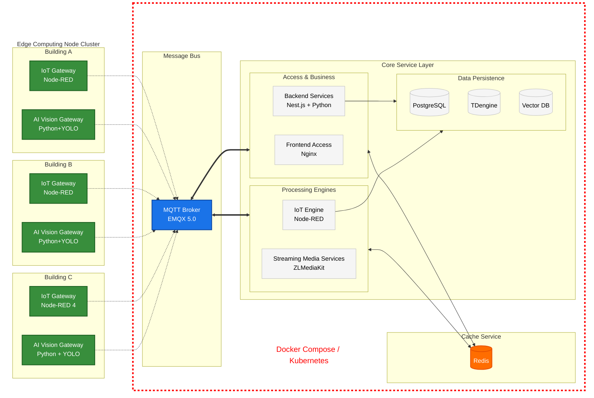
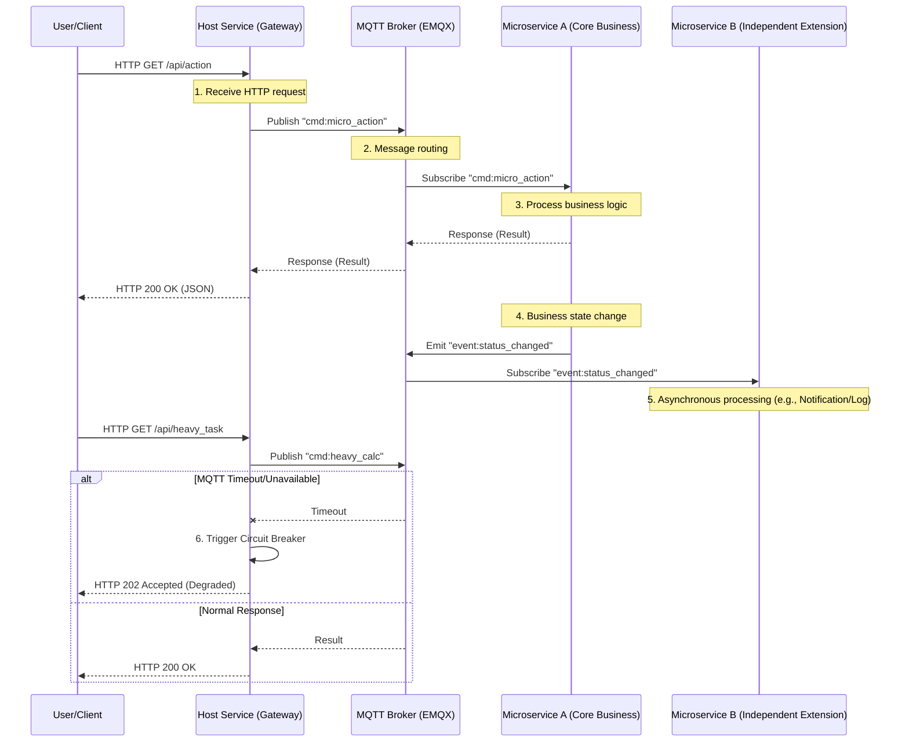
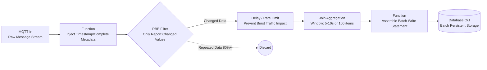

# Practicing "Technological Life Form" in Green Buildings: BuildingOS High-Availability Architecture and L5 AI Autonomous Evolution

## Preface: The Awakening of Buildings—Constructing Truly Living Tech-Architecture (BuildingOS)

> **"A building is no longer a static spatial enclosure, but an awakening 'Technological Life Form'."**

As the global smart building market surges with a Compound Annual Growth Rate (CAGR) exceeding 20%, we are witnessing not just rapid expansion in scale, but a qualitative leap in system "density" and complexity. With IoT connections in a single building easily surpassing 100,000 nodes, traditional Integrated Building Management Systems (IBMS) struggle to handle millions of message pulses per second. Meanwhile, driven by global carbon neutrality consensus and strict regulations, energy efficiency has evolved from an "optional feature" to a "survival baseline." The deep integration of the IoT world has triggered an explosion in business demand: from intelligent security and fire safety to pedestrian and vehicle access management, to office-centric scenarios like meeting room control, space booking, and end-to-end visitor management—everything revolves around the building.

Buildings are being radically redefined. They are no longer static spatial enclosures but have evolved into "Technological Life Forms" with full capabilities for **perception, thought, decision-making, self-healing, and evolution**. These organisms autonomously learn, continuously optimize energy efficiency, and predict maintenance during 24/7 perpetual operation, ultimately reaching L5 fully autonomous evolution—achieving optimal energy efficiency, user comfort, and carbon reduction goals without human intervention.

The transformation of smart buildings from basic automation (BAS) to comprehensive digital operation is unstoppable. Traditional siloed architectures cannot cope with massive real-time data throughput and complex multi-tenant business needs. We need a new paradigm—an operating system-level architecture that can self-regulate, self-repair, and continuously evolve like a living organism.

BuildingOS is the practitioner of this paradigm. With high availability and high concurrency as its core foundation, it integrates cloud-edge-terminal synergy, Domain-Driven microservices, and AI autonomous evolution to truly "awaken" buildings. From the high-availability organ system at birth, to immune self-healing during growth, to mature AI-driven L5 autonomous evolution, and finally to large-scale "reproduction" through standardized templates and the BaaS model—BuildingOS injects full vitality into every building.

This article follows the full lifecycle of a technological life form as its main thread, combined with real-world projects, to narrate its process of awakening and growth. This is not just a technical whitepaper, but a practical response to the core green building philosophy of "Invest for Impact"—realizing quantifiable energy reduction, carbon mitigation, and long-term operational returns through forward-looking investment in AI, high-availability architecture, and autonomous evolution.

Let us witness the awakening of buildings together.

---

### Data References (Jan 2026)

1. **Fortune Business Insights (2025/2026)**
   * **Report**: *Smart Building Market Size, Share & Growth Report [2032]*
   * **Core Data**: Global market size is projected to grow from **$143 billion** in 2025 to **$548.5 billion** by 2032, with a CAGR of **21.2%**.
   * **Key Trends**: Emphasizes the reshaping of the market by AI and cloud-native Digital Twin platforms, becoming the core drivers for decarbonization and high-performance buildings.

2. **Grand View Research (2025)**
   * **Report**: *Smart Building Market Size, Share & Trends Analysis Report (2025-2033)*
   * **Core Data**: The market enters a period of explosive growth after 2026, with CAGR stabilizing in the **18.9% - 30.4%** range; software services supporting millions of concurrent connections grow the fastest.
   * **Key Trends**: AI-driven intelligent systems and edge computing will become mainstream, significantly enhancing energy efficiency and building resilience.

3. **Sustainability Trend (2026 Perspective)**
   * **Insight**: Digital operations and maintenance have become the long-term essential path to achieving green building standards and carbon reduction. 2026 is the critical node where sustainability shifts from a "marketing slogan" to an "operating system," and L5 autonomous evolution systems will become the core investment direction for net-zero carbon goals.

---

### Practicing Buildings

#### Wangchao Center—BuildingOS's First "Technological Life Form" in Reality

Wangchao Center is a core landmark in Qianjiang Century City, Hangzhou, and the first full-scale practice project where BuildingOS moved from concept to reality. Adjacent to a subway station, the building exemplifies Transit-Oriented Development (TOD). As a complex integrating offices, hotels, and retail spaces, Wangchao Center achieved a complete life cycle from basic automation to L5 AI autonomous evolution through BuildingOS: the high-availability architecture ensured perpetual operation after "birth," cloud-edge collaborative AI drove continuous energy self-optimization, and it finally achieved a quantifiable investment return of 28% annual energy reduction and over 1,200 tons of CO₂ carbon mitigation.


**Project Overview:**

*   **Address**: Qianjiang Century City, Hangzhou, China
*   **Site Area**: 10,418 m²
*   **Building Height**: 280 m
*   **Number of Floors**: 57 (55 above ground + 2 below ground)
*   **Total GFA**: 125,000 m²
*   **Actual Capacity**: 4,500 people (office peak)
*   **IoT Node Scale**: Over 50,000 active devices (lighting, HVAC, access, security, meeting systems)
*   **BuildingOS Deployment**: Launched in April 2024, operated stably throughout 2025 and completed AI evolution iterations

**Awards & Certifications (as of Jan 2026):**

*   **2024, Pro+ Award**: Architectural Society of Shanghai China (ASSC)
*   **2024, CREDAWARD**: China Real Estate & Design Award (CREDAWARD)
*   **2024, CTBUH Award of Excellence (Best Tall Building)**: Council on Tall Buildings and Urban Habitat (CTBUH)
*   **Sustainability Certification**: LEED BD+C CS (Core & Shell) Silver

---

### Guide

**Chapter 1: Birth—From "Automation" to "Life Form"**
Re-examining the complexity of building IoT applications, proposing the path and practice case studies for modern building intelligence.

**Chapter 2: Structure—Design Practices for Technological Life Forms**
A deep dive into high-availability and high-concurrency architectures, revealing how to build a "robust body" that supports million-level throughput and zero downtime.

**Chapter 3: Evolutionary Rehearsal—Pre-birth Simulation and Digital Twin**
Before the life form officially enters the physical world, how to conduct millions of "prenatal educations" and scenario rehearsals in a virtual mirror.

**Chapter 4: Health Maintenance—Immune Systems and Intelligent Diagnosis**
Constructing a self-healing O&M system that monitors and repairs system hidden dangers in real-time, just as a medical system treats a human.

**Chapter 5: Learning and Evolution—AI Empowerment and L5 Autonomy**
Gifting buildings with "wisdom," demonstrating how the system achieves the leap from basic linkage to advanced autonomy through continuous learning.

**Chapter 6: Maturity and Reproduction—Scaling Expansion with BaaS Model**
Exploring how technological life forms achieve rapid replication and reproduction across regions and industries through standardized templates.

---

# Chapter 1: From "Automated Building" to "Technological Life Form"—Complexity and Evolution of Smart Building Systems

## 1.1 Positioning the Complexity of Smart Building Systems

Traditional Building Automation Systems (BAS) have operated stably for decades, but the explosive development of IoT technology has brought traditional systems face-to-face with the following challenges:

### 1.1.1 Introduction of Large-Scale New Intelligent Devices

IoT technology has significantly enhanced overall intelligence levels while introducing many new types of devices, including but not limited to:

*   **Lighting Management**: Integration of various on-off devices and wireless smart switches to achieve refined and scenario-based control.
*   **Energy Saving Management**: Constructing comprehensive human sensors based on vision cameras and multi-modal perception devices to support dynamic environmental adjustment and energy optimization.
*   **Access Management**: Deep linkage between gates, vehicle barriers, and elevator control to form a collaborative transit system for personnel and vehicles.
*   **HVAC Management**: Intelligent scheduling and precise control for various HVAC equipment such as water-cooled and refrigerant-cooled systems.
*   **Meeting Room Management**: Integration of electric curtains, audio-visual systems, supporting one-key scenario switching and multimedia collaboration.
*   **Future Expansion**: The system must reserve open interfaces and scalability for intelligent terminals, inspection robots, and service robots expected to be deployed on a large scale in the AI era.
*   **Sensors**: Temperature, humidity, light, motion detection, environmental noise, etc.
*   **Actuators**: Lighting switches, smart switches, motors, actuators, etc.
*   **Communication Modules**: Wi-Fi, Bluetooth, Zigbee, LoRa, etc.
*   **Data Processing Modules**: Microcontrollers, single-board computers (such as Raspberry Pi), etc.


::: info Practice Case: IoT Device Distribution in Wangchao Center
**Types and scale of IoT devices used in Wangchao Center:**

*   **Lighting System**: Modbus on-off controllers, KNX on-off controllers, Zigbee wireless switches, DALI protocol smart switches.
*   **HVAC**: KNX controllers, Zigbee wireless control panels, AC gateways.
*   **Environmental Perception**: Modbus environmental sensors (temperature, humidity, TVOC, formaldehyde, CO2), Zigbee wireless environmental sensors (light, noise), specialized bathroom sensors.
*   **Access Management**: Barriers, floor access control, indoor access control, fire access control, facial recognition subsystems.
*   **Security Perception**: Zigbee wireless human sensors (motion, noise), vision sensors, Zigbee water leakage sensors.
*   **Energy Metering**: Modbus power sensors (voltage, current, power), smart meters.
*   **Vertical & Vehicle Transportation**: Elevator subsystems, parking subsystems.
*   **End-Execution**: Electric curtains, electric motors, actuators, etc.

**Statistical Scale**: A total of **50,000+** IoT devices are connected throughout the building (including subsystem end-devices).
:::

### 1.1.2 Deep Coupling of Multi-modal Subsystems

Modern building IoT applications are no longer isolated silos but deeply linked organic wholes:

*   **Synergy between Lighting and Energy Saving**: Evolving from simple timed on-off to "multi-modal regulation" integrating vision AI and environmental perception. Using cameras to identify crowd density and light distribution to generate real-time lighting strategies.
*   **Access and Space Collaboration**: Second-level linkage between access control, vehicle barriers, elevator control, and meeting reservation systems. For example: when a visitor's vehicle enters the garage, the system automatically assigns elevator control and initiates environmental preheating in the target meeting room.
*   **Robot Collaboration Network**: Reserving low-latency control links and spatial semantic map interfaces for inspection and delivery robots, making them part of the building's life form.


### 1.1.3 Traffic Models and the "Density Challenge"

Why do traditional systems collapse? We can establish a typical traffic model for a single building:

*   **Perception Scale**: 100,000 active IoT nodes (including temperature control, lighting, security, and environmental monitoring).
*   **Reporting Frequency**: Core devices report status once every 1s, and AI vision metadata generates 10-50 structured messages per second.
*   **Message Peaks**: During periods like the morning peak, instantaneous message throughput can exceed **1 million/s**.
*   **Bottleneck Analysis**: Traditional BAS systems based on relational databases rapidly experience I/O blocking when faced with such continuous high-frequency pulse writes.

In this context, traditional building automation is being fully replaced by dedicated building IoT application systems. The complexity of building IoT applications is mainly reflected in the following four dimensions:

1.  **Highest Integration Complexity**: Smart building (campus) systems belong to one of the most complex categories in the IoT application spectrum. They not only need to interface with massive sensors, controllers, and various protocols (BAS) but also deeply integrate with business IT systems such as security, energy management, and property operations. Compared to smart cities, smart agriculture, and smart factories, the complexity of heterogeneous protocol integration, real-time requirements, and multi-role concurrent access is significantly higher.
2.  **"Technological Life Form" Characteristics**: Once the system is online, it must operate 24/7 without interruption. Any brief disruption could trigger security failures, energy loss, or a collapse in user experience. High availability (99.99%+) and high concurrency thus become the fundamental architectural basis for system survival.
3.  **Multi-user Touchpoints and Decoupling Challenges**: Diverse user roles (property managers, office tenants, visitors, O&M engineers, etc.) and numerous touchpoints (mobile terminals, large screens, self-service terminals, etc.). This requires the architecture to deeply decouple business scenarios through microservices while establishing a unified IoT access layer and standardized message bus rules.


4.  **Multi-dimensional Construction and AI-driven L5 Evolution**: Advanced capabilities rely heavily on data accumulation after long-term operation. This process places extreme requirements on the underlying high-availability architecture—any data loss or service interruption will directly block the growth path of the "Technological Life Form."

## 1.2 The Metaphor of "Technological Life Form" and Core Requirements

Comparing a smart building system to a "Technological Life Form" is not a figure of speech but a precise characterization of its essential attributes. It corresponds to rigorous technical implementation levels:

*   **Nervous System (Communication and Perception)**:
    *   **Peripheral Nerves**: Hybrid deployment of traditional industrial protocols like BACnet, KNX, Modbus, DALI and new IoT protocols like Zigbee, LoRaWAN, Matter.
    *   **Nerve Plexus (Edge Computing)**: Node-RED and edge computing nodes responsible for converting heterogeneous protocols into standardized spatial semantic data in real-time.
*   **Blood Circulation (Message Bus)**: Efficient message flow based on MQTT 5.0, ensuring information reaches every controller in real-time, achieving "millisecond-level conditioned reflexes."
*   **Memory Center (Storage System)**:
    *   **Instantaneous Memory**: Redis caches the current building state.
    *   **Eternal Memory**: TDengine/TimescaleDB records massive histories, providing data nourishment for AI evolution.


### Core Requirements:

*   **Zero Downtime**: Just as a biological organism cannot withstand long periods of "unconsciousness," the system must achieve 24/7 continuous operation after going online.
*   **Self-adaptation and Growth**: The system needs to continuously accumulate data and iterate models during operation, supporting functional expansion and AI capability injection.
*   **Core Survival Requirements**: High availability (99.99%+, annual downtime < 53 minutes) and high concurrency (single buildings supporting 100,000+ device connections, million-level messages/second throughput) constitute its "heartbeat" and "blood circulation" systems.

Therefore, smart building engineering is a complex system project that requires rigorous prior planning. It should be approached from the perspective of a "Technological Life Form," prioritizing core requirements of zero downtime, self-adaptation, and continuous growth.

## 1.3 Multi-dimensional Construction Goals and AI-driven L5 Evolution Path

The construction of smart building systems presents a clear multi-dimensional path:

*   **Basic Dimension**: Security (video fusion, intrusion detection), energy saving (dynamic optimization of lighting + HVAC), and humanization (self-adaptive adjustment of environmental comfort).
*   **Service Dimension**: Self-service (space reservation, end-to-end visitor management), and intelligent operations (asset management, predictive maintenance).
*   **Evolution Path**: Referencing the SAE autonomous driving standards, we have defined a clear evolution path for BuildingOS.


| Level | Name | Core Characteristics | Technical Performance |
| :--- | :--- | :--- | :--- |
| **L1** | **Basic Automation** | Rule-based | Simple If-Then logic (e.g., timed switching, sensor-activated lighting). |
| **L2** | **Data-driven Collaboration** | Scenario-based | Cross-subsystem linkage (e.g., lights automatically turn on after swiping a card to enter). |
| **L3** | **Conditional Autonomy** | Decision Support | The system can automatically adjust energy consumption strategies in specific scenarios, requiring off-post supervision. |
| **L4** | **High Autonomy Operation** | Predictive Operations | Possesses predictive maintenance capabilities, able to regulate HVAC in advance based on crowd flow prediction. |
| **L5** | **Full Autonomous Life Form** | Autonomous Evolution | **"Driverless Building"**. The system has self-healing and self-optimization capabilities, automatically reorganizing logic across subsystems. |

The realization of this evolution path is inseparable from the solid foundation of high availability and high concurrency. Only by ensuring the perpetual operation of the system can data be accumulated without interruption, AI models can continue to learn, and the "Technological Life Form" can truly grow and display full vitality.

---

# Chapter 2: High-Availability and High-Concurrency Architecture Design and Implementation

## 2.1 Logical Decoupling and Physical Aggregation—Avoiding Traditional IT Architecture Pitfalls

When constructing BuildingOS, the most dangerous tendency is to view the smart building system as a "traditional IT system with hardware interfaces." While modern internet architectures provide high-availability and high-concurrency references, smart building systems are fundamentally different in terms of spatiotemporal attributes, protocol complexity, and fault boundaries. The core challenge lies in balancing the flexibility of software logic with the stability of the physical world. A smart building system is by no means just "IT system + sensors," but a redistribution of architectural gravity.

### 2.1.1 Differences in Basic Structure

| Component Dimension | Traditional IT System Architecture | Building System Architecture |
| :--- | :--- | :--- |
| **Perception Layer** | H5/Mini Program/PC (Manual Input) | 100,000+ sensor arrays, vision AI, streaming media (Automatic Perception) |
| **Central Nervous System** | HTTP/RESTful (Short Connection), MQ | **MQTT 5.0 (Long Connection)**, WebSocket, Industrial Bus |
| **Logic Layer** | Centralized Backend Services (SpringCloud/NestJS) | **Backend Services + Node-RED Orchestration Engine + AI Vision Algorithms** |
| **Execution Layer** | Database write-back | Edge gateways, controllers, actuators, robot instruction sets |
| **Memory Storage** | Relational Database (MySQL/PG) | **PG + Time Series Database (TDengine) + Vector Database** |

### Architecture Pattern Comparison


### 2.1.2 Design Strategy Comparison: Shifting from "Request-driven" to "Closed-loop Feedback"

Smart building systems cannot simply replicate traditional IT architectures because of fundamental differences in their core interaction logic and resource allocation focus.

#### A. Interaction Paradigm: Shifting from "Request-driven" to "Closed-loop Feedback"

Traditional IT systems are essentially **one-way request-driven models**. A user initiates a click, the server processes the logic and writes back to the database, and the entire chain is completed after the data is written.
BuildingOS is a **full-duplex event feedback model**. It does not rely on active human triggers but generates actions based on "state changes":

*   **Traditional Flow**: Frontend (Manual Input) → Backend (Logic Processing) → Database (Static Persistence).
*   **BuildingOS Flow**: Perception (Sensor State Change) → Logic (Node-RED Orchestration/AI Decision) → Execution (Controller Action) → Re-perception (State Closed-loop Confirmation).
This requires the system not only to handle "storage" but also to process "transfer" and "distribution" in real-time.

#### B. Architectural Center of Gravity: Shifting from "Top-heavy" to "Balanced Top and Bottom"

This is the watershed in K8s orchestration strategies between BuildingOS and large internet architectures:

*   **Traditional IT's "Top-heavy" (Extreme refinement of distributed logic)**:
    To support non-equilibrium concurrency of hundreds of millions of users (such as flash sales), IT systems focus on the **logic layer (top)**. Architects break down business into hundreds or thousands of microservices to cope with logic-side complexity, while the underlying physical resources (compute, network, storage) are viewed as completely transparent, homogeneous computing pools.
*   **BuildingOS's "Balanced Top and Bottom" (Physical aggregation and BaaS-ification)**:
    Building business (such as HVAC regulation, security patrols) has strong physical boundaries. We also use K8s, but the focus is not on infinite splitting of the logic side, but on building a **robust physical base (bottom)**.
    *   **Solid Base**: We abstract hardware capabilities as **BaaS (Building as a Service)**. The center of gravity of the architecture lies in ensuring strong coupling and high availability of the IoT engine, edge gateways, and core databases at the physical resource layer.
    *   **Light Top**: The logic layer remains moderately split, focusing on the flexible combination of business scenarios. This "top-to-bottom ratio" ensures that when upper-level business (top) iterates or fluctuates, the underlying physical feedback chain (bottom) remains as steady as a mountain.

#### C. Fault Tolerance Logic: Shifting from "Graceful Degradation" to "Edge Autonomy"

In IT design, if a central server fails, "graceful degradation" is usually adopted, i.e., closing non-core businesses. But in building systems, key functions (such as fire linkage, elevator control, core lighting) have no room for degradation.

*   **Offline Survival**: BuildingOS introduces **"vegetative nervous system" design**. When the cloud center (brain) stutters, edge nodes deployed on-site must be able to rely on local logic aggregation to independently complete closed-loop tasks, achieving physical-level disaster redundancy.

## 2.2 Deep Selection and Synergy of Core Components

Combined with the similarities and differences with IT and the experience of landing practice iterations, the component selection list is as follows (the design template is for a building environment with 100,000 sensors, 1 million/s data traffic, and thousands of users):

| Level/Component | Core Technical Selection | Key Features and Roles |
| :--- | :--- | :--- |
| **Frontend Access** | **Nginx** | Load balancing, reverse proxy, static resource service |
| **Backend Service** | **Next.js + Python** | Node.js handles I/O-intensive concurrent tasks, Python handles AI logic and computing tasks |
| **Caching System** | **Redis** | Business state caching, hot data acceleration (Business Memory) |
| **Message Bus** | **MQTT (EMQX 5.0)** | Supports millions of concurrent connections and real-time message routing, the system's "blood circulation" |
| **Data Storage** | **PostgreSQL** | Relational business data storage (Business Memory) |
| | **TDengine** | High-throughput writing and compressed storage of massive time-series data (Sensory Memory) |
| | **Vector DB** | Vector database, supporting RAG and knowledge base retrieval (AI Knowledge Base) |
| **Streaming Service** | **ZLMediaKit + FFmpeg** | Video stream transcoding, WebRTC low-latency distribution, frame capture processing |
| **IoT Engine** | **Node-RED 4** | Business logic orchestration, heterogeneous protocol adaptation, low-code development |
| **Edge Gateway** | **Node-RED 4 (IoT)** | Deployed at the edge, responsible for protocol parsing, data cleaning, and network-disconnection autonomy |
| | **Python + YOLO (AI)** | Edge-side vision inference, real-time target detection and model training |
| **AI Large Model** | **LangChain + LangSmith** | LLM application orchestration, debugging, and monitoring |
| | **Local Specialized Model** | Privatized deployment of vertical domain large models, ensuring data privacy and professionalism |

### System Architecture Diagram




## 2.3 The "Lifeline" of High-Availability Design

To achieve 99.99% availability, BuildingOS implements multiple layers of protection in its architecture:


*   **Containerized Orchestration (K8s)**: Services are auto-discovered, load-balanced, and self-healed through Kubernetes. All core components (backend, frontend, Node-RED, MQTT cluster) run as microservices.
*   **Multi-tenant Business Decoupling**: Using microservices architecture, businesses such as security, energy saving, and visitors are completely split. The upgrade or failure of a single business module will never affect other functions of the life form.
*   **Edge Autonomy**: Utilizing the edge autonomy capabilities of IoT edge gateways and AI edge meshes to complete multiple sets of closed-loop strategies, ensuring that in the event of an IT system failure, degraded operation can be completed relying only on the power system.

### 2.3.1 Containerized Deployment and Kubernetes Clusters

The production-grade deployment of BuildingOS adopts a fully containerized solution, supporting both Docker Compose (single-machine/small-scale verification) and Kubernetes (production cluster) modes. The core goal is to achieve high availability (99.99%+), elastic scaling, and zero-downtime rolling updates. It finally follows the deployment pattern of containerization → Kubernetes clustering → Local PaaS layer.

All components are first fully containerized: each service (frontend, backend, database, message bus, IoT engine, streaming media, etc.) is built as an independent Docker image. Containerization is the prerequisite for achieving private cloud-native deployment, ensuring environment consistency, portability, and rapid startup capabilities.

On this basis, clustering management and high availability are achieved through Kubernetes:
*   Kubernetes is responsible for service discovery, load balancing, self-healing, rolling updates, and elastic scaling.
*   All stateful services (PostgreSQL, Redis, TDengine, EMQX) use StatefulSet, while stateless services use Deployment.
*   Health checks (liveness/readiness probes) and resource limits (requests/limits) ensure stable Pod operation.

Finally, the entire Kubernetes cluster can be flexibly deployed to:
*   **Private Cloud/Hybrid Cloud PaaS Layer**: Such as VMware Tanzu, Red Hat OpenShift, Rancher.
*   **Self-built Hyper-converged Infrastructure**: Based on hyper-converged platforms such as VMware vSphere, Huawei FusionSphere, Nutanix, etc., installing native Kubernetes or using its integrated distribution.

This layered design ensures that BuildingOS can seamlessly adapt to different customer infrastructure strategies, supporting both rapid cloud adoption and strict localized deployment requirements.

#### 2.3.1.1 Production Environment Resource Estimation (Wangchao Center Case Study)


Taking Wangchao Center (57 floors, GFA 125,000 m², Grade A office building with 4,500 permanent office workers) as an example for resource estimation:

| Item | Estimation Basis | Quantity/Peak |
| :--- | :--- | :--- |
| **Active IoT Devices** | Lighting, HVAC terminals, environmental sensors, human sensors, access control, elevators, meeting room terminals, etc. | ≈ 100,000 nodes (max load) |
| **Time Series Write Peak** | Core devices report every 1-5 seconds, vision AI events tens per second | Peak ≈ 800,000 - 1,200,000 rows/s |
| **MQTT Concurrent Connections** | Long connections for all devices + edge gateways + frontend WebSocket | ≈ 120,000 concurrent connections |
| **Business Concurrent Users** | Concurrent access by property, tenants, management mobile/large screen | Peak ≈ 1,000 - 1,500 people |
| **Video Stream Concurrency** | Security cameras + meeting room video | Peak ≈ 300 - 500 channels |
| **Data Storage (30 Years)** | Time series data growth ≈ 10-15TB/year (after compression) | Total ≈ 300 - 450TB |

#### 2.3.1.2 Kubernetes Production Cluster Resource Planning

Based on the above load, a minimum production cluster size of **5 nodes** (3 Master + 2 Worker, scalable) is recommended, with the following node specifications:

| Node Type | Node Count | vCPU | Memory | System Disk | Data Disk (NVMe SSD) | Purpose |
| :--- | :--- | :--- | :--- | :--- | :--- | :--- |
| **Master** | 3 | 8 | 32GiB | 100GB | - | etcd, API Server, Controller |
| **Worker** | 2+ | 32 | 128GiB | 100GB | 2TB (per node) | Business Pods, storage volumes |

#### 2.3.1.3 Component Resource Allocation (Kubernetes Deployment/StatefulSet)

| Service | Replicas | CPU Req/Limit | Memory Req/Limit | Storage (per replica) | HA Strategy |
| :--- | :--- | :--- | :--- | :--- | :--- |
| **Frontend (Nginx)** | 3-5 | 200m / 1c | 256Mi / 512Mi | - | HPA + Ingress |
| **Backend (NestJS)** | 4-6 | 1c / 2c | 1Gi / 2Gi | 10Gi (Logs/Uploads) | HPA + Anti-Affinity |
| **PostgreSQL** | 1 (M) + 1 (S) | 2c / 4c | 4Gi / 8Gi | 100Gi | StatefulSet + PG HA |
| **Redis** | 3 (Sentinel) | 500m / 2c | 1Gi / 4Gi | 20Gi | StatefulSet + Sentinel |
| **TDengine** | 3 (Cluster) | 4c / 8c | 8Gi / 16Gi | 500Gi-1TB | StatefulSet + dnode cluster |
| **EMQX** | 3-5 | 2c / 4c | 4Gi / 8Gi | 50Gi | StatefulSet + Core/Replicant |
| **Node-RED** | 3 | 500m / 2c | 1Gi / 2Gi | 20Gi (flows) | Deployment + ConfigMap |
| **ZLMediaKit** | 3 | 4c / 8c | 4Gi / 8Gi | 200Gi (Cache) | Deployment + GPU/NPU |
| **Grafana** | 2 | 500m / 2c | 1Gi / 2Gi | 20Gi | Deployment |

**Estimation Logic Notes**:
- **CPU**: TDengine/EMQX/ZLMediaKit are CPU-intensive; reserve 2-3x margin based on peak message/stream processing.
- **Memory**: Time series writes require large memory buffers; TDengine suggests 4-8GiB per core.
- **Storage**: TDengine compression ratio is about 10:1; 30-year raw data is about 3-5PB, compressed to 300-500TB; distributed storage (e.g., Ceph or cloud disks) is recommended.
- **Elasticity**: Configure Horizontal Pod Autoscaler (HPA) based on CPU (70%) or custom metrics (MQTT connections, TD write QPS).

#### 2.3.1.4 Comparison of Deployment Methods

| Deployment Method | Application Scenario | HA Capability | O&M Complexity | Recommendation |
| :--- | :--- | :--- | :--- | :--- |
| **Docker Compose** | Small buildings, verification environments | High single point risk | Low | ★★ |
| **Kubernetes** | Mid-large office buildings, production environments | Multi-node self-healing | Medium | ★★★★★ |

Kubernetes cluster deployment is strongly recommended for production environments to ensure the continuous operation of the "Technological Life Form" in scenarios such as node failure, Pod drift, and network partitioning.

### 2.3.2 Multi-tenant Business Decoupling—Microservices Splitting and Collaboration

BuildingOS takes a pragmatic and cautious strategy in microservices splitting: the business logic of building IoT systems is relatively simpler and more stable than traditional internet IT systems, so it does not pursue overly fine-grained microservices splitting, but evolves targetedly according to actual business requirements and load characteristics. This principle stems from years of practical experience in smart building projects, avoiding the operational complexity and distributed transaction overhead brought by blind "microservices-ification."

#### A. Splitting Strategy: Business Domain-Oriented

*   **Core Concept**: Microservice boundaries are oriented by business domains (Domain), rather than mechanical functional cutting. Medium-grained services (5-10 core domains) are adopted in the early stage, and only independently split under explosive growth or high concurrency scenarios.
*   **Why Not Complex Splitting**:
    *   The core business of building IoT (such as space management, energy regulation, access control) has low change frequency and relatively certain logic, unlike e-commerce or financial systems that face frequent business innovation and massive transactions.
    *   Excessive splitting introduces additional burdens of distributed transactions, link tracing, and service governance, while building systems need to focus more on real-time performance and reliability in the physical world.
*   **Practical Project Verification**: In most building scenarios, 80% of the load is concentrated on device access, data collection, and simple rule execution, which can be efficiently handled through the IoT engine (Node-RED) and message bus, without the need to disperse into numerous microservices.
*   **Independent Operation for Explosive Scenarios**: When certain sub-domains have obvious high concurrency or independent evolution requirements (such as video analysis, security event processing, visitor peak traffic), they will be independent as dedicated microservices to achieve horizontal expansion and independent deployment. For example, the video stream processing service (integrating ZLMediaKit) can be independently and elastically expanded during peak periods without affecting the core energy management domain.

Wangchao Center Smart Building System Splitting Practice:
Microservices Splitting: Visitor module, Access module, IoT Simulator module, Video AI module, Alarm Center module:


#### B. Microservices Collaboration Framework: MQTT-based Event-Driven

In BuildingOS, collaboration between microservices and host services (main app or Gateway) is mainly achieved through **MQTT Transporter**. This fully leverages the native support of NestJS microservices architecture, using EMQX as the central message bus to achieve asynchronous, event-driven loosely coupled communication. Meanwhile, it supports Hybrid application mode (HTTP + MQTT) and can configure HTTP as a degradation path to ensure high availability.

The core of NestJS microservices architecture is the Transporter layer. The MQTT transporter provides both **Request-Response** and **Event-based** communication modes.

##### 1. Microservices Registration and Discovery Mechanism
*   **No Explicit Registration**: NestJS microservices do not rely on external service registration centers like Consul/Eureka. When a microservice starts, it creates an MQTT client through `ClientsModule.register()` or `@Client()` and connects to the EMQX Broker.
*   **Dynamic Discovery**: The Broker is responsible for message routing. Microservices listen for specific Topic patterns (using `@MessagePattern()`), and clients send messages through proxies injected by `@Client()`, with the Broker automatically forwarding to matching subscribers.
*   **HA Expansion**: EMQX clusters support auto-discovery (DNS or static configuration), and microservices can connect to any node in the cluster to achieve load balancing and failover.

##### 2. Microservices Collaboration Sequence Diagram



### 2.3.3 Edge Autonomy Design: Ensuring "Technological Life Form" Survival in Extreme Scenarios

The edge autonomy design of BuildingOS is the core guarantee of system robustness. Its goal is: in the event of complete loss of contact with the cloud or core IT systems, to maintain basic building life functions (lighting, ventilation, basic access, security linkage) relying only on power supply, achieving multi-level closed-loop strategies and graceful degradation.


#### 2.3.3.1 General Principles of Edge Autonomy

*   **Multi-layer Closed-loop**: Priority local closed-loop → Floor closed-loop → Building closed-loop → Cloud closed-loop.
*   **Zero-dependency Degradation**: Key life functions (such as fire linkage, emergency lighting) do not depend on any network or server.
*   **Layered Responsibility**: Redundant IoT edge gateways are deployed on each floor to form independent autonomous domains; AI edge nodes provide local intelligence enhancement.

#### 2.3.3.2 Edge Gateway Deployment and Autonomous Capabilities

*   **Deployment Mode**:
    *   **2-3 IoT edge gateways** are deployed on each floor (redundant design, master-slave hot switching or load balancing).
    *   Gateway Hardware: Industrial-grade edge computing boxes (ARM/x86, NPU optional), supporting PoE power supply and UPS backup to ensure continuous power.
    *   Software Stack: Built-in full Node-RED instance + lightweight MQTT Client + local rule engine.
*   **Protocol Support**:
    *   Traditional Building Protocols: BACnet/IP, Modbus RTU/TCP, DALI, KNX.
    *   New IoT Protocols: MQTT, CoAP, Matter, Zigbee (via bridging).
    *   IP-class Device Direct Connection: Intelligent terminals supporting HTTP/REST, WebSocket can be directly accessed.
*   **Local Autonomous Closed-loop Example**:
    *   **Lighting System**: Physical switches, smart sockets, and smart lamps are directly connected to the local floor gateway Node-RED. The gateway has built-in scenario strategies (such as "Delayed light-off when people leave" "Emergency lighting forced on"), without cloud intervention.
    *   **AC/Fresh Air/Curtains**: Panel commands are prioritized for local execution; supporting infrared learning modules, pre-storing infrared code libraries to achieve manual infrared remote control degradation in the event of IT failure.
    *   **Fire Linkage**: Smoke/heat sensors trigger local hard linkage (relay direct control) and report at the same time (if network is available).

#### 2.3.3.3 Ultimate Degradation Guarantee at the Physical Layer

To deal with extreme scenarios (all IT systems and gateways fail simultaneously), BuildingOS requires the following "Zero IT" guarantees to be embedded in the building's electrical design phase:

*   **Lighting and Sockets**: Traditional physical switches parallel bypass design ensures that switches can directly cut off/on power, detached from all intelligent control.
*   **AC Panels**: Retain or add independent infrared receiver modules, supporting manual operation of standard infrared remote controllers.
*   **Electric Curtains/Fresh Air**: Panels retain manual buttons or mechanical pull-cord bypasses.
*   **Emergency Broadcast and Evacuation Lighting**: Adopt independent fire power supply and hard-wired linkage, not connected to any intelligent system.

#### 2.3.3.4 Layered Execution of Autonomous Strategies

| Scenario Level | Network State | Execution Subject | Typical Strategy Example | Available Function Ratio |
| :--- | :--- | :--- | :--- | :--- |
| **Level 1** | Cloud Normal | Cloud + Edge Synergy | AI global optimization, predictive maintenance | 100% |
| **Level 2** | Cloud Disconnected | Floor Gateway Autonomy | Local scenario linkage, timed strategies | 85-90% |
| **Level 3** | Gateway Partial Failure | Remaining Gateways + Local Cache | Redundant switching, simplified rules | 70-80% |
| **Level 4** | All IT Failure | Physical Bypass + IR/Manual | Basic on-off, emergency lighting, IR AC control | 50-60% |

#### 2.3.3.5 Implementation Points and Risk Control

*   **Redundancy Design**: At least 2 gateways per floor, supporting automatic master-slave switching (heartbeat detection).
*   **Local Storage**: Gateways have built-in storage to cache recent 7-30 days of data and rule configurations, supporting offline operation after disconnection.
*   **Test Verification**: "Disconnect network and cloud" stress tests must be conducted before delivery to ensure key functions are available in Level 4 degradation scenarios.
*   **Risk Assessment**:
    *   **Highest Risk**: Power interruption (beyond IT scope, requiring building-side UPS and generator guarantee).
    *   **Next Highest Risk**: Gateway firmware failure (controlled through OTA remote upgrade + local rollback mechanism).
    *   **Low Risk**: Infrared interference (reduced through multi-brand code libraries and learning functions).

## 2.5 Performance Design Details for High Traffic

### 2.5.1 IoT Engine and Orchestration: Node-RED Non-blocking I/O Performance Boost

In BuildingOS, Node-RED serves as the IoT engine, undertaking the core processing responsibilities of massive sensor data reporting and control instruction delivery. Facing the concurrent pressure of 100,000+ nodes in a single building and a peak of one million messages/second, Node-RED achieves efficient and stable data pipelines through the following three key features.

#### 2.5.1.1 Non-blocking Event-Driven Model

Node-RED is based on the Node.js single-threaded event loop (Event Loop) to achieve fully non-blocking I/O:
*   All operations (MQTT subscribe/publish, database writing, HTTP call, serial communication) are executed asynchronously, and the main thread never waits for I/O completion.
*   Back-pressure mechanism automatically regulates upstream traffic, avoiding memory overflow or system crash.
*   Measured effect: On a 4-core 8Gi server, a single instance can stably process 40,000-60,000 msg/s, with CPU occupancy only 30%-50%, far superior to traditional multi-threaded blocking models.

This feature ensures that Node-RED maintains low latency and high throughput in high-concurrency scenarios, making it an ideal engine for processing massive real-time data in buildings.

#### 2.5.1.2 Flexible Flow Orchestration for Efficient Data Pipelines

Node-RED transforms high-frequency sensor data and control instructions into structured, optimized processing chains through visual flow orchestration. **Key optimization flowchart:**



Key optimization nodes and roles:
*   **Jitter Suppression**: RBE node filters duplicate values, Debounce node suppresses short-term fluctuations, reducing invalid writes by 70%-90%.
*   **Pre-processing**: Function node completes data cleaning, unit conversion, and anomaly filtering, reducing pressure on downstream storage.
*   **Batch Processing**: Join + Batch nodes transform high-frequency single writes into batch operations, increasing single writes from 1 row to 100-500 rows, reducing overall write QPS by 10-50 times, while increasing database throughput by more than 10 times.
*   **Control Instruction Path**: Reverse flow supports priority queues (Queue node), ensuring millisecond-level delivery of key instructions (such as fire linkage).

Through the above orchestration, Node-RED compresses the original million-level raw messages into efficient, controllable batch streams, perfectly adapting to the high-frequency characteristics of building time-series data.

#### 2.5.1.3 Multi-instance Parallel Processing on the Central Server Side (K8s Orchestration)

To break through the single-instance bottleneck, BuildingOS deploys multiple Node-RED instances on the cloud/central server side, achieving horizontal expansion and load balancing through Kubernetes:

*   **Deployment Mode**:
    *   Deployment + ConfigMap (shared global flow configuration).
    *   Replica count 3-10 (dynamically adjusted according to building scale).
    *   Each instance subscribes to MQTT topic partitions (Topic Sharding), such as `/buildingA/+/sensor/#` sharded to different instances.
*   **Load Sharing**:
    *   EMQX Broker automatically balances messages to subscribers, achieving natural load balancing.
    *   HPA (Horizontal Pod Autoscaler) automatically scales based on custom metrics (MQTT message queue length, CPU).
*   **High-Availability Guarantee**:
    *   Pod Anti-Affinity ensures instances are distributed on different nodes.
    *   ConfigMap + PersistentVolume share `flows.json`, supporting zero-downtime rolling updates.

Measured effect: A 3-instance cluster can linearly improve to 150,000+ msg/s, and a 5-instance cluster can easily break through 250,000 msg/s, meeting peak demand in multi-building multiplexing scenarios.

### 2.5.2 MQTT 5.0-based Performance-Optimized Message Bus

BuildingOS abandons traditional enterprise message queues (such as RabbitMQ, Kafka) and chooses **EMQX (MQTT 5.0)** as its core message bus. This decision stems from the unique traffic characteristics of building IoT scenarios: **small packets, high concurrency, long connections, low bandwidth**. The performance of MQTT in such scenarios far exceeds traditional MQ, as confirmed by multiple authoritative benchmarks.

#### 2.5.2.1 Performance Comparison with Traditional MQ (Authoritative Data)

*   **EMQX Official Benchmark (2024-2025)**: A single-node EMQX 5.x on a 4-core 16Gi server can support **20 million concurrent connections** and **10 million message throughput per second**, with latency < 10ms (99th percentile).
*   **OpenBenchmark (2023)**: Comparison under same hardware conditions:

| MQ | Concurrent Connections | Message Throughput (msg/s) | Avg Latency | Memory Occupancy |
| :--- | :--- | :--- | :--- | :--- |
| **EMQX 5.0** | 10 million | 8 million | 2-5ms | Low |
| **Kafka** | 100,000 | 5 million | 10-50ms | High |
| **RabbitMQ** | 50,000 | 100,000 | 20-100ms | Medium |

MQTT's throughput and latency advantage is 5-10 times in small packet scenarios (< 256 bytes, typical building sensor packets), mainly due to:
*   **Binary Protocol**: Header only 2 bytes, much lower than AMQP (RabbitMQ) and Kafka's complex serialization.
*   **Long Connection + QoS**: Devices maintain TCP long connections, avoiding the overhead of three-way handshakes of HTTP short connections.
*   **Native Pub/Sub Support**: No extra routing logic needed, Broker forwards directly.

*   **HiveMQ Benchmark (2024)**: Under 1KB small packet load, MQTT clusters have 50% lower CPU utilization and 80% lower network bandwidth than Kafka.

These data fully prove: **In building IoT scenarios of "small packets, high connections," MQTT 5.0 is the best-performing message bus choice.**

#### 2.5.2.2 Application of MQTT 5.0 New Features in Building Scenarios

*   **Shared Subscription**: Multiple Node-RED instances share the same topic group to achieve load balancing (e.g., `/iot/status/# $share/group/`).
*   **Message Expiration and Delay**: Supports automatic discarding of control instruction timeouts to avoid backlogs.
*   **User Properties and Topic Aliases**: Injecting spatial coordinates (`spaceCode`) into the message header to reduce Payload volume.
*   **Enhanced Authentication**: Supports OAuth2 and certificates to meet multi-tenant security requirements.

#### 2.5.2.3 Spatial Paradigm Topic Specification: Maximizing Subscription Efficiency and Scenario Adaptation

To achieve efficient subscription and message routing for edge gateways, BuildingOS defines rigorous **spatial hierarchy topic specifications**, making full use of MQTT wildcards (`+`/`#`) to achieve flexible filtering while ensuring a clear and scalable topic structure.

**General Spatial Topic Specification** (State Reporting):
```
/spaceCode/floorAreaCode/floorCode/areaCode/{deviceType}/{deviceId}
```
Example:
*   Meeting room temperature sensor: `/WH/buildingA/3F/meetingRoom101/temp/001`
*   Wildcard subscription: all devices on 3F `/WH/buildingA/3F/+/+/+/+`

**Control Instruction Specification** (Command Delivery):
```
/iot/control/{deviceType}/spaceCode/floorAreaCode/floorCode/areaCode/{deviceId}
```
Example:
*   3F lighting control: `/iot/control/light/WH/buildingA/3F/+`
*   Specific meeting room curtain: `/iot/control/curtain/WH/buildingA/3F/meetingRoom101/001`

**Sensor State Reporting Specification**:
```
/iot/status/{deviceType}/spaceCode/floorAreaCode/floorCode/areaCode/{deviceId}
```

**Edge Gateway Subscription Optimization Example**:
*   **Single-floor Lighting Gateway**: Subscribes to `/iot/control/light/spaceCode/floorAreaCode/3F/#`, accurately receiving all lighting instructions for this floor without having to process other floors or device types.
*   **AI Edge Node**: Subscribes to `/iot/status/camera/spaceCode/floorAreaCode/+/+/+`, capturing all building video events.
*   **Global Monitoring**: Cloud Node-RED subscribes to `/iot/status/#`, summarizing all states.

**Advantages**:
*   **Maximizing Subscription Efficiency**: Edge gateways only receive necessary messages, reducing irrelevant traffic by 80%.
*   **Load Balancing**: When multiple gateways share a subscription, use shared subscription `$share/group/iot/control/light/spaceCode/floorAreaCode/3F/#`.
*   **Scalability**: Adding new floors/areas only requires extending the path, without modifying subscription logic.
*   **Security**: Combined with ACL, gateways are restricted to only subscribe to topics on their own floor.

### 2.5.3 Time Series Data: Stable Storage and Retrieval of Massive IoT Data Streams

In processing massive time-series data from the IoT, BuildingOS chooses **TDengine** as its core time-series database (Sensory Memory Layer). TDengine is specifically designed for IoT scenarios, solving the I/O bottleneck problem of traditional relational databases under high-frequency writes, compressing historical data queries from "minutes" to "milliseconds," and achieving extremely high compression ratios and resource efficiency.

#### 2.5.3.1 Why Time-Series Databases are More Suitable for IoT Systems (Comparison with Relational Databases)

IoT data is essentially **time-ordered, high-cardinality, high-frequency write, low-query-modify** time-series streams, which are significantly different from traditional transactional data (OLTP). Relational databases (such as pure PostgreSQL or MySQL) are general-purpose but not suitable for IoT time-series loads, with main issues including:

*   **Write Bottleneck**: Each record is an independent INSERT, leading to frequent index updates and WAL log bloating, with I/O quickly saturating under high concurrency.
*   **Storage Bloating**: No dedicated compression, high data redundancy; 30-year building data can easily reach PB level.
*   **Inefficient Querying**: Range queries require full table scans, and aggregation operations (such as downsampling) are complex.
*   **Cardinality Explosion**: IoT devices have many tags, leading to high-cardinality query stutters.

Time-Series Databases (TSDB) are specifically optimized for time-series, providing:
*   **Columnar Storage + Dedicated Compression**: Gorilla, Delta-delta, and other algorithms, with compression ratios of 10-50 times.
*   **Batch Writing and Pre-aggregation**: Supertable model, one INSERT for multiple records.
*   **Efficient Querying**: Built-in downsampling, continuous queries, and retention policies.

Authoritative Views and Data:
*   InfluxData official blog (2025) states: TSDB is specifically designed for the "continuous write, occasional read" pattern, while relational databases balance read and write, leading to performance collapse in IoT high-write scenarios.
*   TDengine official report: Traditional relational databases have low storage efficiency and slow queries in time-series scenarios, while TSDB can improve performance by 10-100 times.

#### 2.5.3.2 Performance Advantages of TDengine in IoT Time-Series Scenarios (Benchmark Comparison)

TDengine significantly outperforms InfluxDB and TimescaleDB (PostgreSQL extension) in standard TSBS (Time Series Benchmark Suite) IoT tests:

| Metric | TDengine | InfluxDB | TimescaleDB | Source (2025) |
| :--- | :--- | :--- | :--- | :--- |
| **Write Speed** | Up to 16.2x faster than InfluxDB | Baseline | Baseline | TDengine TSBS IoT Report |
| **Query Response** | 8-132x faster on average | Slower | Slower | TDengine vs InfluxDB/TimescaleDB |
| **Compression Ratio**| 9.89:1 - 87.64:1 | 3.39:1 - 7.44:1 | Medium | TDengine Compression Benchmark |
| **Resource Usage** | Lower CPU/Memory | High | High | TDengine Medium Report |

*   **Write Performance**: TDengine's ingestion speed in IoT scenarios is 1.04-16 times faster than competitors, utilizing columnar storage + batch + cache mechanisms to avoid row-level locks and index overhead of relational databases.
*   **Query Performance**: Millisecond response, supporting high-cardinality tag queries without extra partitioning.
*   **Storage Efficiency**: Compression ratio far exceeds InfluxDB by 3-25 times; 30-year building data is compressed to only a few hundred TB.

These benchmarks (TSBS standard IoT dataset) prove: **TDengine is the optimal choice for current IoT time-series data storage**, perfectly solving the pain points of building systems with 100,000/s writes and PB-level historical data.

#### 2.5.3.3 TDengine Practices in BuildingOS

*   **Supertable Model**: One supertable per device type (e.g., temperature sensor), with sub-tables automatically partitioned.
*   **Batch Writing**: Combined with Node-RED batch processing, a single INSERT for hundreds of rows.
*   **Retention Policy**: Automatic cold/hot layering + data lifecycle management.
*   **High Availability**: 3-node cluster, replica redundancy + automatic failover.

Through TDengine, BuildingOS achieves stable storage and lightning-fast retrieval of time-series data, providing a solid data foundation for AI analysis and predictive maintenance.

### 2.5.4 Edge Sharing: Cloud Pressure Distribution via Multi-level Routing Structure

BuildingOS completely abandons the pure server architecture of "all data back to cloud" and instead constructs a **cloud-edge-terminal multi-level sharing system**, similar to the multi-level routing structure of a network (Core-Aggregation-Access), reducing cloud pressure by 80%-90% by processing large amounts of data and computing tasks near the physical world, while improving system real-time performance and robustness.

#### 2.5.4.1 Design Principles for Multi-level Sharing Architecture

*   **Layered Processing**: Raw data is filtered, aggregated, and preliminarily calculated at the level closest to the source, and only high-value events or summary results are reported.
*   **Step-by-step Traffic Compression**: Access Layer (Device) → Aggregation Layer (Floor Edge) → Core Layer (Cloud), with each level compressing by 5-20 times.
*   **Computing Sinking**: Real-time control and anomaly detection are completed at the edge, while the cloud focuses on global analysis, AI training, and cross-building decision-making.

#### 2.5.4.2 Edge Levels and Shared Responsibilities

1.  **IoT Edge Gateway (Access/Aggregation Layer)**
    *   **Deployment Location**: 2-3 redundant gateways are deployed in each floor's machine room (industrial-grade boxes, PoE/UPS power supply).
    *   **Core Responsibilities**:
        *   **Protocol Polling and Caching**: Actively poll traditional devices such as BACnet/Modbus/DALI, and cache the most recent 7-30 days of data.
        *   **Local Autonomous Closed-loop**: Built-in lightweight Node-RED instance to execute preset strategies (such as human sensing lighting, fire hard linkage).
        *   **Data Pre-aggregation**: Aggregate this floor's sensor data into statistical values (avg, max, min, count) every 5-10 seconds and report to the cloud.
        *   **Offline Survival**: When the network is interrupted, maintain basic lighting, AC, and ventilation strategies to ensure the "life form" does not lose control.
    *   **Sharing Effect**: Compress the original 100,000+ rows/second reporting into thousands of summary data points, reducing 90%+ of raw traffic on the cloud.

2.  **AI Edge Node (Intelligent Aggregation Layer)**
    *   **Deployment Location**: 1-2 edge servers with NPU/GPU are deployed per floor or every 2-3 floors.
    *   **Core Responsibilities**:
        *   **Local Processing of Video/Audio Streams**: Integrate ZLMediaKit to process RTSP/RTMP streams, combined with lightweight AI models (YOLO, anomaly detection) to transform original pixel streams into structured events.
        *   **Event Extraction Example**:
            *   Person fall → Report `{event: "fall", location: "3F Corridor", timestamp: ...}`
            *   Smoke detection → Report alarm event and trigger local broadcast.
            *   Crowd flow statistics → Summary report every minute, avoiding frame-by-frame reporting.
        *   **Bandwidth Compression**: Original video stream (hundreds of Mbps) compressed into event stream (< 1KB/event), saving 99% of backbone network bandwidth.
        *   **Local Inference Priority**: Real-time anomalies (such as intrusion) trigger local alarms and linkage, while the cloud is only used for model updates and global analysis.

#### 2.5.4.3 Multi-level Routing-style Traffic Sharing Model

| Level | Processing Content | Raw Traffic | Output Traffic | Compression Ratio | Cloud Pressure Reduction |
| :--- | :--- | :--- | :--- | :--- | :--- |
| **Device Layer** | Raw sensor/video streams | Millions msg/s | - | - | - |
| **IoT Edge Gateway**| Polling, Caching, Pre-agg, Local Control | 100,000+ rows/s | Thousands summary/s | 20-50x | 90%+ |
| **AI Edge Node** | Video event extraction, anomaly detection | Hundreds video streams | Event stream (<1KB/row) | 1000x+ | 99% |
| **Cloud Core** | Global analysis, AI training, cross-building decision | - | Final thousands/s | - | Overall 95%+ |

#### 2.5.4.4 Implementation Effects and Risk Control

*   **Real-time Performance Boost**: Local control latency < 50ms, cloud-dependent scenario latency < 500ms.
*   **Bandwidth Saving**: Backbone network traffic of a single building reduced from Gbps level to Mbps level.
*   **Risk Control**:
    *   **Redundant Deployment**: At least 2 edge devices, master-slave heartbeat switching.
    *   **Synchronization Mechanism**: After network recovery, automatically upload cached data.
    *   **Test Verification**: "Complete cloud disconnection" scenario simulated before delivery to ensure complete edge autonomy.

Through this multi-level routing edge sharing design, BuildingOS liberates the cloud from the predicament of "data drowning," allowing it to focus on high-value computing, while empowering the system to maintain basic "life signs" even under extreme network conditions.

---

# Chapter 3: Digital Twin and Simulation—Risk Control and Operational Decision Support Before Complex System Launch

Building IoT systems are deeply coupled with the physical world, and their operating states are highly dependent on real loads and dynamic environments. Even after rigorous design, it is difficult to accurately predict the overall behavior of 100,000 devices running concurrently before the system officially goes online—similar to an urban traffic system: completely different congestion, latency, and anomaly patterns are generated when running empty versus with ten thousand cars simultaneously.

To this end, BuildingOS introduces two major mechanisms: **Digital Twin** and **Simulation**, serving as the "digital mirrors" of the physical building, controlling risks, optimizing design, and supporting long-term operations from the dimensions of visual decision-making and stress testing, respectively.

## 3.1 Digital Twin: A Runtime Multi-modal AI-Driven Operational Decision Platform

Digital Twin is no longer a static 3D display, but a dynamic operational platform integrating a new generation of BIM (Building Information Modeling) and Unreal Engine 5.0 high-fidelity rendering. It maps building structures, environmental variables (temperature, humidity, light, wind speed), device states, and personnel activities in real-time, forming a "runtime mirror" of the building.


### 3.1.1 Core Operational Value of Digital Twin

Digital Twin runs through the entire project lifecycle, but its greatest value is reflected in **daily operational decision-making** rather than early-stage solution evaluation:

*   **Global Security and Fire Situation Awareness**: Aggregates video fusion, intrusion detection, smoke sensor distribution, and fire passage status to provide a unified command view.
*   **Traffic Flow Coordination**: Real-time monitoring of pedestrian, vehicle, and elevator flowlines, supporting dynamic diversion during peak periods and elevator group control optimization.
*   **Environmental Health Management**: 3D heat map display of multi-dimensional environmental indicators (PM2.5, CO2, temperature, humidity), supporting rapid localization of abnormal areas.
*   **Device Health Overview**: Visualization of all-building device operating states, fault distribution, and predictive maintenance priorities.
*   **Real-time Energy Diagnosis**: Energy dashboards by system, floor, and time period, supporting carbon emission tracking and optimization suggestions.

### 3.1.2 Runtime Multi-modal AI Integration

Traditional digital twins rely on manual interpretation of massive data, which cannot meet sudden, multi-dimensional decision-making needs in operations. BuildingOS achieves intelligent interaction and automated insights through multi-modal large models (local specialized models):

1.  **Multi-modal Input Transformation**: Supports multiple interaction modes such as voice, natural language, and touch screen gestures. Users can directly ask: "Is the current environment of the 3F meeting area suitable for receiving important visitors?"
2.  **AI Large Model Access**: Connects to locally deployed multi-modal large models through the LangChain framework (supporting text + structured data + image input).
3.  **Multi-source Data Real-time Capture Toolchain (MCP)**:
    *   **Real-time Dynamic Data**: Subscribes to MQTT all-device status topics.
    *   **Historical Structured Data**: Pulls device operation, environmental indicators, and personnel trajectory history from TDengine/PostgreSQL.
    *   **Video AI Events**: Real-time access to AI edge node outputs (on-post detection, crowd flow statistics, security anomalies).
    *   **Knowledge Base Retrieval**: Vector database (PG Vector) stores O&M manuals, operating specifications, and historical work orders, supporting RAG (Retrieval-Augmented Generation).
4.  **Structured Output Specification**: LLM output is forced into JSON/Markdown table/chart formats, ensuring the digital twin frontend can render directly.
5.  **Frontend Dynamic Rendering Upgrade**:
    *   Supports streaming responses and dynamic chart refreshing.
    *   Automatically highlights abnormal areas, path planning, and decision suggestions.

Through the above closed loop, Digital Twin has upgraded from "passive display" to an "active intelligent assistant," significantly improving operational response speed and decision quality.

## 3.2 Simulation: Full-chain Stress Testing and Risk Rehearsal Before Launch

Simulation constructs a "virtual sandbox" of the building from an engineering perspective, verifying the system under extreme loads in advance by software-simulating the real behavior and traffic of all devices.


### 3.2.1 Refined Design of Device Behavior Models

To realistically restore the physical world, BuildingOS has established parameterized behavior models for mainstream device types:

| Device Type | Reporting Mechanism | Data Payload Example | Behavior Simulation Logic |
| :--- | :--- | :--- | :--- |
| **Smart Lighting** | Periodic (60s) | `{online:1, status:"on"}` | Periodic heartbeat + immediate response to control commands, simulating "zero-latency" feedback |
| **HVAC** | Periodic (30s) | `{temp:22, mode:"cool", fan:"low"}` | Temperature drift model (slowly approaching target value ±0.2℃), plus random jitter simulating environmental non-uniformity |
| **Env Sensors** | Periodic (60s) | `{pm2.5:7, co2:692, temp:23.3, hum:39.7}`| Multi-parameter independent noise model (PM2.5±2, CO2±15, Temp±0.2, Hum±0.5) |
| **Human Sensing** | Event-driven | `{status:"busy"}` | Log-normal distribution random switching between free/busy (min interval 5s), simulating real personnel movement |
| **Power Monitoring**| Periodic (30min)| `{voltage:235, power:6.2kW, energy:1234.5kWh}`| Small fluctuations in voltage/current, real-time power calculation, monotonic integral accumulation of electricity, ensuring energy continuity |

### 3.2.2 Supported Multi-dimensional Stress Scenarios

The simulation system supports flexible configuration of the following scenarios to achieve full-chain stress testing:

*   **Traffic Scale**:
    *   Low Load: 1M msg/s total instantaneous traffic
    *   Medium Load: 10M msg/s
    *   High Load: 100M msg/s (extreme stress test)
*   **Fault Injection**:
    *   Random device offline (10%/20%/30%)
    *   Single edge gateway downtime (simulating floor-level fault)
    *   Network partitioning (disconnection between edge and cloud)
*   **Data Anomalies**:
    *   Sensor jitter injection (10%/20%/30%)
    *   Data drift and mutation simulation

### 3.2.3 Simulation Deep Integration and Closed-loop Verification

Simulation device programs directly connect to the BuildingOS production code path (MQTT → Node-RED → Backend → Storage), achieving:
*   Full-chain functional verification (control command delivery, strategy execution, data persistent storage).
*   Performance bottleneck localization (database writing, message backlog, CPU/memory spikes).
*   Fault tolerance mechanism testing (edge autonomy, data supplemental uploading).

## 3.3 Application Scenarios and Actual Benefits

The deep integration of Digital Twin and Simulation transforms the smart building construction mode from "linear serial" to "parallel collaborative," achieving engineering progress decoupling: supporting early pre-deployment and tuning of projects, improving delivery fault tolerance under conditions of preceding progress delays such as wiring and decoration. Deepened design compensation: correcting strong-current box layout, IP address allocation, AC inner and outer machine correspondence, and camera blind spots through simulation results, reducing rework costs. Delivery efficiency improvement: supporting simultaneous development, testing, and O&M training. Practice has proved that this mechanism can improve overall project delivery efficiency by 20%-30%.

Digital Twin should not just be the skin of a building, but rather an extension of its brain. Through simulation, we empower BuildingOS with the ability to foresee future risks before "birth," which is the core element of high-availability architecture design.

1.  **Project Progress Fault Tolerance**: In cases of civil engineering/decoration delays, complete system integration testing and tuning in advance, improving overall delivery certainty.
2.  **Deepened Design Supplement**:
    *   Verification of strong-current box layout and circuit planning.
    *   IP address segment allocation and conflict detection.
    *   Verification of AC inner and outer machine correspondence.
    *   Analysis of camera field of view and blind spots.
3.  **Parallel Development and Training**: Development teams, integrators, and O&M personnel can work in parallel in a virtual environment, improving efficiency by 20%-30%.
4.  **Risk Rehearsal**: Discover more than 90% of concurrency bottlenecks and abnormal scenarios before launch, avoiding major failures after formal operation.

Through the dual-mirror mechanism of Digital Twin and Simulation, BuildingOS transforms the uncontrollable risks of complex building systems into predictable, optimizable, and trainable deterministic engineering practices, providing a solid guarantee for the safe birth and long-term healthy operation of "Technological Life Forms."

---

# Chapter 4: Daily Operation and Intelligent Diagnosis Mechanism

Once a building "Technological Life Form" is put into operation, it transitions from the construction phase to the long-term O&M phase. At this time, the system is no longer a static technological stack, but a complex organism with dynamic interactions between people, space, equipment, and environment, similar to a traffic management system for a city with a population of millions: complex and ever-changing traffic patterns, frequent emergencies, and continuous iteration of optimization needs. An effective O&M mechanism must cover dynamic strategy adjustment, rapid fault response, continuous scenario solidification, emergency plan drills, and intelligent system health diagnosis to ensure long-term stable and efficient operation of the system.

## 4.1 Daily Intelligent Strategy Formulation and Adjustment

The intelligent strategies of BuildingOS far exceed the simple trigger logic of smart homes; they are multi-dimensional dynamic decision-making systems based on time, space, internal/external environment, and personnel behavior. Strategies are uniformly orchestrated through cloud Node-RED instances, supporting online visual adjustment and immediate effect.

Typical strategy examples:

*   **Lighting Strategy**: Combining workday/non-workday/statutory holiday time attributes, as well as office personnel schedules for each floor/area, to automatically generate sub-time-period and sub-area lighting plans. Supporting refined adjustments (such as delay-off threshold 15-30 minutes) to achieve a dynamic balance between energy saving and comfort.
*   **Temperature Control Strategy**: Real-time collection of multi-point sensor data within an area, calculating weighted averages and introducing a sensory temperature calibration model (PMV correction) to achieve 0.1℃ precision regulation. The system automatically switches cooling/heating/ventilation modes and fan speed gears, balancing comfort and energy efficiency.
*   **Energy Saving Strategy**:
    *   Off-work Period: AI vision analysis (edge node output) judges actual personnel activity in office areas; unattended areas automatically close AC and non-emergency lighting, solving the "one person working overtime, whole floor lit" waste.
    *   Independent Meeting Room Management: Fusing radar human sensors and reservation system data, automatically closing lighting, AC, and projection equipment after 10 minutes of vacancy, avoiding manual inspections of hundreds of meeting rooms.
*   **Strategy Adjustment Mechanism**: Property managers submit adjustment applications through the digital twin interface or mobile terminals. Cloud Node-RED flows support A/B testing and canary release to ensure the safe launch of new strategies.

#### BuildingOS Strategy Orchestration Engine

### 4.1.1 Core Design: Multi-dimensional Intelligent Configuration

Traditional building automation systems mostly stay in the "multi-level grouping by device" mode: tens of thousands of lights, ACs, and sensors are each bound to an ID, forming extremely complex N-to-N relationships, and the automation configuration volume explodes linearly or even exponentially. Once space is adjusted (such as floor function changes), time changes (such as holiday adjustments), or temporary needs arise (such as leader visits, overtime arrangements, AC parameter changes during seasonal transitions), large-area reconfiguration is required, with extremely high maintenance costs. How to quickly specify temperature control strategies for summer, winter, and transition seasons also requires a fast configuration plan.

BuildingOS completely abandons the "point-by-point configuration" engineering mindset and introduces a four-dimensional configuration model. By abstracting control logic into four independent axes, it completes high-dimensional computation and automatic pruning at the engine bottom layer, finally outputting refined, high-concurrency semantic control instruction sets.


It completely decouples control logic into four orthogonal dimensions and completes high-dimensional combination and automatic aggregation inside the engine, finally generating extremely refined **pre-coded instruction sets** that can be directly used for IoT routing. This is an essential leap from "engineering pile-up" to "system architecture."

### Four-dimensional Decoupling Model

| Dimension | Core Abstraction | Expression Example | Traditional Pain Points Solved |
| :--- | :--- | :--- | :--- |
| **Space** Where | Semantic Route SpaceCode | `JQDS/A/+/mroom` All meeting rooms in Area A | Binding device IDs one by one, extremely high cost of spatial adjustment |
| **Time** When | Multi-layer Date Types + Timeline | Workday / Adjusted Day / Specific Date Override | Copying multiple sets of schedules, difficult maintenance of special scenarios |
| **Condition** If| Trigger Types | Timed / Human Sensing / Temp Threshold / AI Event | Fragmented condition logic, difficult to manage uniformly |
| **Action** Then | Standardized Instruction Template | `{"action":"dim", "value":30, "delayOff": "10min"}` | Inconsistent instruction formats, batch delivery prone to errors |

These four dimensions are **independently configured and freely combined** in the engine, yet can **automatically aggregate into a single routable SpaceCode + a set of refined JSON instructions** at runtime, driving the precise coordination of tens of thousands of points throughout the building.

.jpg>)

### 4.1.2 Elegance of the Spatial Dimension: SpaceCode Semantic Routing

SpaceCode adopts a **four-segment, combinable IoT routing path**, completely liberating from physical device ID shackles:

```
Project ID / Floor (Wildcard or Specified) / Area Function / Sub-type (Optional)
```

Typical expression examples:
*   `JQDS/A/+/mroom` → **All meeting rooms in the entire building** of Area A
*   `JQDS/13F,15F/officeAB` → **R&D office areas AB** on 13F and 15F
*   `JQDS/+/ZL` → **All corridors** in the entire building
*   `JQDS/B/5F-10F/lobby` → **Lobby areas** on 5F–10F of Area B
*   `JQDS/13F/13F-north/panel` → **Specific distribution box area** on the north side of 13F

### 4.1.3 Multi-layer Override Mechanism of the Time Dimension

Time rules adopt a **multi-layer override + local rewrite** priority model:

Priority from high to low:
1.  **Specific Date**: Highest priority, such as "2026-02-14 Leader Visit Day" or "Temporary Overtime on a Certain Day"
2.  **Special Workday / Special Non-workday**: Handling statutory holiday adjustments, weekend makeup work, etc.
3.  **Standard Workday / Holiday**
4.  **Default Year-round Bottom Strategy**

This mechanism allows O&M personnel to handle almost all special scenarios with **minimal changes**, without having to tear down and rewrite the entire set of strategies.


### 4.1.4 Engine Aggregation Logic: From Multi-dimensional Input to JSON Output Closed-loop

The runtime engine automatically completes the following steps:
1.  Parse SpaceCode → Expand and match all physical space paths.
2.  Select the highest priority time rule based on the current date and time context.
3.  Apply If condition filtering → Keep only currently satisfied actions.
4.  Render standardized instruction templates → Generate JSON Payload.
5.  Splice MQTT topics → e.g., `cmd/JQDS/HZ-WC/13F/office/light`.

Typical instructions delivered are extremely simple and powerful:

```json
{
  "spaceCode": "JQDS",
  "senceData": "{\"senceData\":[{\"senceId\":\"JVnqdDuK7kkIcWpG7S1PtpRjex6M6Aip\",\"senceName\":\"QQ\",\"senceType\":\"light\",\"startDay\":\"2026-01-01\",\"endDay\":\"2027-02-01\",\"senceDetail\":[{\"areaName\":\"Office\",\"areaDetail\":[{\"id\":\"LFPlwrHgejHxyshdSXRdmrKQvLWwOCTy\",\"name\":\"1111\",\"dayType\":[\"workday\",\"weekend\"],\"actionType\":[\"time\",\"ai\"],\"action\":[{\"id\":\"u2N96hcHLjHMsfPOAKBmz6PsdWNEObJB\",\"startTime\":\"00:30\",\"endTime\":\"\",\"desc\":\"1111\",\"dayType\":\"workday\",\"action\":{\"action\":\"on\"},\"actionType\":\"time\"},{\"id\":\"TQIZOzg1I0h0XvCNR5bKem9K0IZDUqG6\",\"startTime\":\"00:30\",\"endTime\":\"\",\"desc\":\"Quack Quack Quack\",\"dayType\":\"workday\",\"action\":{\"minute\":10,\"action\":\"off\"},\"actionType\":\"ai\"}],\"validFloors\":[\"all\"],\"validAreas\":[[\"area\",\"AQ\"],[\"area\",\"BQ\"],[\"area\",\"CQ\"],[\"area\",\"DQ\"]],\"invalidFloorAreas\":[],\"invalidFloors\":[],\"actionFloors\":[\"Q01F\",\"Q02F\",\"Q03F\",\"Q04F\",\"Q05F\",\"Q06F\",\"Q07F\",\"Q08F\",\"Q09F\",\"Q10F\",\"Q11F\",\"Q12F\",\"Q13F\",\"Q14F\",\"Q15F\",\"Q16F\",\"Q17F\",\"Q18F\",\"Q19F\",\"Q20F\"],\"realadress\":[{\"type\":\"area\",\"spaceCode\":\"JQDS\",\"floorAreaCode\":\"QQ\",\"floorCode\":\"Q01F\",\"areaType\":\"area\",\"areaCode\":\"AQ\",\"id\":\"AQ\",\"parentId\":\"Q01F\",\"value\":\"AQ\",\"name\":\"Area A\",\"label\":\"Area A\",\"children\":[],\"crumblist\":[\"JQ Building\",\"All Area\",\"1F\",\"Area A\"]}]}]}]}]}"
}
```

**Example JSON Statistical Report:**
- **Number of Scenes (senceId)**: 1 (Name: `QQ`)
- **Action Statistics (action)**: 2 total
  - `time` (Timed Action): 1
  - `ai` (AI Intelligent Action): 1

#### Performance Advantages of OS-level Cron Execution
The final strategy JSON is converted into OS-level **Cron tasks**, offering significant advantages over software-level loops (e.g., Node.js `setInterval` or polling):
1. **Ultra-low Overhead**: Cron is an OS kernel-level service, consuming near-zero application CPU, avoiding software polling "idling" losses.
2. **High Precision & Stability**: Triggered by the OS scheduler, ensuring millisecond-level execution even if the application stutters or restarts.
3. **Massive Scalability**: Easily handles millions of concurrent time pulses for 100k+ devices, ensuring a robust "blood circulation" system.

#### Practice Case: Wangchao Center Strategy Statistical Report (Full Data)
**Strategy Statistics (Sence)** by `senceType`:

- **air** (AC Strategy) : 6
- **light** (Lighting Strategy) : 2
- **alerm** (Alarm Strategy) : 1
- **Total** : 9 strategies

**Action Statistics (Action)** by `actionType`:

- **time** (Timed Action) : 1633
- **temperature** (Temp Linkage) : 220
- **ai** (AI Intelligent Action) : 71
- **human** (Human Sensing Action) : 38
- **temperatureAlerm** (Temp Alarm) : 17
- **airAlerm** (Air Quality Alarm) : 5
- **Total** : 1984 actions

**Area Classification Statistics** The areas defined in this strategy file (`areaName`) are highly granular, covering **38 categories**:

- **Core Office Areas** : Office, Area 3, Area 4, Area 5, Floor Office, Area 3 Office, Area 4 Office, Area 5 Office, Customized Office.
- **Meeting/Dining Spaces** : Floor Meeting Rooms, Meeting Rooms, Customized Meeting Rooms, Yunshan Restaurant, Yunxiang Restaurant.
- **Lighting Categories** : Logo Lighting, Public Lighting, Office Lighting, Meeting Lighting, President Floor Lighting.
- **Special Functional Floors** : President Floor, President Office, 52F, 53F, 34F/35F/54F, 23F/24F, Floor Server Rooms, Floor Restrooms.
- **Strategy Grouping** : Regular Office Temp/Time (By Zone), AI Unattended Strategy, Meeting Room Strategy, Other Space Strategy.
- **Others** : Test, Other Areas, Customized Areas, Special Floors.

**Independent Area Details**
- **Total Independent Areas** (`areaDetail` level) : **45**.
- This means that while there are 38 high-level area categories, there are 45 refined control units distinguished by `id` or `name` in the actual configuration.

#### Analysis Conclusions

- **High-weight Timed-driven**: The configuration is primarily driven by timed strategies (`time`), accounting for over 82% of total actions, reflecting high operational regularity.
- **Full Scenario Coverage**: Strategies cover lighting, HVAC, and alarms, with AC strategies (`air`) being the most numerous as the core of energy management.
- **Hierarchical Spatial Management**: The area division reflects a **"graded and layered"** logic, supporting both precision control for specific rooms (e.g., President Office) and unified strategies for large categories (e.g., AI Unattended). This enables refined energy and environment management across various scenarios (overtime, holidays, unattended).
- **High Automation & Environmental Awareness**: The system integrates AI, human sensing, and environmental metrics (Temp, Air Quality), transitioning from "manual O&M" to "environmentally-aware automation."


### 4.1.5 Essential Comparison with Traditional Mode

| Metric | Traditional Device Grouping Mode | BuildingOS Multi-dimensional Orchestration Engine | Improvement |
| :--- | :--- | :--- | :--- |
| **Main Strategy Config Items**| Hundreds–Thousands | Usually 20–80 main rules + few special day overrides | 80–95% ↓ |
| **Spatial Layout Adjustment Cost**| Massive device ID re-binding | Modify 1 line of SpaceCode expression | Order of magnitude reduction |
| **Special Date/Event Handling**| Copy entire set then modify | Only add/override one specific date rule | Extremely low cost |
| **Global Conflict Detection** | Basically none or manual | Engine real-time scanning + conflict alarm | From nothing to something |
| **Traceability of Results** | Almost none | Supports "Future Calendar Preview" + "History Log Coloring" | Significant improvement |
| **Scalability to AI Evolution** | Extremely difficult to access | Naturally supports NL interaction + closed-loop optimization | Future-oriented |

## 4.2 Daily Device Fault Reporting and Handling Flow

BuildingOS constructs a standardized, closed-loop fault handling flow, achieving full-link traceability from discovery to recovery:

1.  **Fault Automatic Discovery**: The system actively identifies device offline and parameter anomalies through health checks and threshold alarms (Grafana Alert).
2.  **Automatic Work Order Generation**: Anomalous events trigger backend microservices to automatically create work orders (integrated with WeChat Work/DingTalk), pushing to the person in charge.
3.  **Handling Flow**:
    *   Level 1 Response (confirm within 5 minutes): O&M personnel take the order.
    *   Level 2 Processing (On-site/Remote): Supports remote diagnosis and restart, dispatching work if necessary.
    *   Level 3 Closed-loop (Recovery Verification): Automatic verification after device recovery, work order closed and archived.
4.  **Knowledge Base Accumulation**: Historical work orders and root cause analysis are stored in a vector database, supporting AI to assist in rapid localization of subsequent similar faults.

## 4.3 Daily Scenario Requirement Implementation and Solidification

Temporary or personalized scenario needs often arise during operations. BuildingOS achieves rapid response and long-term solidification through a low-code + approval mechanism:

*   **Requirement Submission**: Tenants/property submit scenario requirements through mobile terminals or the digital twin interface (e.g., "Extended lighting in 5F overtime zone every Wednesday 18:00-22:00").
*   **Rapid Implementation**: O&M personnel quickly build temporary flows in cloud Node-RED using visual nodes.
*   **Approval and Testing**: After multi-level approval, verify no conflicts in a simulation environment.
*   **Solidification Launch**: Upgrade temporary flows to official strategies through version management (Git + ConfigMap), supporting rollback.
*   **Benefits**: Requirement response shortened from "days" to "hours," with hundreds of scenarios solidified cumulatively, forming a building-specific strategy library.

## 4.4 Emergency Plan Handling for Daily Emergencies

BuildingOS has a built-in graded emergency plan system to ensure rapid response and minimum impact under emergencies:

*   **Plan Classification**:
    *   Network Interruption: Edge autonomy closed-loop starts, local strategies maintain basic functions.
    *   Core Component Failure: K8s self-healing + master-slave switching.
    *   Major Anomalies (e.g., fire): Hard linkage + broadcast + evacuation path dynamic lighting.
*   **Drill Mechanism**: Periodically (quarterly) inject fault scenarios through the simulation platform for full-process drills.
*   **Command Support**: Digital Twin provide real-time situation maps + AI suggestions (e.g., optimal evacuation routes).

## 4.5 Daily System Component Health Check and Diagnosis

### 4.5.1 Node Health Check

*   **Each service node has built-in health checks and daily self-check mechanisms** (Kubernetes liveness/readiness probe + custom health check scripts).
*   **Daily Self-check**: Scheduled tasks (CronJob) execute full-link probing (MQTT connectivity, database response, edge gateway heartbeat) to generate health reports.

### 4.5.2 Automated Generation of O&M Reports

*   **Unified Log Collection**: EFK (Elasticsearch + Fluent Bit + Kibana) or Loki + Promtail solution to achieve centralized distributed logs.
*   **Metric Monitoring and Visualization**: Prometheus collects node/app metrics, and Grafana builds unified dashboards (system load, MQTT connections, TDengine write QPS, edge gateway status).
*   **Report Automation**: Daily/weekly PDF/Markdown reports are automatically generated and pushed to WeChat Work groups.

### 4.5.3 AI-Assisted Diagnosis and System "Medical Record" Management

*   **AI Analysis of Abnormal Logs and Metrics**: After anomalous events are triggered, LangChain + local large models analyze log contexts and historical similar cases to form structured diagnosis reports.
*   **System "Medical Record" Archives**: Each node/component maintains a lifelong "health archive" (vector database storage), recording all faults, configuration changes, and performance baselines.
*   **Predictive Maintenance**: AI models pre-warn of potential faults (such as disk near full, abnormal connection growth) based on "medical records" and real-time metrics, achieving a shift from "reactive repair" to "proactive prevention."

## 4.6 Automated Inspection

The automated inspection function of BuildingOS is an advanced intelligent diagnosis tool in daily O&M, aiming to replace traditional manual point-by-point inspection with "scenario-centric, space-based" units. It simulates the overall judgment logic of senior O&M personnel "patrolling the building" through multi-source data fusion and rule + AI joint reasoning, performing periodic or on-demand comprehensive health assessments of key functional spaces (such as meeting rooms, overtime areas, public areas, etc.).

Unlike traditional device monitoring (single device online/offline, threshold violation), automated inspection focuses on **whether actual space usage status is consistent with equipment synergistic performance**, capable of discovering hidden, combinational, and logical faults, significantly reducing "climbing" frequency, and turning large amounts of on-site verification into online preliminary screening, dispatching personnel only for high-risk or difficult problems.

### 4.6.1 Core Design Philosophy of Automated Inspection

*   **Spatial Scenarios as Diagnostic Units**: Not looking at single sensors or actuators in isolation, but viewing meeting rooms/areas as a "minimum behavior closed-loop unit."
*   **Multi-dimensional Data Cross-verification**: Device online status + control execution results + sensor observations + system expected status + historical behavior patterns.
*   **Anomaly Grading and Intelligent Judgment**: Simple faults are auto-fixed/alarmed, while complex logical conflicts trigger a "suspected misjudgment" tag and recommend on-site review.
*   **Low Intrusion, High Coverage**: Relying on existing edge collection and cloud analysis, with almost no additional hardware investment.

### 4.6.2 Typical Scenario: Meeting Room Automated Inspection Logic

The system takes the meeting room as the minimum inspection unit, comprehensively evaluating the following key dimensions (can be executed in batches by floor or area):

0.  **Basic Online Check**: Electronic door plates, lighting circuits, AC indoor units, air quality sensors (CO2/temp-hum/formaldehyde, etc.), human sensors (mmWave radar/PIR), and door Pad are all online (MQTT heartbeat normal).
1.  **Door Pad Running Health**: Check if Pad has lost MQTT subscription, if screen is frozen, and if it can normally receive/display door plate status (via heartbeat packets or screenshot comparison).
2.  **Actual Lighting Execution Status**: Confirm via current transformers or smart switch feedback whether lighting is truly powered off/on, consistent with switch commands issued by the system.
3.  **AC Running Health**: Read AC indoor unit error codes, running mode, difference between set temperature and return air temperature, compressor status, etc., to judge if there are faults like cooling failure, filter clogging, communication interruption, etc.
4.  **Human Sensor Logic Consistency**:
    *   When sensor reports "occupied," are lighting/AC in on or delayed-off state?
    *   If sensor continuously reports "occupied" but lighting and AC are in off/standby-off state for a long time → Suspected **false trigger** (AC outlet blowing plants, curtains, etc.), marked as **yellow warning**, recommending on-site verification.
    *   If sensor reports "unoccupied" but lighting/AC are in on state → Possible missed report or someone entering via other paths, marked anomalous.
5.  **Door Plate Display Consistency**: Is the "Occupied/Free/Reserved" status shown on the door plate consistent with the system's comprehensive judgment (reservation table + human sensors + lighting/AC behavior).
6.  **Env Sensor and Pad Display Consistency**: Are air quality readings (especially CO2 concentration) consistent with the air quality level/value presented on the door Pad/door plate (preventing sensor data from not being correctly uploaded or frontend display bugs).

### 4.6.3 Inspection Report Presentation and Anomaly Labeling Rules

Inspection reports are floor-based, using intuitive small blocks + text combinations for property/O&M to quickly scan. Each meeting room corresponds to a set of color blocks (typical order from left to right: door plate, lighting, air sensor, human sensor), with color meanings as follows:

*   **Green**: Normal / On / Data Consistent
*   **Gray**: Normal Off / Standby
*   **Red**: Offline / Serious Fault / Execution Failed
*   **Orange/Yellow**: Logic Inconsistent / Suspected Misjudgment / Needs Attention

Additional text labels are used to explain specific problems, for example:
*   "Door plate - Status Inconsistent"
*   "Sensor - Occupied but AC Off"
*   "AC - Error code E101"
*   "Pad - MQTT Lost"
*   "Lighting - Command issued but no current feedback"

Example report snippet:


Reports support filtering by severity (only showing red + orange problem rooms), exporting by floor/area, historical trend comparison, and one-key generation of work orders.

### 4.6.4 Execution Mechanism and Frequency

*   **Periodic Inspection**: Daily early morning 4:00–6:00 (low peak), daily noon 12:30–13:30, after work 19:00–21:00, each floor inspection is executed once.
*   **Triggered Inspection**: Alarm linkage, after strategy change, pre-check before tenant reporting, manual trigger.
*   **Execution Engine**: Node-RED main flow calls microservices, edge nodes provide raw data, and cloud rule engine + lightweight LLM perform logical reasoning.
*   **Optimization Iteration**: Inspection misreport/missed report cases periodically enter the "medical record library" for rule optimization and model fine-tuning.

Through automated inspection, BuildingOS compresses the traditional workload of "manual inspection of 100 rooms in 2–3 hours" into "online 5–10 minute rapid screening + only handling 5–15% of difficult problems on-site," significantly improving O&M efficiency and the level of refined building management.

## 4.7 O&M Dashboard

---

# Chapter 5: Learning and Evolution—AI Empowerment and L5 Autonomy

If high-availability architecture is the "sturdy body" of a technological life form, then AI is its "wisdom." In BuildingOS, AI is no longer a simple rule-based linkage, but has evolved into a full-chain intelligent system with **self-perception, autonomous decision-making, and self-optimization**. Through the deep integration of cloud-edge collaborative AI, multi-modal large models, and autonomous evolution mechanisms, the system achieves a leap from L1 basic automation to L5 full autonomous evolution.

## 5.1 Refined Intelligent Energy Saving

The application of AI in BuildingOS first solves the "refined energy saving" problem in complex building environments. By fusing multi-modal data and autonomous decision-making, the system achieves dynamic balance between extreme energy efficiency and high comfort.

*   **HVAC Global Optimization**: AI models (Cloud Core) analyze all-building HVAC terminal loads, combined with electricity price curves and weather forecasts, to generate global optimization strategies (e.g., pre-cooling during off-peak hours, dynamic adjustment of water temperatures), reducing overall energy consumption by 15-25%.
*   **Vision-enhanced Lighting**: Using edge AI nodes (YOLO) to identify actual crowd density and work status, automatically adjusting lighting brightness and delay-off thresholds, avoiding the "one person working, whole floor lit" waste.
*   **Personalized Comfort Strategies**: Learning personalized environmental preferences (temp, humidity, light) through interaction with office tenants, achieving "service follows people" while ensuring overall energy limits are not exceeded.

## 5.2 BuildingOS AI Architecture: From Perception to Autonomous Evolution

The AI capability of BuildingOS is built on a distributed, cloud-edge collaborative architecture, ensuring high-frequency "reflexes" and global "strategic thinking."

### 5.2.1 Distributed AI Hierarchy

*   **Edge AI (Reflex Layer)**: Lightweight models (YOLO, anomaly detection) deployed on floor nodes, processing real-time events with <100ms response time.
*   **Cloud Core AI (Brain Layer)**: Heavyweight models processing global optimization, predictive maintenance, and cross-building knowledge migration.

### 5.2.2 AI Tech Stack and RAG Pipeline

*   **Multi-source Data Capture (MCP)**: Real-time status (MQTT) + Time-series history (TDengine) + Vision events (Edge AI).
*   **Knowledge Base (RAG)**: O&M manuals, design blueprints, and historical work orders stored in Milvus (Vector DB), supporting AI-assisted diagnosis.
*   **Decision Engine**: LangChain.js orchestrates multi-LLM (Llama 3, GPT-4, etc.) routing and Node-RED workflow execution.

## 5.3 Engineering Practice of Evolution Mechanism

L5 autonomy is not achieved overnight, but through continuous online iteration:

*   **Online Learning**: The system automatically collects strategy execution results every week (energy vs. comfort satisfaction) and fine-tunes parameters.
*   **A/B Testing**: New strategies are grey-scaled in single floors/zones, and only promoted to the whole building after verifying indicators outperform the baseline.
*   **Autonomous Adjustment**: AI automatically generates and verifies new parameter combinations based on seasonal changes and usage pattern shifts.
*   **Safety Rollback**: All adjustments are versioned, supporting one-key rollback to the last stable state.

### 5.2.1 Digital Building AI Agent System Project Proposal (Zeekr Wangchao Plan)

To be submitted: Zeekr Wangchao Smart Building Plan
Date: Aug 2, 2025, 10:21 PM CDT

#### 0.1 Project Overview & Executive Summary
This project proposes the development of a **Digital Building AI Agent System** to revolutionize building construction and operations through AI. Unlike traditional "post-addition" approaches, this project embeds AI into every stage of the building lifecycle (design, blueprint, bidding, construction, O&M), creating an L5 autonomous evolution platform.
*   **Core Objective**: Achieve **L5 Autonomous Intelligence** as defined in the L1-L5 classification, creating a green, efficient, and adaptive building ecosystem.
*   **Project Timeline**: 6 months.
*   **Value Propositions**: Global standard leadership, vendor-independent assets, cross-project replicability, and continuous iterative evolution.

#### 0.2 Technology Stack & Core Architecture
The system adopts a localized, modular architecture to ensure high-performance AI interaction while protecting privacy.

| Layer | Technical Components | Rationale/Description |
| :--- | :--- | :--- |
| **Frontend** | React + TypeScript + **Ant Design X** | Specialized AI UI components (Bubble, Conversations) for enhanced interaction efficiency. |
| :--- | :--- | :--- |
| **Backend** | NestJS + TypeScript | Enterprise-grade framework supporting RESTful & GraphQL; asynchronous tasks via Bull (Redis). |
| **AI Engine** | **LangChain.js** + Node-RED | Enables RAG, Text-to-SQL, multi-LLM switching, and visual workflow orchestration. |
| **Database** | **Milvus** + PostgreSQL | High-performance vector search (docs/images/tables) and relational data storage. |
| **Model Layer** | Llama 3 / Mistral (Local) + GPT-4 / Claude (Cloud) | Compatible with open-source and proprietary models; uses **MCP + Agent + AGP** architecture. |
| **Multi-modal** | Tesseract OCR + SheetJS + LLaVA | Supports semantic understanding of blueprints, construction forms, and various documents. |
| **DevOps** | Docker + Kubernetes + Prometheus | Containerized deployment and full-link metric monitoring. |

#### 0.3 Full Lifecycle Construction Process
The AI Agent provides deep empowerment at each stage:
1.  **Top-level Design & Blueprint**: Analyzes vision, culture, and multi-modal data to predict potential needs and generate forward-looking strategic blueprints.
2.  **Requirements & System Design**: Automatically generates function/scenario lists, conducts technical rehearsals, and optimizes high-availability system topologies.
3.  **Bidding & Project Management**: Generates engineering bills and budgets, predicts cost-benefit ratios; coordinates multi-trade schedules and verifies software prototypes.
4.  **O&M & Evaluation**: Handles daily inspections and ad-hoc requests, analyzes LEED certification data, and drives continuous version improvements.

#### 0.4 Implementation Strategy & Timeline
*   **AI Training Strategy**: Train specialized expert models for each stage using multi-modal data and industry benchmarks, ensuring traceability of outputs.
*   **Role Allocation**: Establish AI Trainers, AI Users, and AI Security Officers to ensure data privacy and system integrity.
*   **Timeline**:
    *   **Months 1-2**: Top-level design, blueprint planning, and requirements gathering.
    *   **Months 3-4**: System design, bidding preparation, and initial procurement.
    *   **Month 5**: Project supervision, coding implementation, and system integration.
    *   **Month 6**: System testing, documentation handover, and official operations launch.

---

By introducing the **Ant Design X**-driven intelligent interaction interface and the **MCP + Agent + AGP** extensible architecture, BuildingOS will not only be a building management software but a self-evolving "Digital Organism," ensuring Zeekr's absolute leadership in smart building innovation.

---

# Chapter 6: Maturity and Reproduction—Standardized Replication and the BaaS Model

As a mature "Technological Life Form," BuildingOS needs not only to live healthily in a single building but also to achieve rapid replication across different regions, industries, and scales through "reproduction" mechanisms. This capability is based on the highly standardized **Building as a Service (BaaS)** model.

## 6.1 Evolution Principles: From Complex Systems to Simple Standards

The smart building industry is traditionally characterized by "one project, one customization," leading to high costs and low reliability. BuildingOS breaks this pattern by:
- **Modular Design**: Decomposing building functions into independent, pluggable service modules (Lighting-as-a-Service, HVAC-as-a-Service).
- **Standardized Templates**: Providing pre-configured frameworks for different building types (Office, Mall, Hotel).
- **High Cost-Performance Ratio**: Reducing marginal deployment costs by 40-60% through standardized BaaS assets.

## 6.2 BaaS (Building as a Service) Multi-tenant Model

The BaaS model transforms buildings into standardized, replicable "service units":

*   **Multi-tenant Granularity**: Supporting isolated management for different landlords, property managers, and large tenants within the same physical infrastructure.
*   **Cloud Sharing & Edge Isolation**: Shared global optimization intelligence in the cloud, with strictly isolated control logic and data at the floor edge nodes.
*   **Software-Defined Buildings**: All building capabilities are exposed through standardized APIs (MQTT/RESTful), enabling rapid business innovation.

## 6.3 Implementation Path: Database, MQTT, and Microservice Isolation

*   **Database Isolation**: Utilizing independent storage spaces or logical schema isolation for different buildings/tenants.
*   **MQTT Isolation**: Independent Topic namespaces and ACL controls based on EMQX multi-tenancy features.
*   **Microservice Isolation**: Deploying dedicated instances for core business domains while sharing common infrastructure services.

## 6.4 Quantifiable Benefits Assessment

Practice has proved that the standardized BaaS model brings quantifiable benefits to large-scale building clusters:

*   **Deployment Cycle**: Reduced from months to weeks through automated configuration.
*   **O&M Efficiency**: Centralized management reducing on-site personnel requirements by 50%+.
*   **Energy Savings**: Rapid migration of AI models ensuring optimal efficiency from day one.

---

# Conclusion: Building a Sustainable Future for Technological Life Forms

BuildingOS transforms buildings from static "containers" into evolving "Technological Life Forms." With high availability and high concurrency as the "heartbeat," digital twins and simulation as the "mirror," and AI as the "wisdom," it achieves a leap from L1 basic automation to L5 full autonomous evolution.

Through the BaaS model and standardized replication, we are creating a globally connected, self-evolving, and sustainable building ecosystem. This is not just a technical revolution, but a profound reshaping of the human living environment.

Let us embrace the era of "Technological Life Forms" and together build a greener, smarter, and more vibrant future for buildings.
