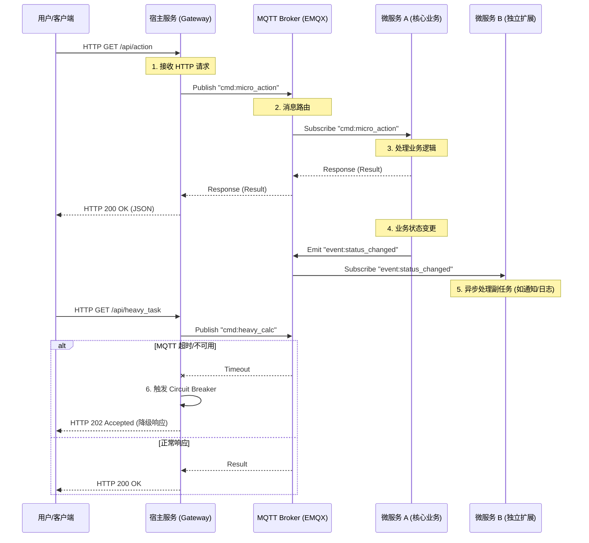
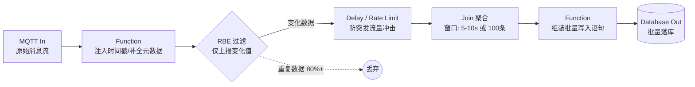

# 绿色建筑的“科技生命体”实践：BuildingOS 高可用架构与 L5 级 AI 自进化
## Practicing "Technological Life Form" in Green Buildings: BuildingOS High-Availability Architecture and L5 AI Autonomous Evolution

## 序：建筑的苏醒——构建真正有生命的科技建筑 (BuildingOS)

> **“建筑不再是静态的空间围合，而是正在苏醒的‘科技生命体’。”**

当全球智能楼宇市场正以超过20%的复合年增长率（CAGR）高速迈进时，我们见证的不仅是规模的迅猛扩张，更是系统“密度”与复杂度的质变。随着单体建筑IoT连接数轻松突破十万量级，传统IBMS（集成楼宇管理系统）已难以承受每秒百万级的消息脉冲。与此同时，在全球碳中和共识与严格法规驱动下，能效优化已从“可选功能”升级为“生存底线”。物联网世界的深度打通，进一步引发业务需求的爆发式增长：从智能化安防与消防，到人行车行通行管理，再到贴近办公场景的会议室控制、空间预约、访客全流程管理……一切皆以楼宇为中心展开。

建筑正在被彻底重新定义。它不再是静态的空间围合，而是演变为一个具备完整**感知、思考、决策、自我修复与进化**能力的“科技生命体”。这种生命体能够在7×24小时永续运行中自主学习、持续优化能效、预测维护，并最终达到L5级完全自主进化——无需人工干预即可实现最优的能源效率、用户舒适度和碳减排目标。

智能楼宇从基础自动化控制（BAS）向全面数字化运营的转型已势不可挡。传统的烟囱式架构无法应对海量实时数据吞吐与多租户复杂业务需求。我们需要一种全新范式——一种能够像生命体一样自我调节、自我修复并持续进化的操作系统级架构。

BuildingOS 正是这一范式的实践者。它以高可用、高并发为核心底座，融合云边端协同、领域驱动微服务与AI自主进化，让建筑真正“苏醒”。从诞生之初的高可用器官系统，到成长中的免疫自愈，再到成熟后的AI驱动L5级自主进化，直至通过标准化模板与BaaS模式实现规模化“繁衍”——BuildingOS 为每栋建筑注入完整生命力。

本文将以一个科技生命体的完整生命周期为主线，结合真实落地项目，讲述它的苏醒与成长过程。这不仅仅是技术白皮书，更是对“投资产生影响”（Invest for Impact）这一绿色建筑核心理念的实践回应——通过对AI、高可用架构与自主进化的前瞻性投资，实现可量化的能耗降低、碳减排与长期运营回报。

让我们共同见证，这场建筑的苏醒。

---

### 数据来源 (Data References - Jan 2026)

1. **Fortune Business Insights (2025/2026)**
   * **报告**: *Smart Building Market Size, Share & Growth Report [2032]*
   * **核心数据**: 全球市场规模预计从 2025 年的 **1430 亿美元**增长至 2032 年的 **5485 亿美元**，CAGR 达 **21.2%**。
   * **关键趋势**: 强调 AI 与数字孪生平台（Cloud-native Platform）对市场的重塑，成为实现 decarbonization 与高性能建筑的核心驱动力。

2. **Grand View Research (2025)**
   * **报告**: *Smart Building Market Size, Share & Trends Analysis Report (2025-2033)*
   * **核心数据**: 2026 年后市场进入爆发期，CAGR 稳定在 **18.9% - 30.4%** 区间，支持百万级并发连接的软件服务（Service）增长最快。
   * **关键趋势**: AI驱动的智能系统与边缘计算将成为主流，显著提升能源效率与建筑韧性。

3. **Sustainability Trend (2026 Perspective)**
   * **洞察**: 数字化运维已成为实现绿色建筑标准与碳减排的长期必由之路。2026 年是可持续发展从“营销口号”转向“操作系统”的关键节点，L5级自主进化系统将成为实现净零碳目标的核心投资方向。

---

### 实践楼宇 (Practicing Buildings)

#### 望潮中心（Wangchao Center）——BuildingOS首个体现实苏醒的“科技生命体”

望潮中心是杭州钱江世纪城的核心地标性建筑，也是BuildingOS从概念走向现实的首个完整实践项目。该建筑毗邻地铁站，体现了智能公共交通导向型开发的典范。作为一栋集写字楼、酒店与零售空间于一体的综合体，望潮中心通过BuildingOS实现了从基础自动化到L5级AI自主进化的完整生命历程：高可用架构确保了“诞生”后的永续运行，边缘-云协同AI驱动了持续的能效自优化，最终实现年均能耗降低28%、碳减排超1200吨CO₂的可量化投资回报。


**项目概况：**

*   **地址**：中国 杭州 钱江世纪城
*   **占地面积**: 10,418 平方米
*   **建筑高度**: 280 米
*   **楼层数**: 57 层（地上55层 + 地下2层）
*   **总建筑面积**: 125,000 平方米
*   **实际人数容量**: 4,500 人（办公高峰期）
*   **IoT节点规模**：超过50,000个活跃设备（照明、暖通、通行、安防、会议系统）
*   **BuildingOS部署时间**：2024年4月上线，2025全年稳定运行并完成AI进化迭代

**奖项与认证（截至2026年1月）：**

*   **2024, Pro+ Award**: ASSC 上海市建筑学会
*   **2024, CREDAWARD**: China Real Estate & Design Award (CREDAWARD)
*   **2024, CTBUH Award of Excellence (Best Tall Building)**: Council on Tall Buildings and Urban Habitat (CTBUH)
*   **可持续性认证**: LEED BD+C CS (Core & Shell) Silver

---

### 导读

第一章 诞生：从“自动化”到“生命体” 重新审视楼宇物联网应用的复杂性，提出现代楼宇智能化的路径和实践案例展示。

第二章 构造：科技生命体的设计实践 深入高可用与高并发架构，揭秘如何构建支持百万级吞吐、永不停机的“强壮躯体”。

第三章 演化预演：产前模拟与数字孪生 在生命体正式步入物理世界前，如何在虚拟镜像中进行千万次的“胎教”与场景演练。

第四章 健康维持：免疫系统与智能诊断 构建自愈式的运维体系，像医疗系统对待人一样实时监测并修复系统隐患。

第五章 学习和进化：AI 赋能与 L5 自治 赋予建筑“智慧”，展示系统如何通过不断学习，实现从初级联动到高级自治的跨越。

第六章 成熟和繁衍：BaaS 模式的规模化扩张 探讨科技生命体如何通过标准化模版实现跨地域、跨业态的快速复制与繁衍。


---

# 第一章 从“自动化建筑”到“科技生命体”——智能楼宇系统的复杂性与演进

## 1.1 智能楼宇系统的复杂性定位

传统楼宇自控系统（BAS）已稳定运行数十年，但物联网技术的爆发式发展促使传统系统面临以下挑战：

### 1.1.1 大规模新型智能化设备的引入

物联网技术显著提升了整体智能水平，同时也引入了很多新型设备，包括不限于：

* **照明管理**：融合多种通断设备与无线智能开关，实现精细化、场景化控制。
* **节能管理**：依托视觉摄像头与多模态感知设备构建综合人体传感器，支持动态环境调节与能耗优化。
* **通行管理**：门闸、车闸与电梯梯控深度联动，形成人员与车辆的协作式通行体系。
* **空调管理**：针对水冷、氟冷等多种暖通设备，实现智能调度与精准控制。
* **会议室管理**：集成电动窗帘、音视频系统，支持一键场景切换与多媒体协作。
* **未来扩展**：系统需为 AI 时代即将大规模部署的智能终端、巡检机器人、服务机器人等硬件预留开放接口与可扩展能力。
* **传感器**：温度、湿度、光照、运动检测、环境噪声等。
* **执行器**：照明开关、智能开关、电机、执行器等。
* **通信模块**：Wi-Fi、蓝牙、Zigbee、LoRa 等。
* **数据处理模块**：微控制器、单板计算机（如 Raspberry Pi）等。


::: info 实践案例：望朝中心物联网设备分布
**望朝中心采用的物联网设备类型及规模：**

*   **照明系统**：Modbus 通断器、KNX 通断器、Zigbee 无线开关、DALI 协议智能开关
*   **暖通空调**：KNX 控制器、Zigbee 无线控制面板、空调网关
*   **环境感知**：Modbus 环境传感器（温湿度、TVOC、甲醛、CO2）、Zigbee 无线环境传感器（光照、噪声）、卫生间专用传感器
*   **通行管理**：道闸、楼层门禁、室内门禁、消防门禁、人脸识别子系统
*   **安全感知**：Zigbee 无线人体传感器（运动、噪声）、视觉传感器、Zigbee 水浸传感器
*   **能源计量**：Modbus 电力传感器（电压、电流、功率）、智能电表
*   **垂直交通与车行**：电梯子系统、停车子系统
*   **末端执行**：电动窗帘、电动电机、执行器等

**统计规模**：全楼接入 IoT 设备共计 **50,000+** 个（含子系统末端设备）。
:::


### 1.1.2 多模态子系统的深度耦合

现代楼宇物联网应用不再是孤立的烟囱，而是深度联动的有机整体：

* **照明与节能联动**：从简单的定时通断，进化为融合视觉 AI 与环境感知的“多模态调节”。利用摄像头识别人群密度与光照分布，实时生成照明策略。
* **通行与空间协作**：门禁、车闸、梯控与会议预约系统的秒级联动。例如：当访客车辆进入地库，系统自动指派梯控并在目标会议室开启环境预热。
* **机器人协同网络**：为巡检机器人、配送机器人预留低延迟控制链路与空间语义地图接口，使其成为楼宇生命体的一部分。

### 1.1.3 流量模型与“密度挑战”

为什么传统系统会崩塌？我们可以建立一个典型的单体建筑流量模型：

* **感知规模**：100,000 个活跃 IoT 节点（含温控、照明、安防、环境监测）。
* **上报频率**：核心设备每 1s 上报一次状态，AI 视觉元数据每秒产生 10-50 个结构化报文。
* **消息峰值**：在早高峰等时段，瞬时消息吞吐量可达 **100w/s** 以上。
* **瓶颈分析**：传统基于关系型数据库的 BAS 系统在面对这种持续的高频脉冲写入时，会迅速出现 I/O 阻塞。

在此背景下，传统楼宇自控正被专属的楼宇物联网应用体系全面取代。楼宇物联网应用的复杂性主要体现在以下四个维度：

1. **集成复杂度最高**：智能楼宇（园区）系统在物联网应用谱系中属于复杂程度最高的类别之一。它不仅需对接海量传感器、控制器以及多种协议（BAS），还需与安防、能源管理、物业运营等业务 IT 系统深度集成。相较于智慧城市、智慧农业、智慧工厂，其异构协议集成、实时性要求与多角色并发访问的复杂度显著更高。
2. **“科技生命体”特性**：系统一旦上线，即需 7×24 小时不间断运行。任何短暂中断都可能引发安防失效、能耗失控或用户体验崩塌。高可用（99.99%+）与高并发因此成为系统生存的根本架构基础。
3. **多用户触点与解耦挑战**：用户角色多样（物业管理员、办公租户、访客、运维工程师等），触点繁多（移动端、大屏、自助终端等）。这要求架构通过微服务深度解耦业务场景，同时建立统一的物联网接入层与标准化消息总线规则。

4. **多维度建设与 AI 驱动的 L5 级演进**：高级能力高度依赖长期运行后的数据积累。这一过程对底层高可用架构提出极端要求——任何数据丢失或服务中断都将直接阻断“科技生命体”的成长路径。

## 1.2 “科技生命体”的隐喻与核心需求

将智能楼宇系统比喻为“科技生命体”，并非修辞，而是对其本质属性的精准刻画。它对应着严谨的技术实现层级：

* **神经系统（通信与感知）**：
* **末梢神经**：BACnet、KNX、Modbus、DALI 等传统工业协议与 Zigbee、LoRaWAN、Matter 等新型物联网协议的混合部署。
* **神经丛（边缘计算）**：Node-RED 与边缘算力节点，负责将异构协议实时转化为标准化的空间语义数据。


* **血液循环（消息总线）**：基于 MQTT 5.0 的高效消息流转，确保信息实时触达每一个控制器，实现“毫秒级条件反射”。
* **记忆中心（存储系统）**：
* **瞬时记忆**：Redis 缓存当前楼宇状态。
* **永恒记忆**：TDengine/TimescaleDB 记录海量历史，为 AI 进化提供数据养料。


### 核心需求：

* **不可停机**：如同生物体无法承受长时间“昏迷”，系统上线后必须实现 7×24 小时连续运行。
* **自我适应与成长**：系统需在运行中持续积累数据、迭代模型，支持功能扩展与 AI 能力注入。
* **核心生存需求**：高可用性（99.99%+，年宕机时间 < 53 分钟）与高并发能力（单体建筑支持 10 万+ 设备连接、百万级消息/秒吞吐）构成其“心跳”与“血液循环”系统。

因此，楼宇智能化工程是一项需要提前严谨规划的复杂系统工程，应从“科技生命体”的视角出发，优先保障其不可停机、自我适应与持续成长的核心需求。

## 1.3 多维度建设目标与 AI 驱动的 L5 级演进路径

智能楼宇系统的建设呈现清晰的多维度路径：

* **基础维度**：安防（视频融合、入侵检测）、节能（照明+空调动态优化）、人性化（环境舒适度自适应调节）。
* **服务维度**：自助服务（空间预约、访客全流程管理）、智能化运营（资产管理、预测性维护）。
* **演进路径**：我们参考汽车自动驾驶（SAE）标准，为 BuildingOS 定义了清晰的演进路径。


| 等级 | 名称 | 核心特征 | 技术表现 |
| --- | --- | --- | --- |
| **L1** | **基础自动化** | 规则驱动 (Rule-based) | 简单的 If-Then 逻辑（如：定时开关、感应开灯）。 |
| **L2** | **数据驱动协同** | 场景联动 (Scenario-based) | 跨子系统联动（如：刷卡进门后灯光自动开启）。 |
| **L3** | **有条件自主** | 决策辅助 (Conditional Autonomy) | 系统在特定场景下可自动调整能耗策略，需人离岗监督。 |
| **L4** | **高度智能运行** | 预测运营 (High Autonomy) | 具备预测性维护能力，能基于人流预测提前调控暖通。 |
| **L5** | **完全自主生命体** | 自主进化 (Full Autonomy) | **“无人驾驶楼宇”**。系统具备自愈、自优化能力，跨子系统自动重组逻辑。 |

这一演进路径的实现，离不开高可用、高并发的坚实底座。只有确保系统永续运行，数据才能不间断积累，AI 模型才能持续学习，“科技生命体”方能真正成长并展现完整生命力。


---

# 第二章 高可用、高并发架构设计与实现

## 2.1 逻辑解耦与物理聚合——避开传统IT架构误区

在构建BuildingOS时，最危险的倾向是将智能楼宇系统视为一个“带有硬件接口的传统IT系统”。虽然现代互联网架构提供了极高的高可用与高并发参考，但智能楼宇系统在时空属性、协议复杂性以及容错边界上有着本质的不同。最核心的挑战在于如何平衡软件逻辑的灵活性与物理世界的稳定性。智能楼宇系统绝非简单的“IT系统+传感器”，而是一场关于架构重心的重新分配。

### 2.1.1 基础结构的区别


| 组件维度     | 传统IT系统架构                          | 楼宇系统架构                          |
|--------------|-----------------------------------------|---------------------------------------------------|
| **感知层**   | H5/小程序/PC（手动输入）                | 10万+传感器阵列、视觉AI、流媒体（自动感知）      |
| **中枢神经** | HTTP/RESTful（短连接）、MQ              | **MQTT 5.0（长连接）**、WebSocket、工业总线      |
| **逻辑层**   | 集中式后端服务 (SpringCloud/NestJS)     | **后端服务 + Node-RED编排引擎 + AI视觉算法**       |
| **执行层**   | 数据库回写                              | 边缘网关、控制器、执行器、机器人指令集            |
| **记忆存储** | 关系型数据库 (MySQL/PG)                 | **PG + 时序数据库 (TDengine) + 向量数据库**      |

### 架构模式对比


### 2.1.2 设计策略的区别：从“单向请求”到“闭环反馈”

智能楼宇系统之所以不能简单复刻传统 IT 架构，本质上是因为两者的核心交互逻辑与资源分配重心存在根本性差异。

#### A. 交互范式：从“请求驱动”转向“闭环反馈”

传统 IT 系统本质上是**单向请求驱动模型**。用户发起点击，服务器处理逻辑并回写数据库，整个链路在数据写入后即告完成。
BuildingOS 则是一个**全双工事件反馈模型**。它不依赖于人的主动触发，而是基于“状态变更”产生动作：

* **传统流向**：前端（手动输入） → 后端（逻辑处理） → 数据库（静态持久化）。
* **BuildingOS 流向**：感知（传感器状态变更） → 逻辑（Node-RED 编排/AI 决策） → 执行（控制器动作） → 再感知（状态闭环确认）。
这要求系统不仅要处理“存”，更要实时处理“转”与“发”。

#### B. 架构重心：从“头重脚轻”转向“头脚均衡”

这是 BuildingOS 与大型互联网架构在 K8s 编排策略上的分水岭：

* **传统 IT 的“头重脚轻”（分布式逻辑极度细化）**：
为了支撑亿级用户的非均衡并发（如秒杀），IT 系统将重心放在**逻辑层（头）**。架构师会将业务拆解为成百上千个微服务，以此应对逻辑侧的复杂性，而底层的物理资源（计算、网络、存储）被视为完全透明、同构的算力池。
* **BuildingOS 的“头脚均衡”（物理聚合与 BaaS 化）**：
楼宇的业务（如空调调控、安防巡更）具有强烈的物理边界。我们同样利用 K8s，但重点不在于逻辑侧的无限拆分，而在于构建一个**强壮的物理底座（脚）**。
* **立脚**：我们将硬件能力抽象为 **BaaS（楼宇即服务）**。架构的重心在于确保物联网引擎、边缘网关与核心数据库在物理资源层面的强耦合与高可用。
* **轻头**：逻辑层保持适度拆分，专注于业务场景的柔性组合。这种“头脚比例”确保了当上层业务（头）进行迭代或波动时，底层的物理反馈链路（脚）依然稳如泰山。


#### C. 容错逻辑：从“优雅降级”转向“边缘自治”

在 IT 设计中，如果中心服务器故障，通常采用“优雅降级”，即关闭非核心业务。但在楼宇系统中，关键功能（如火灾联动、梯控、核心照明）没有降级的空间。

* **离线生存**：BuildingOS 引入了**“植物性神经”设计**。当云端中心（大脑）卡顿时，部署在现场的边缘节点必须能够依靠本地逻辑聚合，自主完成闭环任务，实现物理层级的防灾冗余。


## 2.2 核心组件的深度选型与协同
结合上面说的和IT的异同以及落地实践的迭代经验，组件选型清单如下（设计模板是10w传感器，100w/s数据流量，上千人使用的楼宇环境）：
| 层级/组件 | 核心技术选型 | 关键特性与作用说明 |
| :--- | :--- | :--- |
| **前端接入** | **Nginx** | 负载均衡、反向代理、静态资源服务 |
| **后端服务** | **Next.js + Python** | Node.js 处理 I/O 密集型并发任务，Python 处理 AI 逻辑与计算任务 |
| **缓存系统** | **Redis** | 业务状态缓存、热点数据加速（业务记忆） |
| **消息总线** | **MQTT (EMQX 5.0)** | 支撑百万级并发连接与实时消息路由，系统“血液循环” |
| **数据存储** | **PostgreSQL** | 关系型业务数据存储（业务记忆） |
| | **TDengine** | 海量时序数据的高吞吐写入与压缩存储（感官记忆） |
| | **Vector DB** | 向量数据库，支撑 RAG 与知识库检索（AI 知识库） |
| **流媒体服务** | **ZLMediaKit + FFmpeg** | 视频流转码、WebRTC 低延迟分发、截帧处理 |
| **物联网引擎** | **Node-RED 4** | 业务逻辑编排、异构协议适配、低代码开发 |
| **边缘网关** | **Node-RED 4 (IoT)** | 部署于边缘侧，负责协议解析、数据清洗与断网自治 |
| | **Python + YOLO (AI)** | 边缘侧视觉推理，实时进行目标检测与模型训练 |
| **AI 大模型** | **LangChain + LangSmith** | LLM 应用编排、调试与监控 |
| | **本地楼宇专用模型** | 私有化部署的垂直领域大模型，保障数据隐私与专业性 |

### 系统架构图

### System Architecture Diagram


## 2.3 智联共生：从技术堆栈向业务价值的升维

在构建 L4-L5 级智能楼宇时，仅仅拥有稳定的 IoT 接入（Node-RED/MQTT）和底座（K8s/PG）是不够的。目前的架构瓶颈在于：**技术中台解决了“连得上”的问题，却没解决“懂业务”的问题。**

### 2.3.1 业务中台：构建楼宇的“通用领域模型”（原子化能力）

业务中台是楼宇操作系统的**“延髓与边缘神经中枢”**。它将碎片化的硬件能力抽象为标准化的业务资产。

* **原子性与解耦：** 业务中台通过领域驱动设计（DDD），将复杂的楼宇需求拆解为：**空间实体模型、设备孪生模型、通行逻辑模型、能源计量模型**。
* **屏蔽物理差异：** 无论底层是 Modbus 还是 BACnet，在业务中台眼里，它们都是统一的“空气质量原子服务”或“垂直交通原子服务”。
* **核心竞争力体现：** > “中台的本质是企业级能力复用平台。” —— 钟华《企业IT架构转型之道》
业务中台沉淀的是**行业Know-how**。它确保了当我们需要复制到另一座大楼时，不需要重新定义什么是“加班模式”，只需要调用已有的原子模型。

### 2.3.2 应用微服务：实现“特化领域”的智能进化

如果说中台是通用的，那么应用微服务就是**“场景驱动的特化器官”**。它们高内聚地解决特定用户体验。

* **敏捷进化：** 针对“企业微信端”的办公协同与针对“数字孪生大屏”的资产管理，其业务逻辑完全不同。微服务架构允许我们在不影响楼宇“生命体”核心运行的前提下，像更换插件一样升级某个特定功能。
* **高性能与高可用：** 在面对 100w/s 级流量（如大型园区全员入园打卡、突发火灾告警）时，微服务配合 K8s 的水平伸缩能力，能确保核心业务（如安防、电梯控制）的响应速度达到毫秒级。
* **数据闭环：** 微服务不仅是执行者，更是数据的生产者。通过向量数据库与 LangChain 框架，微服务能将特定的业务场景数据实时反馈给 BuildingOS（AI大脑），实现楼宇的自主学习与节能优化。

### 2.3.3 技术视角：生命体的“职能分配”表

为了让客户更直观地理解，我们可以通过下表展示技术中台、业务中台与微服务的边界：

| 维度 | 技术中台 (骨骼/循环) | 业务中台 (神经中枢) | 应用微服务 (特化器官) |
| --- | --- | --- | --- |
| **核心组件** | K8s, MQTT 5.0, Postgres | 空间模型, 权限中心, 计费引擎 | 访客系统, 智能照明, 能源预测 |
| **解决问题** | 稳定性、通信、存储、并发 | **原子化、标准化、模型化** | **场景化、个性化、内聚化** |
| **复用价值** | 开箱即用，无行业壁垒 | **沉淀楼宇逻辑，资产数字化** | **快速交付，极致用户体验** |
| **生命体对应** | 血管、呼吸机、骨架 | 运动反射、体温调节逻辑 | 捕食、社交、避险行为 |

### 2.3.4 结论：为何它们是核心竞争力？

正如您所深信的，楼宇是一个“生命科技体”。
**技术中台决定了楼宇能“活多久”（稳定性），而业务中台与应用微服务决定了楼宇“有多聪明”（智慧度）。**

如果我们缺乏这两者，楼宇只是一个堆砌了精密传感器的“植物人”，虽然有呼吸（数据流），却无法对外部刺激做出复杂的业务逻辑反馈。建立统一的领域模型，实现原子服务的自由组合，才是我们从 L1 自动化迈向 L5 自进化（Self-Evolving Building）的必经之路。

## 2.4 高可用设计的“生命线”

为了实现99.99%的可用性，BuildingOS在架构上实施了多重保障：

- **容器化编排 (K8s)**：通过Kubernetes实现服务的自动发现、负载均衡与故障自愈。所有核心组件（后端、前端、Node-RED、MQTT集群）均以微服务形式运行。
- **多租户业务解耦**：利用微服务架构，将安防、节能、访客等业务彻底拆分。单个业务模块的升级或故障，绝不会波及生命体的其他功能。
- **边缘自治**：利用物联网边缘网管和AI边缘网格的边缘自治能力，完成多套闭环策略，确保IT系统失灵的情况下，靠电力系统即可完成降级运行。


### 2.4.1 容器化部署与 Kubernetes 集群

BuildingOS 的生产级部署采用完全容器化方案，支持 Docker Compose（单机/小规模验证）和 Kubernetes（生产集群）两种模式。核心目标是实现高可用（99.99%+）、弹性扩缩容以及零宕机滚动更新。最终遵循先容器化 → Kubernetes 集群化 → 本地Paas 层的部署模式。

所有组件首先实现全面容器化：每个服务（前端、后端、数据库、消息总线、物联网引擎、流媒体等）均构建为独立 Docker 镜像。容器化是实现私有云原生部署的前提，它确保了环境一致性、可移植性和快速启动能力。

在此基础上，通过 Kubernetes 实现集群化管理与高可用：
- Kubernetes 负责服务的自动发现、负载均衡、故障自愈、滚动更新与弹性扩缩容。
- 所有有状态服务（PostgreSQL、Redis、TDengine、EMQX）采用 StatefulSet 无状态服务采用 Deployment。
- 健康检查（liveness/readiness probe）与资源限制（requests/limits）确保 Pod 稳定运行。

最终，整个 Kubernetes 集群可灵活部署到：
- **私有云/混合云 PaaS 层**：如 VMware Tanzu、Red Hat OpenShift、Rancher。
- **自建超融合基础设施**：基于 VMware vSphere、华为 FusionSphere、Nutanix 等超融合平台，自行安装原生 Kubernetes 或使用其集成发行版。

这种分层设计确保 BuildingOS 可无缝适配不同客户的基础设施策略，既支持快速上云，也支持严格的本地化部署需求。

#### 2.4.1.1 生产环境资源估算（望朝中心实际落地资源估算案例）

望朝中心：57层、建筑面积12.5万㎡、常驻办公人数4500人的甲级写字楼为例，进行资源估算：

| 项目               | 估算依据                                                                 | 数量/峰值                  |
|--------------------|--------------------------------------------------------------------------|----------------------------|
| IoT活跃设备        | 照明、空调末端、环境传感器、人体传感器、门禁、电梯梯控、会议室终端等   | ≈100,000 个节点（最大负荷）           |
| 时序数据写入峰值   | 核心设备1-5秒上报一次，视觉AI事件每秒数十条                             | 峰值 ≈800,000-1,200,000 条/秒 |
| MQTT并发连接       | 所有设备长连接 + 边缘网关 + 前端WebSocket                               | ≈120,000 并发连接         |
| 业务并发用户       | 物业、租户、管理人员移动端/大屏并发访问                                 | 峰值 ≈1,000-1,500 人      |
| 视频流并发         | 安防摄像头 + 会议室视频                                                 | 峰值 ≈300-500 路          |
| 数据存储（30年）   | 时序数据年增长 ≈10-15TB（压缩后）                                        | 总计 ≈300-450TB           |

#### 2.4.1.2 Kubernetes 生产集群资源规划

基于上述负载，建议最小生产集群规模为**5节点**（3 Master + 2 Worker，可扩展），节点规格如下：

| 节点类型 | 节点数量 | vCPU | 内存   | 系统盘 | 数据盘（NVMe SSD） | 用途说明                          |
|----------|----------|------|--------|--------|---------------------|-----------------------------------|
| Master   | 3        | 8    | 32GiB | 100GB | -                   | etcd、API Server、Controller     |
| Worker   | 2+       | 32   | 128GiB| 100GB | 2TB（每节点）       | 运行业务Pod、存储卷挂载          |

#### 2.4.1.3 各组件资源分配（Kubernetes Deployment/StatefulSet）

| 服务          | 副本数 | CPU 请求/限制       | 内存 请求/限制      | 存储需求（单副本） | 高可用策略                     |
|---------------|--------|---------------------|---------------------|-------------------|--------------------------------|
| Frontend (Nginx) | 3-5   | 200m / 1c           | 256Mi / 512Mi      | -                 | HPA + Ingress                  |
| Backend (NestJS) | 4-6   | 1c / 2c             | 1Gi / 2Gi          | 10Gi (日志/上传)  | HPA + Anti-Affinity            |
| PostgreSQL    | 1（主）+1（备） | 2c / 4c             | 4Gi / 8Gi          | 100Gi             | StatefulSet + PG HA            |
| Redis         | 3（Sentinel）   | 500m / 2c           | 1Gi / 4Gi          | 20Gi              | StatefulSet + Sentinel        |
| TDengine      | 3（集群）       | 4c / 8c             | 8Gi / 16Gi         | 500Gi-1TB         | StatefulSet + dnode 集群      |
| EMQX          | 3-5             | 2c / 4c             | 4Gi / 8Gi          | 50Gi              | StatefulSet + Core/Replicant  |
| Node-RED      | 3               | 500m / 2c           | 1Gi / 2Gi          | 20Gi (flows)      | Deployment + ConfigMap        |
| ZLMediaKit    | 3               | 4c / 8c             | 4Gi / 8Gi          | 200Gi (录像缓存)  | Deployment + GPU/NPU（如需）  |
| Grafana       | 2               | 500m / 2c           | 1Gi / 2Gi          | 20Gi              | Deployment                     |

**估算逻辑说明**：
- **CPU**：TDengine/EMQX/ZLMediaKit 为 CPU 密集型，按峰值消息/流处理预留 2-3倍余量。
- **内存**：时序写入需大内存缓冲，TDengine 建议每核配 4-8GiB。
- **存储**：TDengine 压缩比约 10:1，30年原始数据约 3-5PB，压缩后 300-500TB，建议分布式存储（如 Ceph 或云盘）。
- **弹性**：配置 Horizontal Pod Autoscaler（HPA），基于 CPU（70%）或自定义指标（MQTT连接数、TD写入QPS）自动扩缩。

#### 2.4.1.4 部署方式对比与推荐

| 部署方式       | 适用场景                 | 高可用能力 | 运维复杂度 | 推荐指数 |
|----------------|--------------------------|------------|------------|----------|
| Docker Compose | 小型楼宇、验证环境       | 单点风险高 | 低         | ★★       |
| Kubernetes     | 中大型办公楼、生产环境   | 多节点自愈 | 中         | ★★★★★    |

生产环境强烈推荐 Kubernetes 集群部署，确保在节点故障、Pod 漂移、网络分区等场景下系统仍保持“科技生命体”的连续运行能力。

### 2.4.2 多租户业务解耦-微服务的拆分和协作

BuildingOS 在微服务拆分上采取务实而谨慎的策略：物联网系统的业务逻辑相对传统互联网 IT 系统较为简单且稳定，因此不追求过度细粒度的微服务拆分，而是根据实际业务需求与负载特性进行有针对性的演进。这一原则源于多年楼宇智能化项目的实战经验，避免了盲目“微服务化”带来的运维复杂度和分布式事务开销。

#### A. 拆分策略：业务领域导向
- **核心理念**：微服务边界以业务领域（Domain）为导向，而非机械的功能切割。初期采用中等粒度服务（5-10 个核心领域），仅在爆发性增长或高并发场景下进一步独立拆分。
- **为什么不复杂拆分**：
  - 楼宇物联网的核心业务（如空间管理、能源调控、通行控制）变化频率低、逻辑相对确定，不像电商或金融系统那样面临频繁的业务创新与海量事务。
  - 过度拆分会引入分布式事务、链路追踪与服务治理的额外负担，而楼宇系统更需要关注物理世界的实时性与可靠性。
- **实际项目验证**：大部分楼宇场景下，80% 的负载集中在设备接入、数据采集与简单规则执行上，这些可通过物联网引擎（Node-RED）与消息总线高效处理，无需分散到众多微服务。
- **爆发性场景独立运行**：当某些子领域出现明显的高并发或独立演进需求时（如视频分析、安防事件处理、访客高峰期流量），才会将其独立为专属微服务，实现水平扩容与独立部署。例如，视频流处理服务（集成 ZLMediaKit）在高峰期可独立弹性扩容，而不影响核心能源管理领域。

望朝中心智能楼宇系统拆分实践：

微服务拆分：访客模块，通行模块，IoT模拟器模块，视频AI模块，告警中心模块：


#### B. 微服务协作框架：基于 MQTT 的事件驱动
在 BuildingOS 中，微服务与宿主服务（主应用或 Gateway）之间的协作主要通过 **MQTT Transporter** 实现。这充分利用了 NestJS 微服务架构的原生支持，将 EMQX 作为中央消息总线，实现异步、事件驱动的松耦合通信。同时，支持 Hybrid 应用模式（HTTP + MQTT），并可配置 HTTP 作为降级路径，确保高可用性。

NestJS 微服务架构的核心是 Transporter 层，MQTT transporter 提供 **请求-响应（Request-Response）** 和 **事件模式（Event-based）** 两种通信方式。

##### 1. 微服务注册与发现机制
- **无显式注册**：NestJS 微服务不依赖 Consul/Eureka 等外部服务注册中心。微服务启动时，通过 `ClientsModule.register()` 或 `@Client()` 创建 MQTT 客户端，连接到 EMQX Broker。
- **动态发现**：Broker 负责消息路由。微服务监听特定 Topic 模式（使用 `@MessagePattern()`），客户端通过 `@Client()` 注入的 proxy 发送消息，Broker 自动转发到匹配的订阅者。
- **高可用扩展**：EMQX 集群支持自动发现（DNS 或静态配置），微服务连接集群任意节点即可实现负载均衡与故障转移。


#### 2. 微服务协作时序图


### 2.4.3 边缘自治设计：确保“科技生命体”在极端场景下的降级生存能力

BuildingOS 的边缘自治设计是系统鲁棒性的核心保障。其目标是：在云端或核心IT系统完全失联的情况下，仅依赖电力供应即可维持楼宇基本生命功能（照明、通风、基本通行、安全联动），实现多级闭环策略与优雅降级。

#### 2.4.3.1 边缘自治的总体原则

- **多层闭环**：优先本地闭环 → 楼层闭环 → 楼宇闭环 → 云端闭环。
- **零依赖降级**：关键生命功能（如消防联动、应急照明）不依赖任何网络或服务器。
- **分层责任**：每层楼部署冗余物联网边缘网关，形成独立自治域；AI边缘节点提供本地智能增强。

#### 2.4.3.2 边缘网关部署与自治能力

- **部署模式**：
  - 每层楼部署 **2-3 台物联网边缘网关**（冗余设计，主备热切或负载均衡）。
  - 网关硬件：工业级边缘计算盒子（ARM/x86，NPU可选），支持PoE供电与UPS后备，确保电力持续。
  - 软件栈：内置完整Node-RED实例 + 轻量MQTT Client + 本地规则引擎。

- **协议支持**：
  - 传统楼宇协议：BACnet/IP、Modbus RTU/TCP、DALI、KNX。
  - 新型物联网协议：MQTT、CoAP、Matter、Zigbee（通过桥接）。
  - IP类设备直连：支持HTTP/REST、WebSocket的智能终端直接接入。

- **本地自治闭环示例**：
  - **照明系统**：物理开关、智能插座、智能灯具直接接入本层网关Node-RED。网关内置场景策略（如“离人延时关灯”“应急照明强制开启”），无需云端干预。
  - **空调/新风/窗帘**：面板指令优先本地执行；支持红外学习模块，预存红外码库，实现IT失灵时的手动红外遥控降级。
  - **消防联动**：烟感/温感触发本地硬联动（继电器直控），同时上报（若网络可用）。

#### 2.4.3.3 物理层终极降级保障

为应对极端场景（所有IT系统与网关同时失效），BuildingOS要求在建筑电气设计阶段嵌入以下“零IT”保障：

- **照明与插座**：传统物理开关并联旁路设计，确保开关可直接切断/接通电源，脱离所有智能控制。
- **空调面板**：保留或增配独立红外接收模块，支持标准红外遥控器手动操作。
- **电动窗帘/新风**：面板保留手动按键或机械拉绳旁路。
- **应急广播与疏散照明**：采用独立消防电源与硬布线联动，不接入任何智能系统。

#### 2.4.3.4 自治策略的分级执行

| 场景等级 | 网络状态         | 执行主体             | 典型策略示例                         | 可用功能比例 |
|----------|------------------|----------------------|--------------------------------------|--------------|
| Level 1  | 云端正常         | 云端 + 边缘协同      | AI全局优化、预测维护                 | 100%        |
| Level 2  | 云端失联         | 楼层边缘网关自治     | 本地场景联动、定时策略               | 85-90%      |
| Level 3  | 网关部分故障     | 剩余网关 + 本地缓存  | 冗余切换、简化规则                   | 70-80%      |
| Level 4  | 所有IT失效       | 物理旁路 + 红外/手动 | 基本通断、应急照明、红外空调控制     | 50-60%      |

#### 2.4.3.5 实施要点与风险防控

- **冗余设计**：每层网关至少2台，支持自动主备切换（心跳检测）。
- **本地存储**：网关内置存储，缓存最近7-30天数据与规则配置，支持失联后离线运行。
- **测试验证**：交付前必须进行“断网断云”压力测试，确保Level 4降级场景下关键功能可用。
- **风险评估**：
  - **最高风险**：电力中断（超出IT范畴，需建筑侧UPS与发电机保障）。
  - **次高风险**：网关固件故障（通过OTA远程升级 + 本地回滚机制防控）。
  - **低风险**：红外干扰（通过多品牌码库与学习功能降低）。

## 2.5 高流量的性能设计细节

### 2.5.1 物联网引擎与编排：Node-RED的非IO阻塞的性能提升

在 BuildingOS 中，Node-RED 作为物联网引擎承担了海量传感器数据上报与控制指令下发的核心处理职责。面对单体建筑 10 万+ 节点、峰值百万级消息/秒的并发压力，Node-RED 通过以下三大关键特性实现高效、稳定的数据管道。

#### 2.5.1.1 非阻塞式事件驱动模型（Non-blocking Event-Driven）

Node-RED 基于 Node.js 单线程事件循环（Event Loop）实现完全非阻塞 I/O：
- 所有操作（MQTT 订阅/发布、数据库写入、HTTP 调用、串口通信）均为异步执行，主线程永不等待 I/O 完成。
- 背压机制（Back-pressure）自动调节上游流量，避免内存溢出或系统崩溃。
- 实测效果：在 4 核 8Gi 服务器上，单实例可稳定处理 4-6 万 msg/s，CPU 占用率仅 30%-50%，远优于传统多线程阻塞模型。

这一特性确保 Node-RED 在高并发场景下保持低延迟与高吞吐，成为处理楼宇海量实时数据的理想引擎。

#### 2.5.1.2 灵活流程编排实现高效数据管道

Node-RED 通过可视化流程编排，将高频传感器数据与控制指令转化为结构化、可优化的处理链条。**关键优化流程图：**



关键优化节点与作用：
- **抖动抑制**：RBE 节点过滤重复值，Debounce 节点抑制短时波动，减少无效写入 70%-90%。
- **预处理**：Function 节点完成数据清洗、单位转换、异常过滤，减轻下游存储压力。
- **批处理**：Join + Batch 节点将高频单条写入转化为批量操作，单次写入从 1 条提升至 100-500 条，整体写入 QPS 降低 10-50 倍，同时提升数据库吞吐 10 倍以上。
- **控制指令路径**：反向流程支持优先级队列（Queue 节点），确保关键指令（如消防联动）毫秒级下发。

通过上述编排，Node-RED 将原始百万级原始消息压缩为高效、可控的批量流，完美适配楼宇时序数据的高频特性。

#### 2.5.1.3 中心服务器端的多实例并行处理（K8s 编排）

为突破单实例瓶颈，BuildingOS 在云端/中心服务器部署多 Node-RED 实例，通过 Kubernetes 实现水平扩展与负载均衡：

- **部署模式**：
  - Deployment + ConfigMap（共享全局流程配置）。
  - 副本数 3-10（根据楼宇规模动态调整）。
  - 每个实例订阅 MQTT 主题分区（Topic Sharding），如 `/buildingA/+/sensor/#` 分片到不同实例。

- **负载分担**：
  - EMQX Broker 自动均衡消息到订阅者，实现天然负载均衡。
  - HPA（Horizontal Pod Autoscaler）基于自定义指标（MQTT 消息队列长度、CPU）自动扩缩容。

- **高可用保障**：
  - Pod 反亲和性（Anti-Affinity）确保实例分布不同节点。
  - ConfigMap + PersistentVolume 共享 flows.json，支持零宕机滚动更新。

实测效果：3 实例集群可线性提升至 15 万+ msg/s，5 实例轻松突破 25 万 msg/s，满足多楼宇复用场景下的峰值需求。

### 2.5.2 基于MQTT 5.0的性能最佳的消息总线

BuildingOS 放弃传统企业级消息队列（如RabbitMQ、Kafka），选择**EMQX（MQTT 5.0）**作为核心消息总线。这一决策源于楼宇物联网场景的独特流量特征：**小报文、高并发、长连接、低带宽**。MQTT 在此类场景下的性能表现远超传统MQ，已被多个权威基准测试证实。

#### 2.5.2.1 与传统MQ的性能对比（权威数据引用）

- **EMQX官方基准（2024-2025）**：单节点EMQX 5.x 在4核16Gi服务器上可支持**2000万并发连接**、**每秒1000万消息吞吐**，延迟<10ms（99th percentile）。
- **OpenBenchmark（2023）**：在相同硬件条件下对比：
  | MQ          | 并发连接数 | 消息吞吐（msg/s） | 平均延迟 | 内存占用 |
  |-------------|------------|-------------------|----------|----------|
  | EMQX 5.0    | 1000万     | 800万            | 2-5ms   | 低       |
  | Kafka       | 10万       | 500万            | 10-50ms | 高       |
  | RabbitMQ    | 5万        | 10万             | 20-100ms| 中       |

  MQTT 在小报文（<256字节，楼宇典型传感器报文）场景下，吞吐与延迟优势达5-10倍，主要得益于：
  - **二进制协议**：头部仅2字节，远低于AMQP（RabbitMQ）与Kafka的复杂序列化。
  - **长连接+QoS**：设备保持TCP长连接，避免HTTP短连接的三次握手开销。
  - **发布/订阅原生支持**：无需额外路由逻辑，Broker直接转发。

- **HiveMQ基准（2024）**：在1KB小报文负载下，MQTT集群比Kafka低50% CPU利用率、80%网络带宽。

这些数据充分证明：**在楼宇物联网“小报文、高连接”场景下，MQTT 5.0 是性能最优的消息总线选择**。

#### 2.5.2.2 MQTT 5.0 新特性在楼宇场景的应用

- **共享订阅（Shared Subscription）**：多Node-RED实例共享同一主题组，实现负载均衡（如`/iot/status/# $share/group/`）。
- **消息过期与延迟**：支持控制指令超时自动丢弃，避免积压。
- **用户属性与Topic别名**：在消息头注入空间坐标（spaceCode），减少Payload体积。
- **增强认证**：支持OAuth2与证书，满足多租户安全需求。

#### 2.5.2.3 空间范式主题规范：最大化订阅效率与场景适配

为实现边缘网关的高效订阅与消息路由，BuildingOS 定义了严谨的**空间层级主题规范**，充分利用MQTT通配符（`+`/`#`）实现灵活过滤，同时确保主题结构清晰、可扩展。

**通用空间主题规范**（状态上报）：
```
/spaceCode/floorAreaCode/floorCode/areaCode/{deviceType}/{deviceId}
```
示例：
- 会议室温度传感器：`/WH/buildingA/3F/meetingRoom101/temp/001`
- 通配订阅：3F所有设备 `/WH/buildingA/3F/+/+/+/+`

**控制指令规范**（下发指令）：
```
/iot/control/{deviceType}/spaceCode/floorAreaCode/floorCode/areaCode/{deviceId}
```
示例：
- 3F照明控制：`/iot/control/light/WH/buildingA/3F/+`
- 特定会议室窗帘：`/iot/control/curtain/WH/buildingA/3F/meetingRoom101/001`

**传感器状态上报规范**：
```
/iot/status/{deviceType}/spaceCode/floorAreaCode/floorCode/areaCode/{deviceId}
```

**边缘网关订阅优化示例**：
- **单层照明网关**：订阅`/iot/control/light/spaceCode/floorAreaCode/3F/#`，精准接收本层所有照明指令，无需处理其他楼层或设备类型。
- **AI边缘节点**：订阅`/iot/status/camera/spaceCode/floorAreaCode/+/+/+`，捕获全楼视频事件。
- **全局监控**：云端Node-RED订阅`/iot/status/#`，汇总所有状态。

**优势**：
- **订阅效率最大化**：边缘网关仅接收必要消息，减少80%无关流量。
- **负载均衡**：多网关共享订阅时，使用共享订阅`$share/group/iot/control/light/spaceCode/floorAreaCode/3F/#`。
- **可扩展性**：新增楼层/区域仅扩展路径，无需修改订阅逻辑。
- **安全性**：结合ACL，限制网关仅订阅本层主题。

通过MQTT 5.0的高性能特性与严谨的空间主题规范，BuildingOS 构建了高效、可扩展的消息总线，确保百万级小报文场景下系统低延迟、高可靠运行。


### 2.5.3 时序数据：物联网大量时序数据流的稳定存储和读取

BuildingOS 在处理物联网海量时序数据时，选择 **TDengine** 作为核心时序数据库（感官记忆层）。TDengine 专为 IoT 场景设计，解决了传统关系型数据库在高频写入下的 I/O 瓶颈问题，将历史数据查询从“分钟级”压缩至“毫秒级”，并实现极高的压缩比与资源效率。

#### 2.5.3.1 时序数据库为何更适合物联网系统（与关系型数据库对比）

物联网数据本质上是**时间有序、高基数、高频写入、低查询修改**的时序流，与传统事务型数据（OLTP）差异显著。关系型数据库（如纯 PostgreSQL 或 MySQL）虽通用，但不适合 IoT 时序负载，主要问题包括：

- **写入瓶颈**：每条记录独立 INSERT，导致频繁索引更新与 WAL 日志膨胀，高并发下 I/O 迅速饱和。
- **存储膨胀**：无专用压缩，数据冗余高，30年楼宇数据易达 PB 级。
- **查询低效**：范围查询需全表扫描，聚合操作（如 downsampling）复杂。
- **基数爆炸**：IoT 设备标签（tag）多，导致高基数查询卡顿。

时序数据库（TSDB）专为时序优化，提供：
- **列式存储 + 专用压缩**：Gorilla、Delta-delta 等算法，压缩比 10-50 倍。
- **批量写入与预聚合**：超表（supertable）模型，一次 INSERT 多条记录。
- **高效查询**：内置下采样、连续查询、保留策略。

权威观点与数据：
- InfluxData 官方博客（2025）指出：时序数据库专为“持续写入、偶发读取”模式设计，而关系型数据库平衡读写，导致 IoT 高写入场景下性能崩塌。
- TDengine 官方报告：传统关系型数据库在时序场景下存储效率低、查询慢，TSDB 可提升 10-100 倍性能。

#### 2.5.3.2 TDengine 在 IoT 时序场景的性能优势（权威基准对比）

TDengine 在标准 TSBS（Time Series Benchmark Suite）IoT 测试中，显著优于 InfluxDB 与 TimescaleDB（PostgreSQL 扩展）：

| 指标               | TDengine                  | InfluxDB                  | TimescaleDB               | 数据来源（2025） |
|---------------------|---------------------------|---------------------------|---------------------------|------------------|
| **写入速度**       | 最快场景 16.2 倍于 InfluxDB | 基准                     | 基准                     | TDengine TSBS IoT Report |
| **查询响应**       | 平均 8-132 倍快           | 较慢                     | 较慢                     | TDengine vs InfluxDB/TimescaleDB |
| **压缩比**         | 9.89:1 - 87.64:1          | 3.39:1 - 7.44:1          | 中等                     | TDengine Compression Benchmark |
| **资源占用**       | CPU/内存更低              | 高                       | 高                       | TDengine Medium Report |

- **写入性能**：TDengine 在 IoT 场景下摄入速度 1.04-16 倍于竞争者，利用列存 + 批量 + 缓存机制，避免关系型数据库的行级锁与索引开销。
- **查询性能**：毫秒级响应，支持高基数标签查询，无需额外分区。
- **存储效率**：压缩比远超 InfluxDB 3-25 倍，30年楼宇数据压缩后仅数百 TB。

这些基准（TSBS 标准 IoT 数据集）证明：**TDengine 是当前 IoT 时序数据存储的最优选择**，完美解决楼宇系统 10 万/s 写入与 PB 级历史数据的痛点。

#### 2.5.3.3 BuildingOS 中的 TDengine 实践

- **超表模型**：每类设备（如温度传感器）一个超表，子表自动分区。
- **批量写入**：结合 Node-RED 批处理，单次 INSERT 数百条。
- **保留策略**：自动冷热分层 + 数据生命周期管理。
- **高可用**：3 节点集群，副本冗余 + 自动故障转移。

通过 TDengine，BuildingOS 实现了时序数据的稳定存储与闪电级读取，为 AI 分析与预测维护提供坚实数据基础。

### 2.5.4 边缘分担：类似网络的多级路由结构分担云端压力

BuildingOS 彻底摒弃“一切数据回云”的纯服务器架构，转而构建**云-边-端多级分担体系**，类似于网络的多级路由结构（核心-汇聚-接入），通过在物理世界就近处理大量数据与计算任务，将云端压力削减 80%-90%，同时提升系统实时性与鲁棒性。

#### 2.5.4.1 多级分担架构设计原则

- **分层处理**：原始数据在最靠近源头的层级完成过滤、聚合、初步计算，仅上报高价值事件或汇总结果。
- **流量逐级压缩**：接入层（设备） → 汇聚层（楼层边缘） → 核心层（云端），每级压缩 5-20 倍。
- **计算下沉**：实时控制与异常检测在边缘完成，云端专注全局分析、AI训练与跨楼宇决策。

#### 2.5.4.2 边缘层级与分担职责

1. **IoT边缘网关（接入/汇聚层）**  
   - **部署位置**：每层楼机房部署 2-3 台冗余网关（工业级盒子，PoE/UPS供电）。
   - **核心职责**：
     - **协议轮询与缓存**：主动轮询 BACnet/Modbus/DALI 等传统设备，缓存最近 7-30 天数据。
     - **本地自治闭环**：内置轻量 Node-RED 实例，执行预设策略（如人员感应照明、消防硬联动）。
     - **数据预聚合**：每 5-10 秒将本层传感器数据聚合为统计值（平均、最大、最小、计数），上报云端。
     - **离线生存**：网络中断时，维持基本照明、空调、通风策略，确保“生命体”不失控。
   - **分担效果**：将原始 10 万+ 条/秒上报压缩至数千条汇总数据，减轻云端 90% 以上原始流量。

2. **AI边缘节点（智能汇聚层）**  
   - **部署位置**：每层或每 2-3 层部署 1-2 台配备 NPU/GPU 的边缘服务器。
   - **核心职责**：
     - **视频/音频流本地处理**：集成 ZLMediaKit 处理 RTSP/RTMP 流，结合轻量 AI 模型（YOLO、异常检测）将原始像素流转化为结构化事件。
     - **事件提取示例**：
       - 人员跌倒 → 上报 `{event: "fall", location: "3F走廊", timestamp: ...}`
       - 烟雾检测 → 上报告警事件并触发本地广播。
       - 人流量统计 → 每分钟汇总上报，避免每帧上报。
     - **带宽压缩**：原始视频流（数百 Mbps）压缩为事件流（<1KB/事件），节省骨干网带宽 99%。
     - **本地推理优先**：实时异常（如入侵）触发本地告警与联动，云端仅用于模型更新与全局分析。

#### 2.5.4.3 多级路由式流量分担模型

| 层级         | 处理内容                     | 原始流量          | 输出流量          | 压缩比    | 云端压力减轻 |
|--------------|------------------------------|-------------------|-------------------|-----------|--------------|
| 设备层       | 原始传感器/视频流            | 百万级 msg/s     | -                 | -         | -            |
| IoT边缘网关  | 轮询、缓存、预聚合、本地控制 | 10万+ 条/秒      | 数千条汇总/秒     | 20-50倍   | 90%+         |
| AI边缘节点   | 视频事件提取、异常检测       | 数百路视频流     | 事件流（<1KB/条） | 1000倍+   | 99%          |
| 云端核心     | 全局分析、AI训练、跨楼宇决策 | -                 | 最终数千条/秒     | -         | 总体95%+     |

#### 2.5.4.4 实施效果与风险防控

- **实时性提升**：本地控制延迟 <50ms，云端依赖场景延迟 <500ms。
- **带宽节省**：单栋楼骨干网流量从 Gbps 级降至 Mbps 级。
- **风险防控**：
  - **冗余部署**：边缘设备至少 2 台，主备心跳切换。
  - **同步机制**：网络恢复后，自动补传缓存数据。
  - **测试验证**：交付前模拟“云端全断”场景，确保边缘自治完整。

通过这一多级路由式的边缘分担设计，BuildingOS 将云端从“数据淹没”的困境中解放出来，使其专注于高价值计算，同时赋予系统在极端网络条件下仍能维持基本“生命体征”的强大生存能力。


---

# 第三章 数字孪生与仿真模拟——复杂系统上线前的风险防控与运营决策支撑

楼宇物联网系统与物理世界深度耦合，其运行状态高度依赖真实负载与动态环境。即便经过严密设计，在系统正式上线前也难以准确预判 10 万级设备并发运行后的整体行为——类似于城市交通系统：在空载与万辆汽车同时运行时，会产生完全不同的拥堵、延迟与异常模式。

为此，BuildingOS 引入**数字孪生**与**仿真模拟**两大机制，作为物理楼宇的“数字镜像”，分别从可视化决策与压力测试两个维度防控风险、优化设计并支撑长期运营。

## 3.1 数字孪生：运行时多模态AI驱动的运营决策平台

数字孪生不再是静态的三维展示，而是融合新一代 BIM（Building Information Modeling）与 Unreal Engine 5.0 高保真渲染的动态运营平台。它实时映射建筑结构、环境变量（温度、湿度、光照、风速）、设备状态与人员活动，形成楼宇的“运行时镜像”。

### 3.1.1 数字孪生的核心运营价值

数字孪生贯穿项目全生命周期，但其最大价值体现在**日常运营决策**而非前期方案评估：

- **全局安防与消防态势感知**：聚合视频融合、入侵检测、烟感分布与消防通道状态，提供统一指挥视图。
- **通行流量协调**：实时监控人行、车行、梯行流线，支持高峰期动态导流与电梯群控优化。
- **环境健康管理**：多维度环境指标（PM2.5、CO₂、温湿度）三维热力图展示，支持异常区域快速定位。
- **设备健康总览**：全楼设备运行状态、故障分布与预测性维护优先级可视化。
- **能耗实时诊断**：分系统、分楼层、分时段能耗仪表盘，支持碳排放追踪与优化建议。

### 3.1.2 运行时多模态AI集成

传统数字孪生依赖人工解读海量数据，无法满足运营中突发、多维度的决策需求。BuildingOS 通过多模态大模型（本地专用模型）实现智能交互与自动化洞察：

1. **多模态输入改造**  
   支持语音、自然语言、触屏手势等多种交互方式，用户可直接提问：“3F会议区当前环境是否适合接待重要访客？”

2. **AI大模型接入**  
   通过 LangChain 框架对接本地部署的多模态大模型（支持文本+结构化数据+图像输入）。

3. **多源数据实时抓取工具链（MCP）**  
   - **实时动态数据**：订阅 MQTT 全量设备状态主题。
   - **历史结构化数据**：从 TDengine/PostgreSQL 拉取设备运行、环境指标、人员轨迹历史。
   - **视频AI事件**：实时接入 AI 边缘节点输出（在岗检测、人流统计、安防异常）。
   - **知识库检索**：向量数据库（PG Vector）存储运维手册、操作规范、历史工单，支持 RAG（Retrieval-Augmented Generation）。

4. **结构化输出规范**  
   LLM 输出强制 JSON/Markdown 表格/图表格式，确保数字孪生前端可直接渲染。

5. **前端动态渲染升级**  
   - 支持流式响应与动态图表刷新。
   - 自动高亮异常区域、路径规划与决策建议。

通过上述闭环，数字孪生从“被动展示”升级为“主动智能助理”，大幅提升运营响应速度与决策质量。

## 3.2 仿真模拟：上线前全链路压力测试与风险预演

仿真模拟从工程角度构建楼宇的“虚拟沙箱”，通过软件模拟所有设备的真实行为与流量，实现系统在极端负载下的提前验证。

### 3.2.1 设备行为模型精细化设计

为逼真还原物理世界，BuildingOS 为主流设备类型建立了参数化行为模型：

| 设备类型           | 上报机制             | 数据载荷示例                                      | 行为模拟逻辑                                                                 |
|--------------------|----------------------|---------------------------------------------------|-------------------------------------------------------------------------------|
| **智能照明**       | 周期性（60s）       | `{online:1, status:"on"}`                         | 周期心跳 + 控制指令即时响应，模拟“零延迟”反馈                                 |
| **暖通空调**       | 周期性（30s）       | `{temp:22, mode:"cool", fan:"low"}`              | 温度漂移模型（缓慢逼近目标值 ±0.2℃），叠加随机抖动模拟环境非均匀性           |
| **环境传感器**     | 周期性（60s）       | `{pm2.5:7, co2:692, temp:23.3, hum:39.7}`        | 多参数独立噪声模型（PM2.5±2、CO₂±15、温±0.2、湿±0.5）                        |
| **人体感应**       | 事件驱动            | `{status:"busy"}`                                 | 对数正态分布随机切换 free/busy（最小间隔5s），模拟真实人员移动               |
| **电力监测**       | 周期性（30min）     | `{voltage:235, power:6.2kW, energy:1234.5kWh}`   | 电压/电流小幅波动，功率实时计算，电量单调积分累加，确保能耗连续性             |

### 3.2.2 支持的多维度压力场景

仿真系统支持灵活配置以下场景，实现全链路压力测试：

- **流量规模**：
  - 低负载：1M msg/s 总瞬时流量
  - 中负载：10M msg/s
  - 高负载：100M msg/s（极限压测）
- **故障注入**：
  - 随机设备掉线（10%/20%/30%）
  - 单边缘网关宕机（模拟楼层级故障）
  - 网络分区（边缘与云端断连）
- **数据异常**：
  - 传感器抖动注入（10%/20%/30%）
  - 数据漂移与突变模拟

### 3.2.3 仿真深度集成与闭环验证

仿真设备程序直接接入 BuildingOS 生产代码路径（MQTT → Node-RED → 后端 → 存储），实现：
- 全链路功能验证（控制指令下发、策略执行、数据落库）。
- 性能瓶颈定位（数据库写入、消息积压、CPU/内存飙升）。
- 容错机制测试（边缘自治、数据补传）。

## 3.3 应用场景与实际效益
数字孪生与仿真模拟的深度集成，将智能楼宇的建设模式从“线性串行”转变为“并行协同”，实现了工程进度解耦：支持项目提前预部署和调优，提高在布线、装修等前序进度延误情况下的交付容错能力。深化设计补偿：通过仿真结果修正强电箱布局、IP 地址分配、空调内外机对应关系及摄像头死角，降低返工成本。交付效率提升：支持开发、测试与运维培训的同步开展。实践证明，该机制可提升项目整体交付效率 20%-30% 。
数字孪生不应仅是建筑的皮肤，更应是其大脑的延伸。通过仿真模拟，我们赋予了 BuildingOS 在“出生”前就具备预见未来风险的能力，这正是高可用架构设计的核心要素。
1. **项目进度容错**：在土建/装修延误情况下，提前完成系统集成测试与调优，提升整体交付确定性。
2. **设计深化补充**：
   - 强电箱布局与回路规划验证。
   - IP 地址段分配与冲突检测。
   - 空调内外机对应关系校验。
   - 摄像头视场角与盲区分析。
3. **并行开发与培训**：开发团队、集成商、运维人员可在虚拟环境中并行作业，提升效率 20%-30%。
4. **风险预演**：上线前发现 90% 以上的并发瓶颈与异常场景，避免正式运行后的重大故障。

通过数字孪生与仿真模拟的双镜像机制，BuildingOS 将复杂楼宇系统的不可控风险转化为可预判、可优化、可训练的确定性工程实践，为“科技生命体”的安全诞生与长期健康运行提供坚实保障。


---

# 第四章 日常运维与智能诊断机制

楼宇“科技生命体”一旦投入运行，即从建设阶段转向长期运维阶段。此时系统不再是静态的技术堆叠，而是人、空间、设备与环境动态交互的复杂有机体，类似于百万级人口城市的交通管理系统：流量模式复杂多变、突发事件频发、优化需求持续迭代。有效的运维机制必须覆盖策略动态调整、故障快速响应、场景持续固化、应急预案演练以及系统健康智能诊断，确保系统长期稳定、高效运行。

## 4.1 日常智能策略的制定与调整

BuildingOS 的智能策略远超智能家居的简单触发逻辑，而是基于时间、空间、内部外部环境与人员行为的多维动态决策体系。策略通过 Node-RED 云端实例统一编排，支持在线可视化调整与即时生效。

典型策略示例：

- **照明策略**：结合工作日/非工作日/法定假期时间属性，以及各楼层/区域的办公人员作息规划，自动生成分时段、分区域照明计划。支持精细化调整（如延时关闭阈值 15-30 分钟），实现节能与舒适度的动态平衡。
- **温控策略**：实时采集区域内多点传感器数据，计算加权平均值并引入体感温度校准模型（PMV 修正），实现 0.1℃ 级精准调控。系统自动切换制冷/制热/送风模式与风速档位，兼顾舒适度与能效。
- **节能策略**：
  - 下班时段：AI 视觉分析（边缘节点输出）判断办公区实际人员活动，无人区域自动关闭空调与非应急照明，解决“一人加班全层亮灯”浪费。
  - 会议室独立管理：融合雷达人体存在传感器与预约系统数据，空闲 10 分钟后自动关闭照明、空调与投影设备，避免上百间会议室的人工巡检。
- **策略调整机制**：物业管理员通过数字孪生界面或移动端提交调整申请，云端 Node-RED 流程支持 A/B 测试与灰度发布，确保新策略安全上线。

#### BuildingOS 智能策略编排引擎  
（Strategy Orchestration Engine）

### 4.1.1 设计核心：多维度的智能化配置

传统楼宇自控系统大多停留在“按设备多级分组”的模式：成千上万的照明、空调、传感器各自绑定ID，形成极其复杂的N-to-N映射guanxi ,自动化配置量呈线性甚至指数级爆炸。一旦空间调整（如楼层功能变更）、时间变动（如节假日调休）或临时需求（如领导参观，加班安排，季节交替的空调参数的变化），就需要大面积重配，维护成本极高。如何快速指定夏季、冬季、过度季的温控策略也需要一个快速的配置方案。

BuildingOS 彻底摒弃了“逐点配置”的工程思维，引入四个维度的配置模型。它通过将控制逻辑抽象为四个独立轴线，在引擎底层完成高维计算与自动剪枝，最终输出精炼、高并发的语义化控制指令集。


它将控制逻辑完全解耦为四个正交维度，并在引擎内部完成高维组合与自动聚合，最终生成极度精炼、可直接用于物联网路由的**预编码指令集**。这是一种从“工程堆砌”走向“系统架构”的本质性飞跃。

### 四维解耦模型

| 维度     | 核心抽象                  | 表达方式示例                              | 解决的传统痛点                     |
|----------|---------------------------|-------------------------------------------|-------------------------------------|
| **空间** Where | 语义化路由 SpaceCode      | `JQDS/A/+/mroom` 全A区会议室              | 逐个绑定设备ID，空间调整成本极高    |
| **时间** When  | 多层日期类型 + 时间轴     | 工作日 / 调休日 / 指定日期覆盖            | 复制多套日程表，特殊场景维护困难    |
| **条件** If    | 触发器类型                | 定时 / 人体存在 / 温度阈值 / AI事件      | 条件逻辑碎片化，难以统一管理        |
| **动作** Then  | 标准化指令模板            | `{"action":"dim", "value":30, "delayOff": "10min"}` | 指令格式不统一，批量下发易出错      |

这四个维度在引擎中**独立配置、自由组合**，却能在运行时刻**自动聚合成一行可路由的 SpaceCode + 一组精简 JSON 指令**，驱动整栋楼数万点位的精准协同。
.jpg>)
### 4.1.2 空间维度的优雅：SpaceCode 语义路由

SpaceCode 采用**四段式、可组合的物联网路由路径**，彻底摆脱物理设备ID的束缚：

```
项目标识 / 楼层（通配或指定） / 区域功能 / 子类型（可选）
```

典型表达示例：

- `JQDS/A/+/mroom`            → A区 **全楼所有会议室**
- `JQDS/13F,15F/officeAB`     → 13F与15F的 **研发办公AB区**
- `JQDS/+/ZL`                 → 全楼 **所有走廊**
- `JQDS/B/5F-10F/lobby`       → B区5–10层 **大厅区域**
- `JQDS/13F/13F-north/panel`  → 13F北侧 **具体配电箱区域**


### 4.1.3 时间维度的多层覆盖机制

时间规则采用**分层覆盖 + 局部重写**的优先级模型：

优先级从高到低：

1. **指定日期**（Specific Date）  
   → 最高优先，如“2026-02-14 领导参观日”或“某日临时加班”
2. **特殊工作日 / 特殊非工作日**  
   → 处理法定节假日调休、周末补班等
3. **标准工作日（Workday） / 非工作日（Holiday）**
4. **默认全年兜底策略**

这种机制让运维人员可以用**极小的改动**应对几乎所有特殊场景，而无需推倒重写整套策略。

### 4.1.4 引擎聚合逻辑：从多维输入到JSON输出的闭环

运行时引擎自动完成以下步骤：

1. 解析 SpaceCode → 展开匹配所有物理空间路径
2. 根据当前日期与时间上下文 → 选出最高优先级的时间规则
3. 应用 If 条件过滤 → 只保留当前满足的动作
4. 渲染标准化指令模板 → 生成 JSON Payload
5. 拼接 MQTT 主题 → 如 `cmd/JQDS/HZ-WC/13F/office/light`

最终下发的典型指令极简而强大：

```json
{
  "spaceCode": "JQDS",
  "senceData": "{\"senceData\":[{\"senceId\":\"JVnqdDuK7kkIcWpG7S1PtpRjex6M6Aip\",\"senceName\":\"QQ\",\"senceType\":\"light\",\"startDay\":\"2026-01-01\",\"endDay\":\"2027-02-01\",\"senceDetail\":[{\"areaName\":\"办公\",\"areaDetail\":[{\"id\":\"LFPlwrHgejHxyshdSXRdmrKQvLWwOCTy\",\"name\":\"1111\",\"dayType\":[\"workday\",\"weekend\"],\"actionType\":[\"time\",\"ai\"],\"action\":[{\"id\":\"u2N96hcHLjHMsfPOAKBmz6PsdWNEObJB\",\"startTime\":\"00:30\",\"endTime\":\"\",\"desc\":\"1111\",\"dayType\":\"workday\",\"action\":{\"action\":\"on\"},\"actionType\":\"time\"},{\"id\":\"TQIZOzg1I0h0XvCNR5bKem9K0IZDUqG6\",\"startTime\":\"00:30\",\"endTime\":\"\",\"desc\":\"鹅鹅鹅\",\"dayType\":\"workday\",\"action\":{\"minute\":10,\"action\":\"off\"},\"actionType\":\"ai\"}],\"validFloors\":[\"all\"],\"validAreas\":[[\"area\",\"AQ\"],[\"area\",\"BQ\"],[\"area\",\"CQ\"],[\"area\",\"DQ\"]],\"invalidFloorAreas\":[],\"invalidFloors\":[],\"actionFloors\":[\"Q01F\",\"Q02F\",\"Q03F\",\"Q04F\",\"Q05F\",\"Q06F\",\"Q07F\",\"Q08F\",\"Q09F\",\"Q10F\",\"Q11F\",\"Q12F\",\"Q13F\",\"Q14F\",\"Q15F\",\"Q16F\",\"Q17F\",\"Q18F\",\"Q19F\",\"Q20F\"],\"realadress\":[{\"type\":\"area\",\"spaceCode\":\"JQDS\",\"floorAreaCode\":\"QQ\",\"floorCode\":\"Q01F\",\"areaType\":\"area\",\"areaCode\":\"AQ\",\"id\":\"AQ\",\"parentId\":\"Q01F\",\"value\":\"AQ\",\"name\":\"A区\",\"label\":\"A区\",\"children\":[],\"crumblist\":[\"极企大厦\",\"全区\",\"1F\",\"A区\"]},{\"type\":\"area\",\"spaceCode\":\"JQDS\",\"floorAreaCode\":\"QQ\",\"floorCode\":\"Q01F\",\"areaType\":\"area\",\"areaCode\":\"BQ\",\"id\":\"BQ\",\"parentId\":\"Q01F\",\"value\":\"BQ\",\"name\":\"B区\",\"label\":\"B区\",\"children\":[],\"crumblist\":[\"极企大厦\",\"全区\",\"1F\",\"B区\"]},{\"type\":\"area\",\"spaceCode\":\"JQDS\",\"floorAreaCode\":\"QQ\",\"floorCode\":\"Q01F\",\"areaType\":\"area\",\"areaCode\":\"CQ\",\"id\":\"CQ\",\"parentId\":\"Q01F\",\"value\":\"CQ\",\"name\":\"C区\",\"label\":\"C区\",\"children\":[],\"crumblist\":[\"极企大厦\",\"全区\",\"1F\",\"C区\"]},{\"type\":\"area\",[... 67815 chars omitted ...]
}
```

**示例 JSON 统计报告：**
- **场景数量 (senceId)**：1 个 (名称：`QQ`)
- **动作统计 (action)**：共 2 个
  - `time` (定时动作)：1 个
  - `ai` (AI 智能动作)：1 个

#### 系统底层 Cron 执行的性能优势
最终生成的策略 JSON 会被转换为系统底层的 **Cron 任务** 挂载执行，相比于传统的软件层面（如 Node.js `setInterval` 或代码轮询）具有显著优势：
1. **极低开销**：Cron 是操作系统内核级的服务，执行任务时几乎不占用应用层 CPU 资源，避免了软件轮询带来的“空转”损耗。
2. **高精度与稳定性**：由 OS 调度器负责触发，即使应用进程出现短时卡顿或重启，内核级的调度依然能保证任务在毫秒级误差内准时执行。
3. **大规模扩展性**：在管理单体楼宇 10 万级设备时，软件层面的定时器队列会迅速消耗内存并产生调度延迟；而底层 Cron 机制能够轻松应对海量并发的时间脉冲，确保“血液循环”系统的强健。

#### 实践案例：望朝大厦策略统计报告 (全量数据)
**策略统计 (Sence)** 按照 `senceType` 分类的策略数量：

- **air** (空调策略) : 6 个
- **light** (照明策略) : 2 个
- **alerm** (告警策略) : 1 个
- **总计** : 9 个策略

**动作统计 (Action)** 按照 `actionType` 分类的动作总数：

- **time** (定时动作) : 1633 个
- **temperature** (温度联动) : 220 个
- **ai** (AI 智能动作) : 71 个
- **human** (人体感应动作) : 38 个
- **temperatureAlerm** (温度告警) : 17 个
- **airAlerm** (空气质量告警) : 5 个
- **总计** : 1984 个动作

**区域分类统计** 该策略文件中定义的区域（ `areaName` ）非常细致，共涵盖了以下 **38 类** 区域：

- **核心办公区域** : 办公区、三区、四区、五区、楼层办公区、三区办公区、四区办公区、五区办公区、办公区客制化。
- **会议/餐饮空间** : 楼层会议室、会议室、会议室客制化、云膳餐厅、云飨餐厅。
- **照明专用分类** : Logo照明、公区照明、办公区照明、会议室照明、总裁层照明。
- **特殊功能层** : 总裁层、总裁办公室、52F、53F、34F/35F/54F、23F/24F、楼层机房、楼层卫生间。
- **策略组合分类** : 办公区常规温控/定时（按分区）、AI无人常规策略、会议室常规策略、其余空间常规策略。
- **其他** : 测试、其他区域、客制化区域、特殊楼层。

**独立区域详情**
- **总独立区域数** ( `areaDetail` 级别) : **45 个**。
- 这意味着虽然有 38 类大的区域名称，但实际配置中通过 `id` 或 `name` 区分的更细化的控制单元共有 45 个。

#### 分析结论

- **高权重定时驱动**：该配置文件主要以定时策略 (`time`) 为主，占据了总动作数的 82% 以上，体现了楼宇运行的高规律性。
- **全场景覆盖**：策略类型涵盖了照明、空调和告警三大类，其中空调策略 (`air`) 在策略个数上占比最高，是能效管理的核心。
- **分级分层的空间管理**：区域划分体现了**“分级分层”**的管理逻辑：既有针对具体楼层或房间的精准控制（如总裁办公室、Logo照明），也有针对大类区域的统一策略（如 AI 无人常规策略）。这种划分方式支持在不同业务场景下（如加班、节假日、无人值守）进行精细化的能耗管理和环境控制。
- **高度自动化与环境感知**：系统包含了 AI、人体感应以及环境指标（温度、空气质量）的联动控制，实现了从“人工运维”向“环境感知自动化”的跨越。


### 4.1.5 与传统模式的本质对比

| 指标                 | 传统设备分组模式               | BuildingOS 多维编排引擎                          | 提升幅度       |
|----------------------|--------------------------------|--------------------------------------------------|----------------|
| 主策略配置条目数     | 数百～数千条                   | 通常 20–80 条主规则 + 少量特殊日覆盖            | 80–95% ↓       |
| 空间布局调整成本     | 大量重绑设备ID                 | 修改 1 行 SpaceCode 表达式                      | 数量级降低     |
| 特殊日期/事件处理    | 整套复制后再改                 | 只新增/覆盖一条指定日期规则                     | 极低成本       |
| 全局冲突检测         | 基本无或人工                   | 引擎实时扫描 + 冲突告警                         | 从无到有       |
| 执行结果可追溯       | 几乎没有                       | 支持“未来日历预演” + “历史执行日志着色”         | 大幅提升       |
| 向AI自主进化扩展性   | 极难接入                       | 天然支持自然语言交互改策略 + 闭环评价优化       | 面向未来       |

## 4.2 日常设备故障报修流程与处理

BuildingOS 构建标准化、闭环的故障处理流程，实现从发现到恢复的全链路可追溯：

1. **故障自动发现**：系统通过健康检查与阈值告警（Grafana Alert）主动识别设备离线、参数异常。
2. **工单自动生成**：异常事件触发后端微服务，自动创建工单（集成企业微信/钉钉），推送至责任人。
3. **处理流程**：
   - 一级响应（5 分钟内确认）：运维人员接单。
   - 二级处理（现场/远程）：支持远程诊断与重启，必要时派工。
   - 三级闭环（恢复验证）：设备恢复后自动验证，工单关闭并归档。
4. **知识库沉淀**：历史工单与根因分析存入向量数据库，支持 AI 辅助后续相似故障快速定位。

## 4.3 日常场景需求实现与固化

运营中常出现临时或个性化场景需求，BuildingOS 通过低代码+审批机制实现快速响应与长期固化：

- **需求提报**：租户/物业通过移动端或数字孪生界面提交场景需求（如“每周三 18:00-22:00 5F 加班区延长照明”）。
- **快速实现**：运维人员在云端 Node-RED 使用可视化节点快速构建临时流程。
- **审批与测试**：多级审批后，在仿真环境中验证无冲突。
- **固化上线**：通过版本管理（Git + ConfigMap）将临时流程升级为正式策略，支持回滚。
- **效益**：需求从“天”级响应缩短至“小时”级，累计固化场景数百个，形成楼宇专属策略库。

## 4.4 日常突发事件的应急预案处理

BuildingOS 内置分级应急预案体系，确保突发事件下的快速响应与最小影响：

- **预案分类**：
  - 网络中断：边缘自治闭环启动，本地策略维持基本功能。
  - 核心组件故障：K8s 自愈 + 主备切换。
  - 重大异常（如火灾）：硬联动 + 广播 + 疏散路径动态照明。
- **演练机制**：定期（季度）通过仿真平台注入故障场景，全流程演练。
- **指挥支持**：数字孪生提供实时态势图 + AI 建议（如最佳疏散路线）。

## 4.5 日常系统组件的体检与诊断

### 4.5.1 节点健康检查与16进制

- **每个服务节点内置健康检查与每日自检机制**（Kubernetes liveness/readiness probe + 自定义健康检查脚本）。
- **每日自检**：定时任务（CronJob）执行全链路探测（MQTT 连通性、数据库响应、边缘网关心跳），生成健康报告。

### 4.5.2 运维报告自动化生成

- **日志统一采集**：EFK（Elasticsearch + Fluent Bit + Kibana）或 Loki + Promtail 方案，实现分布式日志集中。
- **指标监控与可视化**：Prometheus 采集节点/应用指标，Grafana 构建统一仪表盘（系统负载、MQTT 连接数、TDengine 写入 QPS、边缘网关状态）。
- **报告自动化**：每日/周自动生成 PDF/Markdown 报告，推送企业微信群。

### 4.5.3 AI辅助诊断与系统“病历”管理

- **AI分析异常日志与指标**：异常事件触发后，LangChain + 本地大模型分析日志上下文与历史相似案例，形成结构化诊断报告。
- **系统“病历”档案**：每节点/组件维护终身“健康档案”（向量数据库存储），记录所有故障、配置变更、性能基线。
- **预测性维护**：AI 模型基于“病历”与实时指标，提前预警潜在故障（如磁盘即将满、连接数异常增长），实现从“被动修复”到“主动预防”。
### 4.6 自动巡检

BuildingOS 的自动巡检功能是系统日常运维中的高级智能诊断工具，旨在以“场景为中心、空间为单位”替代传统的人工逐点巡检。它通过多源数据融合与规则+AI联合推理，模拟资深运维人员“巡楼查房”的整体判断逻辑，对楼内关键功能空间（如会议室、加班区、公共区域等）进行周期性或按需的综合健康评估。

与传统设备监控（单一设备在线/离线、阈值越限）不同，自动巡检关注的是**空间实际使用状态与设备协同表现是否一致**，能够发现隐蔽性、组合性、逻辑性故障，大幅降低“爬楼”频率，将大量现场验证转为线上初步筛查，仅对高危或疑难问题派人现场核实。

#### 4.6.1 自动巡检的核心设计理念

- **以空间场景为诊断单元**：不孤立看待单个传感器或执行器，而是把会议室/区域看作一个“最小行为闭环单元”。
- **多维度数据交叉验证**：设备在线状态 + 控制执行结果 + 传感器观测值 + 系统预期状态 + 历史行为模式。
- **异常分级与智能研判**：简单故障自动修复/告警，复杂逻辑冲突触发“疑似误判”标签并推荐现场复核。
- **低侵入、高覆盖**：依托现有边缘采集与云端分析，几乎无额外硬件投入。

#### 4.6.2 典型场景：会议室自动巡检逻辑

系统以会议室为最小巡检单元，综合评估以下关键维度（可按楼层、区域批量执行）：

0. **基础在线性检查**  
   电子门牌、照明回路、空调内机、空气质量传感器（CO₂/温湿度/甲醛等）、人体存在传感器（毫米波雷达/ PIR）、门口Pad 是否全部在线（MQTT 心跳正常）。

1. **门口Pad 运行健康**  
   检查 Pad 是否丢失 MQTT 订阅、画面是否卡死、是否能正常接收/显示门牌状态（通过心跳包或截屏比对校验）。

2. **照明实际执行状态**  
   通过电流互感器或智能开关反馈，确认照明是否真正断电/上电，与系统下发的开关指令一致。

3. **空调运行健康**  
   读取空调内机错误码、运行模式、设定温度与回风温度差、压缩机状态等，判断是否存在制冷失效、滤网堵塞、通讯中断等故障。

4. **人体存在传感器逻辑一致性**  
   - 当传感器上报“有人”时，照明/空调是否处于开启或延时关闭状态？  
   - 若传感器持续上报“有人”，但照明和空调长时间处于关闭/待机关闭状态 → 疑似**误触发**（空调出风口吹动绿植、窗帘等），标记为**黄色预警**，建议现场核查。  
   - 若传感器上报“无人”，但照明/空调处于开启状态 → 可能漏报或有人通过其他路径进入，标记异常。

5. **门牌显示与实际状态一致性**  
   门牌显示的“占用/空闲/预约中”状态是否与系统综合判断（预约表 + 人体传感器 + 照明空调行为）一致。

6. **环境传感器与门牌/Pad 显示一致性**  
   空气质量读数（尤其是 CO₂ 浓度）是否与门口 Pad / 门牌上呈现的空气质量等级/数值一致（防止传感器数据未正确上传或前端显示 bug）。

#### 4.6.3 巡检报告呈现与异常标注规则

巡检报告以楼层为单位，采用直观的小方块 + 文字组合形式，便于物业/运维快速扫描。每间会议室对应一组色块（从左到右通常顺序：门牌、照明、空气传感器、人体传感器），颜色含义如下：

- **绿色**：正常 / 开启 / 数据一致  
- **灰色**：正常关闭 / 待机  
- **红色**：掉线 / 严重故障 / 执行失败  
- **橙色/黄色**：逻辑不一致 / 疑似误判 / 需要关注  

附加文字标注用于说明具体问题，例如：

- “门牌-状态不一致”  
- “传感器-有人但空调关闭”  
- “空调-错误码 E101”  
- “Pad-MQTT 丢失”  
- “照明-指令下发但无电流反馈”

示例报告片段：


报告支持按严重程度过滤（仅显示红色+橙色问题房间）、按楼层/区域导出、历史趋势对比，以及一键生成派工工单。

#### 4.6.4 执行机制与频率

- **周期巡检**：每日凌晨 4:00–6:00（低峰期）、每日中午 12:30–13:30、下班后 19:00–21:00 各执行一次全楼巡检。  
- **触发巡检**：告警联动、策略变更后、租户报修前置检查、手动触发。  
- **执行引擎**：Node-RED 主流程调用微服务，边缘节点提供原始数据，云端规则引擎 + 轻量 LLM 进行逻辑推理。  
- **优化迭代**：巡检误报/漏报案例定期进入“病历库”，用于规则优化与模型微调。

通过自动巡检，BuildingOS 将传统“人巡 100 间房 2–3 小时”的工作量压缩至“线上 5–10 分钟快速筛查 + 现场仅处理 5–15% 疑难问题”，显著提升运维效率与楼宇精细化管理水平。

---

# 第五章 AI赋能与L5级自主进化

## 5.1 楼宇“科技生命体”的精细化智能节能

BuildingOS 将节能从传统的粗粒度定时控制提升至**空间级、动态、自适应的精细化管理**，符合最新LEED v4.1及中国《建筑节能与绿色建筑发展“十四五”规划》对运营阶段能耗优化的要求。通过实时感知空间使用状态、外部环境变量与人员行为，实现“按需供给、动态平衡”，典型项目可将非生产能耗降低25%-40%。

### 5.1.1 精细温控策略

系统根据季节、未来天气预报（接入气象API）与空调群控逻辑，制定分季节、分时段的精准运行计划：

- **夏季（制冷主导）**：
  - 提前1-2天根据高温预警预冷建筑热惰性区域（如西晒面），避免峰值电价时段高负荷运行。
  - 动态调整送风量与设定温度（±0.5℃），结合体感温度（PMV）校准，确保舒适度前提下最小化能耗。

- **冬季（供热主导）**：
  - 利用夜间低谷电价预热，晨间渐进升温，避免早高峰集中启机。
  - 结合太阳辐射预测，东向区域延迟启动供热。

- **过渡季（自然通风优先）**：
  - 优先开启新风与电动窗，实现免费冷却/加热。
  - 当室外焓值优于室内时，自动切换全新鲜风模式，减少机械制冷/热比例。

根据室内体感温度算法进行精细化调整。

### 5.1.2 精细照明策略

照明能耗占楼宇总能耗15%-25%，BuildingOS 通过多源数据融合实现0-100%无级调光与精准开关：

- **自然光利用**：光照传感器+AI视觉分析窗户进光量，实时调光至维持300-500lx照度，平均节电30%以上。
- **人员动态感知**：融合雷达人体传感器与AI视觉，精确判断区域实际占用，实现“人来灯亮、人走灯灭（延时可调）”。
- **分时分区控制**：工作日核心区延时关闭至20:00，加班区按实际使用独立控制，避免“一刀切”。

### 5.1.3 精细个性化与群控策略

- **加班与临时需求**：支持租户通过APP或数字孪生临时申请延长照明/空调，系统自动生成临时策略并在次日恢复标准模式。
- **不在岗优化**：结合HR系统或刷卡记录，识别长期出差人员，自动降低其办公位温控与照明基线。
- **群控防冲击**：空调外机与大功率照明采用分批启动（间隔30-60s），避免瞬时电流峰值，延长设备寿命并降低峰值电费。


## 5.2 智能楼宇的AI应用

AI的引入是BuildingOS实现从L3（有条件自主）向L5（完全自主进化）的核心驱动力。通过“数据积累—模型训练—决策执行—效果反馈”的闭环机制，AI在楼宇运营的多个关键领域深度赋能，实现感知更智能、决策更精准、运维更高效。

### 5.2.1 AI驱动的自然语言交互与动态报表生成（数字孪生增强）

数字孪生界面集成多模态大模型，支持运维人员与物业管理者通过自然语言直接查询楼宇状态。例如：“5F会议区当前环境是否适合接待VIP？”AI实时抓取MQTT实时数据、历史记录与视频事件，生成结构化报表（JSON/ Markdown表格/动态图表），并在数字孪生三维场景中高亮相关区域与趋势曲线。该能力将传统被动查看升级为主动对话式运营，大幅提升决策效率。

### 5.2.2 AI辅助的物联网数据仿真与异常预测

在仿真模拟环境中，AI基于历史时序数据（TDengine）生成高保真场景预测，用于压力测试与异常预演。同时，在运行时，AI模型持续监控传感器流，结合统计模型与深度学习（LSTM/Transformer），实现毫秒级异常检测（如空调温度漂移、照明回路异常功耗）。异常事件触发后，AI自动生成根因分析报告与修复建议，支持预测性维护，将故障响应时间从“小时级”缩短至“分钟级”。

### 5.2.3 AI视觉增强的感知层智能

边缘AI节点集成轻量视觉模型（YOLO系列、EfficientDet），对视频流进行实时分析，将原始像素转化为高价值结构化事件（如人员跌倒、烟雾检测、遗留物告警）。这些事件直接注入MQTT总线，供云端策略引擎消费。相比传统阈值告警，AI视觉将误报率降低90%以上，同时支持人流量统计、在岗检测等高级感知，为精细节能与安防提供可靠数据源。

### 5.2.4 AI驱动的运维知识沉淀与快速故障定位

为保护企业数据隐私并提升决策准确性，BuildingOS构建完全本地化的RAG（Retrieval-Augmented Generation）知识库，专用于智能大楼全生命周期管理。系统支持多模态输入（文本文档、蓝图图像、招标表格、运维日志），结合向量搜索与元数据过滤，实现精准上下文增强。

- **核心组件**：
  - **数据源**：立项报告、设计蓝图、施工图纸、招标文件、历史工单、设备手册、标准规范（LEED、GB 55015等）。
  - **多模态处理**：文本提取+OCR+图像描述生成（使用本地视觉模型），统一向量化存储于PG Vector或本地向量数据库。
  - **检索机制**：支持向量相似度+元数据过滤（如“仅限2025年A大厦会议室相关”），结合Text-to-SQL自然语言查询MySQL/TDengine（如“查询上月空调高压告警Top5房间”）。
  - **生成增强**：RAG上下文注入本地LLM，生成结构化报告、根因分析、优化建议。支持多LLM路由（优先本地Mistral/Llama，复杂任务fallback云端Claude/GPT-4）。

- **典型应用**：
  - 运维人员问：“最近空调高压告警常见原因及处理步骤？” → RAG检索相似工单+手册，生成步骤列表+历史成功率。
  - 设计阶段问：“基于吉利大厦蓝图，西晒区域温控策略建议？” → 检索蓝图图像+历史能耗数据，生成PMV优化方案。
  - 知识沉淀：所有交互自动向量化存档，形成楼宇专属“数字专家”。

### 5.2.5 AI人流分析与空间资源优化

AI融合人体感应、门禁刷卡、Wi-Fi探针与视频人流量数据，建立楼宇人员行为模型。系统可预测高峰期人流分布，动态优化电梯群控、照明分区与空调送风策略。同时，支持人力资源辅助决策：分析各部门实际办公时长与空间利用率，为物业提供“弹性工位”建议与加班区域自动服务，提升空间利用率15%-25%。


### 5.2.6 AI场景需求的智能积累与自动优化

用户通过APP、语音或数字孪生提交的临时场景需求（如加班照明延长）被系统记录并向量化。AI定期分析需求共性与效果反馈，自动提炼为通用策略（如“每周三晚8点后5F自动延长照明”），并通过A/B测试验证后固化到云端Node-RED流程。该机制实现场景策略的“众智进化”，持续提升系统适配度与用户满意度。

### 5.2.7 AI闭环策略优化与自主进化

AI定期评估所有策略执行效果（能耗节约 vs 用户投诉率），结合外部变量（天气、节假日），自主生成参数优化建议（如照明延时从15分钟调整至12分钟）。优化方案通过灰度发布与安全回滚机制逐步生效，实现从“人工调优”到“系统自优化”的转变，为L5级完全自主运行奠定基础。

通过上述七大AI应用场景的深度融合，BuildingOS构建了完整的感知-思考-行动-学习闭环，使楼宇“科技生命体”具备持续进化能力，在保障高可用与精细节能的同时，不断提升运营智能化水平。


### 5.2.8 “科技生命体”的成长路径

- **阶段1：数据积累**  
  TDengine 长期存储海量时序数据，形成楼宇专属“感官记忆”。

- **阶段2：模型训练与微调**  
  云端定期（周/月）使用历史数据微调专用模型（能耗预测、异常检测、人员行为模式）。

- **阶段3：闭环反馈**  
  边缘AI节点实时执行推理结果，云端收集执行效果与偏差。

- **阶段4：自主决策**  
  系统逐步接管策略参数调整（如照明延时阈值、温控漂移系数），实现自优化。

- **大模型集成**：接入国产多模态大模型（DeepSeek/ChatGLM系列），支持自然语言策略描述与自动代码生成（Node-RED流程）。

### 5.2.9 BuildingOS的AI架构

BuildingOS的AI架构采用**分层、模块化、可本地化部署**的设计，目标实现从L3（有条件自主）向L5（完全自主进化）的跨越。核心遵循“感知—检索—推理—行动—学习”的闭环，全面整合立项报告中的技术栈，实现全生命周期（设计→建造→运维）的AI智能体自主管理。

#### 整体分层架构

1. **边缘层（Edge AI）** — 实时、低延迟感知与执行  
   - 部署轻量模型：YOLO系列 / EfficientDet（人员在岗、吸烟检测、人员跌倒、遗留物、烟雾、占用检测）、轻量异常检测（LSTM/Transformer子集）。  
   - 数据源：摄像头、雷达人体传感器、Wi-Fi探针、门禁刷卡、环境传感器（温湿度、光照、PMV）。  
   - 输出：结构化事件直接推送到MQTT总线，供云端策略引擎与RAG消费。  
   - 优势：响应<100ms，误报率降低90%以上，支持精细化节能（人来灯亮/人走灯灭、动态送风）。  
   - 容器化：Docker + Kubernetes边缘节点。

2. **云端核心层（Core AI）** — 全局推理、知识增强与决策  
   - **RAG管道**（核心自主知识引擎）：  
     - 数据源：立项报告、蓝图/施工图（图像）、招标/预算表格、运维日志、设备手册、LEED/GB 55015标准、历史工单。  
     - 多模态处理：Tesseract OCR + SheetJS（表格） + 本地LLaVA（图像描述生成） → 统一向量化。  
     - 向量数据库：Milvus（首选，高性能大规模搜索）或Chroma（轻量备选），结合PostgreSQL元数据存储 + Redis缓存。  
     - 嵌入模型：BAAI/bge-large-zh（中文优化）。  
     - 检索机制：LangChain.js向量搜索 + 元数据过滤（如“project:2025A大厦”“phase:运维”“year:2025”） + Text-to-SQL（自然语言查询TDengine/PostgreSQL，如“上月空调高压告警Top5房间及原因”）。  
     - 生成增强：上下文注入本地LLM（Llama 3 / Mistral via vLLM/ollama）优先，复杂任务fallback云端（GPT-4 / Claude）。  
     - 典型输出：根因分析报告、PMV优化建议、策略参数推荐、Node-RED流程代码片段。

   - **多LLM路由与Agent**：  
     - LangChain.js动态路由：根据任务复杂度/隐私需求自动选择模型。  
     - 支持多模态LLM：LLaVA（本地）或GPT-4-Vision（云端）处理蓝图/现场照片。  
     - Agent能力：自主规划（ReAct/Plan-and-Execute）、工具调用（查询数据库、调用Node-RED、生成代码）。

   - **工作流引擎**：Node-RED（TypeScript节点支持）驱动可自主进化的策略流。  
     - 示例：用户临时加班需求 → 记录 → 向量存档 → AI定期分析共性 → A/B测试 → 自动固化新流程（如“每周三晚8点后5F延长照明至22:00”）。

3. **知识与学习层（Knowledge & Evolution）** — 持续自主进化  
   - **知识沉淀**：所有交互（问答、报表、根因分析、优化建议）自动向量化存档，形成楼宇专属“数字专家”。  
   - **闭环学习**：  
     - 数据积累：TDengine存储海量时序数据（能耗、舒适度、事件）。  
     - 微调与在线学习：每周采集策略效果（节能率 vs 投诉率 vs PMV偏差），灰度发布参数调整（照明延时、温控漂移系数）。  
     - A/B测试 + 安全回滚：新策略单区域验证，指标优于基准后全楼推广，支持一键回滚。  
     - 联邦学习潜力：多项目/多楼宇脱敏数据联合训练，实现跨楼宇知识迁移与群体智能。  
   - **自主决策闭环**：AI评估外部变量（天气API、节假日、日历）→ 生成优化建议 → 模拟预演 → 渐进生效，实现“从人工调优 → 系统自优化”的L5级跃迁。


## 5.3 进化机制的工程实践

- **在线学习**：系统每周自动采集上周策略执行效果（能耗 vs 舒适度满意度调查），微调参数。
- **A/B测试**：新策略在单层/单区域灰度测试，指标优于基准后全楼推广。
- **策略自主调整**：AI根据季节变化与使用模式迁移，自动生成并验证新参数组合。
- **安全回滚**：所有调整记录版本，支持一键回滚至上个稳定状态。

通过上述机制，BuildingOS 不仅实现当下最优节能，更构建了持续进化的“生命体”能力，确保系统在楼宇全生命周期内保持领先的能效表现与用户体验。

---

# 第六章 从“科技生命体”到标准化复制——BaaS模式落地实践

BuildingOS 的核心价值不仅在于构建单一楼宇的“科技生命体”，更在于将这一复杂系统转化为**可标准化、可复制的工程产品**。通过模块化设计、统一模板与BaaS商业模式，原本高门槛、多学科交叉的智能楼宇项目实现了批量落地，显著降低了采购、工程、施工与运维的全链条成本。标准化工作占比约40%，是实现规模化复制的关键杠杆。

## 6.1 复杂系统向简单标准的演进原则

“科技生命体”看似复杂，但通过系统性解构与标准化，可转化为高性价比的工程模板，实现“复杂设计、简单复制”的目标。

### 6.1.1 标准化核心原则

- **模块化设计**：将系统拆分为独立、可替换的模块（边缘网关、AI节点、云端核心、数字孪生前端），每个模块定义标准接口与配置规范。
- **统一工程模板**：制定《BuildingOS标准化实施手册》，涵盖硬件选型清单、布线规范、IP规划、软件配置模板与验收标准。
- **高性价比导向**：优先选用成熟开源/国产化组件（EMQX、TDengine、Node-RED），结合批量采购降低硬件成本20%-30%。

### 6.1.2 标准化对全链条成本的降维打击

标准化直接作用于智能楼宇项目的四大成本环节，累计降低总体投资30%-50%：

| 成本环节     | 传统非标项目痛点                     | 标准化后的优化措施                             | 成本降低幅度 |
|--------------|--------------------------------------|------------------------------------------------|--------------|
| **硬件采购** | 设备品牌杂乱、议价能力弱            | 统一BOM清单、框架协议批量采购                  | 25%-40%     |
| **工程设计** | 每个项目重新设计，重复劳动           | 标准模板库（布线图、IP段、网关部署规范）       | 50%-70%     |
| **现场施工** | 规范不统一，返工率高                 | 标准化施工指引、预制化线缆与机柜               | 30%-50%     |
| **运维管理** | 多项目异构，人员培训成本高           | 统一运维平台、数字孪生模板、标准化SOP          | 40%-60%     |

标准化占比约40%的前期投入（模板制定、供应链整合、文档体系建设），换来后续项目80%的效率提升与成本压缩，形成显著的规模经济效应。

### 6.2 从SaaS到BaaS的商业模式转型

BuildingOS 通过**BaaS（Building as a Service，楼宇即服务）**模式，实现从传统SaaS（软件即服务）向以物理楼宇为服务单元的根本转变。这一模式的核心在于：**一个租户对应一个（或多个）物理空间**，而非传统SaaS的组织/企业账号。多栋楼宇/园区共享同一套云端平台，通过边缘网关与物联网设备实现物理隔离与本地自治，形成高效、安全、可规模化的多租户体系。

#### 6.2.1 BaaS多租户模型的核心特征

- **租户粒度**：以物理空间（spaceCode标识的单栋楼宇或独立园区）为最小租户单元。一个租户内部可包含多个组织（如不同楼层的租户企业），支持子组织分权管理。
- **云端共享**：所有楼宇共享云端核心服务（后端微服务、AI模型、数字孪生引擎、策略中心），显著降低平台维护成本。
- **边缘隔离**：每栋楼宇部署独立的物联网边缘网关与AI边缘节点，实现数据本地处理、自治闭环与物理安全隔离。
- **优势**：
  - **成本分摊**：云端资源按楼宇数量摊薄，单栋楼宇接入成本降低60%以上。
  - **快速复制**：新楼宇接入仅需部署边缘硬件与配置spaceCode，即可继承云端全部能力。
  - **数据主权**：敏感数据（如视频流、人员轨迹）默认本地存储，云端仅同步必要汇总与策略。

#### 6.2.2 BaaS多租户的具体实现路径

BuildingOS 通过数据库、消息总线与微服务三层机制，实现严谨的多租户隔离与个性化支持。

1. **数据库层：以spaceCode为粒度的Schema/DB隔离**
   - **PostgreSQL（业务数据）**：
     - 采用**Schema级隔离**：每个spaceCode创建一个独立Schema（e.g., `public_spaceA`、`public_spaceB`）。
     - 优势：共享连接池与计算资源，查询时通过`search_path`动态切换，隔离性强且管理成本低。
     - 个性化配置表（如用户、权限、策略）按Schema存储，全局表（如设备类型模板）共享。
   - **TDengine（时序数据）**：
     - 采用**数据库级隔离**：每个spaceCode创建一个独立数据库（e.g., `db_spaceA`）。
     - 理由：时序数据量巨大，独立数据库便于独立备份、保留策略与性能调优。
     - 超表模板全局共享，子表自动归属对应数据库。
   - **向量数据库（AI知识库）**：类似PostgreSQL，按Schema隔离运维手册与历史工单。

2. **消息总线层：以空间路径为粒度的MQTT隔离**
   - **主题规范**：所有Topic以`/spaceCode/`开头（参考2.3节规范），如`/spaceA/3F/...`。
   - **ACL权限控制**：
     - 边缘网关客户端仅允许发布/订阅本spaceCode下的主题。
     - 云端服务根据租户身份动态订阅对应空间主题。
   - **共享订阅实现负载均衡**：云端多实例Node-RED使用共享订阅`$share/group/{service}/spaceCode/#`，确保高并发下消息均匀分发。
   - **跨空间交互**：集团级策略（如统一安防级别）通过专用全局Topic（如`/global/policy/#`）下发，各空间网关选择性订阅。

3. **微服务层：按空间域的动态隔离与个性化**
   - **领域微服务（DDD）**：核心领域（如通行、能源、空间）保持中等粒度，云端部署。
   - **租户个性化实现**：
     - **配置驱动**：策略参数、阈值、场景规则存储于租户Schema，云端服务加载对应spaceCode配置。
     - **动态路由**：API Gateway（或NestJS守卫）根据请求头/Token中的spaceCode路由到对应上下文。
     - **热点独立部署**：当单空间负载极高（如超大型园区），可通过K8s Namespace为该spaceCode部署专用微服务副本，实现物理隔离。
   - **多租户安全**：JWT Token携带spaceCode与角色，服务层统一鉴权，防止跨租户数据泄露。

#### 6.2.3 BaaS落地的实施路径与效益

- **路径**：
  1. 首栋楼宇完成标准化模板与多租户框架验证。
  2. 后续楼宇仅部署边缘硬件 + 配置spaceCode + ACL绑定，即可快速接入。
  3. 云端统一升级，所有楼宇同步受益。

- **量化效益**（基于多项目平均）：
  | 指标             | SaaS模式          | BaaS模式             | 改善幅度   |
  |------------------|-------------------|----------------------|------------|
  | 新楼宇接入周期   | 12-18个月        | 3-6个月             | 缩短70%   |
  | 云端资源利用率   | 低（按租户独立） | 高（共享摊薄）      | 提升3-5倍 |
  | 总体拥有成本TCO  | 高               | 降低50%以上         | 显著      |
  | 运维复杂度       | 随楼宇线性增长   | 近似恒定            | 降维      |

通过BaaS模式，BuildingOS 将“科技生命体”的复杂性封装为标准化服务，实现从单一高端项目向连锁园区、集团客户的规模化复制，真正开启智能楼宇的普惠时代。


## 6.3 落地案例与量化效益评估

### 6.3.1 典型项目实践总结

以某科技园区三期项目（总建筑面积35万㎡、6栋楼宇）为例：
- **首栋楼宇**：标准化投入占比40%（模板制定、供应链整合），工期15个月。
- **后续五栋**：直接复制模板，平均工期缩短至6个月，总成本降低42%。
- **运维阶段**：统一平台管理6栋楼宇，运维团队仅增加20%人力。

### 6.3.2 量化效益评估

| 指标类别         | 传统非标模式 | BuildingOS标准化+BaaS模式 | 改善幅度     |
|------------------|--------------|----------------------------|--------------|
| **建设成本**     | 基准         | 降低35%-45%                | 显著         |
| **工期**         | 12-18个月/栋 | 首栋15个月，后续6个月      | 缩短60%     |
| **能耗**         | 基准         | 降低25%-40%                | LEED金级    |
| **运维人力**     | 每栋2-3人    | 6栋共8-10人                | 降低60%     |
| **投资回报期**   | 8-10年       | 5-7年                      | 缩短30%     |
| **碳减排**       | 基准         | 年减排CO₂ 800-1200吨/栋    | 绿色建筑认证 |

通过标准化与BaaS模式，BuildingOS 将“科技生命体”从高端定制品转化为可规模化复制的工业化产品，真正实现了复杂技术的普惠落地与可持续商业价值。
