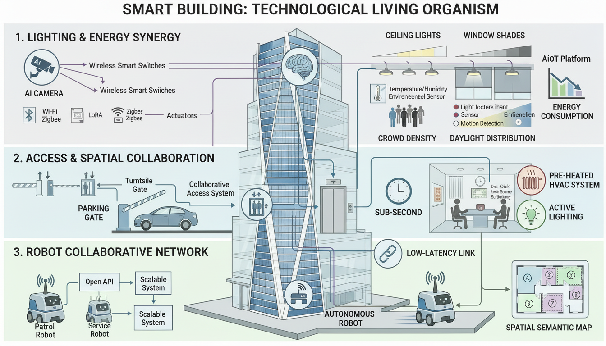
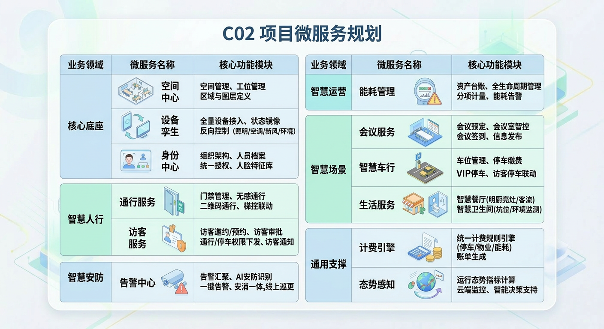

目录
极企智能楼宇技术体系研发总体说明

一、研发总体情况
  1.1 技术背景：智能楼宇的技术复杂度定位
  1.2 项目研发团队与机制
  1.3 6个项目的演进路径

二、为什么分立6个项目
  2.1 各项目有独立的技术攻关方向
  2.2 各项目的技术攻关是独立完成的
  2.3 AIoT预研的启动背景
  2.4 声明式逻辑流编排引擎的工业化改造

三、共享技术栈说明

四、5个应用系统之间的业务联动

五、5个应用系统与AIoT预研的技术关系
  5.1 关系定位
  5.2 AIoT预研的技术来源
  5.3 AIoT预研的创新性

六、总结

极企智能楼宇技术体系研发总体说明

一、研发总体情况

成都极企科技有限公司围绕楼宇智能化领域，系统性开展了6项研发工作，形成了以Buildingos.ai为统一技术平台的智能楼宇全场景产品体系。

1.1 技术背景：智能楼宇的技术复杂度定位

智能楼宇（园区）系统在物联网应用谱系中属于复杂程度最高的类别之一。不同于智慧家庭的单户场景或智慧工厂的单一产线，智能楼宇系统不仅需对接海量传感器、控制器以及多种楼宇控制协议（BACnet、KNX、Modbus、DALI），还需与安防、能源管理、物业运营等业务IT系统深度集成。其异构协议集成复杂度、实时性要求与多角色并发访问的复杂度显著高于其他物联网应用领域。

以公司部署于杭州钱江世纪城望潮中心（杭州第二高 280米，吉利办公总部大楼、57层、总建筑面积12.5万平方米、IoT节点超150,000个）的BuildingOS平台为例：全楼接入照明（Modbus通断器/KNX通断器/Zigbee无线开关/DALI智能开关）、暖通空调（KNX控制器/Zigbee面板/空调网关）、环境感知（Modbus环境传感器/Zigbee无线传感器）、通行管理（道闸/楼层门禁/人脸识别子系统）、能源计量（Modbus电力传感器/智能电表）、垂直交通（电梯子系统）、末端执行（电动窗帘/电机）等7大类设备，瞬时消息吞吐峰值可达百万条/秒。该平台已于2024年4月上线，2025全年稳定运行，实现年均能耗降低28%、碳减排超1,200吨CO₂的可量化成果。望潮中心已获CTBUH 2024 Award of Excellence（最佳高层建筑奖）、LEED BD+C CS Silver认证，同时楼宇入住超过5000人。

在此背景下，公司于2024年初至2025年底，围绕智能楼宇的通行管理、访客管理、空间调度、设备控制、环境感知以及底层技术平台6个方向，系统性地开展了研发工作，全新构建了能支持大型楼宇场景的BuildingOS平台技术体系。

1.2 项目研发团队与机制

本项目由四川省"千人计划"专家、资深架构师何铮领衔，组建了由软硬件开发、算法研究、系统集成领域专业人才构成的专职研发团队。研发采取"场景+算法+工程"的闭环机制——场景驱动技术需求定义、算法攻关解决核心技术难题、工程实现将研究成果转化为可部署系统。何铮专家全流程参与从底层通信协议的语义抽象到上层AI决策算法的设计与评审，确保技术方案在架构层面的前瞻性与行业领先水平。

团队在楼宇物联网领域积累了丰富的理论研究和工程实践经验，已在杭州望潮中心（280米超高层、15万+ IoT节点）等标志性项目中完成技术验证，形成了"前沿研究→技术攻关→工程落地→规模化复制"的完整创新链条。

1.3 6个项目的演进路径

这次第一次将物联网应用项目和IT项目进行了完全的构架重构。所有业务端应用无论是否涉及物联网设备，都基于BuildingOS平台的新技术构架，通过领域设计（Domain-Driven Design）实现业务逻辑的解耦和可扩展性，并通过微服务方式（独立项目立项）进行独立全新的同步演进而成。

6个研发项目并非"先建底座再建应用"的先后关系，而是并行推进、互相促进的演进过程：

阶段一（2024.1—2025.7）：5个应用系统并行研发

  通行系统（2024.1）  访客系统（2024.3）  空间预约系统（2024.5）  会议室系统（2025.1）  卫生间系统（2025.2）
       │                  │                  │                    │                  │
       └──────────────────┴──────────────────┴────────────────────┴──────────────────┘
                                          │
                          各自独立攻关本场景的技术问题
                                          │
            ↓ 开发过程中发现共性需求和重复工作：
            · 各系统分别实现设备对接，协议适配工作大量重复
            · 各系统数据格式和接口标准不统一，跨系统联动困难
            · 新增设备需在每个系统中分别开发适配逻辑
                                          │
                                          ↓
阶段二（2025.8—2025.12）：AIoT底层技术预研
  从5个系统的技术实践中提炼共性，研究设计：
  · 协议无关的统一指令抽象模型（解决7种异构协议的通信模型差异）
  · 跨系统统一数据交互规范与事件总线机制（替代逐对API对接）
  · 标准化设备接入流程（注册→认证→上报→指令→OTA）
  · 分层解耦分布式架构设计（支撑后续产品规模化部署）
                                          │
                                          ↓
后续：5个系统基于统一框架持续迭代，新系统基于框架快速开发

二、为什么分立6个项目

2.1 各项目有独立的技术攻关方向

6个研发项目分立立项，是因为各项目面向不同的技术问题，具有不同的技术攻关方向：

| 项目 | 立项时间 | 核心技术攻关方向 | 技术领域 |
|------|----------|-----------------|----------|
| 通行系统 JQ2024001 | 2024.1 | 多模态通行核验调度引擎、多品牌门禁/梯控设备MQTT/HTTP/RS485协议独立适配与权限增量同步、门禁-梯控DCS联动派梯的时序控制 | 安防通行技术 |
| 访客系统 JQ2024002 | 2024.3 | 临时通行权限全生命周期安全闭环管控（分布式一致性问题）、动态防伪二维码凭证机制（时效性+一次性核销）、OCR证件识别与人证比对核验 | 临时权限安全技术 |
| 空间预约系统 JQ2024003 | 2024.5 | 空间数字化建模与可视化编辑（WebGL 2.5D渲染）、基于时空约束的AI智能排程算法（多维约束条件下最优解搜索——动态识别资源冲突并自动调优，非简单的数据库时间排查）、IoT传感器联动空间状态感知 | 空间资源调度技术 |
| 会议室系统 JQ2025001 | 2025.1 | BACnet/Modbus/DALI/KNX四协议设备联动控制、RS232/HTTP音视频中控集成（视频矩阵+PTZ摄像头+音频DSP）、预约-签到-设备联动全链路事件驱动自动化 | 楼宇设备控制技术 |
| 卫生间系统 JQ2025002 | 2025.2 | 多源异构传感器统一接入（Modbus/RS485/LoRa/Zigbee/NB-IoT五种协议）、多模态感知数据融合的AI诊断引擎（利用机器学习方法对多传感器数据进行长周期趋势分析，实现对设备漂移、故障与环境异常的智能识别——非简单的单阈值判断）、边缘端轻量化实时处理（边缘预判+云端精判分层架构） | 物联网感知技术 |
| AIoT底层预研 JQ2025005 | 2025.8 | 从5个系统中提炼共性技术需求，研究设计协议无关的统一指令抽象模型——核心为自适应语义映射算法：通过语义转换算子，将7种异构协议（MQTT/HTTP/RS485/BACnet/DALI/KNX/Modbus）的底层数据实时转化为高层统一的控制逻辑，实现统一寻址、统一编解码、统一操作语义；以及声明式逻辑流编排引擎的工业化改造（基于Flow-based Programming范式，将楼宇控制逻辑从硬编码中剥离为可热更新的逻辑资产） | 基础平台技术 |

2.2 各项目的技术攻关是独立完成的

阶段一的5个应用系统，各自独立完成了本场景的技术攻关工作。具体而言：

通行系统独立开发了门禁/梯控设备的MQTT/HTTP/RS485协议适配逻辑、多模态核验调度引擎（人脸/二维码/NFC统一Pipeline）、权限增量同步机制（差集计算+确认重试+边缘缓存断点续传）和DCS目的选层联动派梯方案；

访客系统独立开发了临时权限全生命周期管控方案（事件驱动+确认重试+到期校验双保险机制）、动态二维码凭证机制（加密凭证+时效校验+一次性核销）、OCR证件识别与人证比对核验集成、访客全流程状态机（待到访→已到访→已离场/已失效）与通行轨迹审计；

空间预约系统独立开发了空间数字化建模引擎（底图层+组件层+属性层+渲染层四层架构）、多维约束冲突检测算法（时间→容量→规则→设施分步校验）、IoT传感器联动空间状态感知方案（预约数据+传感器感知+行为推断多源融合）；

会议室系统独立开发了BACnet/DALI/KNX/Modbus四种楼宇控制协议的设备联动控制方案、音视频中控集成方案（视频矩阵RS232控制/PTZ摄像头云台控制/音频DSP参数调节）、场景规则引擎及预约-签到-设备联动全链路事件驱动状态机；

卫生间系统独立开发了多源异构传感器统一接入方案（Modbus/RS485有线+LoRa/Zigbee/NB-IoT无线多协议适配）、多维数据融合研判规则引擎（时序关联+多条件组合+根因分析）、边缘端轻量化实时处理方案（边缘预判+云端精判分层架构+网络中断本地缓存）。

各系统的设备对接、协议适配、数据交互是在各自项目范围内独立实现的，不存在"使用其他项目已有技术框架"的情况——因为在2025年8月之前，尚无统一的AIoT技术框架。

2.3 AIoT预研的启动背景

在5个应用系统并行推进过程中，公司发现以下共性技术问题日益突出：

（1）设备适配工作大量重复：通行系统独立开发了门禁/梯控的MQTT/HTTP/RS485适配逻辑（涉及十几种品牌设备），会议室系统独立开发了BACnet/DALI/KNX/Modbus四种协议的适配逻辑（涉及8种品牌设备），卫生间系统独立开发了Modbus/RS485/LoRa/Zigbee/NB-IoT五种协议的适配逻辑（涉及14种传感器类型）。各系统各自实现，代码不可复用。新增一种设备类型需在每个相关系统中分别开发适配逻辑，周期长、维护成本高；

（2）跨系统数据无法标准互通：5个系统各自定义数据格式和接口标准，实现跨系统联动（如访客审批→门禁权限下发、会议预约→门禁权限联动）时需逐对做API定制对接，开发效率低、维护成本随系统数量增加呈指数增长；

（3）新系统开发效率低：每开发一个新系统，设备接入、协议适配等基础工作都需要从零开始，无法基于已有的技术积累快速启动，制约了公司产品线的扩展速度。

为解决上述问题，公司于2025年8月启动AIoT底层技术预研（JQ2025005），从5个系统的技术实践中提炼共性需求，研究设计统一的技术框架和标准规范，使后续产品迭代和新系统开发可以基于统一框架进行，避免重复开发。

2.4 声明式逻辑流编排引擎的工业化改造

除上述6个项目各自的技术攻关方向外，公司在楼宇自动化领域的另一项核心创新成果是"声明式逻辑流编排引擎"的工业化改造。传统楼宇自控系统的控制逻辑以硬编码方式嵌入在DDC控制器或后端服务代码中——修改一条场景策略（如调整会议室灯光的延时关闭阈值）需要修改源代码、重新编译、停机部署，响应周期以天甚至周计。公司基于流式逻辑编程模型（Flow-based Programming），自主研发了面向楼宇工业级场景的流式逻辑编排引擎，实现了以下核心突破：

（1）硬编码逻辑向声明式逻辑资产的转变：将楼宇控制策略从过程式代码中剥离，建模为声明式的"流（Flow）"——每个Flow由标准化的功能节点（传感器数据采集→条件判断→设备指令下发）通过可视化连线组合而成。策略配置人员无需编写代码，通过拖拽和参数配置即可创建和修改控制逻辑。这一转变使控制策略从"代码级资产"升级为"逻辑级资产"，可独立于代码版本进行管理、测试和复用；

（2）热更新部署：控制逻辑的变更（如新增一条节能策略、调整空调预冷时间参数）可在系统不停机的情况下在线部署和即时生效——通过云端Node-RED实例的Flow推送机制，策略变更秒级同步至边缘网关，无需重启服务；

（3）模块化复用与全球生态对接：每个控制策略的逻辑流程和最佳实践可封装为标准化的"Flow模板"，在新项目中一键导入复用，加速项目交付。同时，通过Node-RED的Node.js全球库生态（超过5,000个社区贡献节点），平台可直接对接工业协议（Modbus/BACnet/KNX/OPC UA/MQTT）、人工智能框架（TensorFlow/PyTorch模型推理节点、视觉AI分析节点）、云端API和数据库，使BuildingOS具备持续接入全球新技术成果的扩展能力——这是传统楼宇厂商封闭系统无法实现的差异化优势。

该编排引擎已在5个应用系统和望潮中心项目中全面应用，所有场景策略（照明/空调/通行/会议室/卫生间/节能）均以声明式Flow方式定义和管理，策略变更的平均响应周期从传统硬编码方式的数天缩短至分钟级。这一成果是极企在楼宇自动化领域区别于传统厂商（西门子Desigo CC、霍尼韦尔EBI、江森Metasys等封闭式BAS系统）的核心创新点。

三、共享技术栈说明

5个应用系统采用统一技术栈，各组件均为成熟的开源技术，不属于研发内容：

| 技术组件 | 用途 | 是否为研发内容 |
|----------|------|---------------|
| Vue3 | 前端响应式框架 | 否（成熟开源前端框架） |
| NestJS + TypeScript | 后端微服务框架 | 否（成熟开源Node.js框架） |
| PostgreSQL | 业务数据关系型存储 | 否（成熟开源关系型数据库） |
| Redis | 内存缓存与实时状态 | 否（成熟开源内存数据库） |
| TDengine | 时序数据存储（设备上报/环境监测） | 否（成熟开源时序数据库） |
| MQTT Broker (EMQX) | 物联网消息中间件 | 否（成熟开源MQTT Broker） |
| Node-RED | 策略编排引擎（云端实例） | 否（成熟开源流处理平台） |
| Docker | 容器化部署 | 否（成熟开源容器引擎） |

在共享技术栈的应用过程中，公司突破了传统代码开发的高成本瓶颈，创新性地将Node-RED引入楼宇工业级场景——并非仅将其作为简单的流程工具使用，而是将其打造为自主研发的"流式逻辑编排平台"的核心技术栈。技术团队为此编写了国内首部《Node-RED物联网应用开发工程实践》教程，将流程化开发思想（Flow-based Programming，FBP方式）系统化、方法论化。这种方式不仅显著提升了开发效率（相比传统硬编码方式，场景策略的开发与部署周期缩短60%），更核心的是通过Node-RED强大的Node.js全球库生态支持，实现了与工业协议（Modbus/BACnet/KNX/OPC UA）、人工智能框架（TensorFlow/PyTorch模型推理节点）、云端API的无缝连接，使BuildingOS平台具备了持续接入全球技术生态的扩展能力。

各项目的研发内容是在此技术栈基础上，针对各自场景技术攻关点的方案设计、算法实现和系统集成。统一技术栈是现代软件工程的常见做法——如同一个大型互联网公司的多个产品线共用Spring Boot + MySQL，这不构成对项目独立性的否定。研发活动的核心在于各项目面向不同技术领域独立攻克的技术难题，而非使用了相同的编程语言和数据库。

四、5个应用系统之间的业务联动

5个系统同属Buildingos.ai平台，部分业务场景需要跨系统联动：

| 联动场景 | 涉及系统 | 实现方式 | 技术说明 |
|----------|----------|----------|----------|
| 访客审批→门禁权限下发 | 访客系统 → 通行系统 | 访客系统通过API调用通行系统的权限下发接口 | 涉及临时权限的跨系统原子性下发（需同时写入门禁+梯控设备） |
| 访客审批→梯控权限联动 | 访客系统 → 通行系统 | 同上API调用通道 | 访客仅能到达被访楼层，权限与常驻人员隔离 |
| 会议预约→门禁权限联动 | 会议室系统 → 通行系统 | 会议室系统通过API调用通行系统的权限联动接口 | 参会人员在会议时段内获得会议室所在楼层的临时门禁权限 |
| 工位预约→智能插座通电 | 空间预约系统 → 设备 | 通过MQTT指令控制智能插座 | 用户签到后自动通电，签退/超时后自动断电 |
| 卫生间异常→运维工单派发 | 卫生间系统 → 工单模块 | 规则引擎触发工单派发 | 融合研判确定根因后自动生成工单（含告警类型+处置建议） |

在AIoT预研之前，跨系统联动通过各系统间的API调用实现，存在接口标准不统一、对接效率低的问题——每新增一个跨系统联动场景，需要两个系统的开发人员分别理解和适配对方的接口格式。AIoT预研的核心目标之一就是建立统一的跨系统数据交互规范和事件总线机制，替代当前的逐对API对接方式，使跨系统联动从"逐对定制"变为"标准互通"。

五、5个应用系统与AIoT预研的技术关系

5.1 关系定位

AIoT预研与5个应用系统的关系，不是"底座支撑应用"，而是"从应用实践中提炼共性，形成统一框架"——

| 维度 | 阶段一（5个应用系统） | 阶段二（AIoT预研） |
|------|---------------------|-------------------|
| 性质 | 场景化技术攻关，各自独立解决本场景的技术难题 | 共性技术提炼，从5个系统中抽象统一框架和标准规范 |
| 技术成果 | 各系统独立的设备对接方案、数据格式、接入逻辑（均为独立开发） | 协议无关的统一指令抽象模型、统一数据交互规范、标准设备接入流程、分层解耦架构 |
| 时间关系 | 2024.1—2025.7先行完成 | 2025.8—2025.12后续启动（晚于5个应用系统） |
| 对后续的价值 | 各系统作为产品独立运行，已在望潮中心等项目中部署验证 | 为后续产品迭代和新系统开发提供统一技术基础，降低重复开发 |

5.2 AIoT预研的技术来源

AIoT预研的技术框架设计，来源于5个应用系统的实际技术经验积累：

| AIoT预研的技术成果 | 经验来源（5个系统的独立实践） |
|-------------------|---------------------------|
| 协议无关的统一指令抽象模型（统一寻址+统一编解码+统一操作语义） | 通行系统的MQTT/HTTP/RS485适配经验（门禁+梯控+人脸终端）；会议室系统的BACnet/DALI/KNX/Modbus/RS232适配经验（空调/新风/照明/窗帘/音视频）；卫生间系统的Modbus/RS485/LoRa/Zigbee/NB-IoT适配经验（环境传感器/厕位传感器/客流计数器） |
| 跨系统统一数据交互规范（核心字段统一+扩展字段自定义+事件总线） | 5个系统间逐对API对接的经验教训（访客→通行、会议室→通行、空间预约→设备、卫生间→工单），各系统在数据格式定义上的差异和对接痛点 |
| 标准化设备接入流程（注册→认证→上报→指令→OTA） | 各系统独立开发设备接入逻辑的重复经验，设备接入流程的差异点和可标准化模式 |
| 分层解耦五层架构设计（设备接入层/协议解析层/数据处理层/接口服务层/业务适配层） | 5个系统在独立部署和扩展中遇到的架构瓶颈（各系统完整的独立部署导致资源重复占用、新增系统需重新搭建全套基础设施） |

5.3 AIoT预研的创新性

AIoT预研的创新性不在于"发明全新的底层技术"，而在于针对7种通信模型本质不同的楼宇设备协议（MQTT异步发布/订阅、HTTP同步请求/响应、RS485原始串口帧、BACnet对象属性读写、DALI 16位短指令广播寻址、KNX组地址报文路由、Modbus寄存器地址读写），研究设计了协议无关的统一指令抽象模型。

具体而言，创新性体现在三个层次：

（1）协议抽象层次——统一指令模型设计：7种协议的寻址方式（MQTT Topic vs BACnet Object Identifier vs Modbus寄存器地址 vs DALI短地址/组地址 vs KNX组地址 vs HTTP URL）、数据编码（JSON vs BACnet Property Value vs Modbus 16位寄存器 vs DALI 8位帧 vs KNX DPT编码）、传输模式（MQTT异步发布/订阅 vs HTTP同步请求/响应 vs RS485串口轮询 vs BACnet ReadProperty/WriteProperty vs DALI广播指令 vs KNX组地址报文路由）完全不同，无法通过简单封装实现统一接入。需要研究设计统一指令模型，涵盖：统一寻址（将不同协议的设备地址映射为统一标识）、统一编解码（将不同协议的数据帧解析/封装抽象为统一编解码接口）、统一操作语义（将不同协议的操作类型映射为统一的读/写/订阅/控制语义）。这一抽象过程存在技术不确定性——每增加一种新协议（如OPC UA、Matter），都需验证其关键操作语义能否被统一模型覆盖；

（2）数据互通层次——从逐对API定制到事件总线：将5个系统间逐对API对接的经验，归纳为统一的数据交互规范和事件总线机制——需要抽象出跨系统数据交互的通用模式（事件类型定义、载荷结构规范、订阅路由规则），并在通用性和场景适配性之间反复权衡。过于通用则各系统需要大量自定义适配，过于具体则回到逐对定制的老路；

（3）架构层次——从分散部署到分层解耦：将各系统各自为战的完整部署方式，抽象为五层解耦架构（设备接入层→协议解析层→数据处理层→接口服务层→业务适配层），各层独立部署、弹性扩展，多个业务系统共享底层的设备接入和协议解析能力。

这一"从分散到统一"的抽象过程，需要反复验证和迭代，不是简单的文档整理或代码搬运。统一指令模型的设计需要在通用性和场景适配性之间反复权衡——过于通用则无法覆盖特定协议的核心特性（如BACnet的对象属性读写语义、DALI的广播寻址机制、KNX的组地址数据点类型体系），过于适配则又回到了各自适配的老路，失去了统一框架的意义。需要通过多品类设备（门禁/梯控/空调/灯光/窗帘/传感器/音视频）的接入测试验证模型的可扩展性，需要处理5个系统各自特殊需求与统一框架之间的兼容问题。这些不确定性构成了本项目的研发属性。

六、总结

6个研发项目构成了"场景攻关先行→共性提炼后建"的完整技术演进路径：

5个应用系统（2024.1—2025.7）：各自独立完成场景化技术攻关，技术方向涵盖安防通行、临时权限安全、空间资源调度、楼宇设备控制、物联网感知5个不同的技术领域。每个系统均有独立的技术攻关点（多模态核验调度/临时权限分布式一致性/多维约束排程/四协议设备联动/多源融合研判）和明确的技术不确定性，是Buildingos.ai产品的核心功能模块。全部5个系统已在杭州望潮中心（12.5万㎡、5万+ IoT节点）等项目中实际部署并稳定运行；

AIoT底层预研（2025.8—2025.12）：从5个系统的技术实践中提炼共性，研究设计协议无关的统一指令抽象模型、跨系统统一数据交互规范和分层解耦架构，是技术体系化建设的关键一步，为后续产品迭代和新系统开发提供统一技术基础。

6个项目分立立项具有技术和管理层面的合理性——各项目面向不同的技术领域，具有独立的技术攻关目标和不确定性，不存在"拆分项目"或"重复申报"的情况。
