# 智慧园区核心建设模块解析：从技术集成到价值赋能

> **面向对象**：园区建设决策层、运营管理层、物业管理层
> **版本**：V1.0（汇报稿）
> **编制说明**：本报告基于 BuildingOS 智慧楼宇操作系统在吉利集团多园区（含 Smart 园区、望潮中心等）的实际落地实践编写，系统阐述"智能化园区包含哪些内容"与"为业务带来什么价值"两大核心命题。报告重点论证智慧园区给**园区运营带来的精细化管理**价值，同时兼顾**用户体验**提升。

---

## 目录

- 第一部分　BaaS 模式：吉利集团多园区建设的价值底座
- 第二部分　场景类模块：面向办公业务场景的能力全景
- 第三部分　运营类模块：面向园区运营管理的精细管控
- 第四部分　运维类模块：面向工程运维的保障体系
- 第五部分　价值总结：从技术集成到价值赋能

---

# 第一部分　BaaS 模式：吉利集团多园区建设的价值底座

## 1.1 智能化园区：包含哪些内容？

智能化园区不是单一系统的堆砌，而是一个以"云-边-端"三级架构为骨架、以数据为血液、以场景为表达的整体解决方案。结合 BuildingOS 在吉利集团多园区的实际部署，智能化园区的内容可归纳为**三大类核心模块**与**两大价值目标**：

| 类别 | 内容构成 | 服务对象 | 价值侧重点 |
|------|---------|---------|-----------|
| **场景类** | 通行、访客、会议室、工位、卫生间、停车、报修 | 园区内员工、访客、租户 | 流程数字化、体验提升、场景数据沉淀 |
| **运营类** | 设备中心、能耗中心、告警中心、楼宇智控、智能场景、智慧安防、信息发布、运营中心 | 运营管理团队 | **精细化管理（重点）**、降本增效 |
| **运维类** | 网关、摄像头、物联网设备、巡检、设备告警、日志 | 工程运维团队 | 设备全生命周期保障、故障闭环 |

> **一句话概括**：场景类解决"用得好"，运营类解决"管得精"，运维类解决"保得稳"。三者共用同一套云-边-端底座与数据中台，构成完整闭环。

## 1.2 什么是 BaaS（Building as a Service，楼宇即服务）？

传统智能化建设是"项目制"：每栋楼单独招标、单独设计、单独开发、单独运维，周期长、成本高、能力不互通。BuildingOS 开创性地提出 **BaaS 模式**——把"楼宇"当作服务单元来交付，一个租户对应一个（或多个）物理空间，多栋楼宇/园区共享同一套云端平台，通过边缘网关与物联网设备实现物理隔离与本地自治。

**BaaS 模式的核心特征：**

| 特征 | 说明 |
|------|------|
| **租户粒度=物理空间** | 以 spaceCode 标识的单栋楼宇或独立园区为最小服务单元，一个租户内可含多个组织（如不同楼层租户企业），支持子组织分权管理 |
| **云端共享** | 所有楼宇共享云端核心服务（后端微服务、AI 模型、数字孪生引擎、策略中心），平台维护成本被多园区摊薄 |
| **边缘隔离** | 每栋楼宇部署独立物联网边缘网关与 AI 边缘节点，数据本地处理、自治闭环、物理安全隔离 |
| **标准化复制** | 新楼宇接入仅需部署边缘硬件 + 配置 spaceCode，即可继承云端全部能力 |

## 1.3 BaaS 模式在多园区全生命周期中的价值

BaaS 的价值贯穿园区建设与运营的**八大环节**：采购 → 选型 → 设计 → 深化设计 → 部署 → 交付 → 运营 → 运维。每个环节都在与传统非标项目模式形成对比，体现降本、提速、提质：

### 1.3.1 采购环节：统一 BOM，框架协议批量采购

| 对比项 | 传统非标模式 | BuildingOS BaaS 模式 |
|--------|-------------|----------------------|
| 硬件清单 | 每项目临时选型，品牌杂乱 | 统一 BOM 清单、标准硬件选型库（边缘网关、传感器、控制器） |
| 采购方式 | 单项目议价，议价能力弱 | 框架协议批量采购，多园区集采 |
| 成本效果 | — | 硬件成本降低 **25%-40%** |

### 1.3.2 选型环节：成熟开源/国产化组件，规避供应链风险

- 消息总线选用 **EMQX**、时序数据库选用 **TDengine**、编排引擎选用 **Node-RED** 等成熟开源/国产化组件，经大规模验证，避免闭源锁定与单一供应商依赖。
- 统一技术栈（Vue3 + NestJS + TypeScript + PostgreSQL + Redis + MQTT + Docker），集团自有团队可快速掌握，降低培训与维护成本。

### 1.3.3 设计环节：标准模板库，杜绝重复劳动

- 沉淀《BuildingOS 标准化实施手册》：硬件选型清单、布线规范、IP 规划、软件配置模板、验收标准。
- 标准模板库（布线图、IP 段、网关部署规范）直接复用，工程设计工作量降低 **50%-70%**。

### 1.3.4 深化设计环节：数字孪生与仿真预演，工程进度解耦

- 依托数字孪生与仿真模拟平台，在物理施工前完成全链路虚拟预演（设备行为建模、压力场景仿真、联动逻辑验证）。
- 实现"设计-施工-调试"从线性串行变为**并行协同**：软件侧可提前进场调试，不受布线、装修等前序工程延误影响，大幅提升交付容错能力。

### 1.3.5 部署环节：边缘即插即用，两周完成交付

- 边缘网关与 AI 节点采用标准镜像 + 一键编排（docker-compose / K8s），现场仅需配置 spaceCode 与网络策略。
- **典型案例（Smart 园区）**：软件侧通过提前模拟物联网设备完成云端-边缘全链路验证，设备进场后直接接入，**整体部署周期从传统半年以上压缩至 2 周**，效率提升超过 90%。详见 1.4 节。

### 1.3.6 交付环节：标准化验收，数据驱动移交

- 标准化验收清单（设备在线率、数据连续性、场景联动回归、压测报告），交付即证明。
- 交付物含完整运维文档、自动巡检报告与知识库，移交清晰。

### 1.3.7 运营环节：统一运营平台，一屏统览多园区

- 云端统一运营中心（安防/告警/通行/环境/餐厅/会议六大看板），集团级一屏掌握所有园区运营态势。
- 多园区能耗、告警、通行数据同口径对比，支撑集团精细化管理决策。

### 1.3.8 运维环节：统一运维平台，人力近似恒定

- 统一运维平台 + 自动巡检 + AI 辅助诊断 + 标准化 SOP，运维复杂度不随园区数量线性增长。
- 传统模式每栋楼需 2-3 人运维；BaaS 模式下 6 栋楼仅需 8-10 人，运维人力降低约 **60%**。

## 1.4 标准化与多园区复制能力：Smart 园区 2 周交付的启示

### 1.4.1 案例背景

Smart 园区是吉利集团体系内的新建园区。按传统智能楼宇建设模式，从硬件选型、设计深化、设备进场、软件调试到最终交付，典型周期为 **6-12 个月甚至更长**（涉及多轮现场勘查、单项目定制开发、串行施工与调试）。

### 1.4.2 BuildingOS 的差异化打法

| 阶段 | 传统模式 | BuildingOS 模式 |
|------|---------|----------------|
| 软件准备 | 现场设备就绪后才开始联调 | **软件侧先行**：云端-边缘集群在设备进场前完成部署 |
| 设备联调 | 等实物设备到场逐台调试 | **模拟物联网设备提前进场**：编写模拟设备脚本覆盖典型设备类型（IPC/门禁/环境传感器/能耗表），全链路预验证 |
| 边缘部署 | 现场逐台安装配置 | 标准镜像 + 集群编排（EMQX/TDengine 三节点集群、Node-RED 分域部署），即插即用 |
| 上线验证 | 上线后边用边修 | 功能冒烟测试 + 压测前置，交付即稳定 |
| **总周期** | **半年以上** | **2 周完成部署** |

### 1.4.3 可复制路径：从"项目交付"到"产品复制"

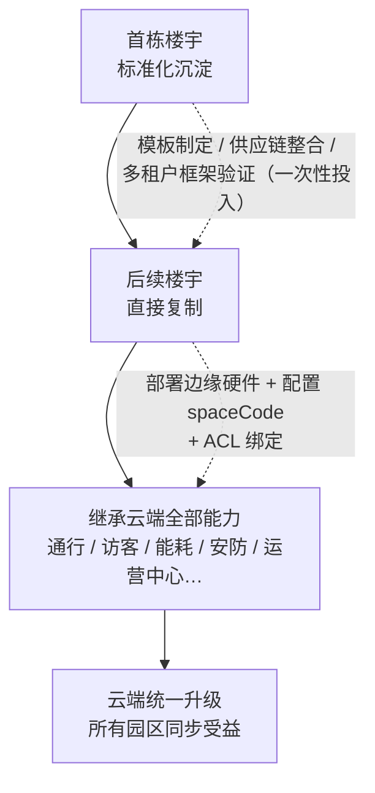

**量化效益（基于多园区平均）：**

| 指标 | 传统模式 | BuildingOS BaaS 模式 | 改善幅度 |
|------|---------|---------------------|---------|
| 新园区接入周期 | 6-18 个月 | 2 周-6 个月（首个 15 个月，后续大幅缩短） | 缩短 **70%+** |
| 建设成本 | 基准 | 降低 **35%-45%** | 显著 |
| 云端资源利用率 | 低（按项目独立） | 高（多园区共享摊薄） | 提升 **3-5 倍** |
| 总体拥有成本 TCO | 高 | 降低 **50% 以上** | 显著 |
| 运维人力 | 每栋 2-3 人 | 6 栋共 8-10 人 | 降低 **60%** |

---

# 第二部分　场景类模块：面向办公业务场景的能力全景

> **模块来源**：BuildingOS 平台「场景」一级菜单（对应前端路由 `/sence`）。
> **价值主线**：将园区办公业务（通行、访客、会议、工位、卫生间、停车、报修）全面数字化，用数据驱动精细化管理，同时显著改善员工与访客体验。

## 2.1 通行管理

### 2.1.1 场景描述

通行是园区最高频、最基础的业务场景。传统模式下，门禁权限靠人工在多个设备上逐个配置，新员工入职、转岗、离职后的权限回收滞后，存在安全隐患；通行记录分散、无法审计。BuildingOS 通行管理以"人-权限-设备"三维模型为核心，实现**通行权限的全生命周期自动化管控**。

### 2.1.2 功能描述

| 功能组 | 功能项 | 说明 |
|--------|--------|------|
| 人员通行 | 用户同步 | 与集团/企业微信等组织系统联动，人员入职自动入系统 |
| | 人脸库 | 统一人脸库管理，人脸下发至各门禁设备 |
| | 通行记录 | 全量通行记录留痕、可查询可审计 |
| | 无感考勤 | 基于通行行为自动生成考勤数据，替代排队打卡 |
| | 派梯设置 | 与梯控联动，授权人员自动派梯至授权楼层 |
| 门禁管理 | 门禁授权 / 门禁设备 / 门禁点分组 | 门禁点位按区域分组，权限精准下发 |
| 通行权限 | 权限组 / 通行角色 / 默认权限规则 | 按角色批量授权，新人入职秒级开通 |
| | 自动授权 | 离职/调岗自动回收权限，杜绝"僵尸权限" |
| | 综合权限查询 / 外部人员管理 / 批量操作 | 权限全景透视、外部人员（外包/施工）限时限域管理 |

### 2.1.3 数据流图

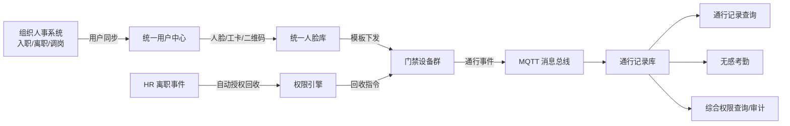

### 2.1.4 业务价值（精细化管理）

- **权限精细化**：按角色/分组/楼层精准授权，离职自动回收，通行安全零死角。
- **考勤自动化**：无感考勤替代排队打卡，考勤数据自动汇总，人力成本与员工等待时间双降。
- **数据可审计**：全量通行记录留痕，支持安全事件回溯，满足合规审计要求。

## 2.2 访客管理

### 2.2.1 场景描述

访客接待是园区的"对外窗口"。传统纸质登记流程繁琐、访客信息无法沉淀、门禁权限无法与访客联动。BuildingOS 访客管理实现**访客邀约、审批、签到、通行、离场**全流程数字化，访客"一次登记、全域通行"。

### 2.2.2 功能描述

| 功能项 | 说明 |
|--------|------|
| 访客申请 | 员工发起邀约/访客自助申请，单人及团体预约 |
| 访客签到 | 到访扫码/人脸/证件核验，自动激活通行权限 |
| 访客机管理 | 自助访客机，无人化登记发卡 |
| 邀约权限 | 精细化邀约权限管控，谁可邀约、可约区域可控 |
| 运营管理 | 访客全流程状态跟踪（待到访/已到访/部分到访/已失效） |
| 统计分析 | 访客流量、事由分布、部门接待排名 |

### 2.2.3 数据流图

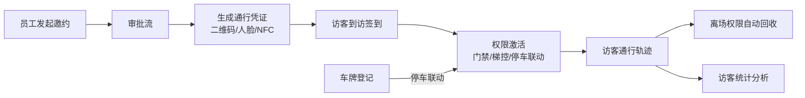

### 2.2.4 业务价值（精细化管理）

- **接待流程标准化**：邀约-审批-签到-离场全流程线上化，前台接待工作量大幅下降。
- **访客风险可控**：黑名单拦截、限时限域授权、离场自动回收权限，访客安全闭环。
- **数据沉淀**：访客流量与事由分析，支撑园区服务资源优化配置。

## 2.3 会议室管理

### 2.3.1 场景描述

会议室资源是园区最稀缺的空间资源之一。传统模式下会议室预订靠口头协调或纸质登记，占用情况不透明，空置与冲突并存。BuildingOS 会议室管理以三维地图沙盘 + 日历双视图，实现会议室**预订、审批、抢占、使用分析**全链路管理。

### 2.3.2 功能描述

| 功能项 | 说明 |
|--------|------|
| 会议室沙盘 | 三维地图展示会议室实时状态（空闲/使用中/预定/维护） |
| 预定会议 / 预定记录 | 在线预订、批量预定、预定记录管理 |
| 审批规则 | 按楼栋/楼层/会议室批量配置审批规则、时长触发审批 |
| 抢占规则 | 超时抢占（扫码抢占 + 释放提醒），杜绝"占而不用" |
| 使用分析 / 时长统计 | 使用率、高峰时段、部门频次、月度运营报表 |

### 2.3.3 数据流图

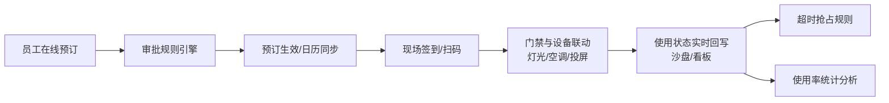

### 2.3.4 业务价值（精细化管理）

- **资源利用率提升**：实时状态透明 + 超时抢占，会议室空置率显著下降，使用率可量化统计。
- **审批精细化**：分级审批规则可配置，重要会议资源优先保障。
- **运营决策支撑**：部门会议频次、高峰时段分析，支撑会议室扩容/缩配决策。

## 2.4 工位管理

### 2.4.1 场景描述

办公空间利用率是园区成本的重要指标。固定工位按人头分配造成大量闲置，共享工位又面临"找不到、占不上"的问题。BuildingOS 工位管理以三维室内地图为载体，实现固定工位与共享工位的**统一分配、预订与可视化监控**。

### 2.4.2 功能描述

| 功能项 | 说明 |
|--------|------|
| 地图管理 | 三维室内地图，工位状态颜色编码（空闲/占用/维修中） |
| 固定工位 | 固定工位与人员绑定，全生命周期管理 |
| 共享预定 | 共享工位时间段预定，门禁权限联动下发 |
| 工位大屏 | 工位状态总览大屏，快速定位可用工位 |
| 工位统计 | 使用统计、部门分布分析、空间利用率报表 |

### 2.4.3 数据流图

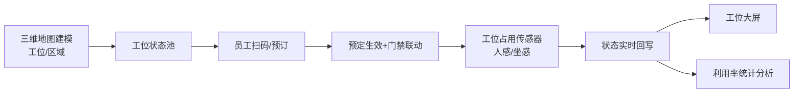

### 2.4.4 业务价值（精细化管理）

- **空间利用率提升**：共享工位模式 + 实时占用感知，办公面积需求可量化压缩，直接降低租赁成本。
- **分配精细化**：固定/共享双模式灵活配置，部门空间需求数据化。
- **体验改善**：员工一键找位、预订即通行，告别"上班抢座"。

## 2.5 卫生间管理

### 2.5.1 场景描述

卫生间是园区高频触点，也是保洁质量与空间品质的"温度计"。传统模式靠定时人工巡查，保洁响应滞后。BuildingOS 通过厕位传感器实现**占用状态实时可视 + 保洁按需触发**。

### 2.5.2 功能描述

| 功能项 | 说明 |
|--------|------|
| 厕位占用监测 | 厕位传感器实时上报占用/空闲状态 |
| 状态展示 | 屏端/地图展示各厕位状态，避免"推门尴尬" |
| 保洁联动 | 使用次数/时长触发保洁工单，按需清洁 |
| 异常告警 | 水浸、设备故障自动告警 |

### 2.5.3 数据流图

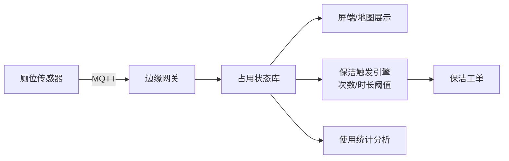

### 2.5.4 业务价值（精细化管理）

- **保洁精细化**：从"定时巡检"升级为"按需触发"，保洁人力利用率提升，体验一致性更好。
- **品质可视**：使用频次与高峰分析，支撑保洁排班优化。

## 2.6 停车管理

### 2.6.1 场景描述

停车是园区通勤体验与秩序管理的关键。传统模式车位分配靠人工登记，出入口拥堵、乱停乱放、访客车位管理困难。BuildingOS 停车管理实现**车位资源、车辆、进出、收费、统计**一体化管理，并与访客、门禁系统联动。

### 2.6.2 功能描述

| 功能组 | 功能项 | 说明 |
|--------|--------|------|
| 资源管理 | 区域管理 / 车位管理 | 停车区域→车位两级资源层级，平面图上传，新能源/普通车位分类 |
| 车辆管理 | 车辆登记 / 白名单 / 黑名单 / VIP | 员工与访客车辆登记，黑白名单管控，VIP 通行管理 |
| 车位申请 | 申请记录 / 审核分配 | 车位在线申请与多级审核，自动分配规则引擎 |
| 进出管理 | 进出记录 / 违规管控 / 访客联动 | 道闸联动自动识别放行，错停/超时/堵塞违规检测，访客车辆预约自动放行 |
| 运营统计 | 实时看板 / 车位使用 / 停车统计 | 车位使用率环形图、多维度统计、部门/访客分析 |
| 充电桩 | 充电桩状态 | 充电桩实时状态监控 |

### 2.6.3 数据流图

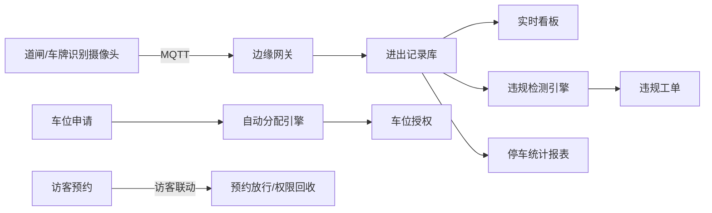

### 2.6.4 业务价值（精细化管理）

- **车位资源精细化**：两级资源管理 + 自动分配规则，车位利用率最大化。
- **秩序自动化**：违规自动检测、黑名单拦截、访客预约放行，出入口通行效率大幅提升。
- **数据可运营**：车位使用率与高峰分析，支撑车位扩容与收费策略优化。

## 2.7 报修与工单管理

### 2.7.1 场景描述

报修是园区日常运营的高频事件。传统模式报修靠电话/纸质登记，工单流转不透明、响应时效无保障、维修质量难追溯。BuildingOS 工单管理实现**报修、派单、处置、验收、评价**全流程闭环，并联动设备告警与巡检自动生成工单。

### 2.7.2 功能描述

| 功能组 | 功能项 | 说明 |
|--------|--------|------|
| 工单管理 | 工单列表 / 工单流程 | 手动/扫码/告警/巡检四种来源，六阶段状态流转（待派发→待接单→处置中→待验收→已归档/已取消） |
| | 服务类型 | 多级树形服务类型字典 |
| | 工单时效 SLA | 一般/紧急/非常紧急三优先级，响应/挂起/完成超时自动升级 |
| | 分配规则 | 按工单类型-区域-楼层-等级四级自动指派处理人 |
| | 工单统计 | 新增、满意度、响应率、完成率多维看板 |
| | 二维码管理 | 按区域/房间生成报修二维码，扫码即报 |
| | 巡检路线 | 自定义检查点 NFC 编码与周期规则，自动生成巡检工单 |
| 设备管理 | 设备台账 / 保养计划 / 保养任务 | 设备全生命周期台账，保养计划自动生成任务 |
| | 巡检点 / 巡检标准 / 巡检计划 / 巡检任务 | 巡检点标准配置，计划驱动自动巡检 |

### 2.7.3 数据流图

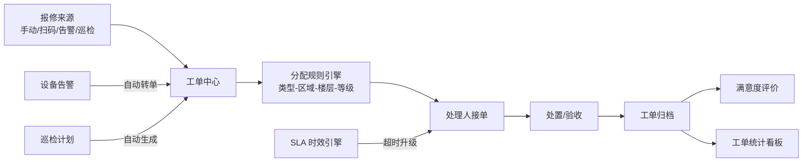

### 2.7.4 业务价值（精细化管理）

- **时效可承诺**：SLA 三级时效 + 超时自动升级，响应与完成时效可量化考核。
- **流转全透明**：六阶段状态全程可见，报修人实时掌握进度。
- **质量可追溯**：设备台账与工单深度关联，维保历史完整追溯，服务评价闭环。

---

# 第三部分　运营类模块：面向园区运营管理的精细管控

> **模块来源**：BuildingOS 平台「运营」「信息发布」「运营中心」一级菜单（对应前端路由 `/operate`、`/publish`、`/operations`）。
> **价值主线**：运营类是**精细化管理价值最集中的板块**——设备状态、能耗、告警、环境、餐饮、会议全部数据化、可视化、可分析，让运营从"经验驱动"升级为"数据驱动"。

## 3.1 设备中心

### 3.1.1 场景描述

设备中心是园区运营的统一入口，汇聚各类物联网设备的实时状态，是运营人员的"设备总览驾驶舱"。

### 3.1.2 功能描述

| 功能项 | 说明 |
|--------|------|
| 设备状态总览 | 全部物联网设备在线/离线/故障状态实时统计与展示 |
| 设备分类监控 | 按设备类型（照明/空调/电梯/门禁/传感器等）分选项卡监控 |
| 实时刷新 | 通过 MQTT 订阅实现秒级实时状态刷新 |

### 3.1.3 数据流图

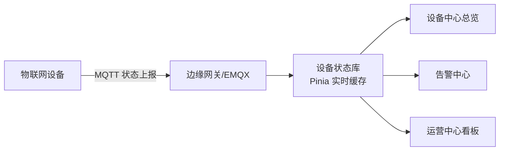

### 3.1.4 业务价值（精细化管理）

- **状态一屏掌握**：全园区设备健康度秒级可视，离线/故障设备第一时间发现。
- **跨园区对比**：统一平台多园区设备状态同口径对比，支撑集团考核与资源调配。

## 3.2 能耗中心

### 3.2.1 场景描述

能耗是园区最大的运营成本项之一，也是"双碳"考核的核心指标。传统模式能耗数据靠人工抄表、按月汇总，无法定位浪费点。BuildingOS 能耗中心实现**能耗采集、监测、管理、双碳**全链路数字化。

### 3.2.2 功能描述

| 功能组 | 功能项 | 说明 |
|--------|--------|------|
| 能耗采集 | 电耗采集 / 水耗采集 | 表计台账管理，数据自动/手动采集录入 |
| 能耗监测 | 告警阈值配置 / 告警事件管理 | 用能异常自动告警，按月份和分项多维度统计 |
| 能耗管理 | 用水/用电监测 | 分站点汇总、分公司尖峰平谷时段用电量与碳排放费用计算 |
| | 价格配置 | 水气阶梯价格（一/二/三档）、用电尖峰平谷四时段价格、月度限额 |
| 双碳管理 | 碳概览 / 碳交易 / 碳足迹 / 双碳曲线 | 碳排放总量与趋势、核证减排量/绿证/CCER 交易、碳足迹全生命周期、达峰/中和预测 |
| | 动态评价 / 辅助决策 / 碳资产管理 | 单位面积与人均能耗指标、节能投资方案评估、排放目标对比 |

### 3.2.3 数据流图

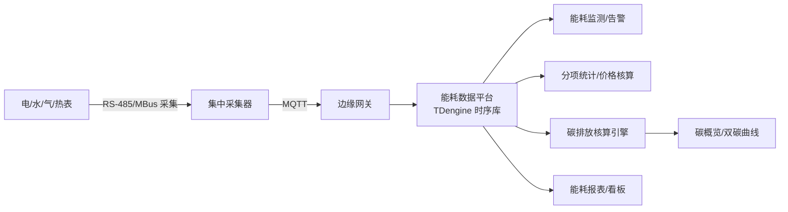

### 3.2.4 业务价值（精细化管理）

- **成本精细核算**：尖峰平谷分时电价、阶梯价格自动核算，能耗成本归属到分公司/楼层。
- **浪费精准定位**：告警阈值 + 分项统计，异常用能（无人空调、深夜照明）实时告警，可量化节能。
- **双碳目标管理**：碳排放核算引擎内置国家电网排放因子，达峰/中和预测，支撑集团双碳考核与碳资产运营。

## 3.3 告警中心

### 3.3.1 场景描述

告警是园区运营的安全防线。传统模式告警分散在各子系统，运营人员需登录多个平台，漏报漏处理风险高。BuildingOS 告警中心实现**多源告警统一汇聚、分级处置、闭环管理**。

### 3.3.2 功能描述

| 功能项 | 说明 |
|--------|------|
| 告警汇聚 | 设备告警、安防告警、能耗告警等多源统一展示 |
| 分级处置 | 告警分级（低/中/高/紧急），按级别配置声音/弹窗/短信/飞书多渠道通知 |
| 告警升级 | 超时自动升级规则，级别提升/上级通知/群组分发 |
| 告警聚合 | 合并窗口 + 多维字段聚合，抑制告警风暴 |
| 告警工单 | 告警一键转工单，处置闭环可追溯 |
| 白名单 | 误报加白、临时通行、设备维护等豁免管理 |

### 3.3.3 数据流图

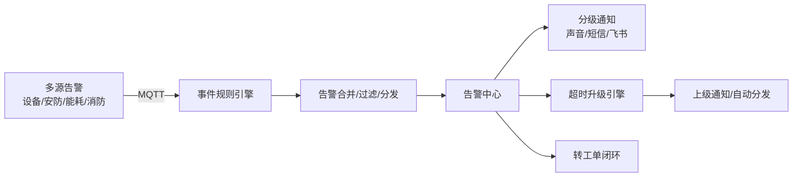

### 3.3.4 业务价值（精细化管理）

- **响应可考核**：告警分级 + 超时升级 + 响应率统计，处置时效纳入运营考核。
- **告警风暴抑制**：多源聚合 + 合并窗口，运营人员不再被告警淹没，聚焦真实风险。
- **闭环可追溯**：告警-工单-处置-归档全链路留痕，安全事件可复盘。

## 3.4 楼宇智控

### 3.4.1 场景描述

楼宇智控是园区设备的"操控中枢"，覆盖电梯、门禁、照明、调光、空调、人感、窗帘、环境、烟感、水浸、平板、厕位、电路、新风、排风等 15 类设备，实现**设备的统一接入、统一控制、统一监控**。

### 3.4.2 功能描述

| 功能项 | 说明 |
|--------|------|
| 电梯 | 电梯状态监控、联动派梯 |
| 门禁 | 门禁设备统一管理与控制 |
| 照明 / 调光 | 照明开关、亮度调节、场景化控制 |
| 空调 | 空调开关、温度设定、模式切换 |
| 人感 | 人体感应传感器，人员存在感知 |
| 窗帘 | 窗帘开合控制 |
| 环境 | 温湿度、空气质量等环境监测 |
| 烟感 / 水浸 | 消防与漏水监测告警 |
| 平板 | 智能平板终端管理 |
| 厕位 | 厕位占用状态 |
| 电路 | 电路与能耗监测 |
| 新风 / 排风 | 新风与排风系统控制 |

### 3.4.3 数据流图

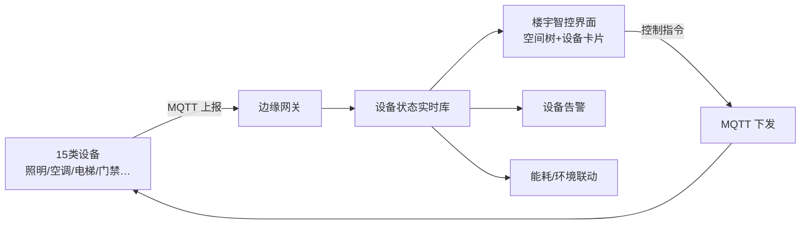

### 3.4.4 业务价值（精细化管理）

- **控制精细化**：按空间树逐层（园区-楼栋-楼层-房间）控制，颗粒度到单个设备。
- **联动智能化**：人感、环境、能耗数据联动，无人自动关灯关空调，节能效果可量化。
- **多协议统一**：Modbus/BACnet/DALI/KNX 等异构协议统一接入，运维不再被设备品牌绑定。

## 3.5 智能场景

### 3.5.1 场景描述

智能场景是楼宇自动化策略的"编排中心"。传统模式每个场景写死在控制器里，改动需厂商上门。BuildingOS 智能场景以可视化策略编辑器实现**场景的零代码编排、日历化管理、执行可追溯**。

### 3.5.2 功能描述

| 功能项 | 说明 |
|--------|------|
| 场景设置 | 可视化策略编辑器，"物理位置 × 时间类型 × 策略条件"三维组合 |
| 场景日历 | 工作日/休息日/节假日分日历配置，特殊日期单独覆盖 |
| 场景日志 | 策略执行日志全记录，未来日历预演 + 历史执行着色 |

### 3.5.3 数据流图

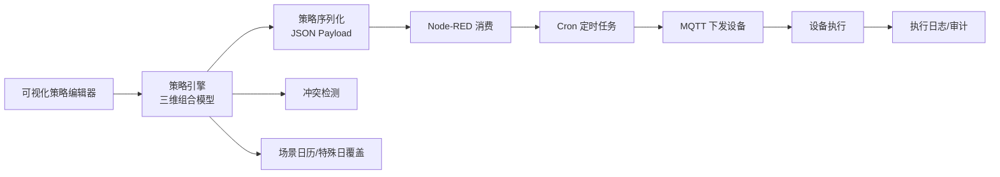

### 3.5.4 业务价值（精细化管理）

- **策略可编程**：运营人员零代码编排场景，需求从"天级响应"缩短至"小时级"。
- **覆盖无遗漏**：工作日/调休/节假日分级覆盖 + 特殊日单独规则，节假日能耗精准控制。
- **执行可追溯**：全量执行日志 + 未来日历预演，策略冲突提前发现，杜绝"偷偷失效"。

## 3.6 智慧安防

### 3.6.1 场景描述

安防是园区安全的底线。BuildingOS 智慧安防以三维地图指挥中心 + 视频 AI 能力，实现**安防告警汇聚、视频巡更、以图搜图、黑名单管理**一体化。

### 3.6.2 功能描述

| 功能项 | 说明 |
|--------|------|
| 告警 | 多源安防告警（视频/门禁/周界/消防）统一汇聚与处置 |
| 以图搜图 | 人脸照片上传，跨系统检索轨迹，人证核验 |
| 黑名单 | 黑名单人员管理，联动告警与拦截 |
| 视频巡更 | 摄像头编排虚拟巡更路线，定时自动巡更 |
| 告警定位 | 三维地图告警飞行定位，事件周边摄像头一键调阅 |

### 3.6.3 数据流图

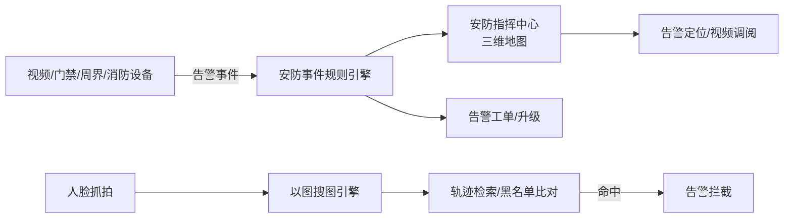

### 3.6.4 业务价值（精细化管理）

- **安防可视化**：三维地图指挥 + 告警飞行定位 + 周边视频一键调阅，处突效率倍增。
- **视频智能化**：以图搜图、人脸比对，安保从"事后调录像"升级为"智能检索定位"。
- **流程闭环**：告警-定位-处置-归档全流程留痕，安保工作可量化考核。

## 3.7 信息发布

### 3.7.1 场景描述

信息发布是园区运营的"声音与画面"。传统模式屏端内容各自为政，更新需逐屏拷贝。BuildingOS 信息发布以"素材 → 投放 → 审批 → 设备"为业务主线，实现**多媒体内容的统一管理与精准投放**。

### 3.7.2 功能描述

| 功能项 | 说明 |
|--------|------|
| 素材管理 | 视频、多屏、网页、直播四种内容类型素材统一管理 |
| 投放管理 | 投放排期（每天/每周/单次/自定义）+ 多级审批流程 |
| 设备管理 | 发布设备按区域/类型分组，在线状态监控、远程重启 |
| 系统配置 | 设备类型、流程实例、审批流、园区隔离配置 |

### 3.7.3 数据流图

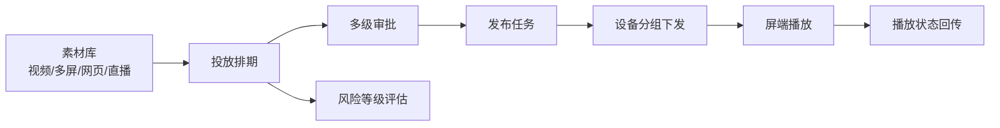

### 3.7.4 业务价值（精细化管理）

- **内容管控精细化**：多级审批 + 风险等级评估，发布内容合规可控。
- **投放可计划**：四种排期模式，重大活动/日常运营内容错峰投放，屏端资源高效利用。
- **设备可运维**：分组监控 + 远程重启，屏幕故障远程处理，无需逐台跑现场。

## 3.8 运营中心（IOC）

### 3.8.1 场景描述

运营中心（IOC）是园区精细化管理价值的**集中体现**——将安防、告警、通行、环境、餐厅、会议六大领域的运营数据汇聚于统一看板，实现"园区运营态势一屏掌握"，是面向园区领导汇报的"运营驾驶舱"。

### 3.8.2 功能描述

| 看板 | 核心指标 |
|------|---------|
| 安防看板 | 今日告警、待处理、在线/离线摄像头、安保人员、巡逻路线、24h 告警趋势、告警类型分布 |
| 告警看板 | 总告警、已处理/处理中/未处理、响应率、平均响应、7 天趋势、来源分析、区域分布 |
| 通行看板 | 今日车流量、车位占用率、在园人数、今日访客、车流趋势、人员密度、车位使用 |
| 环境看板 | 温度/湿度/AQI/PM2.5/CO₂/TVOC/噪音/舒适度八项指标、温度趋势、传感器明细 |
| 餐厅看板 | 就餐人数、座位占用率、用餐总数、排队时间、高峰时段、菜单评分、周度统计 |
| 会议看板 | 今日会议数、进行中、使用率、参会人数、待开会议、平均时长、会议室状态 |

### 3.8.3 数据流图

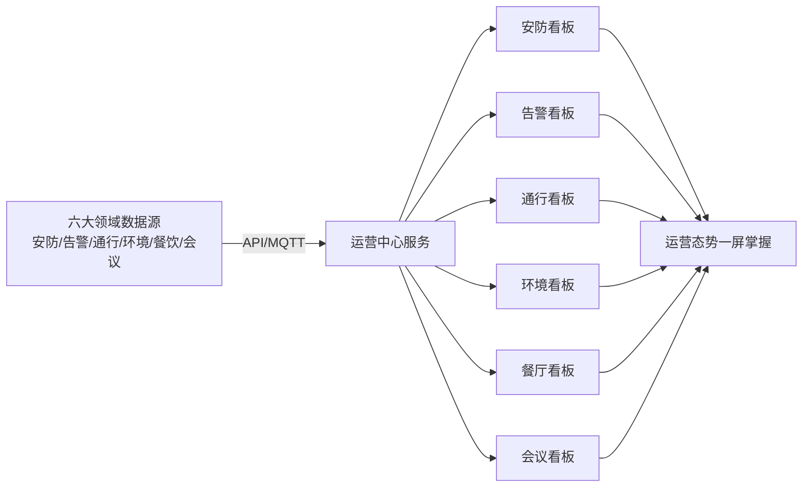

### 3.8.4 业务价值（精细化管理）

- **一屏统览**：六大领域 KPI 汇聚一屏，领导汇报/日常巡检不再切换多系统。
- **指标可量化**：响应率、使用率、占用率、舒适度等指标全部量化，运营绩效可考核。
- **决策数据化**：告警趋势、人员密度、车位占用、会议使用率分析，支撑空间与资源配置决策。

---

# 第四部分　运维类模块：面向工程运维的保障体系

> **模块来源**：BuildingOS 平台「设备」一级菜单（对应前端路由 `/devices`）。
> **价值主线**：运维类模块保障园区"设备稳、数据通、故障清"——以设备全生命周期台账与自动巡检替代人工，以告警与日志闭环保障故障快速定位，是精细化管理的"地基工程"。

## 4.1 网关管理

### 4.1.1 场景描述

边缘网关是园区设备的"翻译官与桥头堡"，向下对接异构协议（Modbus/BACnet/MQTT），向上与云端同步。网关稳定性直接决定园区数据完整性。

### 4.1.2 功能描述

| 功能项 | 说明 |
|--------|------|
| 网关状态监控 | 边缘网关在线/离线状态实时监控 |
| 网关管理 | 网关设备台账、连接参数配置 |
| 云边通道 | 边缘-云端通道建立与双向心跳检测 |

### 4.1.3 数据流图

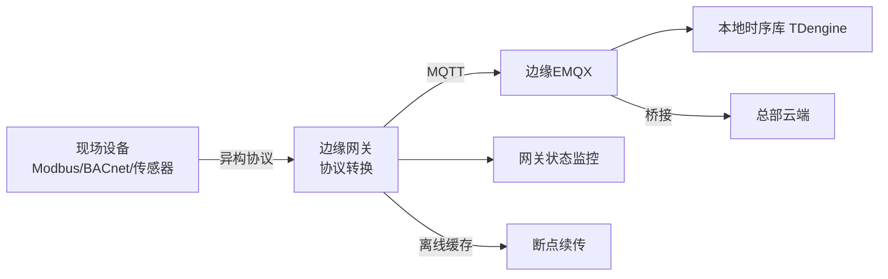

### 4.1.4 业务价值（精细化管理）

- **协议标准化**：异构协议统一转换为标准 MQTT，设备接入成本大幅下降。
- **断网自治**：边缘本地缓存 + 断点续传，网络抖动不丢数据。
- **运维可控**：网关状态可视、云边心跳监控，故障提前发现。

## 4.2 IP 摄像头与 IP 设备管理

### 4.2.1 场景描述

视频与 IP 设备是园区安防与可视化的重要资产。传统模式摄像头/设备台账分散、离线无人知。BuildingOS 实现摄像头与 IP 设备的**统一纳管与状态监控**。

### 4.2.2 功能描述

| 功能项 | 说明 |
|--------|------|
| IP 摄像头 | 摄像头台账、RTSP 拉流、在线状态监控、视频预览 |
| IP 设备 | IP 设备统一纳管、状态监控 |

### 4.2.3 数据流图

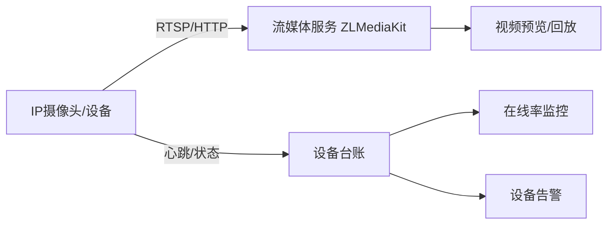

### 4.2.4 业务价值（精细化管理）

- **资产台账化**：摄像头与 IP 设备全量纳管，资产底数清晰。
- **离线可视化**：在线率实时监控，视频盲区第一时间发现。
- **流媒体统一**：RTSP 统一接入分发，多系统共用一路视频源。

## 4.3 物联网设备管理

### 4.3.1 场景描述

物联网设备（照明、空调、传感器等）是园区数据与控制的末端执行单元。BuildingOS 物联网设备管理实现设备的**统一接入、分类管理、状态监控**。

### 4.3.2 功能描述

| 功能项 | 说明 |
|--------|------|
| 设备分类 | 16 类物联网设备统一分类管理（照明/空调/传感器/平板/网关等） |
| 设备状态 | 在线/离线/故障状态实时监控 |
| 设备分组 | 按空间/类型分组，批量控制与查看 |
| 地图点位 | 设备在三维地图点位标注，空间定位 |

### 4.3.3 数据流图

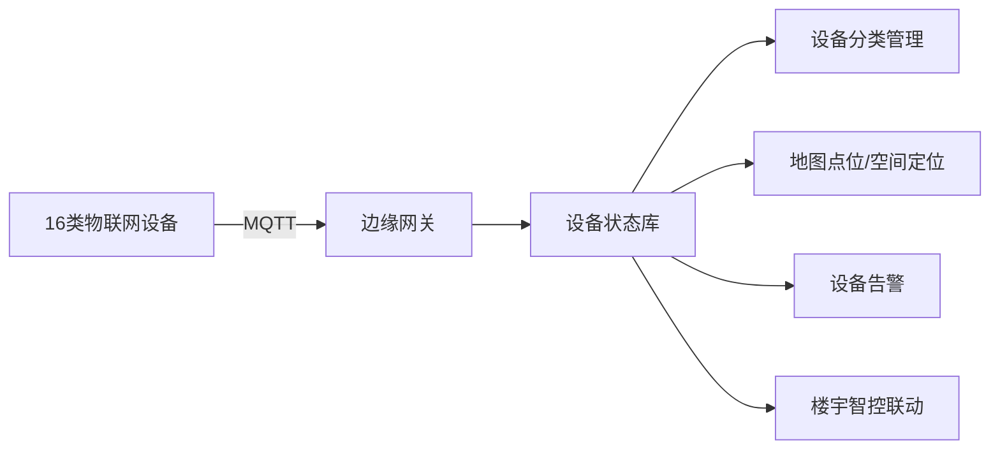

### 4.3.4 业务价值（精细化管理）

- **接入标准化**：EasyDevice 快速接入与模板化驱动，新设备接入"小时级"完成。
- **状态全透明**：全量设备在线率、故障状态实时可视，设备健康度量化评估。
- **空间可定位**：三维地图点位标注，故障设备"一图定位"。

## 4.4 巡检管理

### 4.4.1 场景描述

巡检是保障设备可靠性的核心手段。传统人工巡检靠纸笔记录、凭经验判断，漏检漏记难追溯。BuildingOS 巡检管理提供**会议/设备场景巡检 + 规则驱动自动巡检**，从"爬楼巡检"升级为"线上筛查 + 现场核实"。

### 4.4.2 功能描述

| 功能项 | 说明 |
|--------|------|
| 会议室巡检 | 以会议室为最小单元，综合评估设备在线、控制执行、传感器观测、预期状态、历史行为多维度 |
| 物联网设备巡检 | 设备在线状态 + 控制结果 + 传感器数据交叉验证 |
| 异常分级 | 简单故障自动修复/告警，复杂逻辑冲突标记"疑似误判"推荐现场复核 |

### 4.4.3 数据流图

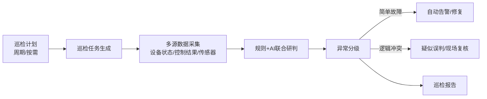

### 4.4.4 业务价值（精细化管理）

- **巡检数字化**：巡检结果自动留痕、自动报告，告别纸笔记录。
- **覆盖智能化**：以空间场景为诊断单元的多维交叉验证，发现"隐蔽性、组合性"故障。
- **人力节约**：大量现场验证转为线上筛查，运维"爬楼"频率大幅下降。

## 4.5 设备告警与日志

### 4.5.1 场景描述

设备告警与日志是故障发现与追溯的"双保险"。BuildingOS 实现设备告警的**自动触发、自动转单**与日志的**全量留存、快速检索**。

### 4.5.2 功能描述

| 功能项 | 说明 |
|--------|------|
| 设备告警 | 设备离线、参数越限自动告警，联动工单自动生成 |
| 设备日志 | 设备控制与状态日志全量留存 |
| API 日志 / 操作日志 | 系统级 API 日志与操作审计日志（管理后台设置菜单） |

### 4.5.3 数据流图

```mermaid
flowchart LR
    A[设备异常] --> B[告警引擎]
    B --> C[设备告警中心]
    C --> D[自动转工单]
    D --> E[工单闭环]
    F[设备控制/状态] --> G[日志存储]
    G --> H[日志检索/审计]
```

### 4.5.4 业务价值（精细化管理）

- **故障主动发现**：阈值告警自动触发，变"用户报障"为"系统发现"。
- **责任可审计**：操作日志/API 日志全量留痕，异常操作可追溯、可定责。
- **数据可分析**：告警频次与类型分析，定位高发故障设备与薄弱环节。

---

# 第五部分　价值总结：从技术集成到价值赋能

## 5.1 价值体系总览

BuildingOS 智慧园区解决方案，以 **BaaS 模式为底座**，以**场景、运营、运维三大类模块**为载体，为吉利集团多园区建设带来两大价值目标：

```mermaid
flowchart TB
    subgraph 底座[BaaS 模式底座]
        A[云-边-端架构] --> B[数据中台]
        A --> C[标准化模板]
        A --> D[多租户隔离]
    end
    subgraph 模块[三大类核心模块]
        E[场景类<br/>通行/访客/会议/工位/卫生间/停车/报修]
        F[运营类<br/>设备/能耗/告警/智控/场景/安防/发布/运营中心]
        G[运维类<br/>网关/摄像头/设备/巡检/告警/日志]
    end
    subgraph 价值[两大价值目标]
        H[精细化管理<br/>（重点：降本增效、数据驱动）]
        I[用户体验<br/>（次要点：便捷、舒适、高效）]
    end
    A --> E
    A --> F
    A --> G
    E --> H
    E --> I
    F --> H
    G --> H
```

## 5.2 精细化管理价值（重点）

| 管理领域 | 传统模式 | BuildingOS 模式 | 精细化价值 |
|---------|---------|----------------|-----------|
| 通行管理 | 人工逐点配权、离职回收滞后 | 角色批量授权、离职自动回收 | 权限零死角、考勤自动化、全程可审计 |
| 空间资源 | 会议室/工位靠协调、利用率不透明 | 三维地图 + 在线预订 + 超时抢占 | 使用率可量化，空置率显著下降 |
| 能源成本 | 人工抄表、按月汇总 | 分项实时采集 + 分时电价 + 双碳核算 | 成本归属到楼/层，浪费精准定位 |
| 告警处置 | 多平台分散、漏报难追 | 多源汇聚 + 分级升级 + 响应率考核 | 响应可考核、风暴被抑制、闭环可追溯 |
| 设备运维 | 人工巡检、纸笔记录 | 自动巡检 + 多维研判 + 工单闭环 | 人力大降、故障主动发现、责任可审计 |
| 集团管控 | 各园区各自为政 | 统一运营中心，多园区一屏对比 | 指标同口径，考核与决策数据化 |

## 5.3 用户体验价值（辅助）

在精细化管理之外，BuildingOS 同样带来可感知的用户体验提升：

- **通行无感化**：人脸/二维码/无感考勤，员工出入不掏卡、不排队。
- **空间可视化**：会议室/工位/卫生间状态实时可查，员工找位、订会、如厕不再"开盲盒"。
- **服务便捷化**：扫码报修、移动端审批、信息发布一屏直达，办事"最多跑一次"。
- **环境舒适化**：人感/环境联动，灯光空调随人而动，办公环境舒适且节能。

## 5.4 多园区复制的集团级价值

- **一次建设、多园区复用**：首栋楼宇沉淀标准化模板，后续园区直接复制，2 周即可完成部署交付（Smart 园区实证）。
- **云端统一、边缘自治**：集团级策略云端统一下发，各园区边缘自治运行，兼顾统一管控与本地可靠。
- **投资回报可期**：建设成本降 35%-45%、运维人力降 60%、能耗降 25%-40%，投资回报期缩短至 5-7 年。

> **结语**：智能化园区的价值不在于"装了多少设备、上了多少系统"，而在于**让每一度电、每一个工位、每一次通行、每一条告警都产生数据，让数据驱动运营决策**。BuildingOS 以 BaaS 模式为底座，以场景-运营-运维三大类模块为载体，帮助吉利集团实现从"建设智慧园区"到"运营智慧园区"的跨越，最终达成**精细化管理降本增效、优质体验聚人留商**的双重目标。

---
