# 操作说明（智能楼宇通行系统 Buildingos.ai.access）

## 目录
1 引言
1.1 编写目的
1.2 定义
2 系统概述
2.1 系统用途
2.2 软件功能概述
2.3 软件运行环境
3 系统操作使用
3.1 用户注册登录
3.2 功能模块操作说明

## 1 引言
### 1.1 编写目的
本操作说明书描述《智能楼宇通行系统 Buildingos.ai.access》的结构、功能与操作方法。

### 1.2 定义
- 系统、本系统：指《智能楼宇通行系统 Buildingos.ai.access》
- 用户：指可以使用本系统的人
- 权限：指分配给用户的功能与数据访问范围

## 2 系统概述
### 2.1 系统用途
面向人员门禁与通行权限管理，实现统一的认证、授权与通行控制。

### 2.2 软件功能概述
- 人员与访客通行权限管理
- 门禁设备联动与策略下发
- 通行日志与告警事件查询
- 黑白名单与临时授权

### 2.3 软件运行环境
- 硬件环境：门禁控制器、读卡器、闸机、摄像头等
- 软件环境：现代浏览器，服务端Linux/Windows均可

## 3 系统操作使用
### 3.1 用户注册登录
通过登录入口进入系统，展示角色与权限控制。
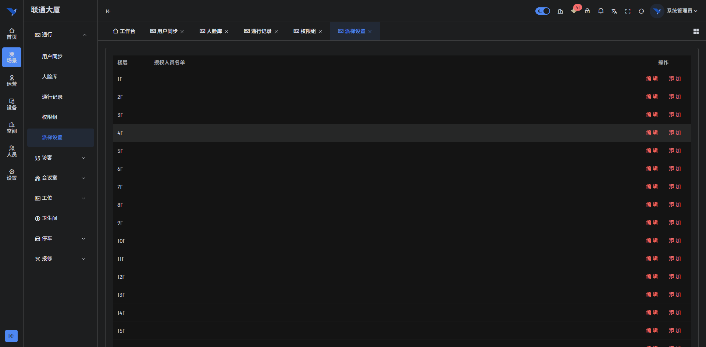
输入正确的账号后登录进入系统首页：
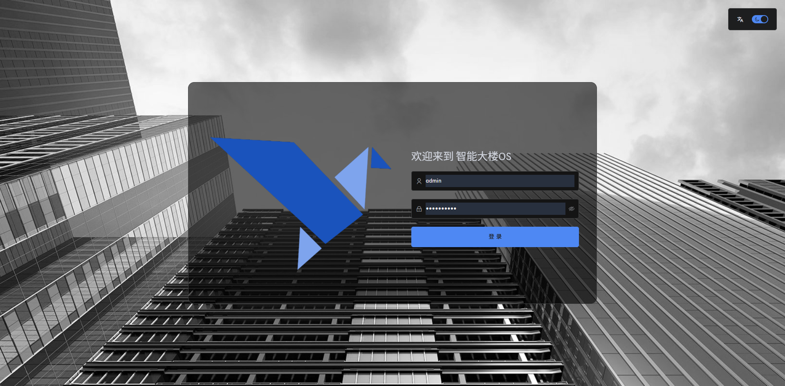
### 3.2 功能模块操作说明
- 人员管理：新增、导入、查询与权限绑定
进入人员管理模块，展示所有人员信息：

其中左边为组织树：
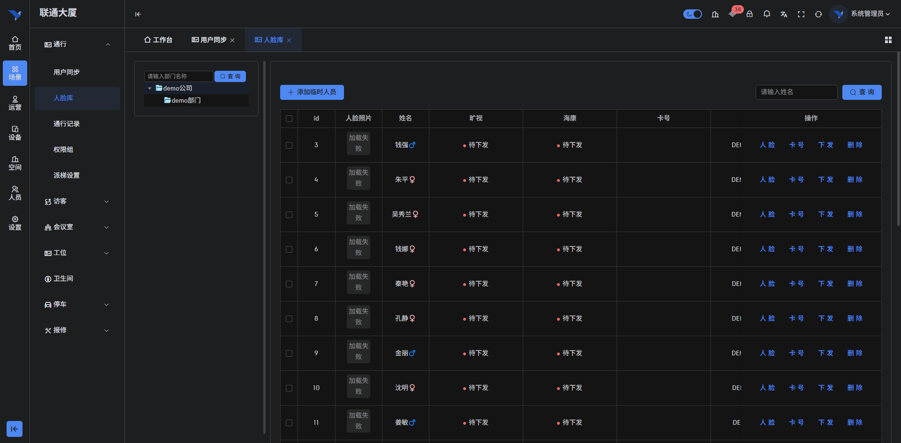
添加企业：
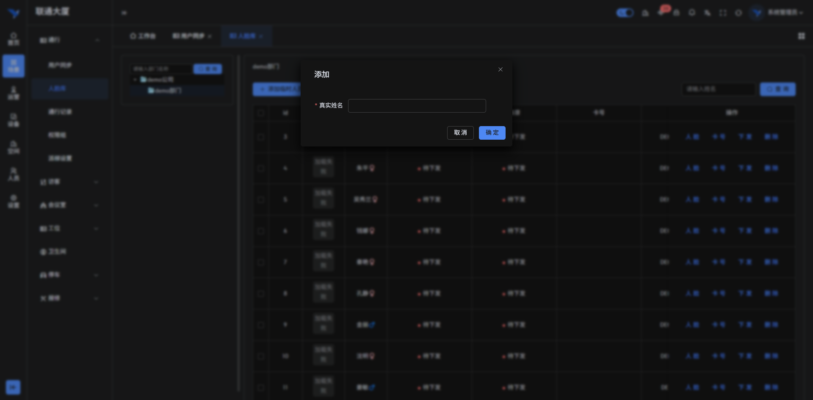
添加部门：
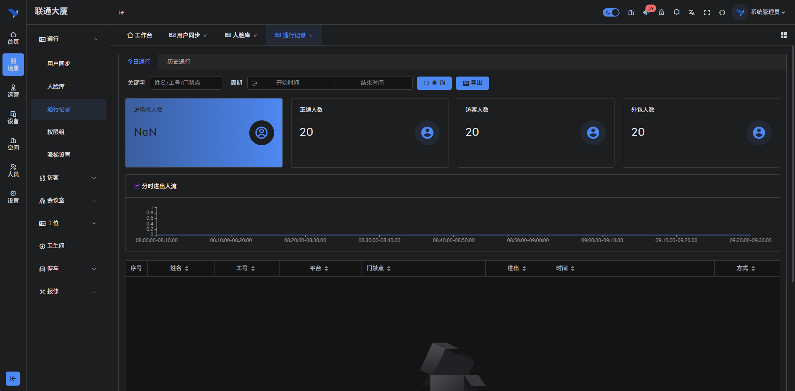
绑定用户，点击后将二维码发送给用户，用户自行扫描绑定：
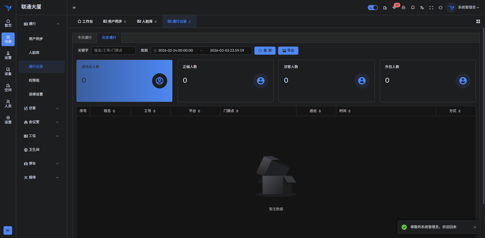
添加用户，需要在部门选择下进行：
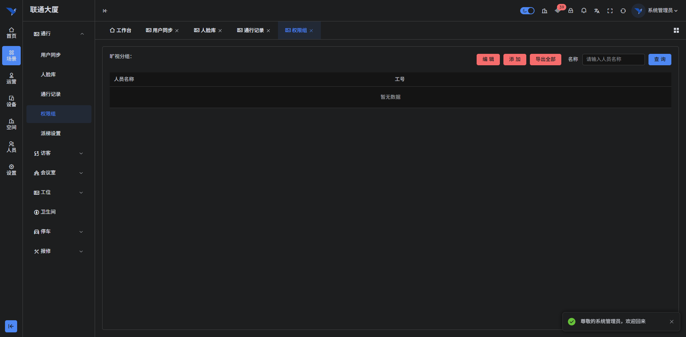
- 门禁管理：设备接入、状态查看
点击菜单运营->楼宇智控->门禁 将看到已经对接的门禁设备，和当前状态
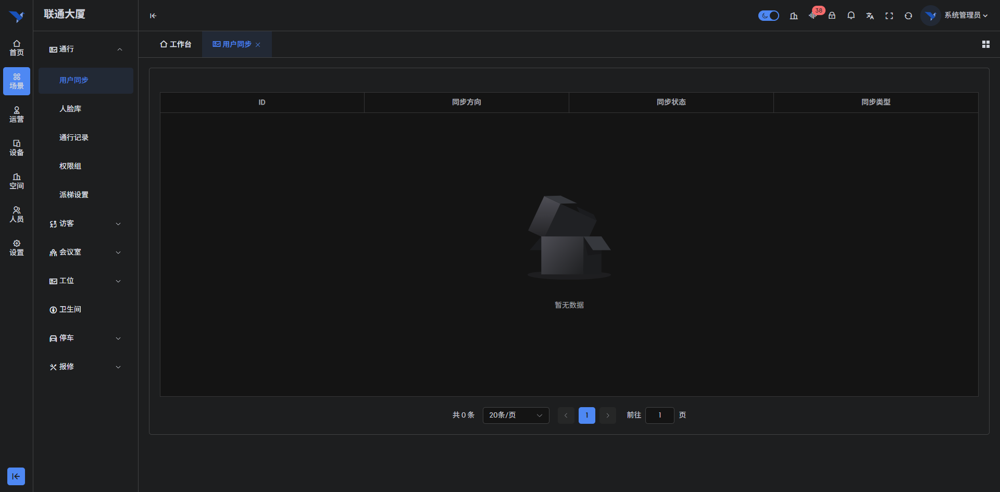
- 用户同步：从云端同步人员与设备数据，并同步到门禁系统
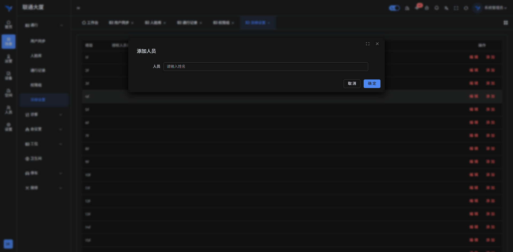
- 人脸库：新增、删除、查询人脸信息
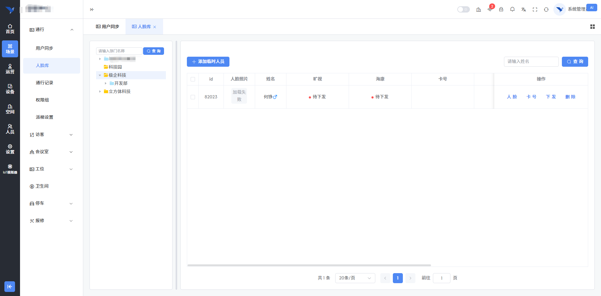
其中可以添加临时用户（用于安保，保洁等临时人员）：
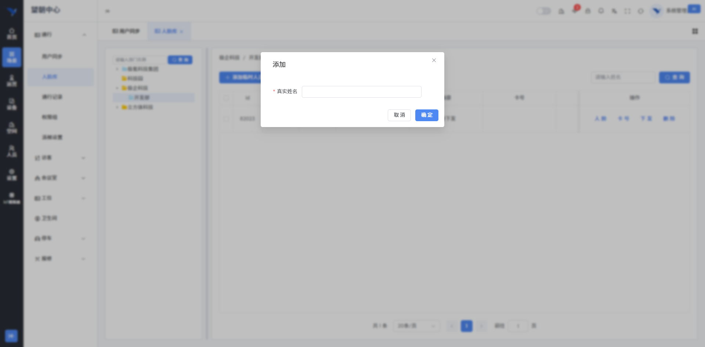
- 权限组：新增、删除、查询权限组信息
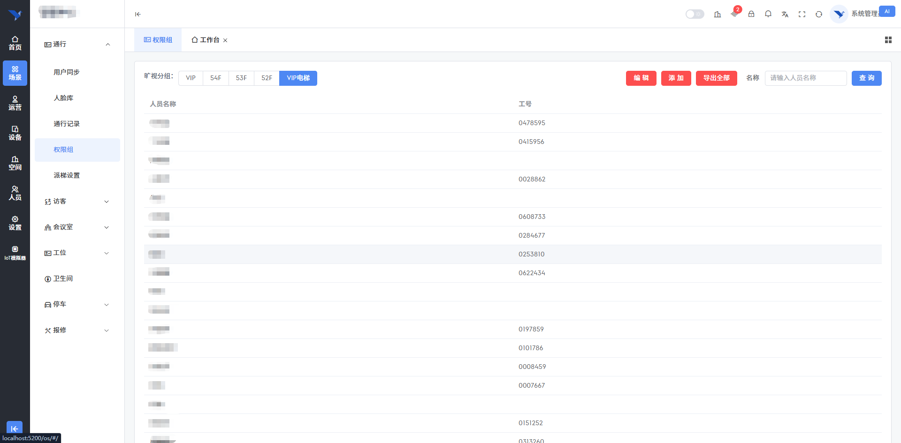
添加新的权限组：
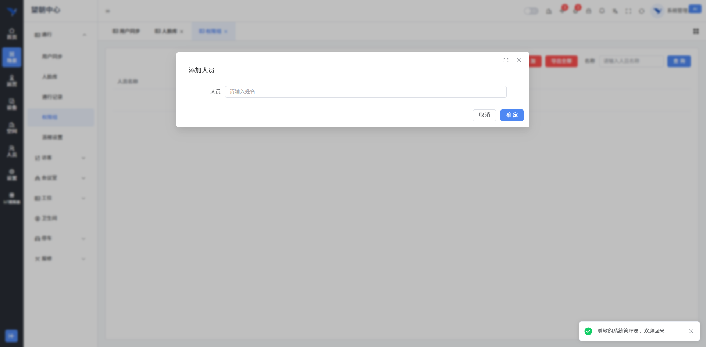
- 派梯设置：新增、删除、查询派梯信息
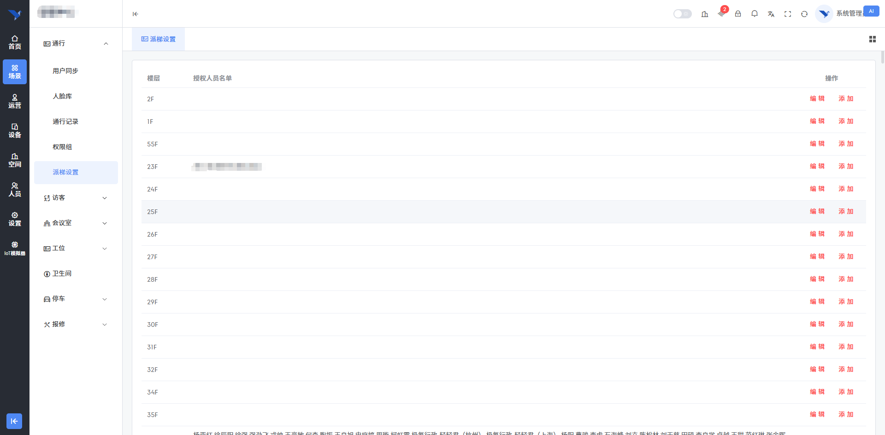
添加新的派梯设置：
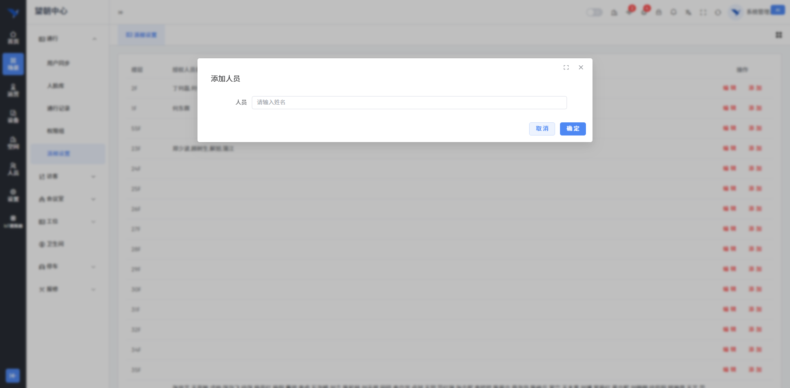
编辑派梯设置：

- 通行记录：按时间、人员、设备维度检索与导出
今日通行：
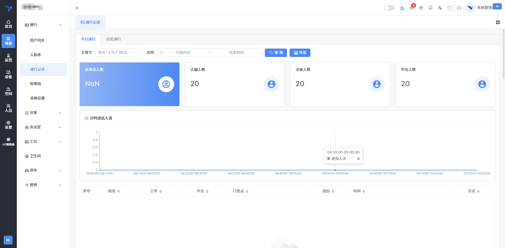
历史通行：
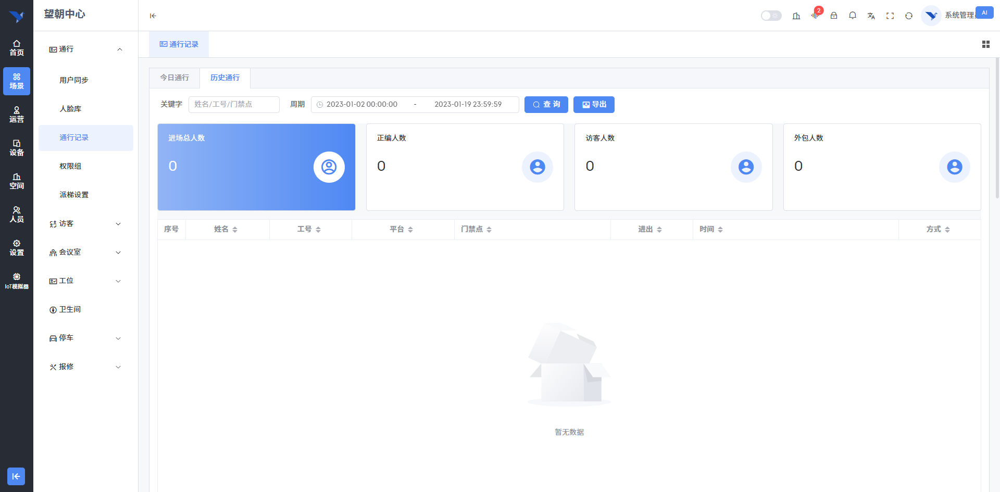
- 告警中心：异常通行与设备故障告警处理
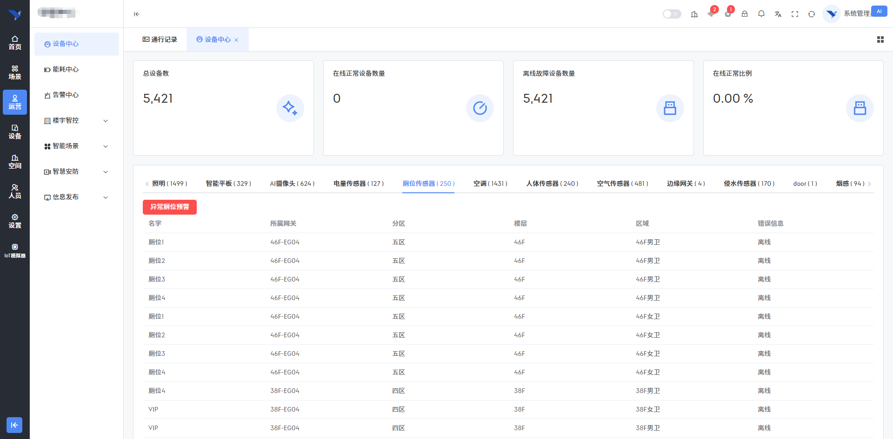
> 截图要求与页数限制同申报规范

