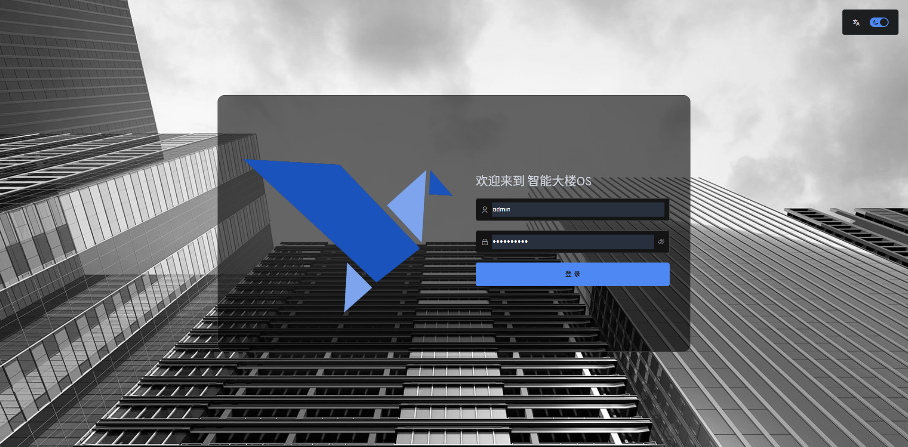
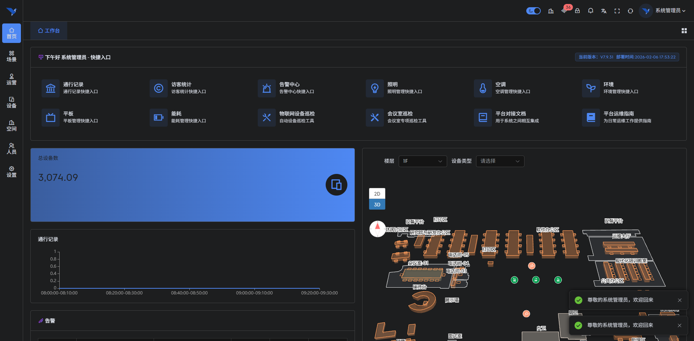
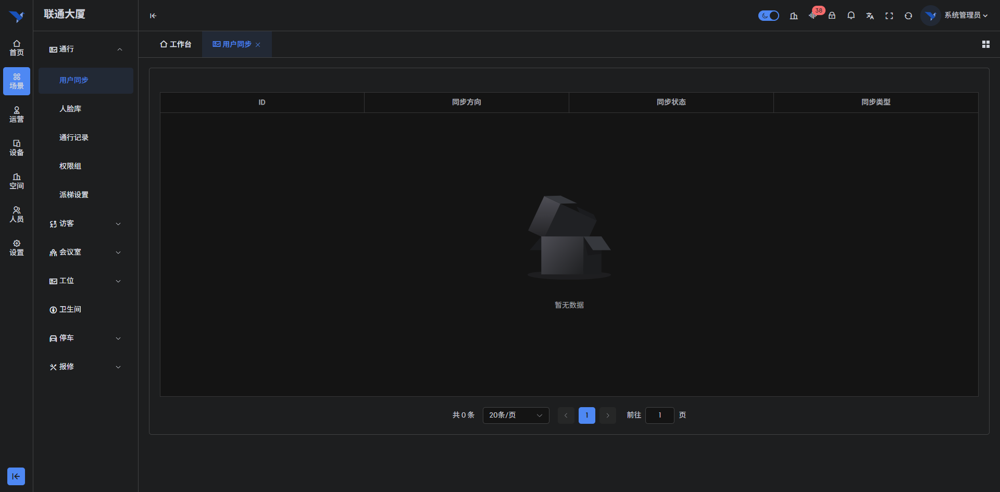
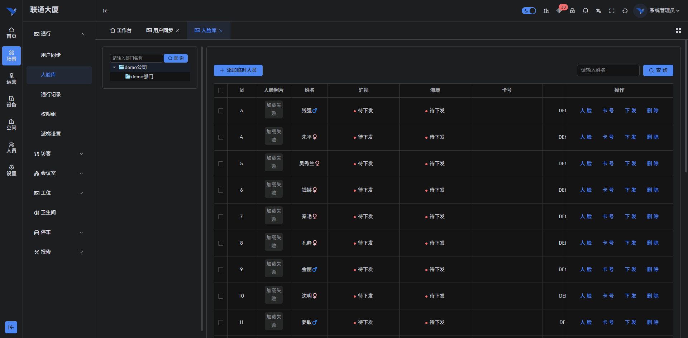
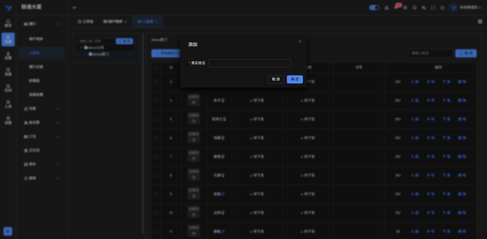
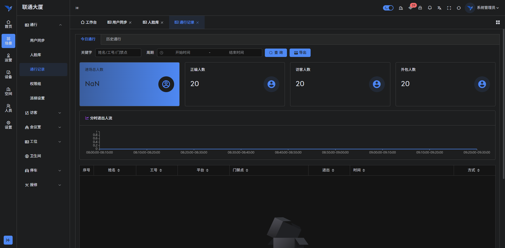
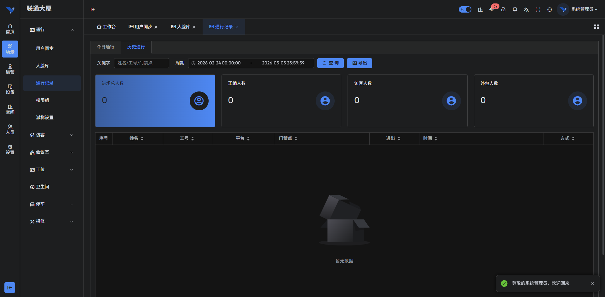
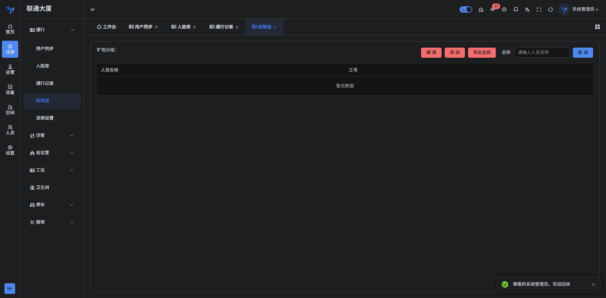
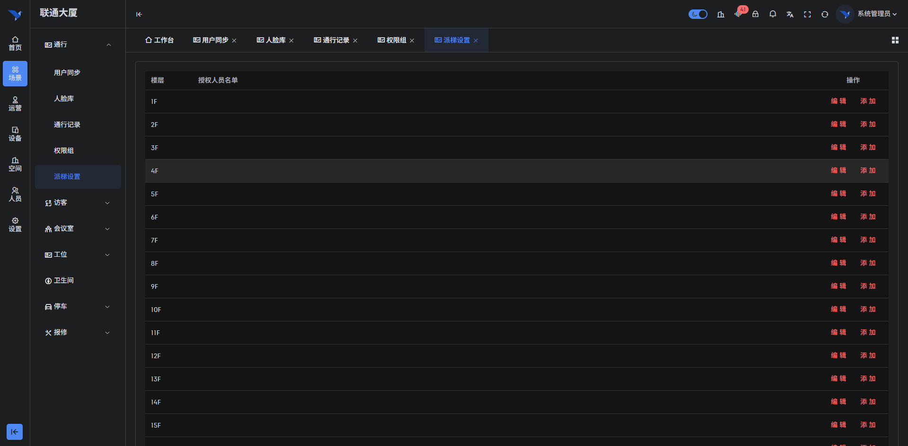
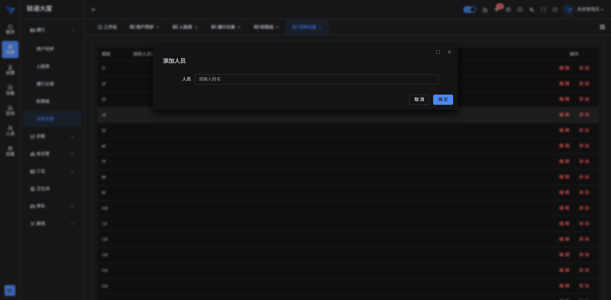

# 操作说明书（智能楼宇通行系统 Buildingos.access）

## 目录

1. **引言**
    1.1 编写目的
    1.2 定义
2. **系统概述**
    2.1 系统用途
    2.2 软件功能概述
    2.3 软件运行环境
3. **系统操作使用**
    3.1 登录与首页
        3.1.1 系统登录
        3.1.2 系统首页概览
    3.2 人员与组织管理
        3.2.1 用户同步管理
    3.3 生物识别库管理
        3.3.1 人脸库维护
        3.3.2 临时人员录入
    3.4 通行审计与监控
        3.4.1 实时通行监控（今日记录）
        3.4.2 历史记录查询与审计
    3.5 权限控制
        3.5.1 权限组配置
    3.6 梯控联动管理
        3.6.1 派梯策略管理
        3.6.2 人员楼层授权

---

## 1. 引言

### 1.1 编写目的
本操作说明书旨在详细描述《智能楼宇通行系统 Buildingos.access》的总体架构、系统功能以及各核心功能模块的具体操作方法。文档面向系统的最终用户、系统管理员以及运维人员，提供标准化的操作指南，帮助用户快速上手并高效管理楼宇通行权限、设备联动及安全审计工作，确保楼宇安防体系的稳定运行。

### 1.2 定义
*   **系统/本系统**：指《智能楼宇通行系统 Buildingos.access》。
*   **用户**：指被授权使用本系统进行管理操作的人员，包括超级管理员、安保人员、前台接待等。
*   **通行人员**：指需要进出楼宇的内部员工、访客、外包人员等。
*   **权限组**：指将特定的门禁设备、通行时间段和人员集合进行绑定的逻辑策略单元。
*   **派梯**：指通过门禁识别联动电梯控制系统，自动登记并点亮目标楼层的过程。

---

## 2. 系统概述

### 2.1 系统用途
《智能楼宇通行系统 Buildingos.access》是专为现代化智慧楼宇和园区设计的综合性通行管理平台。系统集成了人员信息管理、生物特征识别（人脸/指纹）、二维码/IC卡验证、门禁设备控制、访客预约审批以及梯控联动等功能。其核心用途在于建立统一的人员身份认证体系，实现“授权-通行-审计”的全流程数字化管理，提升楼宇的安全防范等级与通行效率。

### 2.2 软件功能概述
本系统主要包含以下核心功能模块：
1.  **多模态通行认证**：支持人脸识别、二维码、IC/NFC卡、蓝牙等多种认证方式，适应不同场景需求。
2.  **全生命周期人员管理**：覆盖员工入职、调岗、离职以及访客预约、到访、离开的全流程状态管理。
3.  **精细化权限控制**：基于RBAC模型，支持按部门、按角色、按时间段灵活配置通行权限。
4.  **实时监控与告警**：提供通行事件的实时大屏展示，对非法闯入、黑名单人员、设备离线等异常情况实时告警。
5.  **智能梯控联动**：实现门禁与电梯系统的深度融合，支持目的选层（DCS）和权限开放。
6.  **数据报表与审计**：提供多维度的通行数据统计分析，支持考勤辅助与安全审计日志导出。

### 2.3 软件运行环境
*   **硬件环境**：
    *   **服务端**：推荐 Intel Xeon 8核以上处理器，16GB内存，512GB SSD存储。
    *   **客户端**：普通办公PC（i5/8GB/256GB），支持Chrome/Edge等主流浏览器。
    *   **外设**：兼容主流品牌的门禁控制器、人脸识别终端、读卡器及边缘网关。
*   **软件环境**：
    *   **服务端操作系统**：Linux (Ubuntu/CentOS) 或 Windows Server 2019及以上。
    *   **数据库**：PostgreSQL 15 / Redis 7。
    *   **运行依赖**：Docker, Nginx, Node.js环境。

---

## 3. 系统操作使用

### 3.1 登录与首页

#### 3.1.1 系统登录
系统采用B/S架构，用户通过浏览器访问指定URL即可进入登录页面。登录界面采用极简设计，保障账号安全。
*   **操作步骤**：
    1.  在浏览器地址栏输入系统访问地址。
    2.  进入登录页后，选择相应的登录角色（如管理员）。
    3.  输入分配的账号和密码。
    4.  （可选）若系统开启了双因素认证，需输入手机验证码或动态令牌。
    5.  点击“登录”按钮进入系统。
*   **界面展示**：
    
    *图 3-1 系统登录界面*

#### 3.1.2 系统首页概览
登录成功后，系统自动跳转至首页（Dashboard）。首页作为系统的数字驾驶舱，集中展示了楼宇通行的核心指标和实时状态。
*   **功能说明**：
    *   **数据概览卡片**：顶部显示当前系统的总人数、今日访客预约数、今日通行人次、在线设备数等关键指标。
    *   **快捷入口**：提供“人员管理”、“访客审核”、“设备监控”等常用功能的快速跳转按钮。
    *   **实时动态**：滚动显示最新的通行记录和告警信息。
    *   **趋势图表**：展示近7天的通行流量趋势图，帮助管理员直观掌握楼宇活跃度。
*   **界面展示**：
    
    *图 3-2 系统首页概览*

### 3.2 人员与组织管理

#### 3.2.1 用户同步管理
本模块用于维护楼宇内部人员的基础数据。支持从第三方系统（如HR系统、AD域、钉钉/企业微信）同步人员架构，也支持手动批量导入。
*   **功能特点**：
    *   **组织架构树**：左侧展示公司的部门层级结构，支持展开/折叠，点击部门可筛选对应人员。
    *   **人员列表**：右侧显示人员详细信息，包括姓名、工号、部门、手机号、状态（在职/离职）等。
    *   **同步配置**：管理员可配置同步源和同步策略（自动/手动），确保门禁系统人员数据与企业源数据一致。
    *   **操作栏**：提供“新增”、“导入”、“导出”、“同步”、“删除”等操作按钮。
*   **操作步骤**：
    1.  点击导航栏“人员管理”下的“用户同步”菜单。
    2.  点击“立即同步”按钮，系统将拉取最新人员数据。
    3.  同步完成后，列表自动刷新，管理员可对异常数据进行修正。
*   **界面展示**：
    
    *图 3-3 用户同步管理界面*

### 3.3 生物识别库管理

#### 3.3.1 人脸库维护
人脸库是实现刷脸通行的基础数据资产。本模块对所有已注册的人脸底库进行集中管理，支持照片质量检测和特征值提取状态监控。管理员可在此页面对人员的生物特征凭证（人脸）和物理凭证（卡号）进行统一维护。

*   **功能说明**：
    *   **检索查询**：支持按姓名、工号或部门快速查找特定人员的人脸数据。
    *   **人脸录入**：点击列表中的“人脸”按钮，系统将弹出照片上传窗口。管理员可选择本地照片上传或使用摄像头抓拍。系统会自动检测上传照片的人脸角度、光照、遮挡情况，确保符合识别算法要求。
    *   **卡号绑定**：点击“卡号”按钮，在弹出的输入框中录入用户的IC卡/NFC卡物理卡号（支持16进制或10进制格式）。绑定后，用户即可使用实体卡片刷卡通行。
    *   **权限下发**：点击“下发”按钮，系统会将该用户的人脸特征值和卡号数据实时推送到其权限组关联的所有门禁控制器和人脸终端设备上，确保通行权限即时生效。
    *   **删除人员**：点击“删除”按钮，系统将执行逻辑删除操作，同时向所有关联设备发送指令，清除该用户在设备端的人脸底库和卡号权限，立即终止其通行资格。
*   **界面展示**：
    
    *图 3-4 人脸库维护界面*

#### 3.3.2 临时人员录入
针对外包人员、实习生或临时访客，系统提供快捷的临时人员录入通道，支持设置有效期限。
*   **功能说明**：
    *   **基本信息录入**：填写姓名、手机号（必填，用于接收通知短信）、身份证号（选填）。
    *   **人脸采集**：支持本地上传照片或通过USB摄像头现场抓拍。
    *   **有效期设置**：精确到分钟的有效期设置。过期后，系统自动冻结其通行权限，无需人工删除。
    *   **权限分配**：直接在录入时选择该临时人员可通行的门禁组（如“公共区域”、“临时办公区”）。
*   **操作步骤**：
    1.  在人脸库页面点击“添加临时人员”。
    2.  在弹窗中完善人员信息并上传合规照片。
    3.  设定开始时间和结束时间。
    4.  点击“保存”，系统即刻下发权限至设备。
*   **界面展示**：
    
    *图 3-5 临时人员添加窗口*

### 3.4 通行审计与监控

#### 3.4.1 实时通行监控（今日记录）
此页面通常投放在监控中心大屏或保安岗亭电脑上，用于实时监视楼宇各出入口的通行情况。
*   **功能说明**：
    *   **实时流展示**：每当有人刷卡或刷脸通行，列表顶部会自动推送最新记录。
    *   **抓拍对比**：显示“注册底图”与“现场抓拍图”的对比，方便安保人员人工复核。
    *   **详细字段**：包含通行时间、地点（具体门禁点位）、人员姓名、人员类型（员工/访客）、通行方式（人脸/二维码）、体温（如有测温设备）等。
    *   **异常高亮**：对于“非法闯入”、“黑名单”、“体温异常”等记录，系统使用红色高亮显示。
*   **界面展示**：
    
    *图 3-6 实时通行记录监控*

#### 3.4.2 历史记录查询与审计
提供海量历史通行数据的查询与追溯功能，支持按月度、季度进行数据归档和报表导出。
*   **功能说明**：
    *   **多维搜索**：支持组合查询条件，如 时间范围 + 部门 + 门禁点位 + 通行结果（成功/失败）。
    *   **数据导出**：支持将查询结果导出为Excel或CSV格式，用于考勤核对或事件调查。
    *   **详情查看**：点击单条记录，可查看详细的设备响应报文和抓拍大图。
    *   **统计分析**：底部提供简易的分页统计，显示查询时间段内的总通行次数。
*   **界面展示**：
    
    *图 3-7 历史通行记录查询*

### 3.5 权限控制

#### 3.5.1 权限组配置
权限组是系统权限管理的核心逻辑，通过将“人”、“门”、“时间”三要素解耦配置，实现灵活的授权管理。
*   **功能说明**：
    *   **权限组列表**：展示所有已创建的权限策略，如“全员通用权限”、“研发中心权限”、“夜间巡逻权限”。
    *   **人员绑定**：查看并管理该权限组下包含的人员或部门。
    *   **设备绑定**：勾选该权限组允许通行的门禁控制器或具体门点。
    *   **时间表控制**：设置允许通行的时间段（如工作日 08:00-20:00），支持节假日例外设置。
*   **操作步骤**：
    1.  进入“权限组”菜单，点击“新建权限组”。
    2.  输入组名称和描述。
    3.  在“关联设备”标签页勾选需要开放的门禁点。
    4.  在“关联人员”标签页添加需要授权的员工或部门。
    5.  保存后，系统自动计算增量数据并下发至设备。
*   **界面展示**：
    
    *图 3-8 权限组配置界面*

### 3.6 梯控联动管理

#### 3.6.1 派梯策略管理
本模块用于管理与电梯控制系统的对接策略，支持传统梯控（刷卡点亮按钮）和目的选层（DCS）模式。
*   **功能说明**：
    *   **梯控设备管理**：配置电梯控制器的IP地址、端口及协议类型。
    *   **楼层映射**：建立物理楼层与电梯系统逻辑楼层的映射关系。
    *   **默认策略**：设置不同人员类型的默认乘梯权限（如访客仅能到达被访楼层，员工可到达所在办公楼层及公共层）。
    *   **状态监控**：查看电梯控制器的在线状态及运行日志。
*   **界面展示**：
    
    *图 3-9 派梯策略管理界面*

#### 3.6.2 人员楼层授权
针对特定人员（如高管、运维人员）进行个性化的楼层权限配置，使其能够到达默认权限之外的楼层。
*   **功能说明**：
    *   **精准授权**：选择特定人员，勾选其允许到达的楼层集合。
    *   **VIP功能**：可设置VIP标志，联动电梯系统实现“VIP专梯”或“优先派梯”功能。
    *   **自动派梯**：配置人员通过闸机时是否自动触发呼梯指令（即“无感通行”）。
*   **操作步骤**：
    1.  在派梯管理页面点击“增加人员”。
    2.  在人员选择器中查找并选中目标人员。
    3.  在楼层列表中勾选授权楼层（支持多选）。
    4.  确认保存，权限即时生效。
*   **界面展示**：
    
    *图 3-10 人员楼层授权窗口*
