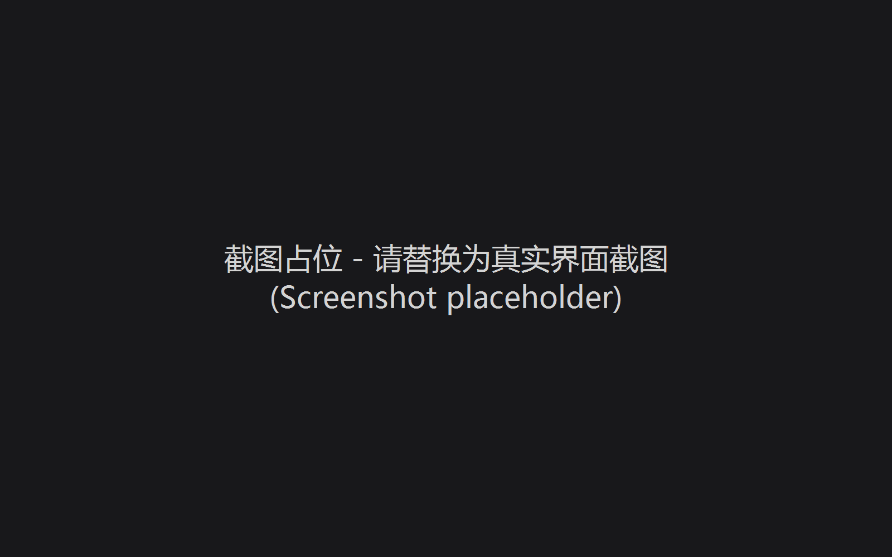
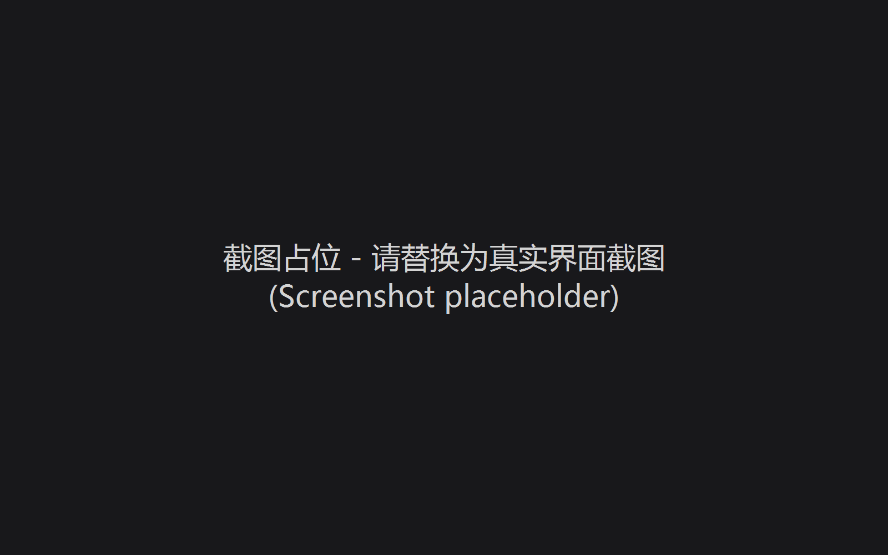
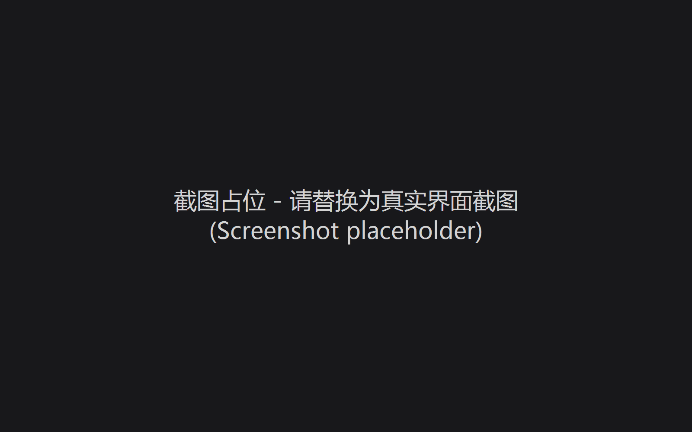
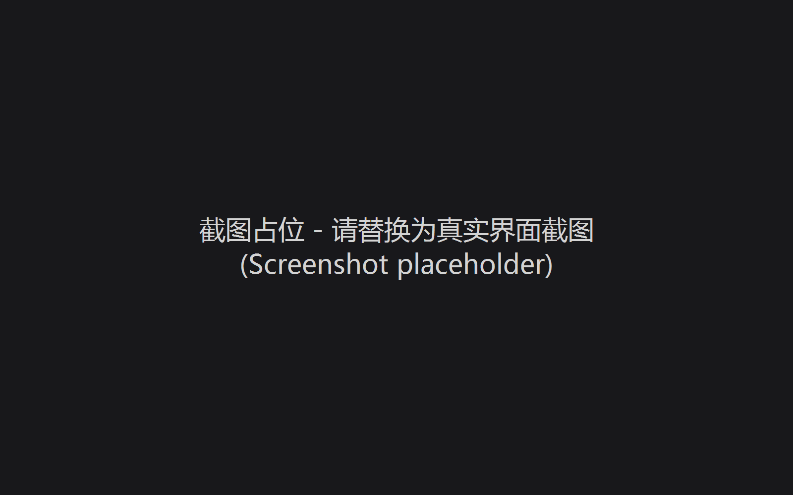
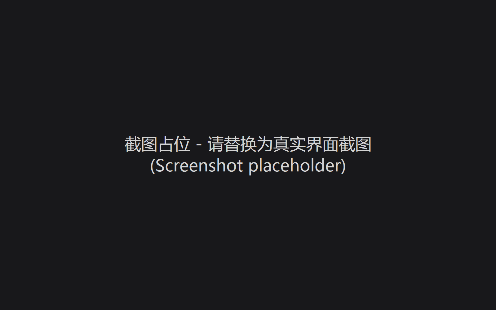
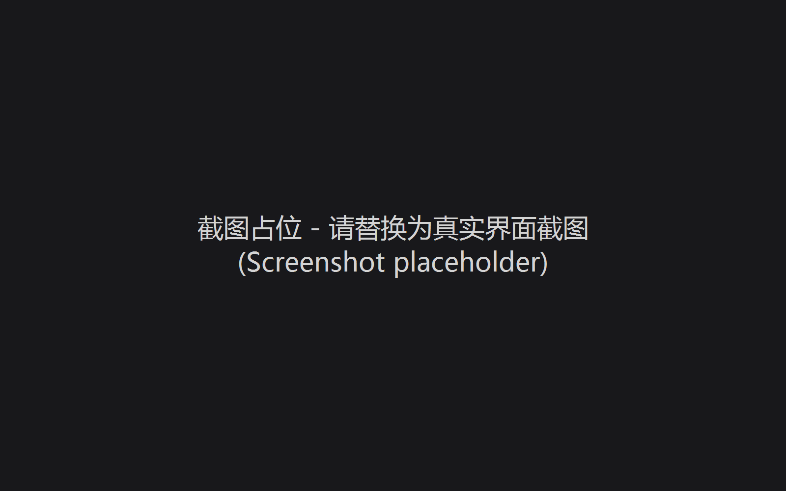
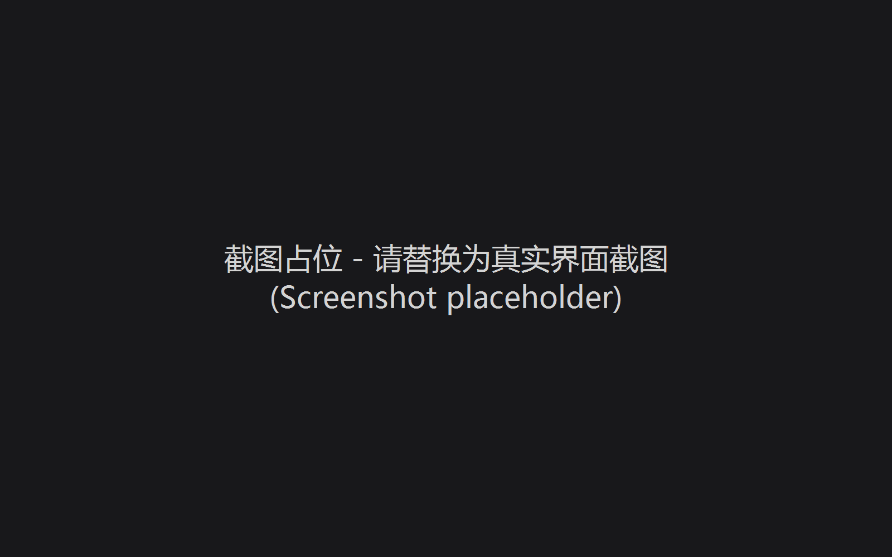

# 操作说明书（智能楼宇IOC运营系统 buildingos.ioc）

## 目录

1. **引言**
    *   1.1 编写目的
    *   1.2 定义
2. **系统概述**
    *   2.1 系统用途
    *   2.2 软件功能概述
    *   2.3 软件运行环境
3. **系统操作使用**
    *   3.1 登录与首页
        *   3.1.1 系统登录
        *   3.1.2 系统首页与看板导航
    *   3.2 安防看板
        *   3.2.1 安防摘要统计卡片
        *   3.2.2 摄像头状态列表
        *   3.2.3 24小时告警趋势
        *   3.2.4 告警类型分布
        *   3.2.5 近期安防事件
    *   3.3 告警看板
        *   3.3.1 多维筛选条件
        *   3.3.2 告警统计概览
        *   3.3.3 7天告警趋势
        *   3.3.4 告警来源分析
        *   3.3.5 区域分布
        *   3.3.6 告警事件列表
    *   3.4 通行看板
        *   3.4.1 通行摘要统计
        *   3.4.2 车流进出趋势
        *   3.4.3 区域人员密度
        *   3.4.4 车位使用详情
        *   3.4.5 车辆通行记录
    *   3.5 环境看板
        *   3.5.1 环境指标仪表卡片
        *   3.5.2 各区域温度趋势
        *   3.5.3 环境传感器详情
    *   3.6 餐厅看板
        *   3.6.1 餐厅运营摘要
        *   3.6.2 就餐趋势与分区分布
        *   3.6.3 今日菜单
        *   3.6.4 周度用餐统计
    *   3.7 会议看板
        *   3.7.1 会议摘要统计
        *   3.7.2 会议室实时状态
        *   3.7.3 部门会议统计
        *   3.7.4 当前进行中会议
        *   3.7.5 周度会议趋势

---

## 1. 引言

### 1.1 编写目的
本操作说明书旨在详细阐述《智能楼宇IOC运营系统 buildingos.ioc》的功能架构、操作流程及维护方法。文档面向园区运营管理人员、物业管理人员及系统管理员，提供标准化的操作指引，帮助用户快速掌握六大专题看板（安防、告警、通行、环境、餐厅、会议）的使用方法，实现园区综合运营态势的一屏掌握与数据下钻分析。

### 1.2 定义
*   **系统/本系统**：指《智能楼宇IOC运营系统 buildingos.ioc》。
*   **IOC**：即智能运营中心（Intelligent Operations Center），指面向园区综合运营的态势监测分析平台。
*   **专题看板**：指针对特定管理领域（安防、告警、通行、环境、餐厅、会议）的可视化分析页面。
*   **摘要卡片**：指看板顶部的彩色统计卡片，用于展示该领域核心KPI数值。
*   **响应率**：指已响应告警数占总告警数的百分比，反映告警处置的及时性。

---

## 2. 系统概述

### 2.1 系统用途
《智能楼宇IOC运营系统 buildingos.ioc》是专为现代化智慧楼宇和园区设计的综合运营态势监测分析平台。系统以六个专题看板（安防看板、告警看板、通行看板、环境看板、餐厅看板、会议看板）为载体，覆盖园区空间、安防、资产、基础设施、能效、通行、智慧空间等八大管理领域，通过ECharts图表、统计卡片、数据表格和实时状态标识的组合呈现方式，将园区人、事、物的运行状态汇聚于统一界面，实现园区综合运营态势一屏掌握，为园区管理者提供从宏观指标到微观明细的完整运营视图。

### 2.2 软件功能概述
本系统主要包含以下核心功能模块：
1.  **安防看板**：以摘要卡片、摄像头状态列表、24小时告警趋势图、告警类型分布环形图和近期安防事件表，呈现园区安全管理全貌。
2.  **告警看板**：以摘要卡片、7天告警趋势图、告警来源分析、区域分布环形图和分页告警事件表，提供告警全生命周期管理视图。
3.  **通行看板**：以摘要卡片、车流进出趋势图、区域人员密度图、车位使用环形图和车辆通行记录表，展示园区人流和车流态势。
4.  **环境看板**：以仪表卡片、温度趋势多线图和环境传感器明细表，综合展示园区空间环境质量。
5.  **餐厅看板**：以摘要卡片、就餐趋势图、分区就餐分布图、今日菜单表和周度用餐统计图，呈现园区餐饮运营态势。
6.  **会议看板**：以摘要卡片、会议室实时状态网格、部门会议统计图、当前进行中会议列表和周度会议趋势图，展示会议室资源使用全貌。

### 2.3 软件运行环境
*   **硬件环境**：
    *   **服务端**：推荐配置 8核 CPU，16GB 内存，512GB SSD 存储。
    *   **客户端**：支持Windows/macOS操作系统的PC机，建议屏幕分辨率1920×1080以上。
    *   **大屏展示**：支持LED拼接屏/液晶拼接墙投放（可选）。
*   **软件环境**：
    *   **浏览器**：建议使用Google Chrome 80+、Microsoft Edge或Firefox等现代浏览器。
    *   **服务端系统**：Linux (Ubuntu 22.04)。
    *   **运行依赖**：Nginx、Docker、Node.js 环境，后端微服务端口3038。

---

## 3. 系统操作使用

### 3.1 登录与首页

#### 3.1.1 系统登录
系统采用B/S架构，用户通过浏览器访问指定网址即可进入登录界面。
*   **操作步骤**：
    1.  输入系统URL地址，回车加载登录页。
    2.  在登录框中输入分配的用户名（Username）和密码（Password）。
    3.  点击"登录"按钮，系统进行身份验证，验证通过后跳转至首页。
*   **界面展示**：
    
    *图 3-1 系统登录界面*

#### 3.1.2 系统首页与看板导航
登录成功后进入系统首页，通过顶部标签页或左侧菜单切换六大专题看板。
*   **功能说明**：
    *   **看板导航**：顶部标签页提供"安防看板""告警看板""通行看板""环境看板""餐厅看板""会议看板"切换入口。
    *   **统一视觉风格**：每个看板页面顶部排列彩色摘要统计卡片，中部以ECharts图表组合呈现趋势与分布，底部以数据表格展示明细记录。
*   **界面展示**：
    
    *图 3-2 系统首页与看板导航*

### 3.2 安防看板

#### 3.2.1 安防摘要统计卡片
安防看板顶部全宽排列六个摘要统计卡片，呈现园区安全管理核心KPI。
*   **功能说明**：
    *   **今日告警**（红色卡片）：当日系统产生的告警总数。
    *   **待处理**（橙色卡片）：当前尚未闭环的告警数量。
    *   **在线摄像头**（绿色卡片）：当前在线运行的摄像头数量。
    *   **离线摄像头**（灰色卡片）：当前离线的摄像头数量。
    *   **安保人员**（蓝色卡片）：当前在岗的安保人员总数。
    *   **巡逻路线**（紫色卡片）：当日已规划的巡逻路线数量。
*   **操作步骤**：
    1.  进入安防看板。
    2.  查看顶部六个摘要卡片获取园区安全核心指标。
*   **界面展示**：
    
    *图 3-3 安防看板摘要统计卡片*

#### 3.2.2 摄像头状态列表
左侧区域以卡片包裹数据表格，展示园区各摄像头的实时状态。
*   **功能说明**：
    *   **状态列**：绿色/灰色标签区分在线/离线状态。
    *   **信息列**：摄像头名称、所属区域、最后检测时间。
*   **操作步骤**：
    1.  在安防看板左侧查看摄像头状态列表。
    2.  通过状态标签快速识别离线摄像头。
*   **界面展示**：
    
    *图 3-4 摄像头状态列表*

#### 3.2.3 24小时告警趋势
右侧区域以双轴组合图表展示24小时告警趋势。
*   **功能说明**：
    *   **柱状图**：蓝色柱状图展示每小时告警数量。
    *   **折线图**：绿色平滑折线叠加展示每小时已处理数量。
*   **操作步骤**：
    1.  查看24小时告警趋势图。
    2.  通过图表识别告警时段分布与处理效率。
*   **界面展示**：
    
    *图 3-5 24小时告警趋势图*

#### 3.2.4 告警类型分布
环形图展示六种告警类型的占比。
*   **功能说明**：
    *   **类型分布**：入侵检测、火灾预警、门禁异常、视频离线、周界报警、设备故障六种类型的占比。
    *   **扇区标签**：显示类型名称和百分比数值。
*   **界面展示**：
    
    *图 3-6 告警类型分布环形图*

#### 3.2.5 近期安防事件
右侧底部表格展示近期安防事件明细。
*   **功能说明**：
    *   **信息列**：时间、类型（彩色标签）、区域、级别（高/中/低）、描述、处理状态。
*   **操作步骤**：
    1.  查看近期安防事件表格。
    2.  通过级别标签快速识别高风险事件。
*   **界面展示**：
    
    *图 3-7 近期安防事件列表*

### 3.3 告警看板

#### 3.3.1 多维筛选条件
告警看板顶部查询栏提供五维筛选条件，支持组合过滤。
*   **功能说明**：
    *   **日期范围**：日期范围选择器（YYYY-MM-DD格式）。
    *   **告警级别**：全部/高/中/低。
    *   **处理状态**：全部/已处理/处理中/未处理。
    *   **所属区域**：全部/A栋/B栋/C栋/园区户外/地下车库。
    *   **告警类型**：全部/入侵检测/火灾预警/门禁异常/设备故障/周界报警。
*   **操作步骤**：
    1.  进入告警看板。
    2.  设置需要的筛选条件。
    3.  点击"查询"按钮，筛选参数即时生效；点击"重置"恢复默认。
*   **界面展示**：
    
    *图 3-8 告警看板多维筛选条件*

#### 3.3.2 告警统计概览
六个摘要卡片随筛选条件动态重新计算。
*   **功能说明**：
    *   **总告警**（蓝色）：筛选范围内告警总数。
    *   **已处理**（绿色）：已完成闭环的告警数量。
    *   **处理中**（橙色）：正在处理中的告警数量。
    *   **未处理**（红色）：尚未开始处理的告警数量。
    *   **响应率**（紫色）：已响应告警占总告警的百分比。
    *   **平均响应**（青色）：从告警触发到开始处理的平均耗时。
*   **界面展示**：
    
    *图 3-9 告警统计概览卡片*

#### 3.3.3 7天告警趋势
柱状图+折线图组合展示最近7天每日告警数量与已处理数量。
*   **功能说明**：
    *   **柱状图**：蓝色圆角柱状图展示每日告警总数。
    *   **折线图**：绿色折线展示每日已处理数量。
*   **界面展示**：
    
    *图 3-10 7天告警趋势图*

#### 3.3.4 告警来源分析
横向柱状图按来源系统展示告警数量排名。
*   **功能说明**：
    *   **来源排名**：视频分析、传感器、门禁系统、手动上报、巡检发现、系统自检。
*   **界面展示**：
    
    *图 3-11 告警来源分析图*

#### 3.3.5 区域分布
环形图展示各区域告警数量比例。
*   **功能说明**：
    *   **区域占比**：A栋、B栋、C栋、园区户外、地下车库。
*   **界面展示**：
    
    *图 3-12 告警区域分布环形图*

#### 3.3.6 告警事件列表
底部全宽分页表格展示过滤后的告警事件明细。
*   **功能说明**：
    *   **信息列**：时间、类型（彩色标签）、区域、来源、级别、状态、处理人、描述。
    *   **分页组件**：支持每页10/20/50/100条切换、页码跳转和总数显示。
*   **操作步骤**：
    1.  在告警看板底部查看告警事件列表。
    2.  使用分页组件翻页或切换每页条数。
*   **界面展示**：
    
    *图 3-13 告警事件列表（分页）*

### 3.4 通行看板

#### 3.4.1 通行摘要统计
页面顶部以四列等宽布局展示核心通行指标。
*   **功能说明**：
    *   **今日车流量**（蓝色卡片）：当日进出园区车辆总数，附带环比变化趋势箭头。
    *   **车位占用率**（绿色卡片）：当前车位占用百分比，以圆形进度环展示，副标题显示可用车位数。
    *   **在园人数**（紫色卡片）：当前园区内人员总数，附带人员密度百分比。
    *   **今日访客**（橙色卡片）：当日登记的访客总数。
*   **界面展示**：
    
    *图 3-14 通行看板摘要统计*

#### 3.4.2 车流进出趋势
左侧区域展示车流进出趋势图。
*   **功能说明**：
    *   **分组柱状图**：绿色柱表示入场车流量，红色柱表示出场车流量。
    *   **时段覆盖**：X轴覆盖14个时段（06:00-19:00），反映通勤规律。
*   **界面展示**：
    
    *图 3-15 车流进出趋势图*

#### 3.4.3 区域人员密度
右侧区域展示各区域的人员密度横向柱状图。
*   **功能说明**：
    *   **渐变着色**：柱状条使用绿→黄→红线性渐变，密度从低到高颜色逐步过渡。
    *   **监测区域**：A栋、B栋、C栋各楼层、餐厅、地下车库等。
*   **界面展示**：
    
    *图 3-16 区域人员密度图*

#### 3.4.4 车位使用详情
环形图展示园区总体车位占用率，下方按分区展示详细占用情况。
*   **功能说明**：
    *   **环形图**：红色扇区为"已占用"，灰色扇区为"空闲"，中心显示"已用X/总Y车位"。
    *   **分区详情**：A栋B1、B栋B1、C栋B1、地面停车场，以进度条展示。
*   **界面展示**：
    
    *图 3-17 车位使用详情*

#### 3.4.5 车辆通行记录
右侧区域以表格展示近期车辆通行记录明细。
*   **功能说明**：
    *   **信息列**：车牌号、车辆类型（临时车/月租车/访客车/VIP）、入场时间、出场时间、所属区域、在场状态。
*   **界面展示**：
    
    *图 3-18 车辆通行记录表*

### 3.5 环境看板

#### 3.5.1 环境指标仪表卡片
页面顶部以八列等宽布局展示环境核心参数。
*   **功能说明**：
    *   **八项指标**：温度、湿度、AQI、PM2.5、CO₂、TVOC、噪音、舒适度。
    *   **彩色边框**：每项指标卡片采用顶部彩色边框（3px实线）+大号数值+标签。
*   **界面展示**：
    
    *图 3-19 环境看板八项指标*

#### 3.5.2 各区域温度趋势
全宽ECharts多线图展示各楼栋的温度变化趋势。
*   **功能说明**：
    *   **多线图**：三条彩色曲线分别代表A栋（蓝色）、B栋（绿色）、C栋（橙色）。
    *   **渐变填充**：每条曲线下方以半透明渐变填充区域。
*   **界面展示**：
    
    *图 3-20 各区域温度趋势图*

#### 3.5.3 环境传感器详情
全宽分页表格展示各区域环境传感器的详细读数。
*   **功能说明**：
    *   **信息列**：所属区域、温度（超过26°C红色高亮）、湿度、PM2.5（进度条可视化）、CO₂（进度条可视化）、噪音、设备状态。
    *   **状态标识**：正常绿色/告警橙色/异常红色。
*   **界面展示**：
    
    *图 3-21 环境传感器详情表*

### 3.6 餐厅看板

#### 3.6.1 餐厅运营摘要
六个摘要卡片展示餐厅核心运营指标。
*   **功能说明**：
    *   **当前就餐人数**（蓝色）：实时就餐人数。
    *   **座位占用率**（绿色）：当前座位使用率，以SVG圆形进度环展示。
    *   **今日用餐总数**（紫色）：当日累计用餐总人次。
    *   **平均排队时间**（橙色）：当前平均排队等候时长。
    *   **高峰时段**（红色）：用餐高峰时间段（如11:30-12:30）。
    *   **总座位数**（青色）：餐厅总座位容量。
*   **界面展示**：
    
    *图 3-22 餐厅看板摘要统计*

#### 3.6.2 就餐趋势与分区分布
左侧展示就餐趋势图，中部展示分区就餐分布图。
*   **功能说明**：
    *   **就餐趋势**：柱状图+折线图组合，高峰时段（11:30-12:30）柱状条为红橙渐变。
    *   **分区分布**：双柱叠加横向图，展示各区域用餐人数与座位占用率。
*   **界面展示**：
    
    *图 3-23 就餐趋势与分区分布图*

#### 3.6.3 今日菜单
右侧区域展示今日菜单数据表格。
*   **功能说明**：
    *   **信息列**：菜品名称、品类（彩色标签）、价格、销量（可排序）、评分（星级组件）。
*   **界面展示**：
    
    *图 3-24 今日菜单表*

#### 3.6.4 周度用餐统计
底部全宽展示ECharts分组柱状图，按周七天展示早餐、午餐、晚餐三组柱状条。
*   **功能说明**：
    *   **分组柱状图**：周一至周日，早餐/午餐/晚餐三组对比。
*   **界面展示**：
    
    *图 3-25 周度用餐统计图*

### 3.7 会议看板

#### 3.7.1 会议摘要统计
六个摘要卡片展示会议资源使用全貌。
*   **功能说明**：
    *   **今日会议数**（蓝色）：当日预定的会议总数。
    *   **进行中**（绿色）：当前正在进行的会议数量，附带CSS动画脉冲绿色圆点。
    *   **会议室使用率**（紫色）：当前会议室的时间占用率。
    *   **参会总人数**（橙色）：当日所有会议的参会人员总数。
    *   **待开会议**（青色）：后续时段待开始的会议数量。
    *   **平均时长**（灰色）：当日会议的平均持续时长。
*   **界面展示**：
    
    *图 3-26 会议看板摘要统计*

#### 3.7.2 会议室实时状态
左侧区域以CSS网格展示会议室卡片。
*   **功能说明**：
    *   **会议室卡片**：房间名称、容纳人数标签、彩色状态指示圆点（蓝色进行中、绿色空闲、橙色已预定、灰色维护中）。
    *   **会议信息**：进行中会议显示会议主题和预计结束时间。
*   **界面展示**：
    
    *图 3-27 会议室实时状态网格*

#### 3.7.3 部门会议统计
右侧上部展示ECharts双柱横向图。
*   **功能说明**：
    *   **双柱对比**：蓝色柱体为各部门会议次数，橙色柱体为累计使用时长。
*   **界面展示**：
    
    *图 3-28 部门会议统计图*

#### 3.7.4 当前进行中会议
右侧下部表格展示当前正在进行的会议。
*   **功能说明**：
    *   **信息列**：会议室、会议主题、所属部门、主持人、时间段（蓝色标签）、参会人数。
*   **界面展示**：
    
    *图 3-29 当前进行中会议列表*

#### 3.7.5 周度会议趋势
底部全宽ECharts双Y轴图表。
*   **功能说明**：
    *   **双Y轴**：左轴会议次数（柱状图），右轴使用率百分比（折线图）。
    *   **时间范围**：X轴为周七天。
*   **界面展示**：
    
    *图 3-30 周度会议趋势图*
