# 操作说明书（智能楼宇智慧运营系统 buildingos.ioc）

## 一、引言

### 1.1 编写目的
本文档用于说明智能楼宇智慧运营系统（buildingos.ioc，Intelligent Operations Center）的操作使用方法，帮助运营管理人员快速掌握园区综合态势感知与运营监控平台的使用。

### 1.2 系统概述
IOC运营中心是园区的综合态势感知与运营监控平台，以六大看板（安防、告警、通行、环境、餐厅、会议）覆盖园区运营的核心监控维度，通过统计卡片、ECharts可视化图表和实时数据表格，为运营管理人员提供"一屏统览"的园区运营全貌。

### 1.3 适用范围
适用于园区运营管理中心、物业管理办公室等场景的大屏监控与日常运营管理。

---

## 二、运行环境

### 2.1 硬件环境
- 服务端：x86 8核CPU，RAM≥16GB，SSD≥512GB
- 客户端：普通办公PC（i5处理器/8GB内存/256GB存储），分辨率≥1920×1080
- 网络：支持园区局域网访问，建议千兆网络环境

### 2.2 软件环境
- 服务端操作系统：Linux（Ubuntu 22.04）
- Web服务器：Nginx
- 客户端浏览器：Chrome 90+ / Edge 90+
- 开发环境：Node.js 20.x、Vite、Vue 3、TypeScript 5.x

### 2.3 部署说明
系统为纯前端单页应用，构建产物为静态HTML/CSS/JS文件，部署至Nginx即可，无需后端服务。

---

## 三、操作使用

### 3.1 系统登录与导航

用户通过浏览器访问系统URL进入运营中心首页。左侧菜单树按"运营中心"分组展示六个看板入口：安防看板（/operations/security）、告警看板（/operations/alarm）、通行看板（/operations/passage）、环境看板（/operations/environment）、餐厅看板（/operations/restaurant）、会议看板（/operations/meeting）。点击菜单项切换看板页面，各看板独立加载数据。

*图 1：运营中心导航菜单*

### 3.2 安防看板

安防看板展示园区安防态势总览，采用统计卡片——数据表格——可视化图表的三层布局。

#### 3.2.1 统计卡片概览
页面顶部以6列均匀布局展示六张统计卡片：今日告警（红色左边框）、待处理（橙色左边框）、在线摄像头（绿色左边框）、离线摄像头（灰色左边框）、安保人员（蓝色左边框）、巡逻路线（紫色左边框）。每张卡片包含SVG图标和数值（大号加粗）+标签（灰色小字）。鼠标悬停时阴影加深。

*图 2：安防看板统计卡片*

#### 3.2.2 摄像头状态列表
页面主体左侧（30%宽度）以vab-card包裹，标题为"摄像头状态"，内含Element Plus表格展示所有摄像头设备：名称、位置（区域）、状态（在线/离线el-tag标签）、最后检测时间。表格支持斑马纹和最大高度320px滚动。

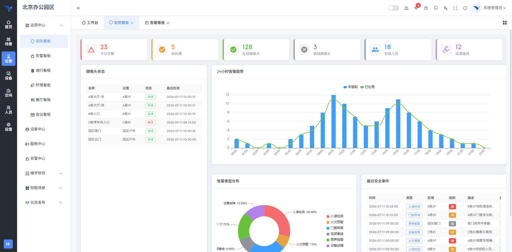

*图 3：摄像头状态列表*

#### 3.2.3 24小时告警趋势
右侧上半部为24小时告警趋势图表（ECharts柱状图+折线图组合），X轴为24小时时间刻度（00:00-23:00），蓝色柱状图展示每小时告警数，绿色平滑折线展示已处理数。支持十字准星tooltip交互。

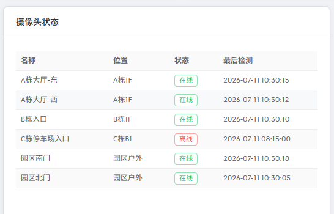

*图 4：24小时告警趋势图*

#### 3.2.4 告警类型分布与安全事件
右侧下半部以50/50分栏展示：左侧为告警类型环形饼图（内径40%外径70%），六类告警以不同颜色区分（入侵检测红/火灾预警橙/门禁异常蓝/视频离线灰/周界报警绿/设备故障紫），图例垂直排列在右侧；右侧为"最近安全事件"表格，展示时间/类型/区域/级别（深色el-tag）/描述（超长省略）/状态（已处理绿/处理中橙）。

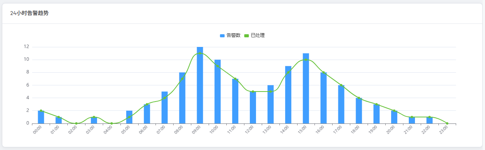

*图 5：告警类型分布与最近安全事件*

### 3.3 告警看板

告警看板是告警管理的深度分析面板，提供多维筛选、统计概览、可视化图表和事件列表四层信息架构。

#### 3.3.1 多维筛选栏
页面顶部使用vab-query-form框架组件包裹查询表单，支持五种筛选条件：日期范围（el-date-picker日期范围选择器）、级别（高/中/低下拉）、状态（已处理/处理中/未处理下拉）、区域（A栋/B栋/C栋/园区户外/地下车库下拉）、类型（入侵检测/火灾预警/门禁异常/设备故障/周界报警下拉）。点击"查询"按钮执行筛选（带loading态），点击"重置"清空所有条件并重新加载全部数据。

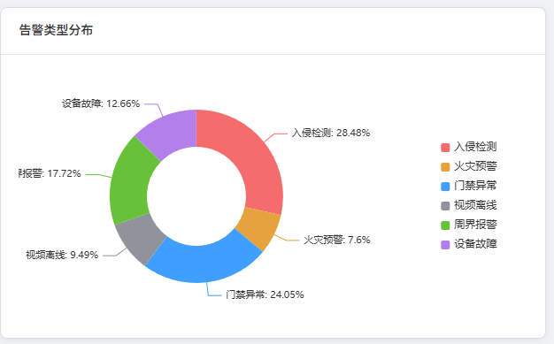

*图 6：告警看板多维筛选栏*

#### 3.3.2 六维统计概览
筛选栏下方展示六张统计卡片，每张带彩色左边框和带色彩背景的Element Plus图标圆圈（悬停上移3px）：总告警（蓝色/WarningFilled图标）、已处理（绿色/CircleCheckFilled图标）、处理中（橙色/Clock图标）、未处理（红色/CircleCloseFilled图标）、响应率（紫色/DataAnalysis图标，百分比格式如"94.3%"）、平均响应（青色/Timer图标，分钟格式如"3.2min"）。数值使用等宽数字字体。

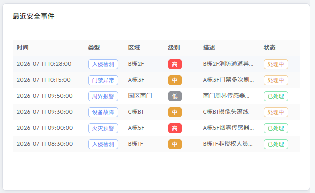

*图 7：告警看板六维统计概览*

#### 3.3.3 三图并列可视化
统计卡片下方以3列等宽布局展示三个图表：左侧"告警趋势（近7日）"为柱状图+折线图组合（蓝色柱顶部圆角4px+绿色折线线宽3px）；中间"告警来源"为横向柱状图（六种来源颜色循环，右侧显示加粗数值标签）；右侧"区域分布"为环形饼图（内径40%外径70%，五区域不同颜色）。

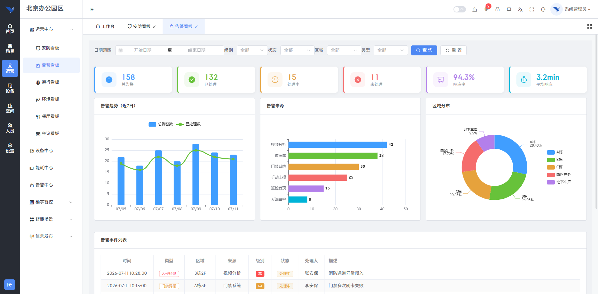

*图 8：告警趋势、告警来源、区域分布三图*

#### 3.3.4 告警事件列表
三图下方以vab-card包裹完整数据表格，展示告警事件详情：时间（居中170px）、类型（纯色el-tag）、区域、来源、级别（深色el-tag）、状态（el-tag）、处理人（无则显示"-"）、描述。底部使用vab-pagination分页组件，支持每页10/20/50/100条切换和页码跳转。筛选条件变化时自动重置到第1页。

*图 9：告警事件分页列表*

### 3.4 通行看板

通行看板是园区人车通行的综合监控面板，覆盖车流、车位、人密、访客四大维度。

#### 3.4.1 统计卡片行
页面顶部以4列等宽布局展示四张统计卡片（el-card shadow="hover"悬停阴影），左右分栏布局：左侧为大号数值+副文本（车流量含环比变化箭头、车位占用率含可用车位、在园人数含密度百分比、访客量），右侧为彩色圆角图标方块。

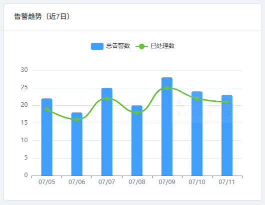

*图 10：通行看板统计卡片*

#### 3.4.2 车流量趋势与人员密度
中部以50/50网格分栏展示：左侧"车流量趋势"为分组柱状图（入场绿色/出场红色，06:00-19:00共14个时间点），卡片头部含自定义图例；右侧"各区域人员密度"为横向柱状图（8个区域按密度升序排列），柱状图使用水平渐变色（左绿→中橙→右红），右侧显示密度百分比标签。

*图 11：车流量趋势与各区域人员密度*

#### 3.4.3 车位详情与通行记录
底部以40%/60%分栏展示：左侧"车位使用情况"包含环形图（已占用红色/空闲灰色）、已用/总车位数摘要、4个分区进度条（A栋B1/B栋B1/C栋B1/地面停车场）；右侧"最近车辆通行记录"为Element Plus表格，包含车牌/类型（el-tag颜色区分：临时车灰/月租车蓝/访客车橙/VIP红）/入场时间/出场时间（未出场显示"--"）/区域/状态（在场绿/已出场灰）。

*图 12：车位使用情况与车辆通行记录*

### 3.5 环境看板

环境看板是园区环境质量的综合监测面板。

#### 3.5.1 八项环境指标卡片
页面顶部以8列等宽布局展示环境指标卡片（el-card shadow="hover"，顶部3px彩色上边框，悬停上移2px）：温度（蓝色/°C）、湿度（绿色/%）、AQI（绿色/数值+等级文字）、PM2.5（橙色）、CO₂（紫色/ppm）、TVOC（粉色/mg/m³）、噪音（黄色/dB）、舒适度（蓝色/0-100分+等级文字：舒适≥85/良好≥70/一般≥55/较差<55）。舒适度为前端七维度加权计算（温度以22°C最佳、湿度以50%最佳、噪音以45dB最佳）。

*图 13：环境看板八项指标卡片*

#### 3.5.2 各区域温度趋势
指标卡片下方为"各区域温度趋势"折线图（高度380px），X轴为06:00-20:00共15个时间点，三条平滑折线分别展示A栋（蓝）、B栋（绿）、C栋（橙）温度变化，每条折线下方带半透明渐变面积填充。图例顶部居中，tooltip白色半透明背景展示时刻和三条折线温度值。

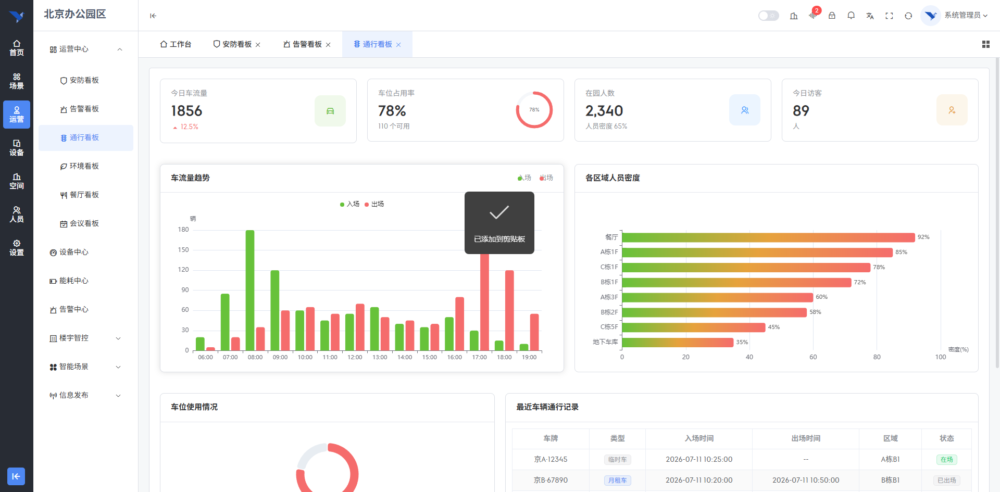

*图 14：各区域温度趋势图*

#### 3.5.3 环境传感器详情表
趋势图下方展示"环境传感器详情"完整数据表格：区域、温度（彩色圆点+数值，>26°C红色加粗）、湿度（绿色圆点+百分比）、PM2.5（数值+进度条，>40时橙色）、CO₂（数值+进度条，>800时橙色）、噪音（分贝值）、状态（正常/告警/异常 el-tag）。进度条颜色根据阈值动态变化。

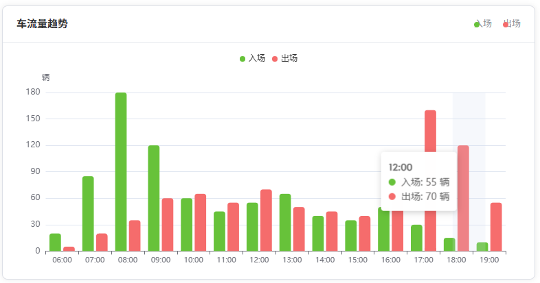

*图 15：环境传感器详情表*

### 3.6 餐厅看板

餐厅看板是园区餐厅运营的监控面板。

#### 3.6.1 六项统计卡片
页面顶部以6列均匀布局展示统计卡片：当前就餐人数（蓝色左边框）、座位占用率（绿色左边框，含SVG环形进度条）、今日用餐总数（紫色左边框）、平均排队时间（橙色左边框）、高峰时段（红色左边框，显示"11:30-12:30"）、总座位数（青色左边框）。

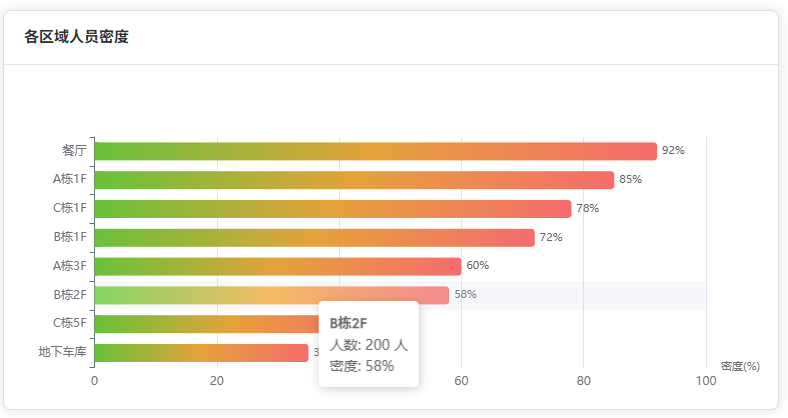

*图 16：餐厅看板统计卡片*

#### 3.6.2 就餐趋势与区域分布
中部采用35%/35%/30%网格布局：左侧"就餐趋势"为柱状图+趋势线（16个时间点07:00-19:00，11:30-12:30高峰区间柱状图使用红色→橙色渐变，其余时段蓝色→浅蓝渐变），叠加绿色平滑趋势线；中间"各区域就餐分布"为双系列横向柱状图（前层蓝色展示就餐人数+人数标签，后层半透明蓝色展示占用率+百分比标签，barGap:'-100%'叠加）；右侧"今日菜单"为排序表格（菜品名称/分类el-tag/价格红色加粗¥前缀/销量支持点击列头排序/评分el-rate只读组件）。

*图 17：就餐趋势、各区域分布与今日菜单*

#### 3.6.3 本周各餐次统计
底部展示"本周各餐次统计"分组柱状图（高度280px），周一至周日X轴，三组柱状图并排：早餐（灰色）、午餐（蓝色）、晚餐（橙色），组间距20%。

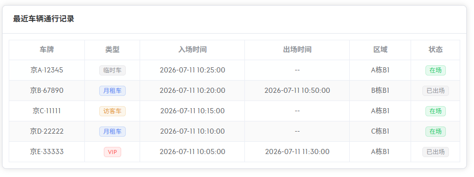

*图 18：本周各餐次统计图*

### 3.7 会议看板

会议看板是园区会议室使用状态的监控面板。

#### 3.7.1 六项统计卡片
页面顶部以6列均匀布局展示统计卡片：今日会议数（蓝色左边框）、进行中（绿色左边框，数值旁带绿色脉冲动画圆点2s呼吸循环）、会议室使用率（紫色左边框，带"%"单位后缀）、参会总人数（橙色左边框）、待开会议（青色左边框）、平均时长（灰色左边框，带"分钟"单位后缀）。

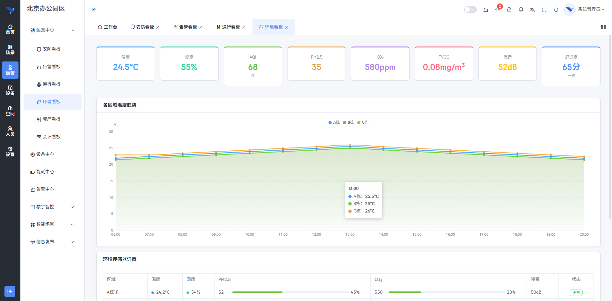

*图 19：会议看板统计卡片*

#### 3.7.2 会议室实时状态
页面主体采用40%/60%网格分栏。左侧以2列网格展示10间会议室卡片，每张卡片左侧4px彩色边条表示状态：使用中（蓝色，显示会议主题+结束时间）、空闲（绿色）、已预定（橙色）、维护中（灰色）。每张卡片含会议室名称+容量标签、状态指示圆点+状态文字、会议行（使用中时蓝色文字展示主题和结束时间）。

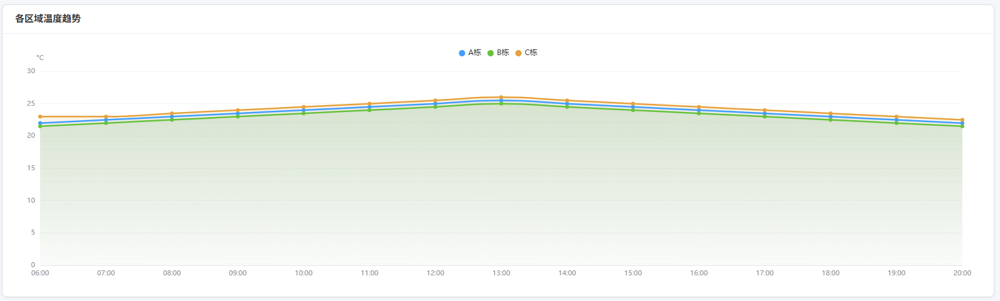

*图 20：会议室实时状态网格*

#### 3.7.3 部门统计与当前会议
右侧上半部为"部门会议使用统计"横向柱状图（6个部门，两组柱并排：会议次数蓝色/使用时长橙色），下半部为"当前进行会议"表格（取前5条，含会议室/会议主题/部门/主持人/时间el-tag/人数）。

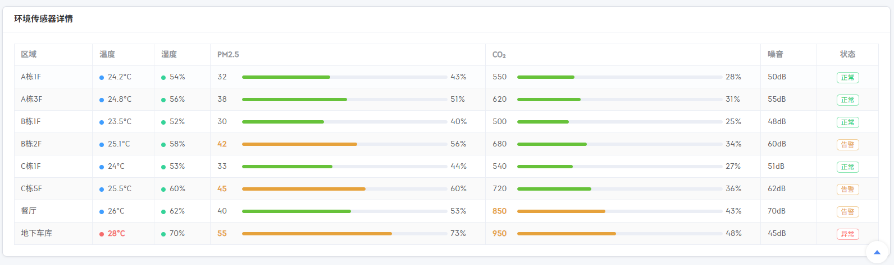

*图 21：部门会议使用统计与当前进行会议*

#### 3.7.4 本周会议趋势
底部展示"本周会议趋势"双Y轴组合图（高度240px）：X轴周一至周日，蓝色柱状图（左轴：会议数量），绿色平滑折线（右轴：使用率百分比0-100%）。

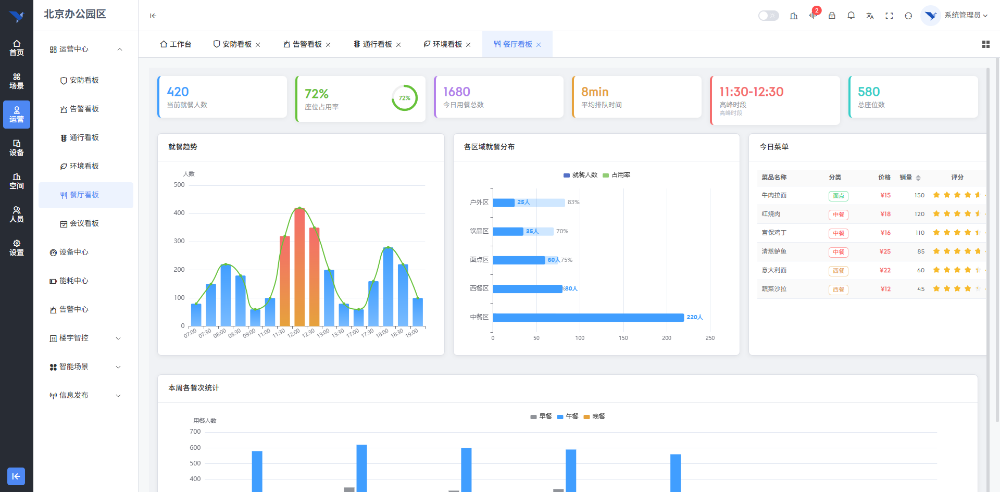

*图 22：本周会议趋势图*

---

## 四、业务逻辑说明

### 4.1 舒适度指数计算

环境看板中的舒适度指数由前端计算引擎实时生成，采用七维度加权评分算法：

- 温度维度：以22°C为最佳值，偏离每°C扣5分，100分为满分
- 湿度维度：以50%为最佳值，偏离每%扣2分
- AQI维度：按AQI值×1.2扣分
- PM2.5维度：按PM2.5值×2扣分
- CO₂维度：超过400ppm部分按0.08倍扣分
- TVOC维度：按TVOC值×500扣分
- 噪音维度：以45dB为最佳值，偏离每dB扣2分

七个维度得分取平均后四舍五入，得到0-100分的综合舒适度指数。≥85为"舒适"，≥70为"良好"，≥55为"一般"，<55为"较差"。

### 4.2 餐厅高峰时段判定

餐厅看板通过字符串比较判定高峰时段：11:30至12:30区间内的数据点，其柱状图使用红色→橙色渐变着色，其余时间段使用蓝色→浅蓝渐变，直观区分高峰与非高峰就餐时段。

### 4.3 车位分区统计

通行看板的车位分区数据基于总车位（500个）按比例缩放至四个区域（A栋B1 150个、B栋B1 130个、C栋B1 120个、地面停车场 100个），各区域已用数量按总占用率等比计算，以进度条形式展示。

### 4.4 Mock数据机制

当前版本所有数据均为前端Mock，API函数位于src/api/operations.ts中，通过统一的mock()工具函数模拟300ms网络延迟。各看板页面在onMounted时通过Promise.all并行加载多个API，单个接口失败不影响其他数据展示。

### 4.5 数据筛选与分页

告警看板支持5维度组合筛选，getAlarmList函数在mock层实现前端内存过滤（按status/level/area/type字段匹配）和分页逻辑（slice截取），筛选条件变化时自动重置页码至第1页。

---

## 五、常见问题

### 5.1 页面加载后无数据
**现象**：打开看板页面后所有卡片和图表均为空或无数据状态。
**排查**：检查浏览器开发者工具Console是否有报错信息；确认src/api/operations.ts文件中的mock函数未被人为修改。当前版本为纯前端Mock数据，无需后端服务运行。

### 5.2 图表显示异常
**现象**：ECharts图表不显示或显示不完整。
**排查**：检查浏览器窗口宽度是否小于1920px（建议分辨率≥1920×1080）；确认echarts和vue-echarts依赖已正确安装；检查浏览器是否禁用了Canvas渲染。

### 5.3 告警列表筛选不生效
**现象**：选择筛选条件后点击查询，列表数据未变化。
**排查**：当前mock数据从固定的8条记录中筛选，某些条件组合（如"已处理"+"低级别"）可能无匹配数据；点击"重置"按钮可恢复全部数据。

### 5.4 舒适度指数数值异常
**现象**：环境看板的舒适度指数显示为0或异常值。
**排查**：舒适度由前端computeComfortIndex函数根据七项环境指标计算，检查环境指标数值是否均为0（Mock数据默认有值）；确认计算函数中的权重参数未被修改。
