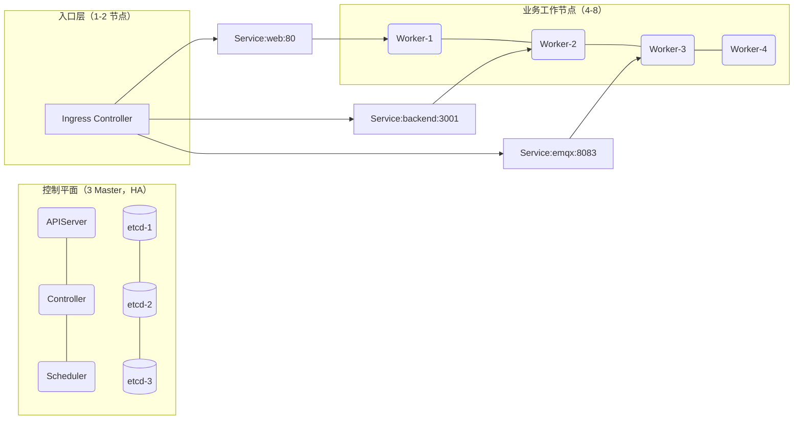
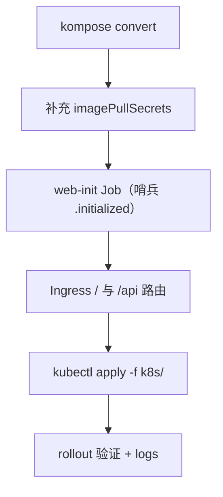

# BuildingOS AI Kubernetes 规划（v1.34.3）

## 集群拓扑（推荐）

- 开发/本地：1 master + 1–2 worker（快速验证，不做 HA）
- 预生产：3 master（HA）+ 3–4 worker（奇数 master 便于 etcd 选举）
- 生产：3 master 固定 + 4–8 worker；入口层与存储可独立节点

## 服务与副本规划

- web（Nginx 前端）：副本 2；HPA 目标 CPU 60%，范围 2–6
- backend（NestJS）：副本 2；HPA 目标 CPU 60%，范围 2–6
- postgres：StatefulSet 1（生产建议主备 1+1 或托管）
- redis：1（生产建议 3 节点+Sentinel 或托管）
- tdengine：1（大规模建议 2–3 节点）
- emqx：1（需要扩展时 2–3 节点）
- grafana：1
- zlmediakit：1（流媒体节点隔离）
- nodered：1（PVC 持久化）

## 资源 Requests/Limits（单 Pod 起始建议）

- web：requests `250m/256Mi`，limits `500m/512Mi`
- backend：requests `500m/1Gi`，limits `1CPU/2Gi`
- postgres：requests `500m/2Gi`，limits `2CPU/4Gi`
- redis：requests `200m/256Mi`，limits `500m/512Mi`
- tdengine：requests `1CPU/2Gi`，limits `2CPU/4Gi`
- emqx：requests `300m/512Mi`，limits `1CPU/1Gi`
- grafana：requests `200m/256Mi`，limits `500m/512Mi`
- zlmediakit：requests `500m/512Mi`，limits `1CPU/1Gi`
- nodered：requests `200m/256Mi`，limits `500m/512Mi`

## 存储（PVC 初始容量建议）

- `frontend_data`：1–5Gi（静态包+版本归档）
- `backend_uploads`：5–20Gi（上传与备份）
- `postgres_data`：20–100Gi
- `redis_data`：1Gi（AOF/RDB）
- `tdengine_data`：50–200Gi（时序数据）
- `grafana_data/logs`：1–5Gi
- `emqx_data/log`：1–2Gi
- `zlmediakit_data`：10–50Gi（录制/快照）
- 所有 PVC 使用支持在线扩容的 `StorageClass`（`AllowVolumeExpansion=true`），仅增大 `resources.requests.storage`

## 调度与稳定性

- 反亲和：web/backend 设置 `podAntiAffinity`，使副本分散到不同 worker
- PDB：web/backend 设定 `minAvailable: 1`，保障滚动升级期间可用性
- 探针：web `/health`，backend `node /app/healthcheck.js`；`initialDelaySeconds/timeoutSeconds` 与当前清单保持一致
- 节点隔离：为 ZLMediaKit/数据库打标签并通过 `nodeAffinity` 上到专用节点
- Ingress：`ingressClassName: nginx`，`/` → web:80，`/api` → backend:3001
- HPA：基于 CPU，目标值 60%，上下限与副本建议一致

## 网络与访问

- 对外入口：Ingress（生产），NodePort/端口转发（开发）
- 内部解析：使用 Service 名称（`backend`、`emqx`），无需容器域名
- 前端 Nginx 已改为：`proxy_pass http://backend:3001/`（K8s Service 名）

## 部署流水线（当前已完成）

- 命名空间与私有镜像凭据已创建：`swr-cred`
- `web-init`：首次解压镜像资产到 `frontend_data` 卷，之后哨兵阻止重复初始化
- Ingress 自带映射：`http://localhost` 与 `http://localhost/api`

## 当前集群状态（示例）

- Pods：`backend/emqx/grafana/nodered/postgres/redis/tdengine` 运行正常；`web` 已修复 Nginx upstream 并稳定
- Services：`ClusterIP` 类型已创建；如需对外暴露，统一走 Ingress 或 NodePort
- Ingress：`buildingos-ingress`（类：`nginx`）

## 变更与扩容建议

- 业务增长时，优先通过 HPA 扩副本，后增加 worker 数量
- 数据层增长：使用支持扩容的 `StorageClass` 调增 PVC 容量（或迁移到托管服务）
- 流量峰值：为 Ingress Controller 单独节点并开启水平扩展

## 风险与注意事项

- PVC 规范：已绑定的 PVC 除 `resources.requests.storage` 外多数字段不可变；遇到不可变错误需删除重建或使用支持在线扩容的存储类
- 探针与限额：过低的 requests 可能导致频繁驱逐或探针超时，建议按上表起步并根据监控调优
- 版本标签：生产使用明确版本（如 `v1.0.0`），避免 `latest` 引发不可控升级

