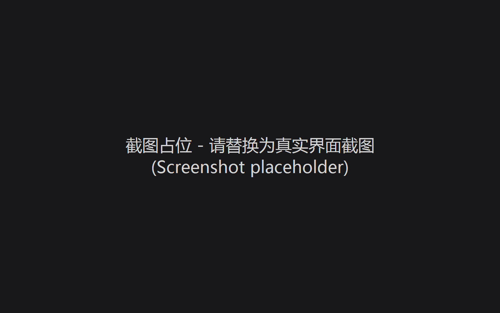

# 操作说明书（智能楼宇智能维护管理系统 buildingos.maintenance）

## 1 引言

### 1.1 编写目的
本操作说明书旨在帮助园区物业管理人员、维修工程师及系统管理员快速掌握智能楼宇智能维护管理系统的使用方法和操作流程，确保工单处理、设备维保和巡检管理工作的规范化与高效化。

### 1.2 系统概述
智能楼宇智能维护管理系统是一套覆盖工单全生命周期管理、设备台账维保追溯与巡检任务自动化调度的综合性维护管理平台。系统支持手动报单、二维码扫码、设备告警触发、巡检自动生成四种工单来源，内置可视化流程引擎、SLA时效管理、分配规则引擎和统计分析看板，与设备设施台账深度融合，实现设备维保历史的完整追溯。

### 1.3 适用范围
本手册适用于以下角色的日常操作参考：
- **物业管理员**：工单调度、分配规则配置、SLA时效管理、数据统计分析
- **维修工程师**：工单接单、处置操作、巡检任务执行
- **系统管理员**：工单流程配置、服务类型字典维护、巡检路线管理、二维码生成
- **普通员工**：工单提交、进度跟踪

## 2 系统运行环境

### 2.1 硬件环境
- **服务端**：x86 8核CPU，RAM≥16GB，SSD≥512GB
- **客户端**：普通办公PC（i5/8GB/256GB），推荐使用Chrome/Edge浏览器
- **移动端**：支持NFC标签读取的Android/iOS设备（用于巡检打卡）

### 2.2 软件环境
- **服务端操作系统**：Linux（Ubuntu 22.04）
- **运行支撑**：Nginx、PostgreSQL 15、Redis 7、MQTT Broker、Docker
- **浏览器**：Chrome 90+ / Edge 90+

## 3 系统操作使用

### 3.1 登录与首页
用户通过浏览器访问系统地址后进入登录页面，输入账号和密码完成身份验证。登录成功后系统根据用户角色展示对应的功能菜单。

*图 3.1 系统登录页面*

### 3.2 工单列表（全生命周期管理）

工单列表是工单管理的核心工作台，整合了工单查询、创建、处理、详情查看和生命周期流转的全部操作。

#### 3.2.1 多条件查询

顶部查询栏支持以下筛选条件组合：
- **上报人**：文本输入，模糊匹配工单上报人姓名
- **报事位置**：文本输入，模糊匹配工单关联的房间或区域位置
- **状态筛选**：下拉选择，包含待派发、待接单、处置中、待验收、已归档、已取消六种状态
- **紧急程度**：下拉选择，包含一般、紧急、非常紧急三个级别
- **上报时间**：日期范围选择器，按工单创建时间区间过滤
- 点击"查询"按钮触发筛选，右侧"新增报事"按钮打开工单创建弹窗

*图 3.2.1 工单列表查询界面*

#### 3.2.2 五选项卡视图

表格上方提供五个选项卡，从不同视角查看工单：

**我的待办**——展示当前登录用户需要处理的工单（待接单、处置中、待验收状态中分配给当前用户的工单）。此视图下每行显示"处理"按钮，点击进入处理流程。

**我的已办**——展示当前用户历史上已处理完成的工单记录。

**我发起的**——展示当前用户作为上报人创建的工单，便于跟踪自己提交的报修进度。

**抄送我的**——展示当前用户被设置为抄送人的工单，无需处理但需知晓进展。

**全部工单**——展示系统中所有工单（受数据权限控制），供管理员全面掌握工单动态。

*图 3.2.2 五选项卡视图*

#### 3.2.3 数据表格

工单表格展示以下信息列：工单编号、标题、上报人、报修来源（手动/扫码/告警/巡检彩色标签）、位置、关联设备、紧急程度（颜色标签区分）、当前状态（六种状态彩色标签，超时工单显示红色闪烁圆点）、上报时间、流程名称、处理人、操作（详情/处理按钮）。

*图 3.2.3 工单数据表格*

#### 3.2.4 工单创建

点击"新增报事"按钮弹出工单创建弹窗，包含以下表单项：
- **报修来源**：下拉选择——手动报单、二维码扫码、设备告警、巡检自动
- **报事房间**：文本输入（必填）
- **关联设备**：远程搜索下拉框，输入设备名称关键字后实时查询设备台账并展示匹配结果。选中某设备后显示设备信息卡片（设备名称、设备编号、型号、安装位置、当前状态）
- **报事流程**：下拉选择适用的工单流程
- **紧急程度**：下拉选择（必填）——一般、紧急、非常紧急
- **描述**：文本域（必填）
- **图片**：图片上传组件（picture-card 模式，最多 3 张）

*图 3.2.4 工单创建弹窗*

#### 3.2.5 工单详情

点击"详情"按钮弹出工单详情弹窗。弹窗以描述列表（双列布局）展示工单的核心信息：工单编号、报事房间、上报人、联系电话、紧急程度（彩色标签）、当前状态（彩色标签）、所属流程、创建时间。描述文本跨双列展示，关联图片以图片预览组件展示，点击可放大查看。描述列表下方展示处理日志时间线（el-timeline），按时间倒序展示工单的每一步流转记录。

*图 3.2.5 工单详情弹窗*

#### 3.2.6 工单处理

在"我的待办"选项卡中，每行工单的"处理"按钮对应工单当前状态所需的操作：
- 待派发状态：处理人打开后可选择接单人并派发
- 待接单状态：处理人点击后确认接单
- 处置中状态：处理人填写处置结果和维修记录
- 待验收状态：验收人确认维修质量，通过后归档

处理操作记录操作人、操作时间和处理内容，追加至工单的处理日志中。

### 3.3 工单流程管理

工单流程管理允许管理员自定义工单的审批处置流程，包括流程节点编排、节点处理人指定和超时升级规则配置。

#### 3.3.1 流程列表

数据表格展示所有已定义的工单流程，包含流程名称、节点数量、创建时间。每行提供编辑和删除操作。删除时弹出确认对话框防止误操作。

*图 3.3.1 流程列表*

#### 3.3.2 流程编辑器

新增或编辑流程时弹出流程编辑弹窗，包含以下配置：

**流程名称**：文本输入（必填），如"普通维修流程""紧急维修流程""设备报修流程"。

**流程节点编排**：以可编辑表格形式展示流程的节点序列，每个节点配置节点名称、节点类型（派发/接单/处置/验收/归档，以不同颜色标签区分）和处理人（多选下拉框）。节点按表格行顺序构成线性流转路径。"添加节点"按钮追加新行，"删除"按钮移除对应节点。

**超时升级规则**：流程编辑器下方提供超时升级规则配置区，以表格形式管理关联节点、超时时长（1-1440分钟）、升级对象、通知方式（短信/电话/飞书多选）和启用开关。

*图 3.3.2 流程编辑器*

### 3.4 服务类型管理

服务类型管理维护工单的多级分类体系，支持树形结构嵌套和排序，为工单创建、分配规则和统计分析提供统一的类型字典。

#### 3.4.1 类型树形列表

数据表格以树形结构展示服务类型，一级为模板（带有项目名称和应用范围），二级为具体的服务类型名称。系统预置五大维修类别：强电维修、弱电维修、空调维修、给排水维修、土建维修。每行展示模板名称/服务名称、项目名称、应用范围（全部或部分流程）、更新时间。

*图 3.4.1 服务类型树形列表*

#### 3.4.2 类型编辑器

新增或编辑服务类型时弹出编辑弹窗，配置模板名称（必填）、项目名称（必填）、应用范围（下拉选择）。服务类型子类表格管理该模板下的具体服务类型，每行配置服务名称和排序数字，支持添加子类和删除操作。

*图 3.4.2 服务类型编辑器*

### 3.5 工单时效（SLA）管理

工单时效（SLA）管理定义工单在不同优先级和不同节点下的时间约束，确保工单处理的及时性和可考核性。

#### 3.5.1 时效规则列表

数据表格展示所有SLA规则，包含规则名称、类型（全局时效/节点时效标签）和三个优先级的三组超时设置（响应/挂起/完成）。一般级别默认480/960/1440分钟，紧急级别默认120/240/480分钟，非常紧急级别默认30/60/120分钟。

*图 3.5.1 SLA规则列表*

#### 3.5.2 时效规则编辑器

新增或编辑SLA规则时弹出编辑弹窗，配置规则名称（必填）、类型（全局流程时效/流程节点时效）、时间单位（分钟/小时/天），以及三个优先级（一般/紧急/非常紧急）各自的响应超时、挂起超时和完成超时三个数值。选择节点时效时额外显示关联节点下拉和启用状态开关。

*图 3.5.2 SLA规则编辑器*

### 3.6 工单统计

工单统计看板提供多维度的工单数据分析和可视化展示，帮助管理者掌握工单处理的整体效率和质量。

#### 3.6.1 筛选条件

顶部筛选栏支持按日期范围（日期范围选择器）和来源类型（下拉选择：全部来源/二维码扫码/手动报单/设备告警/巡检自动）过滤统计数据。

#### 3.6.2 五维度摘要卡片

筛选栏下方以五个彩色卡片展示核心指标：新增工单（蓝色）、满意度（绿色）、响应率（橙色）、完成率（蓝色）、手动报单占比（紫色）。

*图 3.6.2 统计摘要卡片*

#### 3.6.3 趋势图

摘要卡片下方展示ECharts混合图表（柱状图+折线图），以时间为横轴，蓝色柱状图表示每日新增工单数量，绿色平滑折线图表示每日完成工单数量，直观对比新增与完成的趋势关系。

*图 3.6.3 工单趋势图*

#### 3.6.4 按来源与按类型统计表

下方以两个并排表格分别展示按工单来源和按工单服务类型的维度统计，每行列示来源名称/类型名称、工单数量、满意度百分比、响应率百分比、完成率百分比和手动报单占比百分比。

*图 3.6.4 按来源与按类型统计表*

### 3.7 分配规则

分配规则定义了工单的默认处理人指派逻辑，实现工单创建后的自动化派发，减少人工调度工作量。

#### 3.7.1 规则列表

查询栏支持按适用区域（全部/A栋/B栋/C栋）、工单类型（下拉选择服务类型）和状态（启用/禁用）筛选规则。数据表格展示每条规则的工单类型、适用区域、适用楼层、工单等级（彩色标签）、默认处理人、处理小组、抄送人、确认人、超时设置（响应/挂起/完成三位一体格式）和启用/禁用开关。

*图 3.7.1 分配规则列表*

#### 3.7.2 规则编辑器

新增或编辑分配规则时弹出编辑弹窗，配置工单类型（必填）、适用区域（必填）、适用楼层、工单等级（必填）、默认处理人、处理小组、抄送人（多选下拉）、确认人、超时设置（响应/挂起/完成三个数字输入配合超时单位下拉）和启用开关。系统按工单类型→适用区域→适用楼层→工单等级四级优先级匹配规则，自动指派处理人。

*图 3.7.2 分配规则编辑器*

### 3.8 巡检路线（巡检任务管理）

巡检路线管理支持自定义巡检路线、配置检查点NFC打卡编码，以及设置周期性自动生成巡检工单。

#### 3.8.1 路线列表

查询栏支持按适用区域（全部区域/A栋/B栋/C栋）和周期状态（全部/已启用/已停用）筛选巡检路线。数据表格每行支持展开（expand），展开后显示该路线下的检查点列表（检查点名称+NFC编号）。主表格展示路线名称、适用区域、检查点数量（标签形式）、周期规则（格式化描述文字）、自动生成开关、上次执行时间和操作按钮。

*图 3.8.1 巡检路线列表*

#### 3.8.2 路线编辑器

新增或编辑巡检路线时弹出编辑弹窗，配置路线名称（必填，最多50字符）、适用区域（必填）、检查点列表（可编辑表格管理检查点名称和NFC编号，支持增删行）和周期规则（周期类型：每天/每周/每月，执行时间，每周时显示星期选择，每月时显示日期输入）。自动生成工单开关开启后显示关联工单类型输入框。

*图 3.8.2 巡检路线编辑器*

### 3.9 二维码管理

二维码管理支持为园区的区域、楼层、房间生成专属报修二维码，用户扫描二维码后可快速发起报修工单。

#### 3.9.1 二维码列表

查询栏支持按区域（A栋/B栋/C栋）和楼层（B1/1F/2F/3F）筛选二维码。数据表格展示每条二维码的区域、楼层、房间、二维码链接（提供复制按钮）、扫描次数、创建时间和操作按钮（扫描记录/删除）。

*图 3.9.1 二维码列表*

#### 3.9.2 生成二维码

点击"生成二维码"按钮弹出配置弹窗，依次选择区域（必填）、楼层（必填）和房间（必填）。配置完成后弹窗中展示二维码的CSS模拟预览图和生成的报修链接URL，提供复制按钮。二维码链接携带区域/楼层/房间参数，用户扫码后直接进入报修页面，系统自动填充位置信息。

*图 3.9.2 生成二维码弹窗*

#### 3.9.3 扫描记录

点击某个二维码的"扫描记录"按钮弹出记录弹窗，以表格展示该二维码的扫描历史：扫描人姓名、关联房间、扫描时间、扫描结果（是否成功创建工单）。

## 4 工单生命周期说明

系统定义六阶段工单生命周期：

**待派发** → **待接单** → **处置中** → **待验收** → **已归档**（正常完结），任意非归档状态均可转入**已取消**。

工单创建后进入"待派发"状态，由调度人或分配规则自动指定处理人后进入"待接单"。处理人接单后进入"处置中"，完成处置后提交验收进入"待验收"，验收通过后归档。每个阶段均受SLA时效约束，超时触发自动升级告警。

## 5 常见问题

### 5.1 如何处理超时工单？
系统自动将滞留超时的工单标记为红色闪烁圆点提示，同时根据流程配置的超时升级规则执行升级动作：通知上级人员、提升工单紧急程度，或通过短信/电话/飞书等渠道推送告警。管理员应及时关注超时工单并协调处理。

### 5.2 如何配置自动分配规则？
进入"分配规则"模块，新增规则时依次配置工单类型、适用区域、适用楼层和工单等级，指定默认处理人、处理小组、抄送人和确认人，并设置三级超时时间。保存后系统自动按四级优先级匹配新创建的工单。

### 5.3 巡检工单如何自动生成？
进入"巡检路线"模块，新增或编辑路线时配置周期规则（每天/每周/每月）和执行时间，开启"自动生成工单"开关并填写关联工单类型。系统每日扫描已启用的巡检路线，匹配当前时间与周期规则，自动创建巡检工单。
