# 操作说明书（智能楼宇会议室系统 buildingos.meetingroom）

## 目录

1. **引言**
    *   1.1 编写目的
    *   1.2 定义
2. **系统概述**
    *   2.1 系统用途
    *   2.2 软件功能概述
    *   2.3 软件运行环境
3. **系统操作使用**
    *   3.1 登录与首页
        *   3.1.1 系统登录
        *   3.1.2 系统首页概览
    *   3.2 会议室资源管理
        *   3.2.1 会议室数字沙盘
        *   3.2.2 会议室排期视图
        *   3.2.3 新建会议预约
        *   3.2.4 会议信息编辑
        *   3.2.5 预定记录管理
        *   3.2.6 会议时长统计
    *   3.3 会议中控平板（智能控制）
        *   3.3.1 中控首页与场景
        *   3.3.2 视频会议控制
        *   3.3.3 会议中状态管理
        *   3.3.4 环境控制总览
    *   3.4 智能环境设备联动
        *   3.4.1 大屏显示控制
        *   3.4.2 摄像头云台控制
        *   3.4.3 信号源切换
        *   3.4.4 音频系统调节
        *   3.4.5 智能照明控制
        *   3.4.6 门禁权限联动
        *   3.4.7 智能窗帘控制
        *   3.4.8 空调温控调节
        *   3.4.9 新风系统控制
        *   3.4.10 智能插座管理

---

## 1. 引言

### 1.1 编写目的
本操作说明书旨在详细阐述《智能楼宇会议室系统 buildingos.meetingroom》的功能架构、操作流程及维护方法。文档面向系统的最终用户（包括企业员工、行政人员、会议室管理员），提供标准化的操作指引，帮助用户快速掌握从会议预约、审批、现场签到到会中设备智能控制的全流程操作，确保会议室资源的高效利用与会议体验的智能化。

### 1.2 定义
*   **系统/本系统**：指《智能楼宇会议室系统 buildingos.meetingroom》。
*   **中控平板**：指安装在会议室墙面或桌面的触控终端，用于集中控制会议室内的声、光、电及音视频设备。
*   **排期视图**：以时间轴或日历形式展示会议室占用情况的可视化界面。
*   **场景联动**：指一键触发多个设备的组合动作，如“投影模式”自动降下幕布、关闭主灯、开启投影仪。

---

## 2. 系统概述

### 2.1 系统用途
《智能楼宇会议室系统 buildingos.meetingroom》是专为现代智慧办公场景打造的综合性会议管理平台。系统集成了会议预约管理、信息发布、环境设备控制（IoT）及音视频会议控制功能。通过软硬件深度融合，解决传统会议室预定冲突、设备操作繁琐、资源闲置浪费等痛点，实现会议全生命周期的数字化管理。

### 2.2 软件功能概述
本系统主要包含以下核心功能模块：
1.  **资源可视化管理**：提供2.5D数字沙盘和日历排期视图，实时展示会议室占用状态。
2.  **全流程会议预约**：支持Web端/移动端预约，集成审批流、冲突检测及邮件/短信通知。
3.  **智能中控系统**：通过中控平板实现对灯光、窗帘、空调、大屏、音频等设备的集中控制。
4.  **视频会议集成**：深度对接腾讯会议、Zoom等主流会议软件，支持一键入会和会控操作。
5.  **数据统计分析**：自动统计会议室利用率、部门会议时长等数据，为行政决策提供依据。

### 2.3 软件运行环境
*   **硬件环境**：
    *   **服务端**：推荐配置 8核 CPU，16GB 内存，512GB SSD 存储。
    *   **中控端**：定制化安卓触控平板（10寸以上，PoE供电）。
    *   **外设支持**：兼容主流中控主机、SIP终端、继电器控制器及各类IoT传感器。
*   **软件环境**：
    *   **服务端系统**：Linux (Ubuntu 20.04+/CentOS 7+) 或 Windows Server 2019。
    *   **客户端**：支持 Chrome、Edge 等现代浏览器；中控APP支持 Android 10+。

---

## 3. 系统操作使用

### 3.1 登录与首页

#### 3.1.1 系统登录
系统采用B/S架构，用户通过浏览器访问指定网址即可进入登录界面。界面设计简洁商务，支持账号密码或SSO单点登录。
*   **操作步骤**：
    1.  输入系统URL地址，回车加载登录页。
    2.  在登录框中输入分配的用户名（Username）和密码（Password）。
    3.  点击“登录”按钮，系统进行身份验证，验证通过后跳转至首页。
*   **界面展示**：
    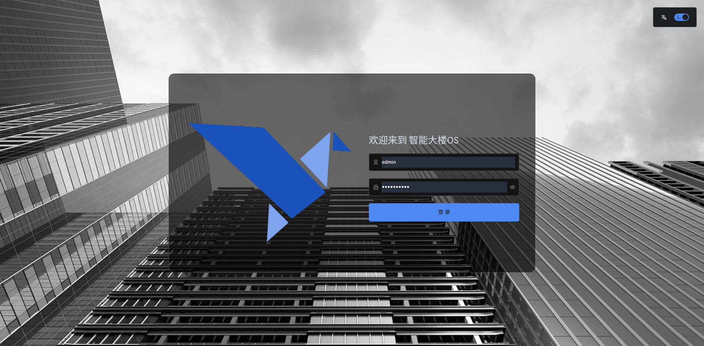
    *图 3-1 系统登录界面*

#### 3.1.2 系统首页概览
登录成功后进入系统首页（Dashboard）。首页作为工作台，聚合了会议管理的核心数据和快捷入口，帮助管理员一目了然地掌握今日会议动态。
*   **功能说明**：
    *   **数据看板**：顶部卡片显示“今日会议数”、“正在进行会议”、“空闲会议室”、“设备在线率”等关键指标。
    *   **快捷导航**：左侧菜单栏提供“会议室管理”、“会议预约”、“设备控制”、“统计报表”等功能模块的快速切换。
    *   **今日日程**：右侧列表展示当前登录用户的今日会议日程，点击可进入详情。
*   **界面展示**：
    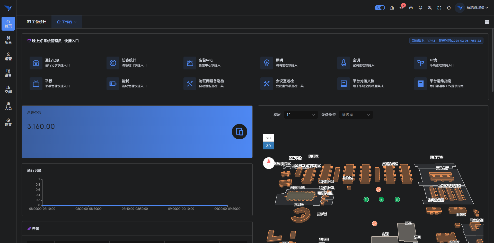
    *图 3-2 系统首页概览*

### 3.2 会议室资源管理

#### 3.2.1 会议室数字沙盘
该模块通过2.5D平面图直观展示楼层会议室的分布及实时状态。
*   **功能说明**：
    *   **状态可视化**：会议室颜色代表状态（绿色-空闲、红色-占用、黄色-即将开始）。
    *   **快速预览**：鼠标悬停在会议室上方，显示当前会议主题、发起人及剩余时长。
    *   **环境监测**：实时显示会议室内的温度、湿度、PM2.5数值（需传感器支持）。
*   **界面展示**：
    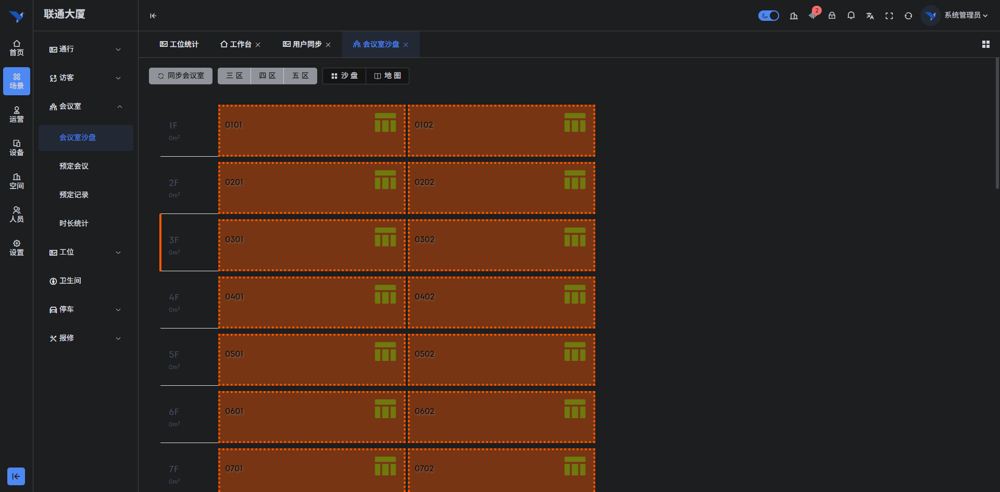
    *图 3-3 会议室数字沙盘*

#### 3.2.2 会议室排期视图
提供时间轴视角的会议室排期表，方便用户查找空闲时段。
*   **功能说明**：
    *   **多视图切换**：支持按日、周、月切换视图。
    *   **拖拽预约**：在空白时间段直接拖拽鼠标，即可快速发起该时间段的会议预约。
    *   **冲突提示**：若选择的时间段已有会议，系统会自动标红并禁止提交。
*   **界面展示**：
    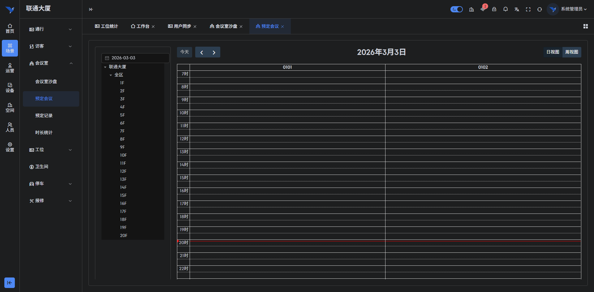
    *图 3-4 会议室排期视图*

#### 3.2.3 新建会议预约
用户点击“新建会议”或在排期表中选择时段，进入会议预约详情页。
*   **功能说明**：
    *   **基本信息**：填写会议主题、时间、参会人数、会议类型（内部/外部）。
    *   **资源选择**：勾选所需会议室及配套服务（如茶水、投影、视频会议终端）。
    *   **参会人通知**：添加内部员工或外部访客邮箱，系统自动发送会议邀请函。
*   **界面展示**：
    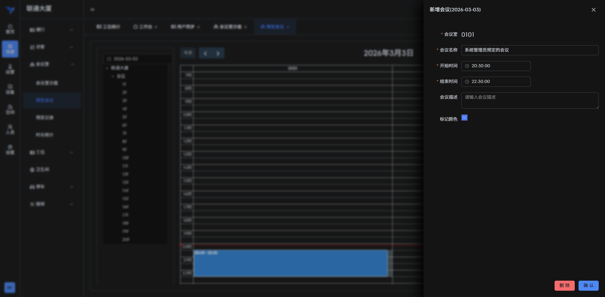
    *图 3-5 新建会议预约*

#### 3.2.4 会议信息编辑
对于已创建但未开始的会议，发起人可进行修改或取消操作。
*   **功能说明**：
    *   **变更通知**：修改会议时间或地点后，系统自动触发变更通知发送给所有参会人。
    *   **会议纪要**：支持上传会议议程附件或预置会议纪要模板。
*   **界面展示**：
    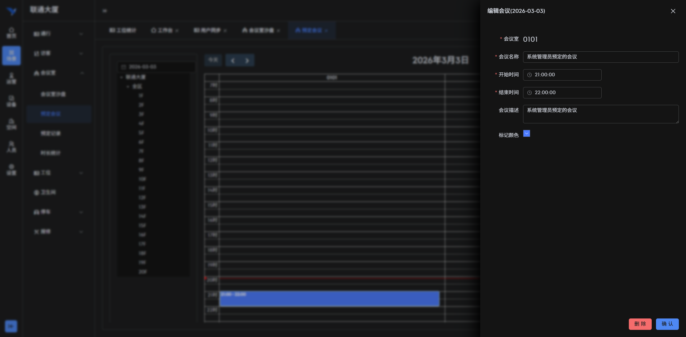
    *图 3-6 编辑会议信息*

#### 3.2.5 预定记录管理
管理员可查看系统中所有的历史预定记录，进行审计和异常处理。
*   **功能说明**：
    *   **状态追踪**：查看会议状态（待审批、已通过、进行中、已结束、已取消）。
    *   **审批管理**：对于需要审批的会议室，管理员在此进行通过或驳回操作。
    *   **签到记录**：查看参会人员的签到情况（支持扫码或人脸签到）。
*   **界面展示**：
    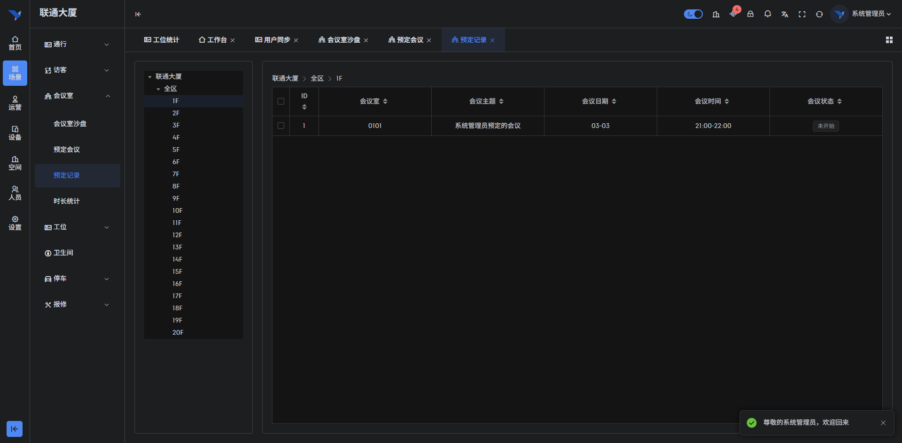
    *图 3-7 会议预定记录列表*

#### 3.2.6 会议时长统计
提供多维度的数据报表，帮助行政部门优化会议室资源配置。
*   **功能说明**：
    *   **时长趋势**：折线图展示日/周/月的会议总时长变化趋势。
    *   **部门排名**：统计各部门的会议时长和频次，评估部门协作活跃度。
    *   **利用率分析**：分析各会议室的忙闲时段，为后续扩容或缩减提供数据支撑。
*   **界面展示**：
    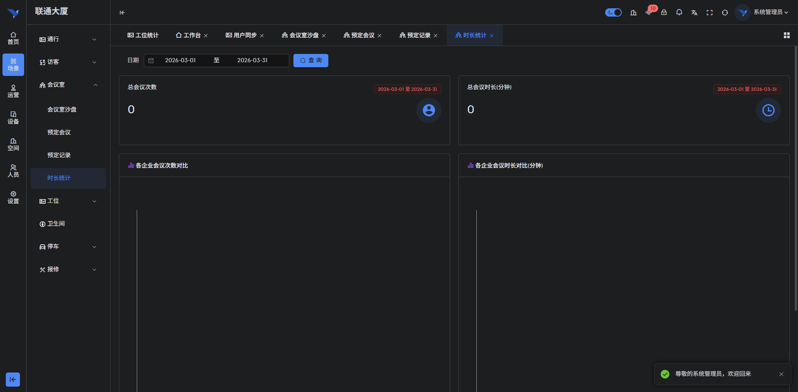
    *图 3-8 会议时长统计报表*

### 3.3 会议中控平板（智能控制）

#### 3.3.1 中控首页与场景
中控平板通常安装在会议室门口或放置于桌面上，是会议室的智能控制中心。
*   **功能说明**：
    *   **状态显示**：顶部显示会议室名称、当前时间、天气及会议状态（空闲/占用）。
    *   **场景模式**：提供“一键入会”、“投影模式”、“离开模式”等快捷场景按钮，一键联动灯光、窗帘和设备。
    *   **快速签到**：支持扫描屏幕二维码或输入会议号进行现场签到。
*   **界面展示**：
    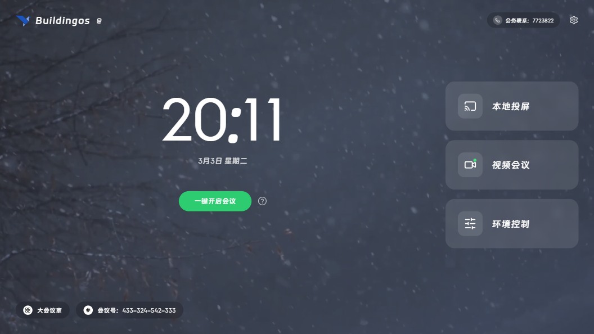
    *图 3-9 中控平板首页*

#### 3.3.2 视频会议控制
深度集成视频会议软件，用户无需操作复杂的外设，在中控屏即可管理远程会议。
*   **功能说明**：
    *   **加入会议**：输入会议号一键加入腾讯会议/Zoom。
    *   **通讯录呼叫**：直接从企业通讯录中选择联系人发起呼叫。
    *   **快速开会**：点击“立即开会”发起即时视频会议。
*   **界面展示**：
    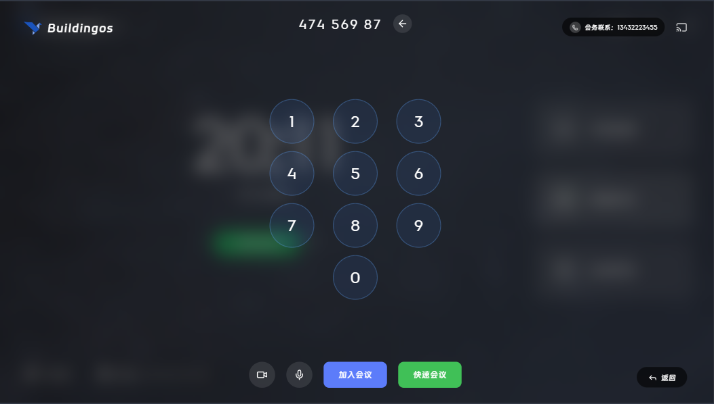
    *图 3-10 视频会议加入界面*

#### 3.3.3 会议中状态管理
会议进行中，中控屏自动切换至会控界面，防止误操作。
*   **功能说明**：
    *   **静音/闭麦**：一键控制本地麦克风静音或摄像头关闭。
    *   **屏幕共享**：控制投屏内容的切换。
    *   **结束会议**：点击结束，系统自动释放会议室资源并重置设备状态。
*   **界面展示**：
    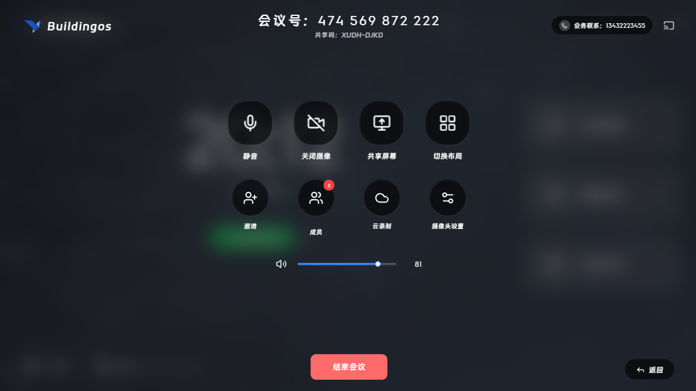
    *图 3-11 视频会议进行中界面*

#### 3.3.4 环境控制总览
点击首页的“环境控制”进入设备管理详情页，可对室内IoT设备进行精细化调节。
*   **功能说明**：
    *   **分区控制**：按设备类型（灯光、空调、窗帘等）分类展示。
    *   **状态反馈**：实时反馈设备的开关状态和数值（如空调温度）。
*   **界面展示**：
    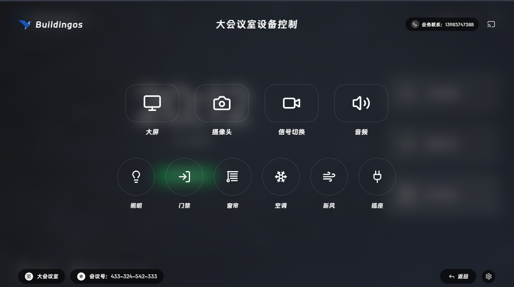
    *图 3-12 环境控制总览页*

### 3.4 智能环境设备联动

#### 3.4.1 大屏显示控制
控制会议室显示设备（投影仪/液晶大屏/LED墙）的开关及参数。
*   **功能说明**：
    *   **电源控制**：一键开启或关闭显示屏。
    *   **模式切换**：切换显示模式（标准/护眼/高亮）。
*   **界面展示**：
    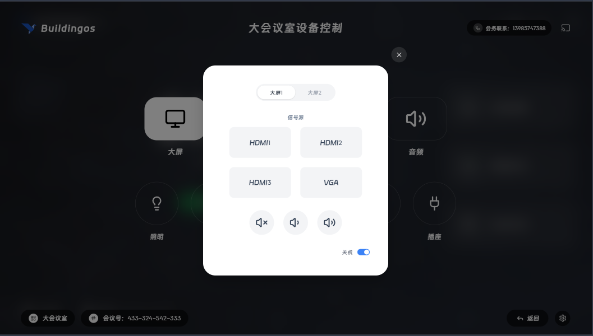
    *图 3-13 大屏显示控制*

#### 3.4.2 摄像头云台控制
针对PTZ会议摄像头，提供方向和变焦控制。
*   **功能说明**：
    *   **云台方向**：上下左右调整摄像头拍摄角度。
    *   **变焦控制**：拉近（Zoom In）或推远（Zoom Out）镜头。
    *   **预置位**：一键调用预设的机位（如“主席位”、“全景位”）。
*   **界面展示**：
    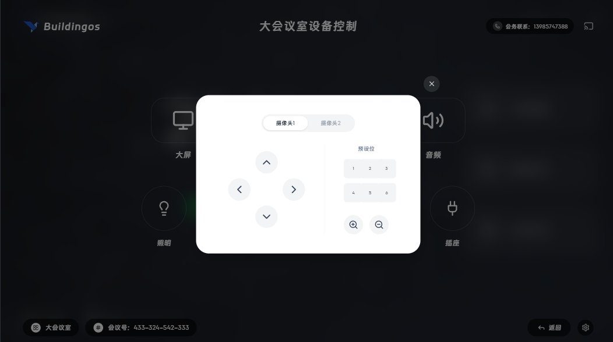
    *图 3-14 摄像头云台控制*

#### 3.4.3 信号源切换
管理视频矩阵的输入输出信号，灵活调度画面上屏。
*   **功能说明**：
    *   **源选择**：选择输入源（如HDMI桌插、无线投屏盒子、会议PC）。
    *   **输出目标**：选择投射到左屏、右屏或双屏同显。
*   **界面展示**：
    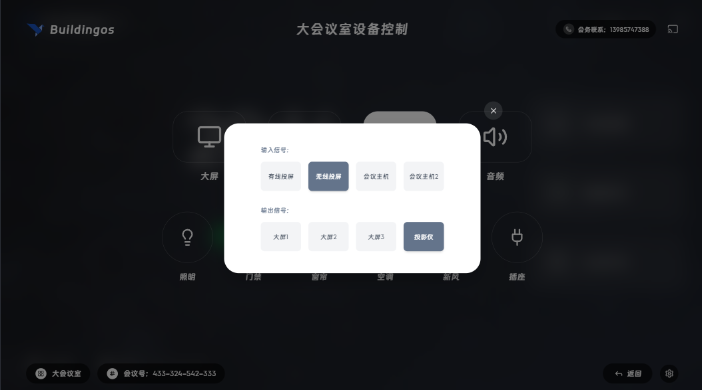
    *图 3-15 视频信号切换*

#### 3.4.4 音频系统调节
控制会议室扩声系统的音量和模式。
*   **功能说明**：
    *   **音量推杆**：滑动调节主音量大小。
    *   **静音开关**：一键静音。
    *   **输入源**：切换音频输入（麦克风/电脑音频）。
*   **界面展示**：
    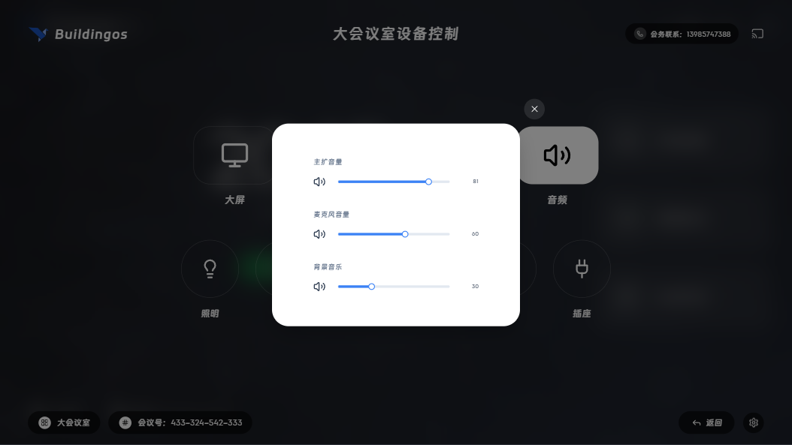
    *图 3-16 音频系统调节*

#### 3.4.5 智能照明控制
接入DALI或KNX照明系统，实现灯光氛围调节。
*   **功能说明**：
    *   **开关控制**：独立控制各回路灯光（筒灯、灯带、射灯）。
    *   **亮度调节**：无极调节灯光亮度（0-100%）。
    *   **色温调节**：调节冷暖光色温。
*   **界面展示**：
    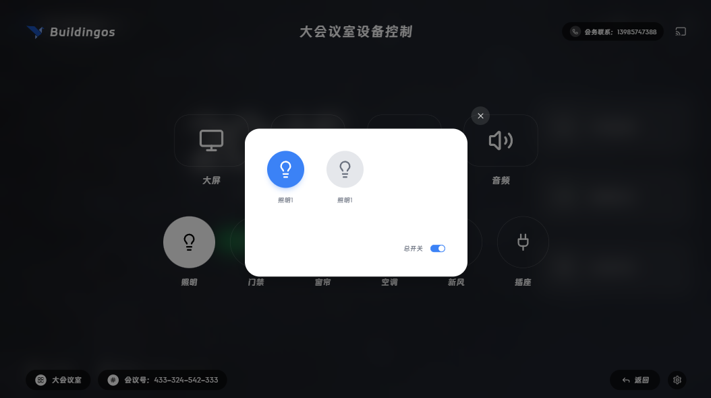
    *图 3-17 智能照明控制*

#### 3.4.6 门禁权限联动
在中控屏上直接管理会议室门锁。
*   **功能说明**：
    *   **远程开门**：点击“开门”按钮，门锁开启5秒后自动闭合。
    *   **常开模式**：开启常开模式，方便会议期间人员频繁进出。
*   **界面展示**：
    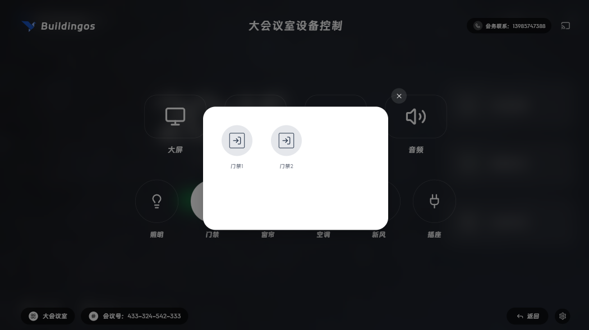
    *图 3-18 门禁权限控制*

#### 3.4.7 智能窗帘控制
控制电动窗帘或百叶窗的开合。
*   **功能说明**：
    *   **开合控制**：一键全开、全关或暂停。
    *   **百分比控制**：拖动滑块精确控制窗帘开合比例（如50%遮光）。
*   **界面展示**：
    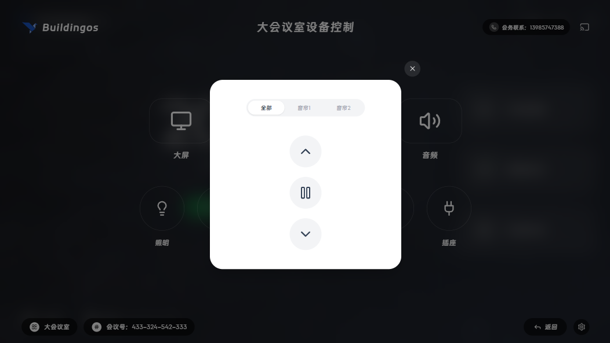
    *图 3-19 智能窗帘控制*

#### 3.4.8 空调温控调节
对接VRV空调网关，调节室内温湿度。
*   **功能说明**：
    *   **模式设定**：切换制冷、制热、送风、除湿模式。
    *   **温度调节**：设定目标温度（16℃-30℃）。
    *   **风速控制**：调节低/中/高风速。
*   **界面展示**：
    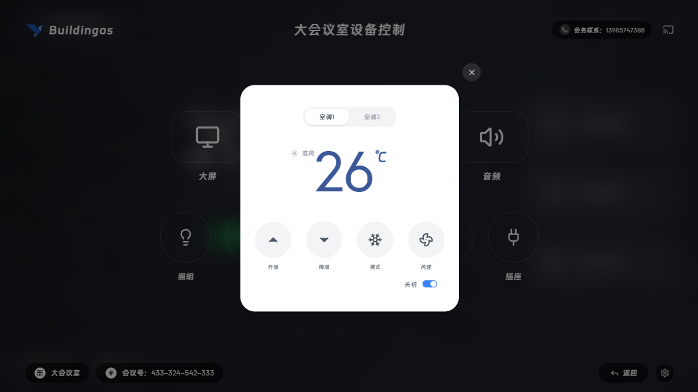
    *图 3-20 空调温控调节*

#### 3.4.9 新风系统控制
控制新风换气设备，改善室内空气质量。
*   **功能说明**：
    *   **开关控制**：开启或关闭新风机。
    *   **风量调节**：根据CO2浓度自动或手动调节换气量。
*   **界面展示**：
    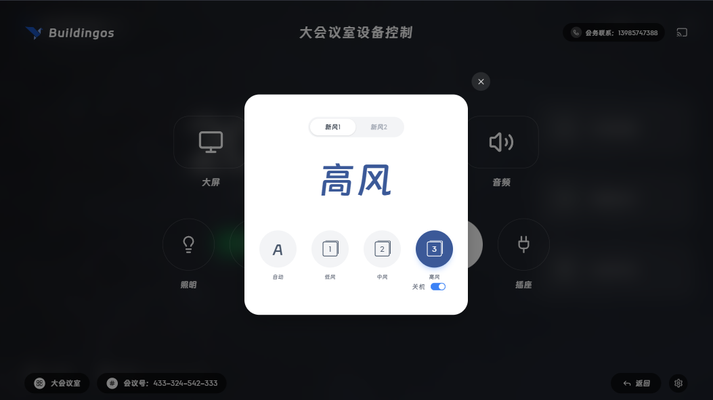
    *图 3-21 新风系统控制*

#### 3.4.10 智能插座管理
管理桌面插座或设备电源的通断。
*   **功能说明**：
    *   **电源开关**：远程切断非必要设备的电源，节能降耗。
    *   **定时任务**：设置插座的定时开启/关闭计划。
*   **界面展示**：
    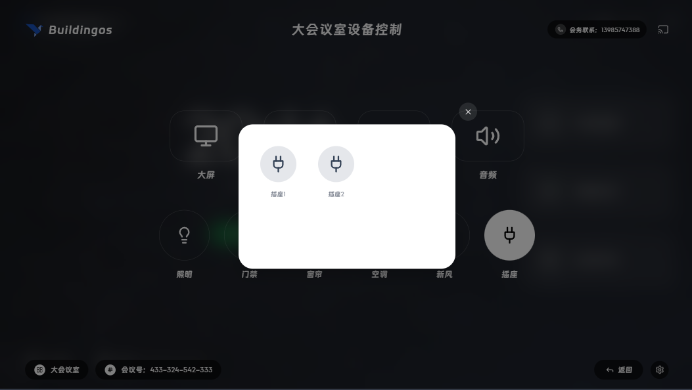
    *图 3-22 智能插座管理*
