# 操作说明书（智能屏系统 buildingos.pad）

## 目录

1. **引言**
    *   1.1 编写目的
    *   1.2 定义
2. **系统概述**
    *   2.1 系统用途
    *   2.2 软件功能概述
    *   2.3 软件运行环境
3. **系统操作使用**
    *   3.1 系统初始化与终端配置
        *   3.1.1 管理员密码验证
        *   3.1.2 终端类型与屏幕比例配置
    *   3.2 首页总览
        *   3.2.1 顶部信息栏与底部导航坞
        *   3.2.2 照明/气候/环境三栏快捷控制
    *   3.3 照明控制
        *   3.3.1 照明分区控制
        *   3.3.2 平面图点位控制
        *   3.3.3 一键全开/全关
    *   3.4 空调温控
        *   3.4.1 空调开关与模式切换
        *   3.4.2 风速与温度调节
    *   3.5 空间占用查看
        *   3.5.1 会议室占用状态
        *   3.5.2 卫生间占用状态
    *   3.6 能耗统计
        *   3.6.1 日/周/月用电量切换
        *   3.6.2 能耗趋势图表
    *   3.7 室内空气质量监测
        *   3.7.1 六项环境指标展示
        *   3.7.2 环境指标分级用色说明
    *   3.8 室外天气信息
        *   3.8.1 室外温湿度与体感温度
        *   3.8.2 天气趋势预测
    *   3.9 综合服务
        *   3.9.1 扫码服务入口
        *   3.9.2 服务卡片说明
    *   3.10 智能楼宇展示
        *   3.10.1 智能化等级展示
        *   3.10.2 楼宇层级说明
    *   3.11 数字孪生大屏
        *   3.11.1 4K大屏总览
        *   3.11.2 实时能耗与运行指标
    *   3.12 会议室设备控制
        *   3.12.1 大会议室设备控制
        *   3.12.2 会务联系
    *   3.13 视频会议
        *   3.13.1 会议号发起与共享码
        *   3.13.2 会议接入状态
    *   3.14 卫生间屏
        *   3.14.1 最近保洁时间
        *   3.14.2 厕位占用状态
    *   3.15 门牌屏
        *   3.15.1 门牌信息展示
    *   3.16 开关屏
        *   3.16.1 照明/空调开关控制

---

## 1. 引言

### 1.1 编写目的
本操作说明书旨在详细阐述《智能屏系统 buildingos.pad》的功能架构、操作流程及维护方法。文档面向楼宇物业管理人员、行政人员及系统维护人员，提供标准化的操作指引，帮助用户快速掌握智能屏终端从初始化配置、日常控制到信息展示的完整操作流程，确保楼宇内各类智能屏终端（墙装平板、电视大屏、门牌屏、卫生间屏）的规范化使用。

### 1.2 定义
*   **系统/本系统**：指《智能屏系统 buildingos.pad》。
*   **智能屏终端**：指部署在楼宇内的墙装平板、电视大屏、门牌屏、卫生间屏等具备触控或显示能力的设备。
*   **底部导航坞（Dock）**：指首页底部的导航栏，提供能耗、照明、空间、气候、服务等功能的快捷入口。
*   **MQTT**：一种轻量级消息传输协议，本系统用于设备状态订阅与控制指令下发。
*   **padType**：终端类型标识，用于区分墙装平板、开关屏、门牌屏、卫生间屏等不同终端模板。

---

## 2. 系统概述

### 2.1 系统用途
《智能屏系统 buildingos.pad》是专为现代化智慧楼宇设计的智能终端统一控制与展示平台。系统取代了传统各自为政的终端界面，通过一套基于Vue3的前端应用，按终端类型（墙装平板、电视大屏、门牌屏、卫生间屏、开关屏）加载对应模板，实现楼宇设备控制、环境监测、空间管理、能耗统计、综合服务等信息的一屏统管。系统与BuildingOS平台通过MQTT/HTTP深度联动，实现"终端统一、控制联动、数据实时"，在提升楼宇智能化体验的同时，降低多终端开发与维护成本。

### 2.2 软件功能概述
本系统主要包含以下核心功能模块：
1.  **终端自适应与模板化**：支持16:9、16:10、1:1多种屏幕比例，按padType加载墙装平板、开关屏、门牌屏、卫生间屏、数字孪生大屏等不同模板。
2.  **首页多模块总览**：首页以三栏布局（照明、气候、环境）展示核心信息，底部导航坞提供各功能模块快捷入口。
3.  **照明控制**：支持分区照明控制、平面图点位控制、一键全开/全关，通过MQTT实时下发指令。
4.  **空调温控**：支持空调开关、制冷/制热/通风模式切换、三档风速与温度调节。
5.  **空间占用查看**：以平面图和卡片形式展示会议室、卫生间等空间的占用状态。
6.  **能耗统计**：以ECharts图表展示日/周/月用电量趋势，辅助能耗管理。
7.  **环境监测**：展示室内温度、湿度、甲醛、CO₂、PM2.5、TVOC六项指标及室外天气信息。
8.  **综合服务与信息展示**：提供扫码服务、智能化等级展示、数字孪生大屏、视频会议联动等增值功能。

### 2.3 软件运行环境
*   **硬件环境**：
    *   **服务端**：推荐配置 8核 CPU，16GB 内存，512GB SSD 存储，部署Nginx与MQTT Broker。
    *   **终端**：墙装平板（1920×1200或1280×800触控屏）、电视大屏（1080P/4K）、门牌屏（7-10寸）。
    *   **网络**：千兆以太网，支持MQTT over WebSocket。
*   **软件环境**：
    *   **终端系统**：支持现代浏览器内核的平板/电视系统，或Android/Windows。
    *   **服务端系统**：Linux (Ubuntu 22.04)。
    *   **运行依赖**：Nginx、MQTT Broker（EMQX/Mosquitto）、Docker。

---

## 3. 系统操作使用

### 3.1 系统初始化与终端配置

#### 3.1.1 管理员密码验证
系统首次启动或进入管理配置界面时，需要输入管理员密码进行身份验证。
*   **功能说明**：
    *   **密码输入**：页面中央显示四位密码输入点，通过屏幕数字键盘输入。
    *   **错误提示**：密码错误时输入点变红并提示错误，可重新输入。
*   **操作步骤**：
    1.  在数字键盘上依次点击密码数字。
    2.  点击删除键（⌫）可清除最后一位输入。
    3.  输入正确密码后自动进入配置界面。
*   **界面展示**：
    
    *图 3-1 管理员密码验证界面*

#### 3.1.2 终端类型与屏幕比例配置
管理员可在此配置终端类型（墙装平板/开关屏/门牌屏/卫生间屏等）和屏幕比例，系统据此加载对应模板并完成分辨率适配。
*   **功能说明**：
    *   **终端类型选择**：配置padType标识，决定加载的页面模板。
    *   **屏幕比例配置**：支持16:9、16:10、1:1三种比例，系统按设计稿（1920×1200或1920×1080或640×640）等比缩放。
*   **操作步骤**：
    1.  选择终端类型。
    2.  选择屏幕比例。
    3.  保存配置后系统自动重启加载对应模板。
*   **界面展示**：
    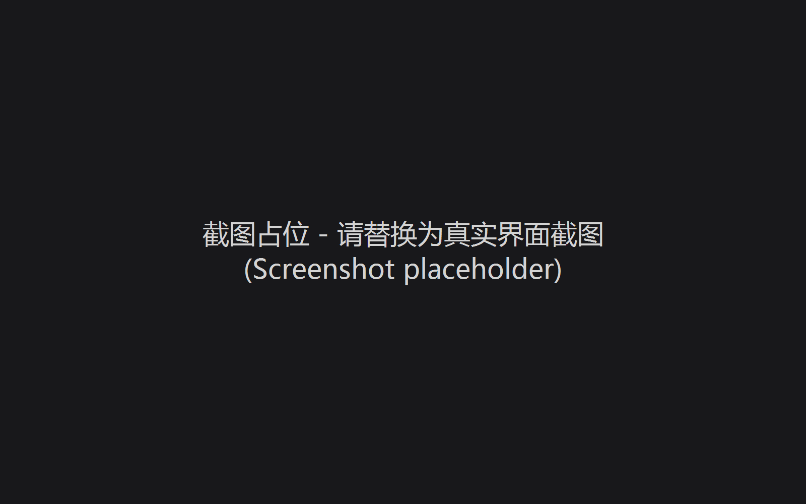
    *图 3-2 终端类型与屏幕比例配置*

### 3.2 首页总览

#### 3.2.1 顶部信息栏与底部导航坞
首页是系统的主界面，顶部展示Logo与当前时间，底部导航坞提供全部功能模块的快捷入口。
*   **功能说明**：
    *   **顶部信息栏**：左侧为系统Logo，右侧为实时时间组件。
    *   **底部导航坞**：半透明黑色背景，包含能耗统计（Charge）、照明（Light）、空间占用（Seat）、空气质量（AirQualityL/AirQualityR）、温控（Climate）、服务（Service）、应急呼叫（Emergency）、智能化介绍（SmartInfo）等入口。
*   **操作步骤**：
    1.  点击导航坞中的图标或文字，打开对应功能抽屉页面。
    2.  点击温控（Climate）图标打开空调控制界面。
    3.  点击应急呼叫（Emergency）触发SOS弹窗。
*   **界面展示**：
    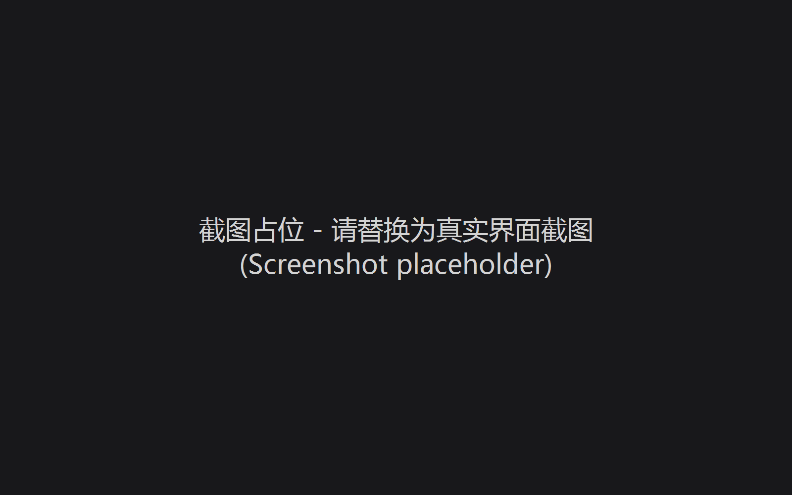
    *图 3-3 系统首页总览*

#### 3.2.2 照明/气候/环境三栏快捷控制
首页主体以三栏布局分别展示照明（Lighting）、气候（Climate）、环境（Environment）三个模块的实时状态卡片。
*   **功能说明**：
    *   **照明栏**：显示当前照明状态与亮度控制入口。
    *   **气候栏**：显示室内外温度及空调状态。
    *   **环境栏**：显示温湿度、空气质量等环境数据。
*   **界面展示**：
    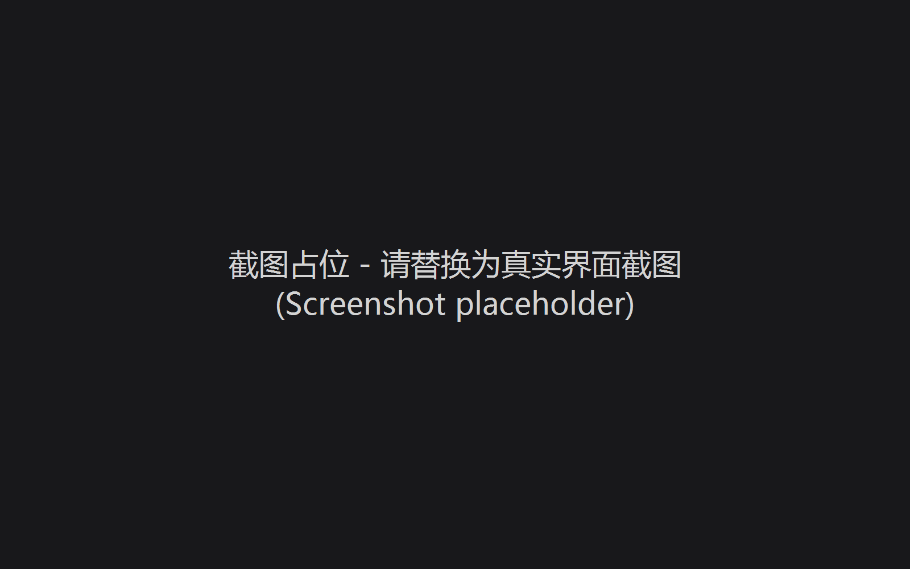
    *图 3-4 首页照明/气候/环境三栏展示*

### 3.3 照明控制

#### 3.3.1 照明分区控制
照明控制页面按区域展示照明设备，支持单个灯光的开关控制。
*   **功能说明**：
    *   **分区列表**：展示办公室灯光、会议室灯光等分区及当前开关状态。
    *   **单项控制**：点击照明图标切换该灯具开关状态。
    *   **操作确认**：切换时弹出确认对话框，避免误操作。
*   **操作步骤**：
    1.  打开照明控制抽屉。
    2.  点击目标灯具图标，弹出"打开/关闭 XX"确认框。
    3.  点击"确认"完成控制，系统通过MQTT下发指令。
*   **界面展示**：
    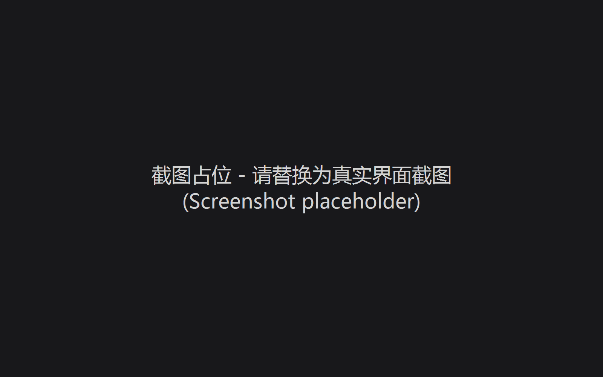
    *图 3-5 照明分区控制界面*

#### 3.3.2 平面图点位控制
照明控制页面同时提供楼层平面图，以点位标记展示各照明设备位置与状态。
*   **功能说明**：
    *   **平面图标记**：平面图上以发光点位标记"过道照明1""照明1""照明2"等设备。
    *   **状态显示**：激活点位显示为亮色，可点击点位进行开关控制。
*   **操作步骤**：
    1.  在平面图上定位目标照明点位。
    2.  点击点位，系统下发开关指令并更新点位状态。
*   **界面展示**：
    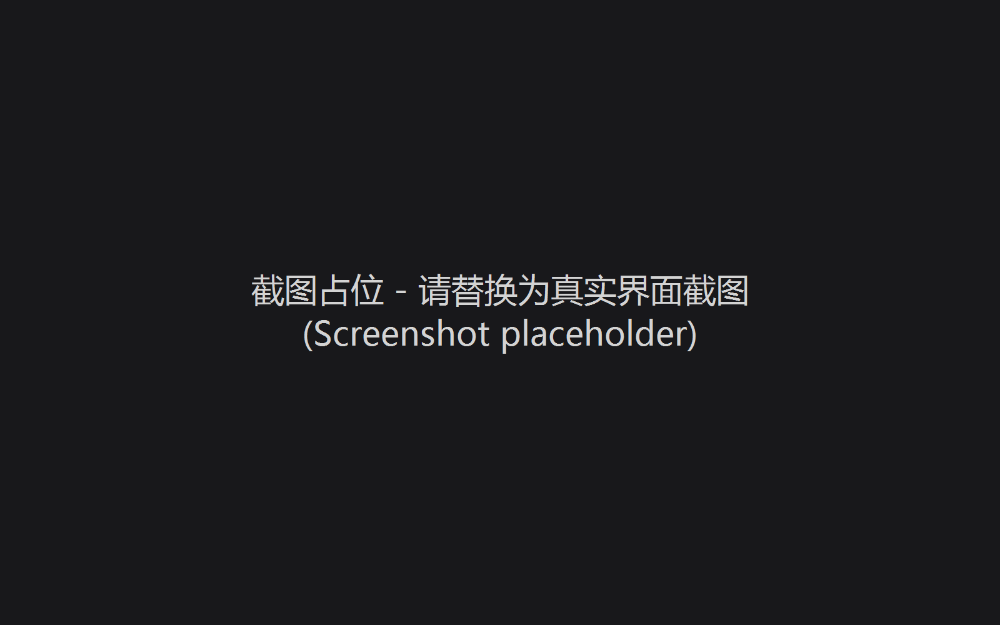
    *图 3-6 平面图照明点位控制*

#### 3.3.3 一键全开/全关
系统提供照明全部开启与全部关闭的快捷操作。
*   **功能说明**：
    *   **一键全开**：将当前区域所有照明设备全部开启。
    *   **一键全关**：将当前区域所有照明设备全部关闭。
*   **界面展示**：
    
    *图 3-7 照明一键全开/全关按钮*

### 3.4 空调温控

#### 3.4.1 空调开关与模式切换
温控界面提供空调电源开关及模式切换功能。
*   **功能说明**：
    *   **电源开关**：点击电源图标打开/关闭空调。
    *   **模式切换**：支持通风（vent）、制冷（cool）、制热（heat）三种模式。
*   **操作步骤**：
    1.  打开温控界面（点击首页导航坞Climate）。
    2.  点击电源按钮开启空调。
    3.  点击模式图标切换制冷/制热/通风模式。
*   **界面展示**：
    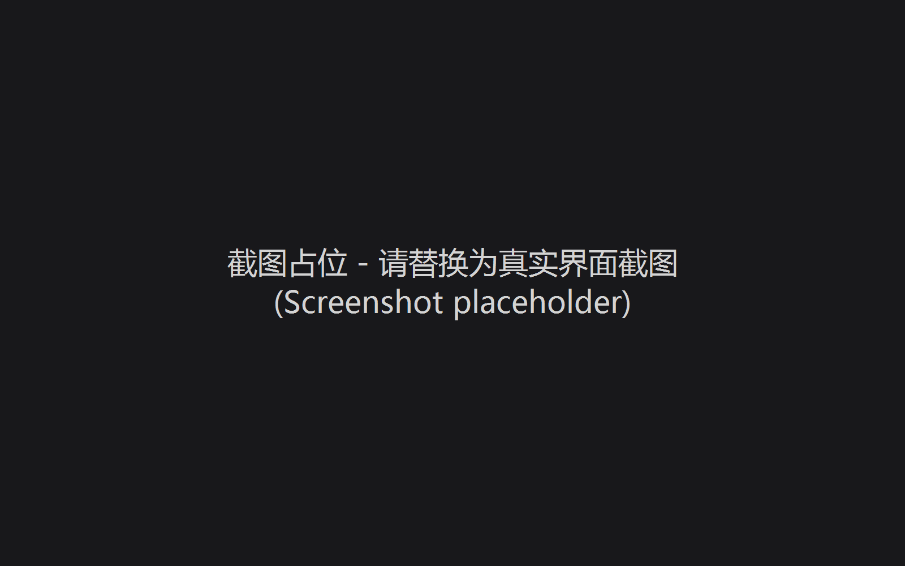
    *图 3-8 空调电源与模式控制*

#### 3.4.2 风速与温度调节
支持三档风速调节与设定温度调整。
*   **功能说明**：
    *   **风速调节**：低（low）、中（mid）、高（high）三档切换。
    *   **温度调节**：上下箭头调节设定温度。
*   **操作步骤**：
    1.  点击风速档位图标（低/中/高）调节风速。
    2.  点击温度上下箭头调整设定温度。
    3.  空调状态通过MQTT实时同步。
*   **界面展示**：
    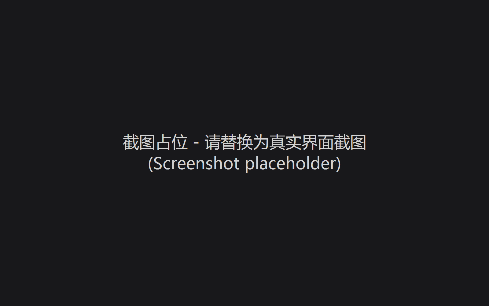
    *图 3-9 空调风速与温度调节*

### 3.5 空间占用查看

#### 3.5.1 会议室占用状态
空间页面以卡片网格展示各会议室的占用状态。
*   **功能说明**：
    *   **状态卡片**：每个会议室以卡片展示房间号与状态（空闲free/使用中busy）。
    *   **颜色标识**：空闲为半透明白色，使用中为红色高亮。
*   **界面展示**：
    
    *图 3-10 会议室占用状态列表*

#### 3.5.2 卫生间占用状态
平面图上以区域色块展示卫生间、会议室的占用情况。
*   **功能说明**：
    *   **区域标记**：女卫、男卫、会议室等空间以不同颜色区域标记。
    *   **状态标识**：红色表示全满/使用中，蓝色表示部分可用/空闲。
*   **界面展示**：
    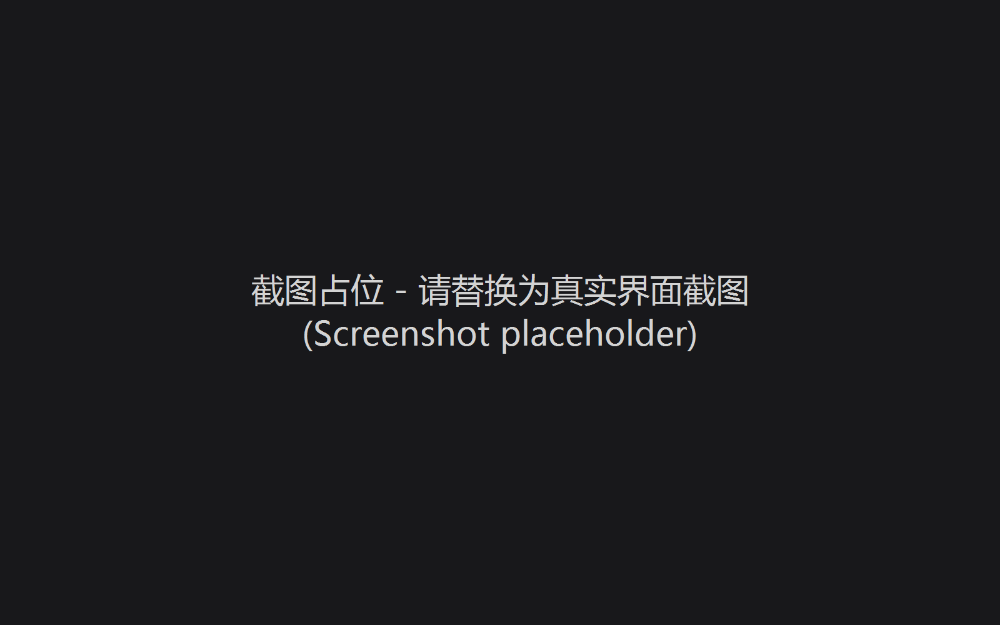
    *图 3-11 空间平面图占用状态*

### 3.6 能耗统计

#### 3.6.1 日/周/月用电量切换
能耗页面支持按日、周、月三个时间粒度查看用电量。
*   **功能说明**：
    *   **粒度切换**：顶部选项卡切换"日""周""月"。
    *   **图表联动**：切换粒度后图表同步更新。
*   **操作步骤**：
    1.  打开能耗统计页面。
    2.  点击"日/周/月"选项卡切换时间粒度。
*   **界面展示**：
    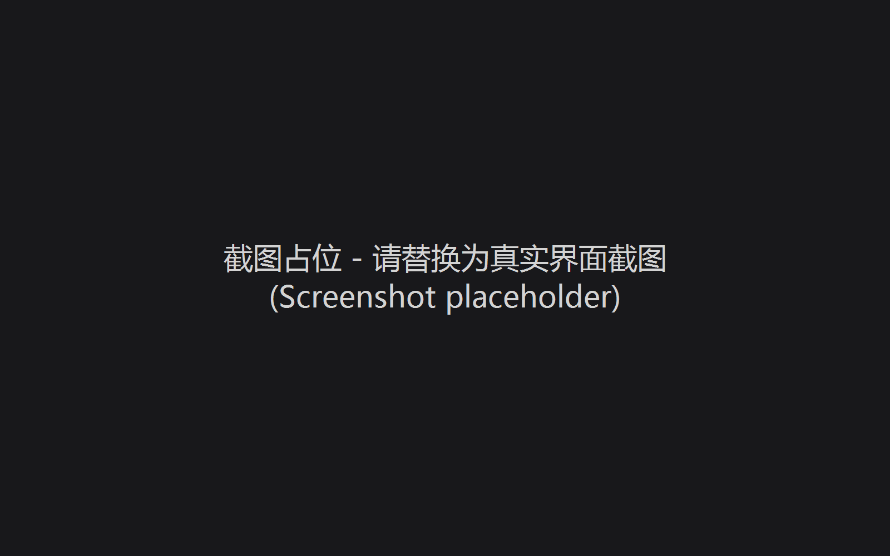
    *图 3-12 能耗统计日/周/月切换*

#### 3.6.2 能耗趋势图表
以ECharts折线图展示24小时用电量变化趋势。
*   **功能说明**：
    *   **趋势曲线**：X轴为0-23时，Y轴为用电量（kwh）。
    *   **悬浮提示**：鼠标悬浮显示该时段精确用电量。
*   **界面展示**：
    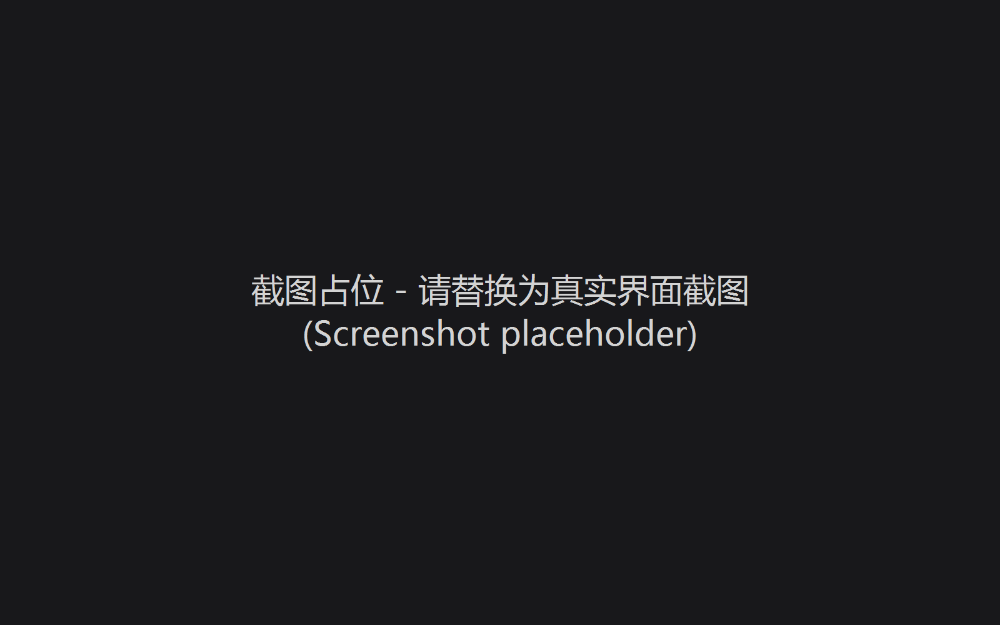
    *图 3-13 能耗趋势折线图*

### 3.7 室内空气质量监测

#### 3.7.1 六项环境指标展示
室内空气质量页面以指标卡片展示温度、湿度、甲醛、CO₂、PM2.5、TVOC六项数据。
*   **功能说明**：
    *   **指标卡片**：每项指标展示当前数值、单位及舒适度等级（舒适/安全/清新/优/正常）。
    *   **进度条**：以渐变进度条可视化指标水平。
*   **界面展示**：
    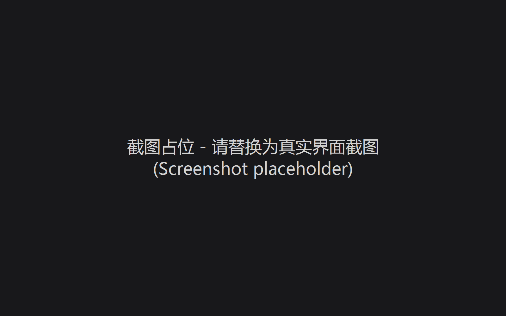
    *图 3-14 室内六项环境指标*

#### 3.7.2 环境指标分级用色说明
页面底部以图例形式说明各项指标的分级用色规则。
*   **功能说明**：
    *   **分级色标**：按温度、湿度等指标分别展示优/良/差等级对应的颜色。
*   **界面展示**：
    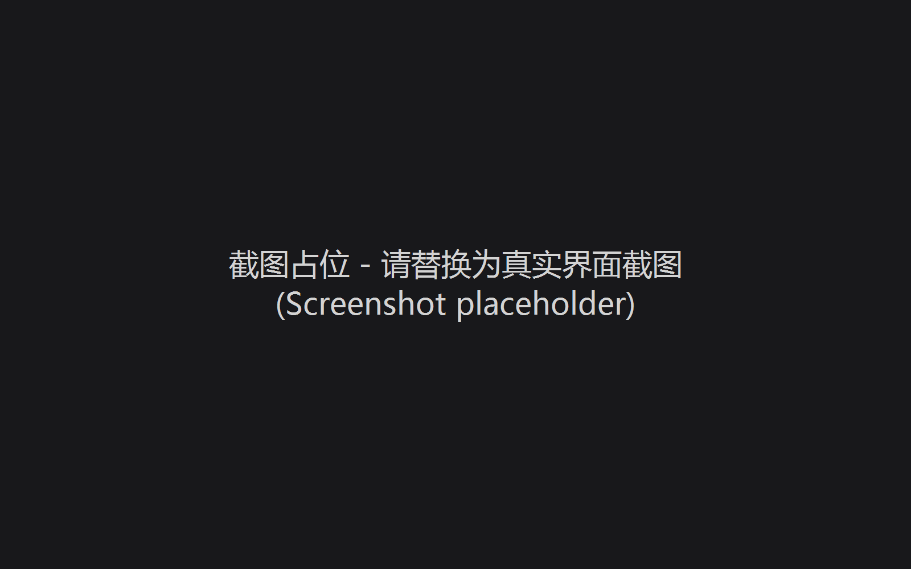
    *图 3-15 环境指标分级用色说明*

### 3.8 室外天气信息

#### 3.8.1 室外温湿度与体感温度
室外空气质量页面展示室外温度、体感温度、湿度等实时天气数据。
*   **功能说明**：
    *   **温度卡片**：展示当前室外温度与趋势。
    *   **体感温度**：根据湿度等因素计算体感温度。
*   **界面展示**：
    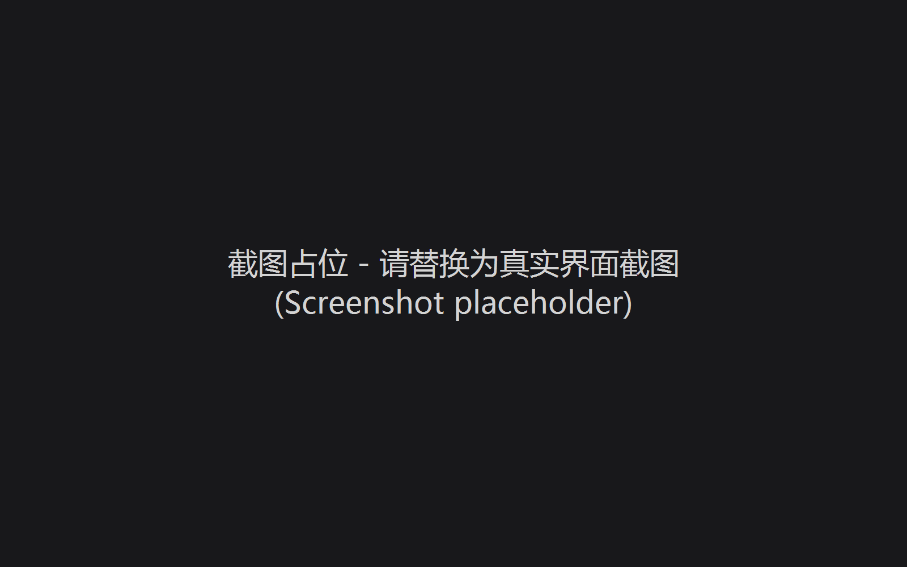
    *图 3-16 室外天气与体感温度*

#### 3.8.2 天气趋势预测
展示未来一段时间的最低气温预测与趋势描述。
*   **功能说明**：
    *   **趋势描述**：如"持续降温，将于下午11:00达到最低气温9°"。
*   **界面展示**：
    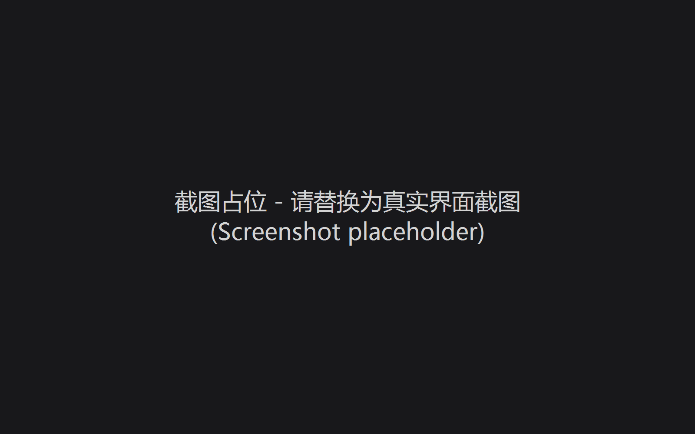
    *图 3-17 天气趋势预测说明*

### 3.9 综合服务

#### 3.9.1 扫码服务入口
综合服务页面提供二维码扫码入口，访客或员工可通过企业微信扫码获取服务。
*   **功能说明**：
    *   **二维码展示**：每张服务卡片显示独立的二维码。
    *   **提示文案**："请使用企业微信扫描二维码"。
*   **操作步骤**：
    1.  打开综合服务页面。
    2.  使用企业微信扫描服务卡片上的二维码。
*   **界面展示**：
    
    *图 3-18 综合服务扫码入口*

#### 3.9.2 服务卡片说明
页面展示多项服务卡片，每张卡片包含标题、副标题与说明文字。
*   **界面展示**：
    
    *图 3-19 综合服务卡片列表*

### 3.10 智能楼宇展示

#### 3.10.1 智能化等级展示
智能化介绍页面以分级路线图展示楼宇的智能化等级（Lv.1-Lv.5）。
*   **功能说明**：
    *   **当前等级**：橙色高亮显示当前智能化等级（如Lv.5 自我学习控制）。
    *   **历史等级**：灰色显示已完成的历史等级。
*   **界面展示**：
    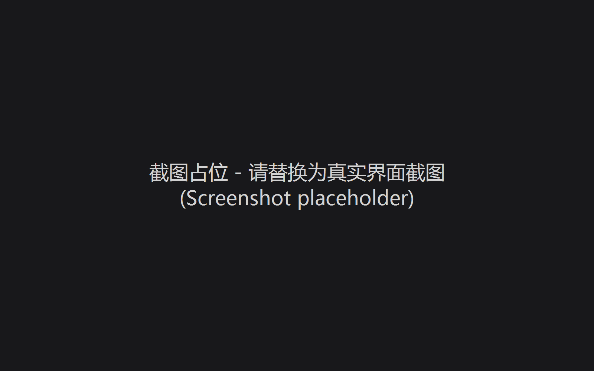
    *图 3-20 智能化等级路线图*

#### 3.10.2 楼宇层级说明
页面中部展示楼宇模型及各级别说明文字。
*   **界面展示**：
    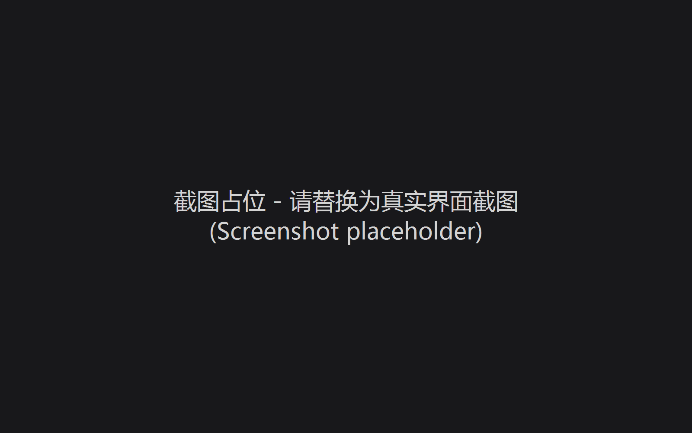
    *图 3-21 楼宇层级与能力说明*

### 3.11 数字孪生大屏

#### 3.11.1 4K大屏总览
数字孪生大屏以3840×2160分辨率展示楼宇智慧运营中心，顶部为标题、菜单与时间天气。
*   **功能说明**：
    *   **顶部菜单**：提供各专题页面切换。
    *   **3D场景**：中部为楼宇3D场景渲染。
*   **界面展示**：
    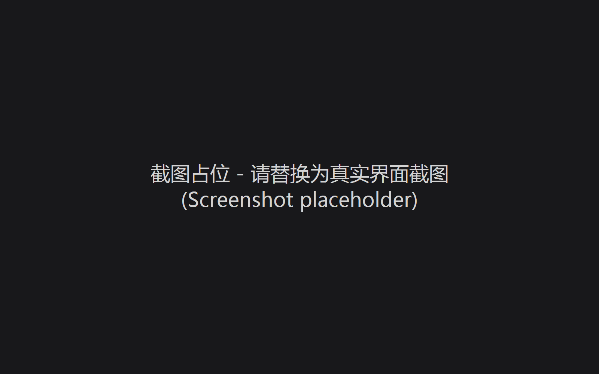
    *图 3-22 数字孪生大屏总览*

#### 3.11.2 实时能耗与运行指标
大屏左侧展示实时能耗等运行指标卡片。
*   **界面展示**：
    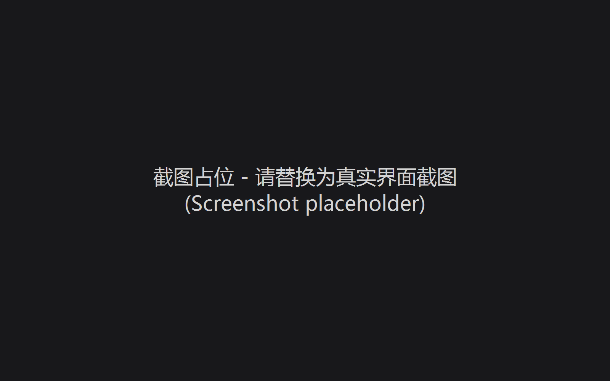
    *图 3-23 数字孪生大屏能耗指标*

### 3.12 会议室设备控制

#### 3.12.1 大会议室设备控制
会议室设备控制页面提供大会议室内照明、空调、窗帘、投影等设备的集中控制。
*   **功能说明**：
    *   **设备分组**：按设备类型分组展示控制项。
    *   **联动控制**：支持一键场景联动（如会议模式）。
*   **操作步骤**：
    1.  打开会议室设备控制页面。
    2.  点击设备控制项进行开关或调节。
*   **界面展示**：
    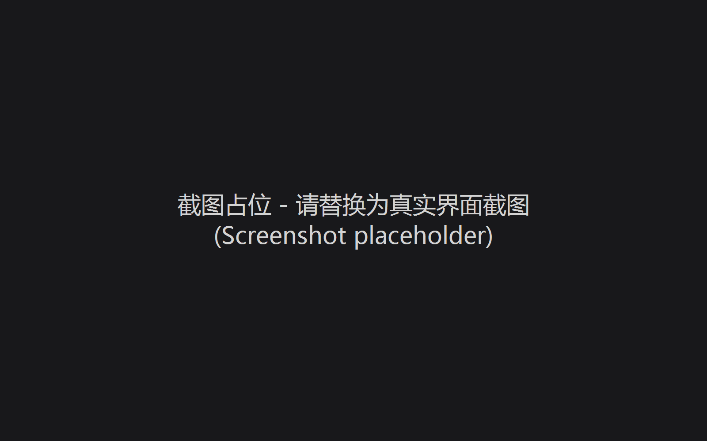
    *图 3-24 大会议室设备控制界面*

#### 3.12.2 会务联系
页面右上角展示会务联系电话，便于现场联系会务人员。
*   **界面展示**：
    
    *图 3-25 会务联系信息*

### 3.13 视频会议

#### 3.13.1 会议号发起与共享码
视频会议页面支持发起会议并显示会议号与共享码。
*   **功能说明**：
    *   **会议号**：大号数字显示当前会议号。
    *   **共享码**：显示会议共享码（如XUDH-DJKD），供参会人员加入。
*   **操作步骤**：
    1.  打开视频会议页面。
    2.  发起会议后记录会议号与共享码。
    3.  与会人员凭会议号/共享码加入。
*   **界面展示**：
    
    *图 3-26 视频会议号与共享码*

#### 3.13.2 会议接入状态
会议接通后页面展示连接状态与会话控制。
*   **界面展示**：
    
    *图 3-27 视频会议接入状态*

### 3.14 卫生间屏

#### 3.14.1 最近保洁时间
卫生间屏左侧展示最近保洁时间信息。
*   **功能说明**：
    *   **保洁记录**：展示最近一次保洁时间。
*   **界面展示**：
    
    *图 3-28 卫生间屏最近保洁时间*

#### 3.14.2 厕位占用状态
卫生间屏中部展示各厕位的占用状态。
*   **界面展示**：
    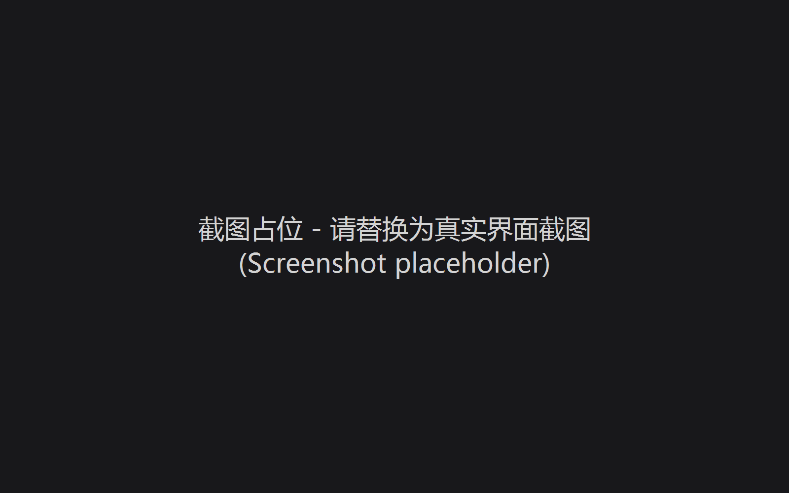
    *图 3-29 卫生间厕位占用状态*

### 3.15 门牌屏

#### 3.15.1 门牌信息展示
门牌屏用于会议室/办公室门口，展示房间信息、占用状态及预约信息。
*   **功能说明**：
    *   **房间信息**：展示房间名称与当前状态。
*   **界面展示**：
    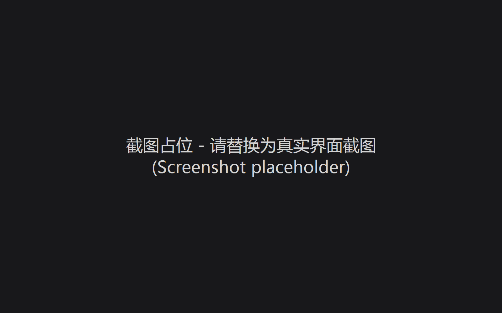
    *图 3-30 门牌屏信息展示*

### 3.16 开关屏

#### 3.16.1 照明/空调开关控制
开关屏提供极简的照明与空调开关控制界面。
*   **功能说明**：
    *   **照明开关**：大图标开关照明。
    *   **空调开关**：大图标开关空调。
*   **操作步骤**：
    1.  打开开关屏主界面。
    2.  点击照明或空调图标切换开关状态。
*   **界面展示**：
    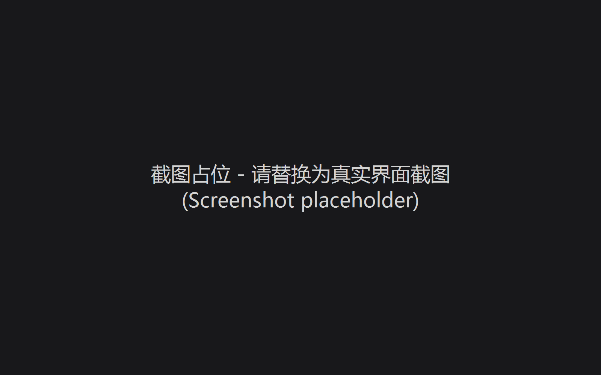
    *图 3-31 开关屏照明/空调控制*
