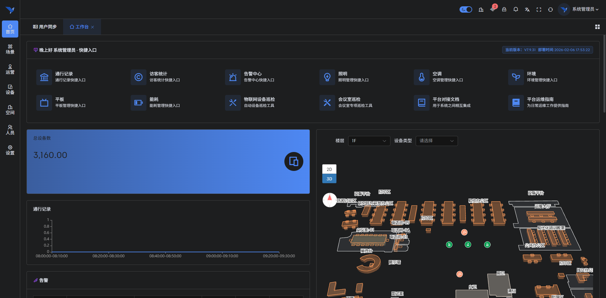
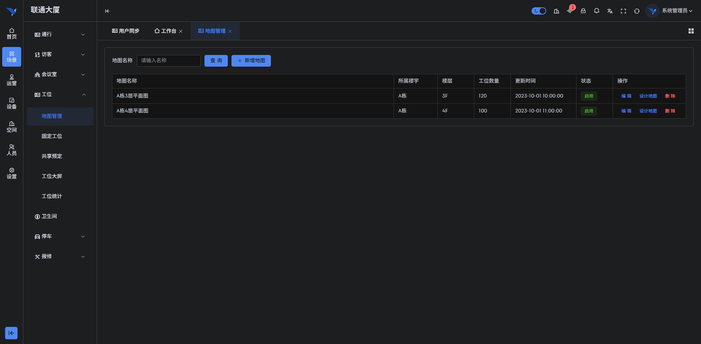
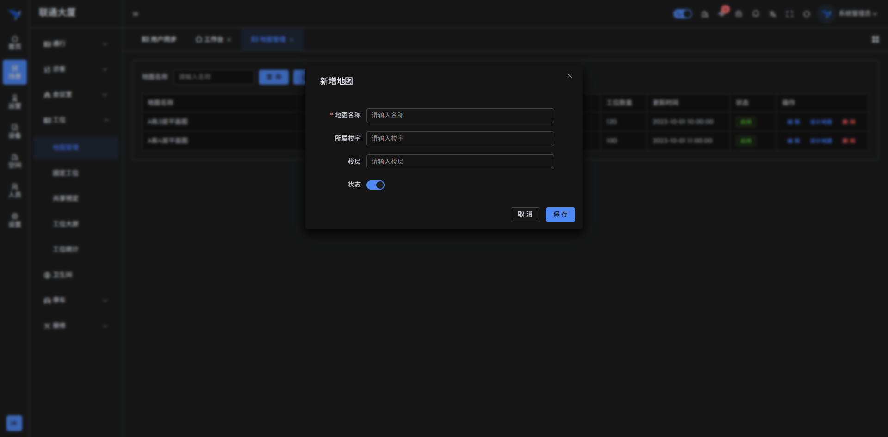
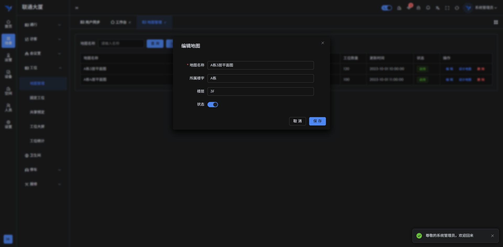
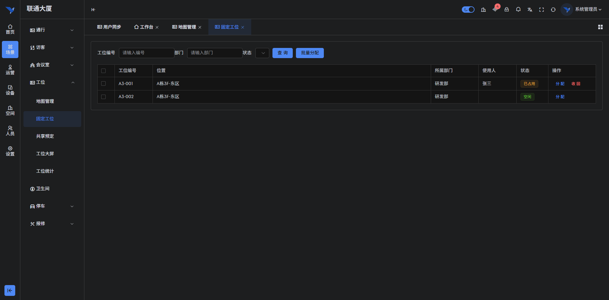
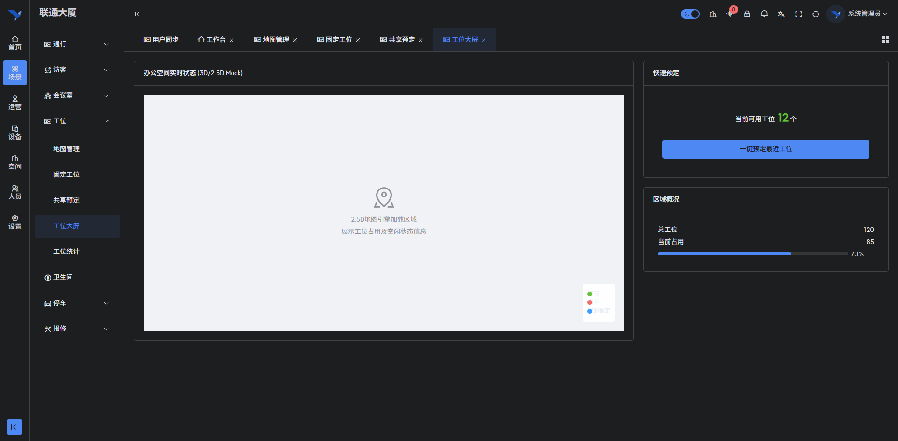
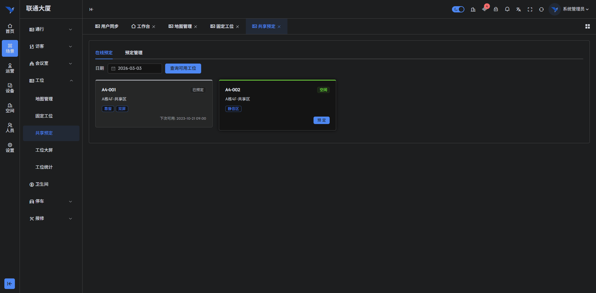
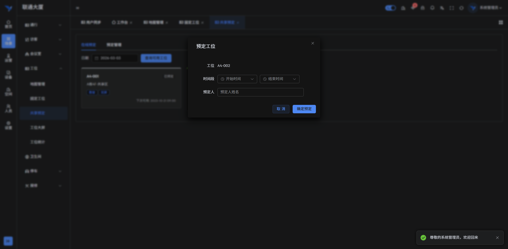
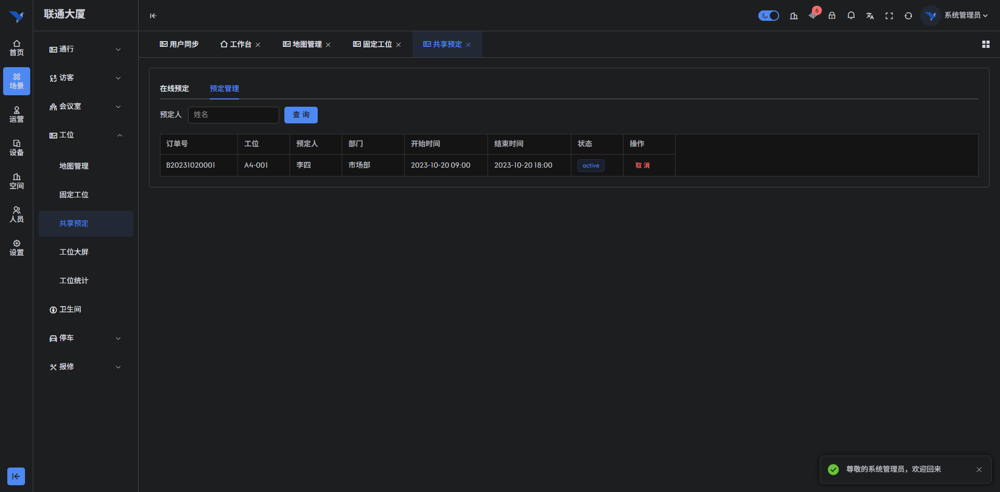
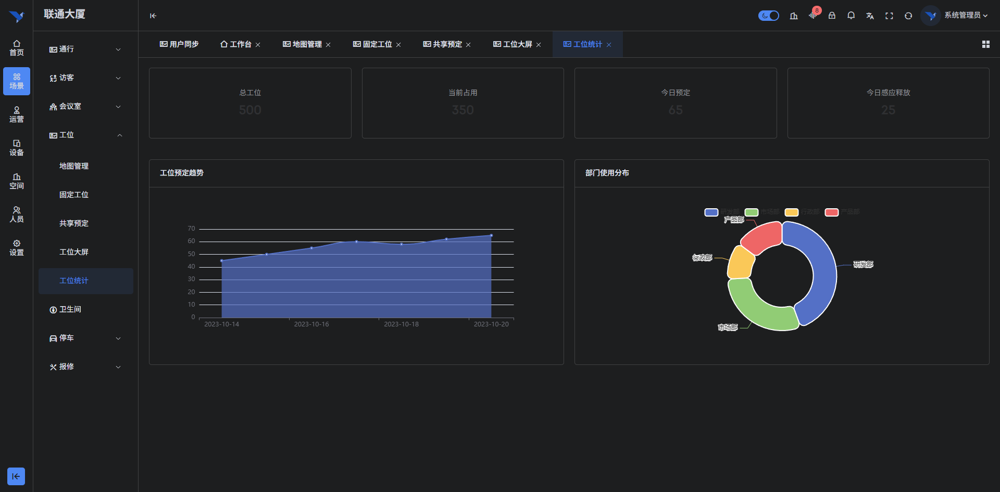

# 操作说明书（智能楼宇空间预约系统 buildingos.reservation）

## 目录

1. **引言**
    *   1.1 编写目的
    *   1.2 定义
2. **系统概述**
    *   2.1 系统用途
    *   2.2 软件功能概述
    *   2.3 软件运行环境
3. **系统操作使用**
    *   3.1 登录与首页
        *   3.1.1 系统登录
        *   3.1.2 系统首页概览
    *   3.2 空间资源数字化管理
        *   3.2.1 地图列表管理
        *   3.2.2 新增楼层地图
        *   3.2.3 可视化地图编辑器
    *   3.3 工位资源分配与管理
        *   3.3.1 固定工位分配
        *   3.3.2 工位使用状态监控
    *   3.4 共享空间在线预约
        *   3.4.1 共享工位视图
        *   3.4.2 发起在线预定
        *   3.4.3 预定记录管理
    *   3.5 数据可视化与统计
        *   3.5.1 工位数据大屏
        *   3.5.2 资源利用率统计

---

## 1. 引言

### 1.1 编写目的
本操作说明书旨在详细阐述《智能楼宇空间预约系统 buildingos.reservation》的功能架构、操作流程及维护方法。文档面向系统的最终用户（包括企业员工、行政管理人员、系统管理员），提供标准化的操作指引，帮助用户快速掌握从空间资源数字化建模、可视化分配到在线预约、冲突检测及数据统计的全流程操作，确保楼宇空间资源的高效利用与规范管理。

### 1.2 定义
*   **系统/本系统**：指《智能楼宇空间预约系统 buildingos.reservation》。
*   **空间资源**：指楼宇内可供分配或预约使用的物理实体，包括工位（固定/共享）、会议室、洽谈间等。
*   **热力图**：通过颜色深浅直观展示空间资源使用频率或占用状态的可视化图表。
*   **冲突检测**：指系统在用户发起预约时，自动校验时间段、空间位置是否已被占用的算法逻辑。

---

## 2. 系统概述

### 2.1 系统用途
《智能楼宇空间预约系统 buildingos.reservation》是专为混合办公（Hybrid Work）模式下的智慧楼宇和园区打造的空间资源管理平台。系统通过数字化建模技术，将物理空间映射为可视化的数字地图，支持固定工位的行政分配与共享工位的自助预约。系统与门禁、电子墨水屏、人体传感器深度联动，实现“人走释位”的动态管理，大幅提升空间坪效和员工办公体验。

### 2.2 软件功能概述
本系统主要包含以下核心功能模块：
1.  **空间数字化建模**：支持导入CAD/图片底图，通过拖拽式编辑器快速构建楼层平面图和工位布局。
2.  **多模式资源管理**：支持固定工位（专属）、共享工位（预约）、部门专属区等多种管理模式。
3.  **可视化在线预约**：提供PC端/移动端的可视化选座功能，支持按时间段、按设备条件筛选。
4.  **智能冲突处理**：内置冲突检测算法，自动规避重复预定，支持审批流配置。
5.  **硬件联动控制**：联动电子工位牌显示预约信息，联动智能插座实现入座通电。
6.  **多维数据分析**：提供资源利用率、部门活跃度、时段热力分布等数据报表，辅助行政决策。

### 2.3 软件运行环境
*   **硬件环境**：
    *   **服务端**：推荐配置 8核 CPU，16GB 内存，512GB SSD 存储。
    *   **客户端**：支持 Windows/macOS 操作系统的 PC 机，建议屏幕分辨率 1920x1080 以上。
    *   **外设支持**：兼容主流电子墨水屏、人体红外传感器、智能门锁及二维码扫描设备。
*   **软件环境**：
    *   **浏览器**：建议使用 Google Chrome 80+、Microsoft Edge 或 Firefox 等现代浏览器。
    *   **服务端系统**：Linux (Ubuntu 20.04+/CentOS 7+) 或 Windows Server 2019。

---

## 3. 系统操作使用

### 3.1 登录与首页

#### 3.1.1 系统登录
系统采用B/S架构，用户通过浏览器访问指定网址即可进入登录界面。界面背景采用科技蓝调，突显智慧楼宇的现代感。
*   **操作步骤**：
    1.  输入系统URL地址，回车加载登录页。
    2.  在登录框中输入分配的用户名（Username）和密码（Password）。
    3.  （可选）勾选“记住密码”以便下次快速登录。
    4.  点击“登录”按钮，系统进行身份验证，验证通过后跳转至首页。
*   **界面展示**：
    
    *图 3-1 系统登录界面*

#### 3.1.2 系统首页概览
登录成功后进入系统首页（Dashboard）。首页作为工作台，聚合了空间管理的核心数据和快捷入口，帮助行政人员一目了然地掌握今日资源使用情况。
*   **功能说明**：
    *   **数据看板**：顶部卡片显示“总工位数”、“已分配工位”、“今日预约数”、“空闲率”等关键指标。
    *   **快捷导航**：左侧菜单栏提供“工位管理”、“会议室预约”、“空间统计”等功能模块的快速切换。
    *   **待办提醒**：展示当前待审批的空间申请，支持点击直接处理。
*   **界面展示**：
    
    *图 3-2 系统首页概览*

### 3.2 空间资源数字化管理

#### 3.2.1 地图列表管理
该模块是空间数字化的基础，集中管理所有楼层或区域的平面地图，支持按楼栋、楼层进行层级化管理。
*   **功能说明**：
    *   **层级展示**：左侧树状结构展示“区域-楼栋-楼层”的层级关系，点击节点可筛选对应地图。
    *   **列表信息**：列表详细展示了地图名称、所属区域、工位总数、状态（启用/禁用）及最后更新时间。
    *   **操作入口**：每条记录右侧提供“编辑”、“删除”、“发布”等操作按钮。
*   **界面展示**：
    
    *图 3-3 楼层地图管理列表*

#### 3.2.2 新增楼层地图
管理员可通过此功能创建新的楼层地图，支持上传高清底图并设置基础参数。
*   **功能说明**：
    *   **基本信息录入**：填写地图名称（如“A座3F研发中心”）、关联的物理楼层。
    *   **底图上传**：支持上传JPG/PNG格式的楼层平面图，建议分辨率大于2000px以保证缩放清晰度。
    *   **比例尺设置**：设置像素与实际距离的比例，确保后续面积计算和路径规划的准确性。
*   **界面展示**：
    
    *图 3-4 新增楼层地图配置*

#### 3.2.3 可视化地图编辑器
系统提供强大的在线地图编辑器，管理员可在此进行工位、会议室等资源点的标注和属性配置。
*   **功能说明**：
    *   **拖拽式布局**：工具栏提供标准工位、L型工位、会议桌等组件，支持拖拽至底图并自由旋转缩放。
    *   **批量生成**：支持框选区域批量生成矩阵工位，快速完成大型办公区的建模。
    *   **属性绑定**：选中任意工位，可配置其编号、所属部门、是否共享、配套设施（显示器/电源）等属性。
    *   **分区管理**：支持绘制多边形区域，划分“静音区”、“协作区”等功能分区。
*   **界面展示**：
    
    *图 3-5 可视化地图编辑器*

### 3.3 工位资源分配与管理

#### 3.3.1 固定工位分配
针对企业内部的固定员工，管理员可在此页面进行“人-位”绑定操作，实现行政分配。
*   **功能说明**：
    *   **可视化分配**：在地图上直接点击空闲工位，弹出人员选择框进行绑定。
    *   **列表管理**：以列表形式展示所有固定工位的分配情况，支持按部门筛选。
    *   **批量导入**：支持Excel模板批量导入分配关系，快速完成组织架构调整后的工位重组。
*   **界面展示**：
    
    *图 3-6 固定工位分配管理*

#### 3.3.2 工位使用状态监控（工位大屏）
提供全屏展示的工位状态视图，通常投放在办公区入口大屏，方便员工快速寻找空闲资源。
*   **功能说明**：
    *   **状态色块**：通过不同颜色直观区分工位状态（绿色-空闲、红色-占用、黄色-保留、灰色-维修）。
    *   **实时刷新**：数据与后端实时同步，秒级响应预约和释放操作。
    *   **人员索引**：支持搜索员工姓名，地图自动定位并高亮其所在工位。
*   **界面展示**：
    
    *图 3-7 工位状态监控大屏*

### 3.4 共享空间在线预约

#### 3.4.1 共享工位视图
员工通过PC端或移动端进入共享工位预定页面，查看可预约的资源分布。
*   **功能说明**：
    *   **时段筛选**：顶部时间轴支持选择预定日期（支持未来7天）和具体时段（全天/上午/下午）。
    *   **地图交互**：支持缩放和平移地图，点击工位图标可查看详细设施信息（如“双屏显示器”、“靠窗”）。
    *   **列表模式**：支持切换至列表视图，按距离远近或设施条件进行快速筛选。
*   **界面展示**：
    
    *图 3-8 共享工位预约视图*

#### 3.4.2 发起在线预定
选中目标工位后，进入预定确认流程，系统自动进行规则校验。
*   **功能说明**：
    *   **预定确认**：显示选定工位的编号、位置及预约时段，系统自动计算费用（如有）。
    *   **冲突检测**：系统实时检测该时段是否已被他人锁定，防止撞单。
    *   **规则校验**：校验用户是否有权限预约该区域（如某区域仅限研发部使用）以及信用分是否达标。
    *   **提交申请**：点击提交后，系统生成预约单，并发送通知至用户终端。
*   **界面展示**：
    
    *图 3-9 发起工位预定确认*

#### 3.4.3 预定记录管理
用户和管理员均可查看所有的历史预约记录，进行状态追踪和异常处理。
*   **功能说明**：
    *   **状态追踪**：查看预约单的流转状态（已预约、使用中、已完成、已取消、已违约）。
    *   **签到/签退**：支持模拟人工签到操作（管理员权限），处理员工忘记打卡的情况。
    *   **违约记录**：系统自动标记“逾期未签到”的记录为违约，并扣除相应信用分。
*   **界面展示**：
    
    *图 3-10 预定记录与违约管理*

### 3.5 数据可视化与统计

#### 3.5.1 资源利用率统计
提供多维度的数据报表，帮助管理层评估空间资源的投入产出比。
*   **功能说明**：
    *   **利用率趋势**：折线图展示日/周/月的工位平均利用率和峰值利用率。
    *   **部门活跃度**：柱状图对比各部门的工位使用时长和人均预约次数。
    *   **空间热力图**：通过热力分布图识别办公区的“冷热区域”，为空间布局优化提供数据支撑。
*   **界面展示**：
    
    *图 3-11 资源利用率统计报表*
