# 操作说明书（智能楼宇智能卫生间系统 buildingos.toilet）

## 目录

1. **引言**
    *   1.1 编写目的
    *   1.2 定义
2. **系统概述**
    *   2.1 系统用途
    *   2.2 软件功能概述
    *   2.3 软件运行环境
3. **系统操作使用**
    *   3.1 登录与首页
        *   3.1.1 系统登录
        *   3.1.2 系统首页概览
    *   3.2 卫生间综合态势感知
        *   3.2.1 卫生间综合看板
        *   3.2.2 卫生间空间列表管理
        *   3.2.3 厕位占用状态监控
    *   3.3 卫生间空间数据维护
        *   3.3.1 空间信息打标
        *   3.3.2 新建卫生间
        *   3.3.3 编辑卫生间信息
    *   3.4 智能设备管理
        *   3.4.1 传感器设备列表
        *   3.4.2 设备详情与运维
    *   3.5 引导终端（PAD/大屏）操作
        *   3.5.1 引导屏首页展示
        *   3.5.2 终端初始化设置
        *   3.5.3 空间映射配置
        *   3.5.4 管理员模式与权限

---

## 1. 引言

### 1.1 编写目的
本操作说明书旨在详细阐述《智能楼宇智能卫生间系统 buildingos.toilet》的功能架构、操作流程及维护方法。文档面向系统的最终用户（包括企业行政管理人员、清洁运维人员、系统管理员），提供标准化的操作指引，帮助用户快速掌握从空间建模、设备绑定、状态监控到异常处理的全流程操作，实现公共卫生间的智慧化、精细化管理。

### 1.2 定义
*   **系统/本系统**：指《智能楼宇智能卫生间系统 buildingos.toilet》。
*   **引导终端**：指安装在卫生间门口的信息显示屏（通常为壁挂PAD或LED大屏），用于展示厕位占用、环境指标等信息。
*   **厕位感知**：通过门磁、红外或微波传感器实时检测隔间内是否有人。
*   **环境监测**：实时采集卫生间内的氨气（NH3）、硫化氢（H2S）、温湿度及PM2.5等空气质量数据。

---

## 2. 系统概述

### 2.1 系统用途
《智能楼宇智能卫生间系统 buildingos.toilet》是专为智慧楼宇、机场、商场等高人流场景设计的公共设施管理平台。系统通过物联网技术实时感知卫生间的占用状态、环境质量（异味/温湿度）及耗材余量，通过引导屏引导用户分流，提升如厕体验；同时为保洁人员提供基于数据的清洁工单，实现降本增效。

### 2.2 软件功能概述
本系统主要包含以下核心功能模块：
1.  **全域态势感知**：实时监测全楼宇卫生间的占用率、客流量及环境指标，提供可视化看板。
2.  **空间数字化管理**：支持卫生间、厕位、洗手台等空间单元的数字化建模与属性配置。
3.  **设备全生命周期管理**：集中管理门磁、气体传感器、客流计数器等IoT设备，监控在线状态与电量。
4.  **智能引导系统**：支持门口引导屏和手机端小程序，实时展示空闲厕位分布，减少排队等待。
5.  **异常告警联动**：对长时间占用（跌倒风险）、吸烟、异味超标等异常情况自动告警并派发工单。

### 2.3 软件运行环境
*   **硬件环境**：
    *   **服务端**：推荐配置 4核 CPU，8GB 内存，256GB SSD 存储。
    *   **客户端**：支持 Windows/macOS 操作系统的 PC 机。
    *   **感知层**：兼容主流的LoRa/Zigbee/NB-IoT/Wi-Fi协议传感器。
*   **软件环境**：
    *   **浏览器**：建议使用 Google Chrome 80+、Microsoft Edge 或 Firefox 等现代浏览器。
    *   **服务端系统**：Linux (Ubuntu 20.04+/CentOS 7+) 或 Windows Server 2019。

---

## 3. 系统操作使用

### 3.1 登录与首页

#### 3.1.1 系统登录
系统采用B/S架构，用户通过浏览器访问指定网址即可进入登录界面。界面设计简洁，背景融入智慧建筑元素。
*   **操作步骤**：
    1.  输入系统URL地址，回车加载登录页。
    2.  在登录框中输入分配的用户名（Username）和密码（Password）。
    3.  点击“登录”按钮，系统进行身份验证，验证通过后跳转至首页。
*   **界面展示**：
    
    *图 3-1 系统登录界面*

#### 3.1.2 系统首页概览
登录成功后进入系统首页（Dashboard）。首页作为工作台，聚合了卫生间管理的核心数据和快捷入口。
*   **功能说明**：
    *   **数据概览**：顶部卡片显示“卫生间总数”、“今日客流量”、“当前占用率”、“设备在线率”等关键指标。
    *   **快捷导航**：左侧菜单栏提供“空间管理”、“设备管理”、“告警中心”、“统计报表”等功能模块的快速切换。
    *   **告警动态**：右侧滚动展示最新的环境超标或设备离线告警，点击可跳转处理。
*   **界面展示**：
    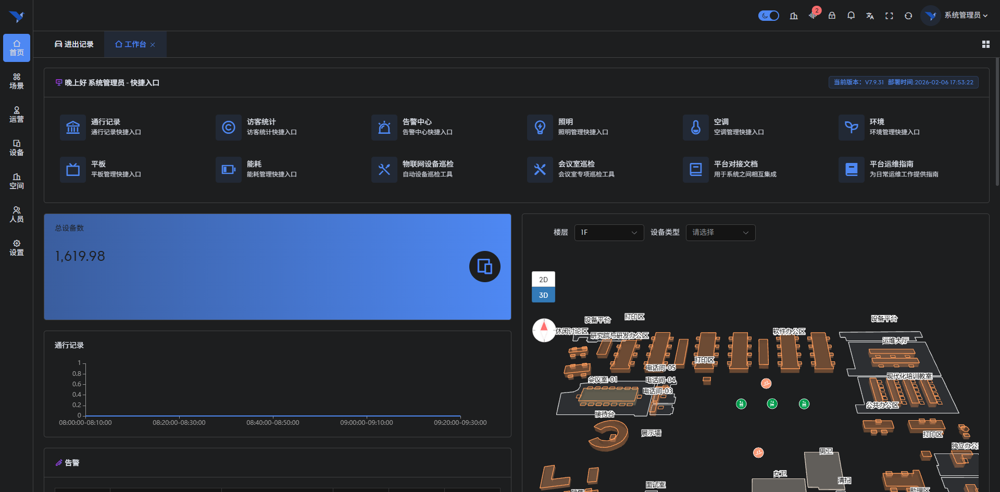
    *图 3-2 系统首页概览*

### 3.2 卫生间综合态势感知

#### 3.2.1 卫生间综合看板
该模块提供全楼宇卫生间运行状态的宏观视图，支持按楼层展开查看。
*   **功能说明**：
    *   **状态色块**：以颜色区分卫生间拥挤度（绿色-空闲、黄色-适中、红色-拥挤）。
    *   **环境指标**：实时显示各区域的异味等级（优/良/差）和清洁评分。
    *   **趋势分析**：底部折线图展示今日客流高峰时段，辅助保洁排班。
*   **界面展示**：
    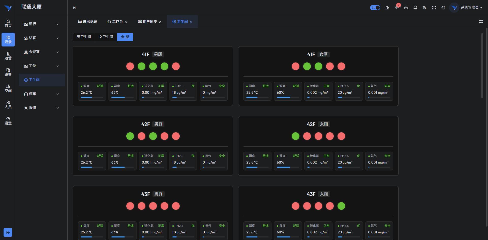
    *图 3-3 卫生间综合运行看板*

#### 3.2.2 卫生间空间列表管理
以列表形式集中管理所有卫生间的基础信息，支持多维度的筛选与查询。
*   **功能说明**：
    *   **层级筛选**：支持按“区域-楼栋-楼层”树状结构筛选卫生间。
    *   **列表信息**：展示卫生间名称、编号、类型（男/女/无障碍/母婴）、厕位数量及当前状态。
    *   **操作入口**：每条记录右侧提供“详情”、“编辑”、“删除”及“查看厕位”等操作按钮。
*   **界面展示**：
    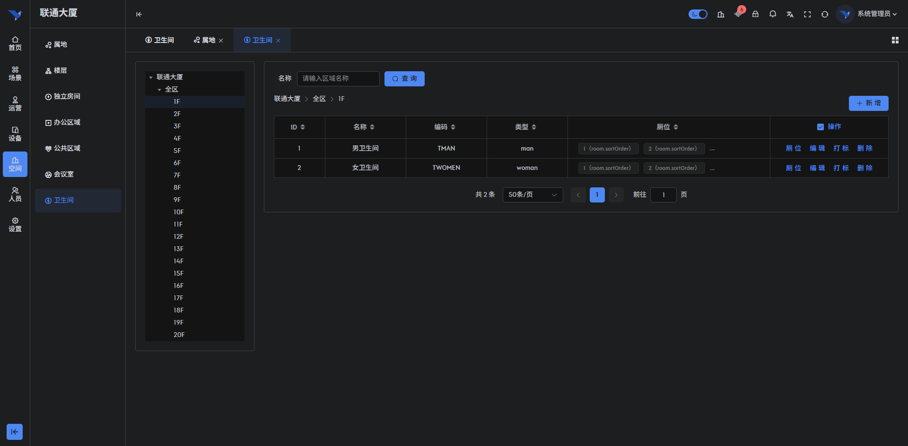
    *图 3-4 卫生间空间列表*

#### 3.2.3 厕位占用状态监控
深入到具体卫生间内部，以平面图形式展示每个隔间的实时占用情况。
*   **功能说明**：
    *   **可视化布局**：真实还原卫生间布局，包括厕位、小便池、洗手台位置。
    *   **实时状态**：厕位图标颜色随传感器状态实时变化（红色-有人、绿色-无人、灰色-维修）。
    *   **占用时长**：有人状态下显示已占用时长，超过阈值（如30分钟）自动标记为异常，提示可能的跌倒风险。
*   **界面展示**：
    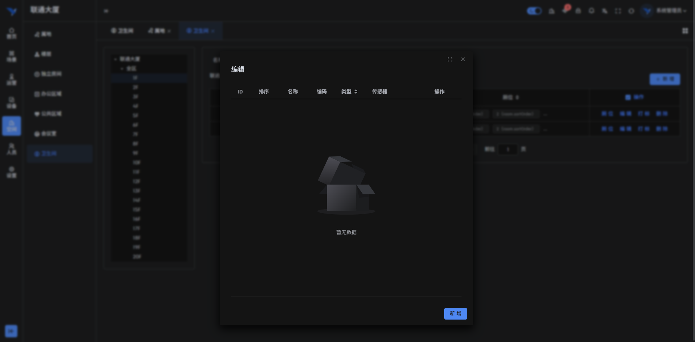
    *图 3-5 厕位实时占用监控*

### 3.3 卫生间空间数据维护

#### 3.3.1 空间信息打标
为卫生间空间添加业务标签，便于分类管理和规则绑定。
*   **功能说明**：
    *   **标签管理**：支持选择或新建标签，如“VIP专用”、“客流热点区域”、“设施老化”。
    *   **规则关联**：打标后可关联特定的清洁策略（如热点区域每30分钟清洁一次）。
*   **界面展示**：
    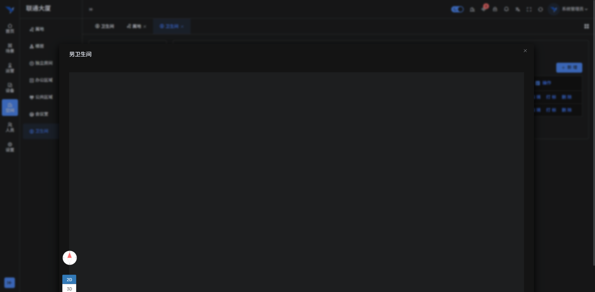
    *图 3-6 空间信息打标*

#### 3.3.2 新建卫生间
管理员可通过此功能在系统中注册新的卫生间空间节点。
*   **功能说明**：
    *   **基本信息**：填写卫生间名称、所属楼层、方位描述。
    *   **容量配置**：设置蹲便器、马桶、小便池、洗手台的具体数量，系统据此生成默认布局。
    *   **服务配置**：勾选该卫生间提供的服务设施（如提供纸巾、洗手液、烘干机、母婴台）。
*   **界面展示**：
    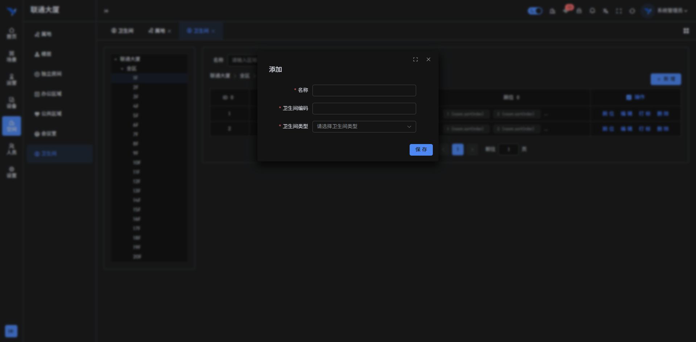
    *图 3-7 新建卫生间配置*

#### 3.3.3 编辑卫生间信息
对于已存在的卫生间，可随时更新其属性信息或状态。
*   **功能说明**：
    *   **状态变更**：手动设置卫生间状态为“维护中”，此时引导屏将提示用户前往临近卫生间。
    *   **参数调整**：修改厕位数量或服务设施信息，同步更新前端显示。
*   **界面展示**：
    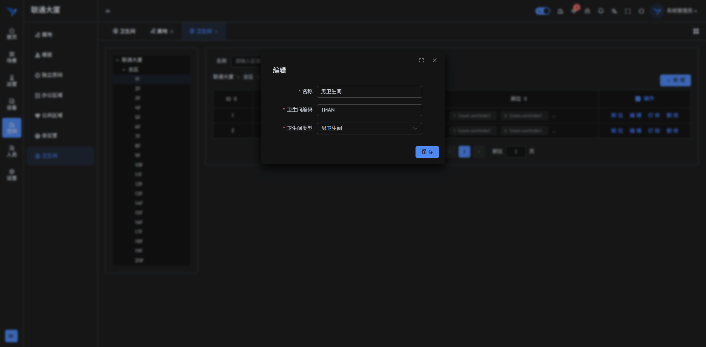
    *图 3-8 编辑卫生间信息*

### 3.4 智能设备管理

#### 3.4.1 传感器设备列表
集中管理部署在卫生间内的各类物联网设备，确保感知层的稳定运行。
*   **功能说明**：
    *   **设备台账**：列表展示设备名称、型号、MAC地址、安装位置及固件版本。
    *   **状态监控**：实时显示设备的在线/离线状态、最后上报时间及信号强度。
    *   **批量操作**：支持设备的批量导入、重启或固件升级。
*   **界面展示**：
    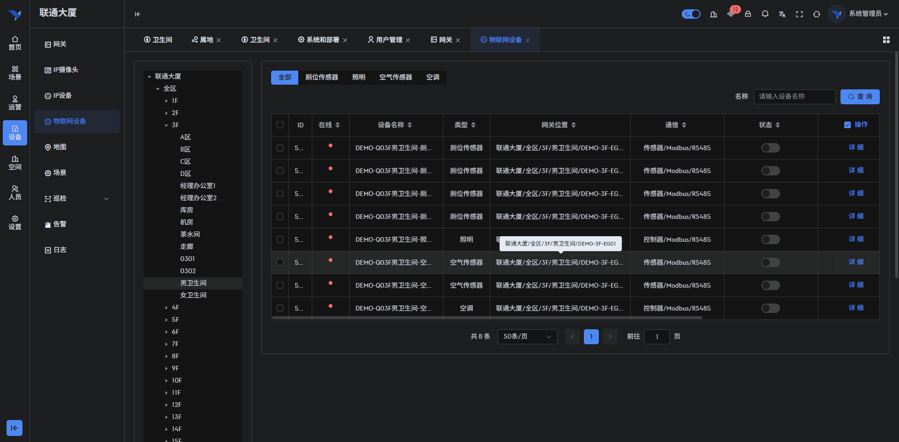
    *图 3-9 传感器设备列表*

#### 3.4.2 设备详情与运维
点击单台设备可查看其详细运行数据和历史日志。
*   **功能说明**：
    *   **实时数据**：展示传感器当前上报的数值（如NH3浓度：0.05ppm）。
    *   **历史曲线**：查看近24小时或7天的数值变化趋势图。
    *   **关联空间**：显示该设备绑定的具体厕位或区域，支持解绑或重新绑定操作。
*   **界面展示**：
    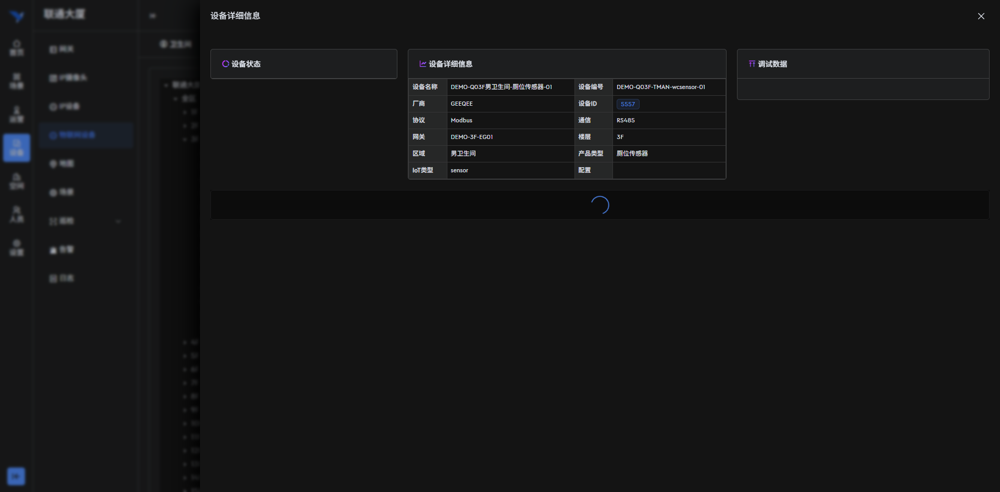
    *图 3-10 设备运行详情*

### 3.5 引导终端（PAD/大屏）操作

#### 3.5.1 引导屏首页展示
安装在卫生间门口的显示终端，面向用户提供直观的指引服务。
*   **功能说明**：
    *   **空闲统计**：大字号显示当前男/女厕的剩余空闲位数量。
    *   **平面指引**：图形化展示内部布局及空位位置，方便用户快速寻找。
    *   **环境公示**：实时公示当前的温度、湿度、异味等级，体现服务透明度。
    *   **公告轮播**：底部可配置轮播物业通知或温馨提示。
*   **界面展示**：
    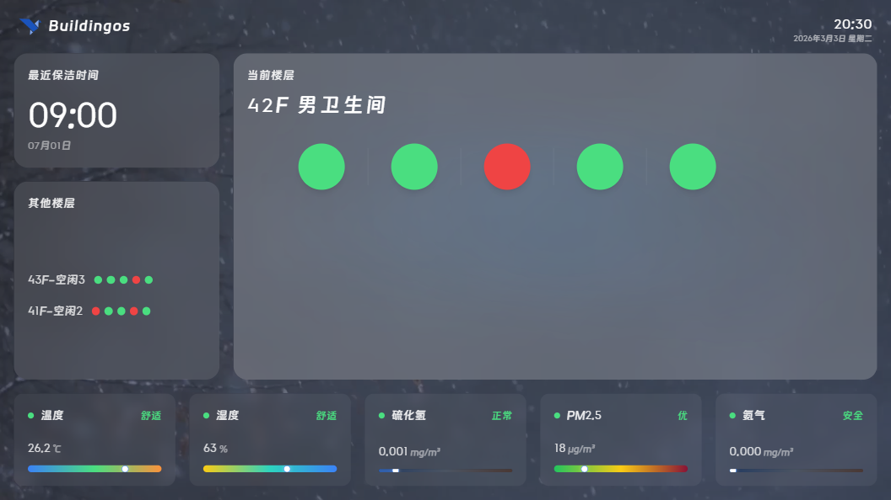
    *图 3-11 门口引导屏首页*

#### 3.5.2 终端初始化设置
新安装的引导终端需进行初始化配置才能接入系统。
*   **功能说明**：
    *   **服务器配置**：输入管理平台的IP地址或域名。
    *   **网络检测**：一键检测终端与服务端的网络连通性。
    *   **设备注册**：生成唯一的设备指纹并注册至云端。
*   **界面展示**：
    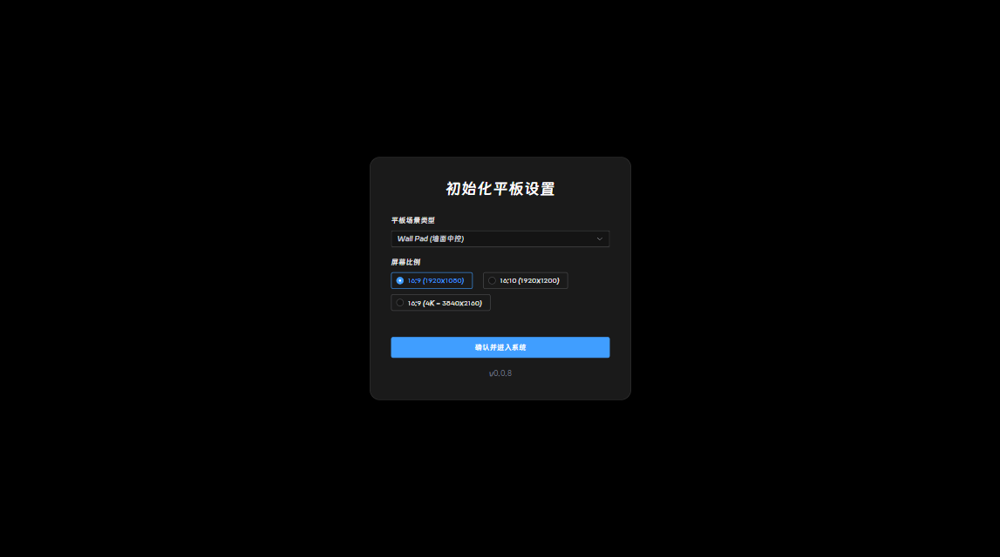
    *图 3-12 终端初始化配置*

#### 3.5.3 空间映射配置
将物理终端与系统中的逻辑卫生间空间进行绑定。
*   **功能说明**：
    *   **空间选择**：从下拉列表中选择该终端所在的具体卫生间（如“A座3F男厕”）。
    *   **显示模式**：选择横屏或竖屏显示模式，适配不同安装场景。
*   **界面展示**：
    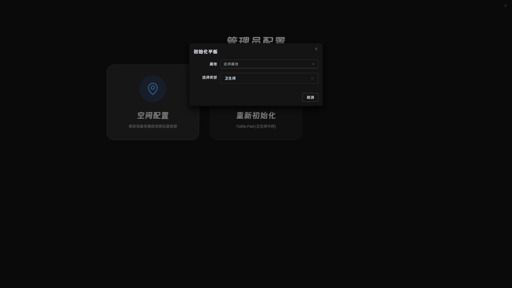
    *图 3-13 终端空间映射配置*

#### 3.5.4 管理员模式与权限
为防止误操作，终端的配置界面受密码保护。
*   **功能说明**：
    *   **安全验证**：进入配置菜单需输入管理员密码（默认为系统预设，建议修改）。
    *   **退出应用**：管理员权限下可退出APP返回安卓桌面进行系统维护。
    *   **日志上传**：手动上传终端运行日志以排查故障。
*   **界面展示**：
    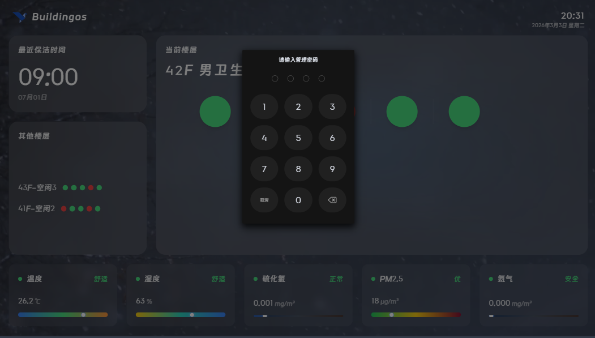
    *图 3-14 安全验证界面*
    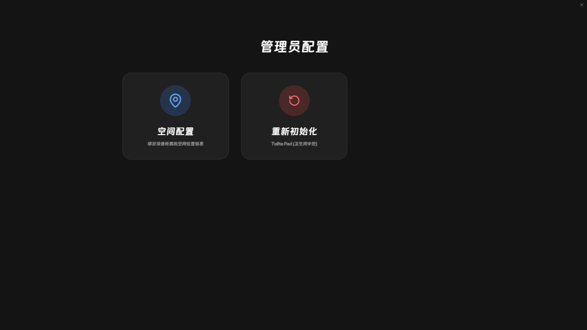
    *图 3-15 管理员维护菜单*
