# 操作说明书（智能楼宇AI感知物联系统 buildingos.visionCount）

## 目录

1. **引言**
    *   1.1 编写目的
    *   1.2 定义
2. **系统概述**
    *   2.1 系统用途
    *   2.2 软件功能概述
    *   2.3 软件运行环境
3. **系统操作使用**
    *   3.1 登录与系统首页
        *   3.1.1 系统登录
        *   3.1.2 系统状态总览（Dashboard）
    *   3.2 AI视频监控
        *   3.2.1 视频矩阵实时画面
        *   3.2.2 AI检测日志与事件
    *   3.3 摄像头管理
        *   3.3.1 区域分组管理
        *   3.3.2 摄像头添加与流地址配置
        *   3.3.3 通道保存与部署
    *   3.4 AI推理参数配置
        *   3.4.1 MQTT连接参数
        *   3.4.2 吸烟检测参数
        *   3.4.3 人员感知与占用参数
    *   3.5 本地大模型复核
        *   3.5.1 提示词模板选择
        *   3.5.2 图片推理测试
    *   3.6 占用日志与热力图
        *   3.6.1 区域与日期筛选
        *   3.6.2 占用热力图查看
        *   3.6.3 日志刷新与导出
    *   3.7 网络配置
        *   3.7.1 DHCP/静态IP切换
        *   3.7.2 静态网络参数设置
    *   3.8 系统运维管理
        *   3.8.1 系统信息与资源监控
        *   3.8.2 服务重启与系统更新
    *   3.9 节能联动
        *   3.9.1 无人消抖策略
        *   3.9.2 灯光空调联动控制

---

## 1. 引言

### 1.1 编写目的
本操作说明书旨在详细阐述《智能楼宇AI感知物联系统 buildingos.visionCount》的功能架构、操作流程及维护方法。文档面向楼宇能源管理人员、系统运维人员及安保人员，提供标准化的操作指引，帮助用户快速掌握从摄像头接入、AI推理参数配置、人员占用感知到节能联动控制的完整操作流程，实现办公区域人员感知的精准化与照明空调节能的智能化。

### 1.2 定义
*   **系统/本系统**：指《智能楼宇AI感知物联系统 buildingos.visionCount》。
*   **AI推理引擎**：部署于边缘推理主机（如NVIDIA Jetson Orin Nano）上的深度学习推理服务，负责对视频流进行目标检测与姿态估计。
*   **人员占用感知**：系统通过人体检测与姿态估计判断区域内是否存在人员，用于联动照明与空调的节能控制。
*   **吸烟检测**：系统对视频流进行吸烟行为识别，触发告警并联动记录证据。
*   **消抖窗口**：为防止误判而设置的时间窗口，在窗口内检测信号需持续满足条件才触发状态切换。
*   **MQTT**：系统内部组件间及与楼宇设备间通信的轻量级消息协议。

---

## 2. 系统概述

### 2.1 系统用途
《智能楼宇AI感知物联系统 buildingos.visionCount》是专为现代化智慧楼宇设计的边缘AI视觉感知与节能联动平台。系统以NVIDIA Jetson Orin Nano等边缘推理设备为核心，通过ZLMediaKit统一接入多路摄像头RTSP流，采用YOLO/RF-DETR等深度学习模型进行人体检测、姿态估计与吸烟行为识别，结合Node-RED业务编排实现空间融合、时段权重与消抖决策，最终通过MQTT协议联动照明与空调设备实现无人自动节能。系统同时提供Web管理界面，支持摄像头管理、AI参数配置、占用热力图查询与本地大模型复核，实现了"边缘感知、智能决策、节能联动"的完整闭环。

### 2.2 软件功能概述
本系统主要包含以下核心功能模块：
1.  **系统状态监控（Dashboard）**：实时展示边缘主机的CPU、内存、GPU利用率及系统资源指标。
2.  **AI视频监控**：以视频矩阵展示各摄像头实时画面，同步滚动展示AI检测日志与事件。
3.  **摄像头管理**：按区域分组管理摄像头，配置RTSP流地址并一键部署生效。
4.  **AI推理参数配置**：支持MQTT连接参数、吸烟检测置信度、人员感知置信度等在线调整。
5.  **本地大模型复核**：调用本地多模态大模型对可疑图片进行语义复核，降低误报。
6.  **占用日志与热力图**：按区域与日期查询人员占用记录，以热力图形式展示占用规律。
7.  **网络配置**：支持DHCP与静态IP两种网络模式切换。
8.  **节能联动**：基于人员占用状态与时段权重，自动下发灯光调暗/关闭、空调关闭等节能指令。

### 2.3 软件运行环境
*   **硬件环境**：
    *   **边缘推理主机**：NVIDIA Jetson Orin Nano（8GB统一内存、67 TOPS、JetPack 6.x），NVMe SSD≥256GB。
    *   **摄像机**：PoE网络摄像机，1080p/H.265编码，支持RTSP推流。
    *   **管理终端**：PC/平板浏览器，访问Web管理界面。
*   **软件环境**：
    *   **浏览器**：建议使用Google Chrome 80+、Microsoft Edge或Firefox等现代浏览器。
    *   **服务端系统**：Linux（Ubuntu 22.04，Jetson JetPack 6.x）。
    *   **运行依赖**：Docker、ZLMediaKit、Node-RED、Mosquitto MQTT、TensorRT/ONNX Runtime。

---

## 3. 系统操作使用

### 3.1 登录与系统首页

#### 3.1.1 系统登录
系统采用B/S架构，用户通过浏览器访问边缘主机IP即可进入登录界面。
*   **操作步骤**：
    1.  在浏览器地址栏输入系统访问地址（如 `http://<边缘主机IP>`）。
    2.  在登录框中输入分配的用户名和密码。
    3.  点击"登录"按钮，系统进行身份验证，验证通过后跳转至首页。
*   **界面展示**：
    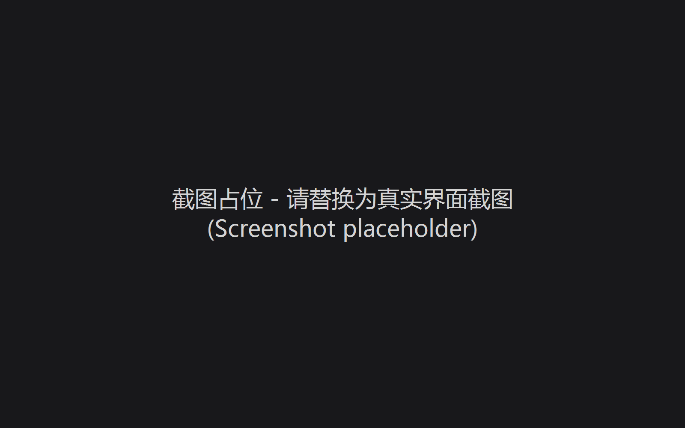
    *图 3-1 系统登录界面*

#### 3.1.2 系统状态总览（Dashboard）
登录成功后进入系统首页（Dashboard），实时展示边缘主机的运行状态与AI服务健康度。
*   **功能说明**：
    *   **系统信息卡片**：显示主板型号、CPU型号与核心数。
    *   **资源占用仪表盘**：以环形进度图展示CPU负载、内存占用、GPU利用率等关键指标。
    *   **服务状态**：展示AI推理服务、流媒体服务（ZLMediaKit）等组件的运行状态。
*   **界面展示**：
    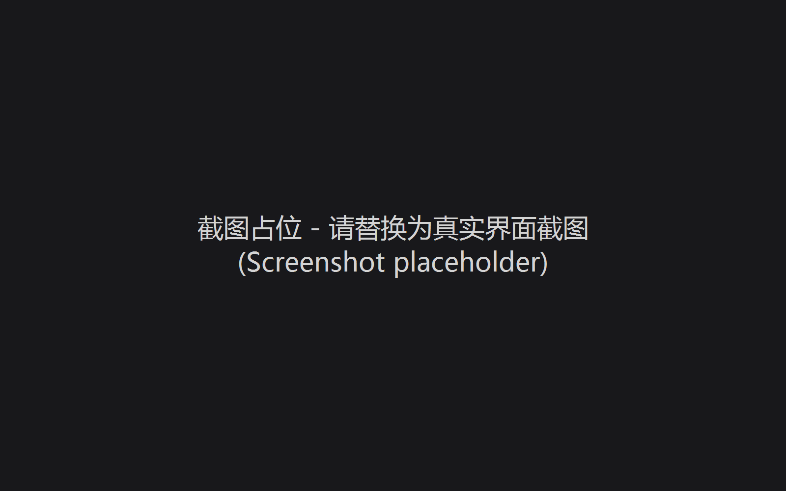
    *图 3-2 系统状态总览（Dashboard）*

### 3.2 AI视频监控

#### 3.2.1 视频矩阵实时画面
AI监控页面左侧以视频矩阵展示各摄像头实时画面，支持多路视频同屏播放。
*   **功能说明**：
    *   **视频矩阵**：按摄像头列表渲染多路实时画面，使用播放器组件解码显示。
    *   **在线计数**：页面顶部标签显示当前在线摄像头数量。
    *   **空状态提示**：未配置摄像头时显示"暂无配置"提示。
*   **操作步骤**：
    1.  进入"AI监控"页面。
    2.  查看各摄像头实时画面及AI检测叠加框。
    3.  观察顶部在线数量标签确认通道状态。
*   **界面展示**：
    
    *图 3-3 AI视频矩阵实时画面*

#### 3.2.2 AI检测日志与事件
页面右侧实时滚动展示AI检测日志与事件记录。
*   **功能说明**：
    *   **日志列表**：滚动展示吸烟检测、人员感知等事件的时间、摄像头编号与判定结果。
    *   **自动滚动开关**：通过开关控制日志是否自动滚动刷新。
*   **操作步骤**：
    1.  在AI监控页面右侧查看检测日志。
    2.  关闭"自动滚动"可暂停日志滚动以便查看历史记录。
*   **界面展示**：
    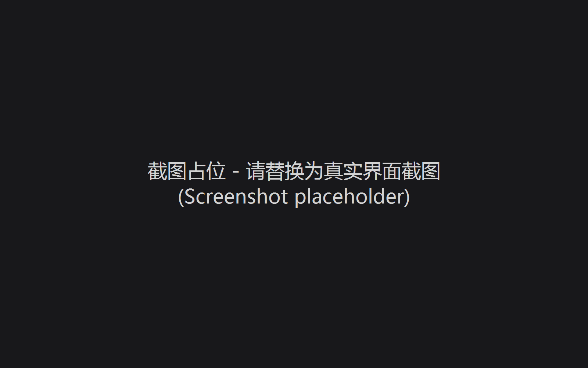
    *图 3-4 AI检测日志与事件*

### 3.3 摄像头管理

#### 3.3.1 区域分组管理
摄像头管理页面按区域（区域编码）对摄像头进行分组展示与管理。
*   **功能说明**：
    *   **区域分组**：按区域编码（如楼层）分组展示摄像头，未分配区域的摄像头归入"未分配区域"。
    *   **架构提示**：页面顶部以提示条说明摄像头→流媒体服务器→AI引擎的接入架构。
*   **操作步骤**：
    1.  进入"摄像头管理"页面。
    2.  查看按区域分组的摄像头列表。
*   **界面展示**：
    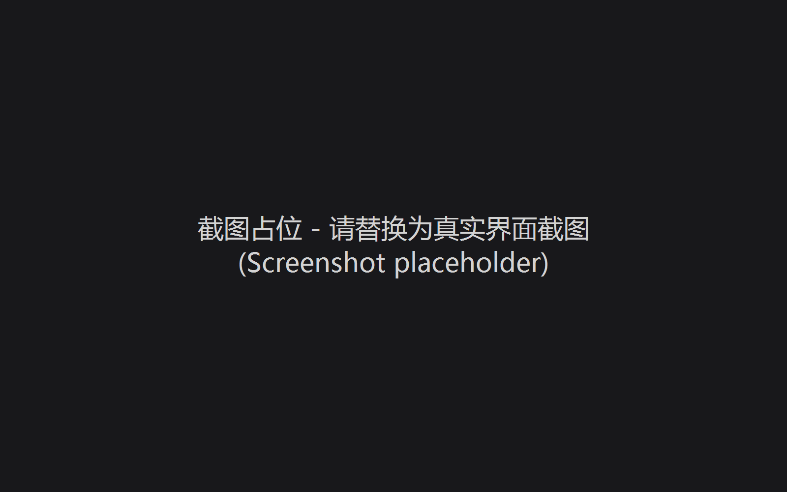
    *图 3-5 摄像头区域分组管理*

#### 3.3.2 摄像头添加与流地址配置
在分组内可添加摄像头并配置其流地址与区域信息。
*   **功能说明**：
    *   **区域选择**：指定摄像头所属区域编码。
    *   **流地址配置**：填写摄像头的RTSP拉流地址。
*   **操作步骤**：
    1.  在目标区域分组下点击"添加摄像头"。
    2.  填写摄像头名称、区域编码与RTSP流地址。
    3.  保存配置。
*   **界面展示**：
    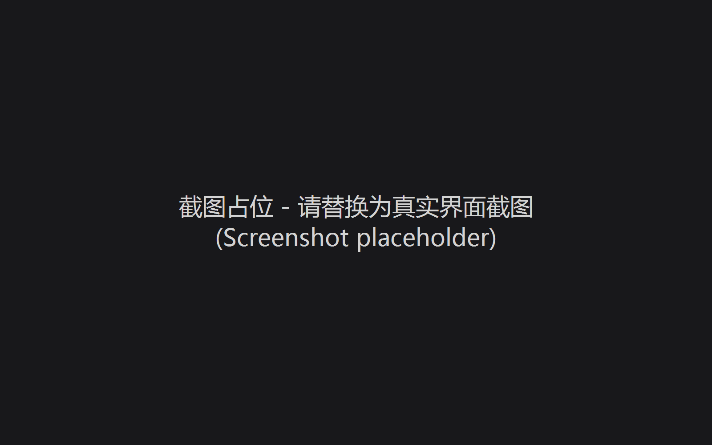
    *图 3-6 摄像头添加与流地址配置*

#### 3.3.3 通道保存与部署
配置完成后点击"保存"按钮，将摄像头配置下发至AI推理引擎与流媒体服务。
*   **功能说明**：
    *   **保存配置**：将当前所有摄像头配置持久化并通知AI引擎重新加载通道。
*   **操作步骤**：
    1.  完成摄像头增删改操作后点击右上角"保存"按钮。
    2.  系统提示保存成功，AI引擎自动重载通道配置。
*   **界面展示**：
    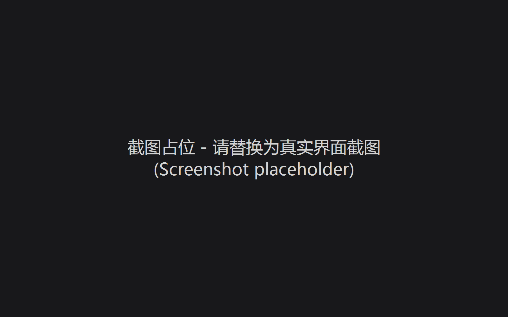
    *图 3-7 摄像头配置保存与部署*

### 3.4 AI推理参数配置

#### 3.4.1 MQTT连接参数
AI参数页面提供MQTT Broker连接参数的在线配置。
*   **功能说明**：
    *   **MQTT地址**：填写MQTT Broker的IP或域名。
    *   **端口**：填写MQTT服务端口。
    *   **心跳间隔**：设置MQTT连接心跳间隔（秒）。
*   **操作步骤**：
    1.  进入"AI参数"页面。
    2.  填写MQTT Broker地址、端口与心跳间隔。
    3.  点击"保存"使配置生效。
*   **界面展示**：
    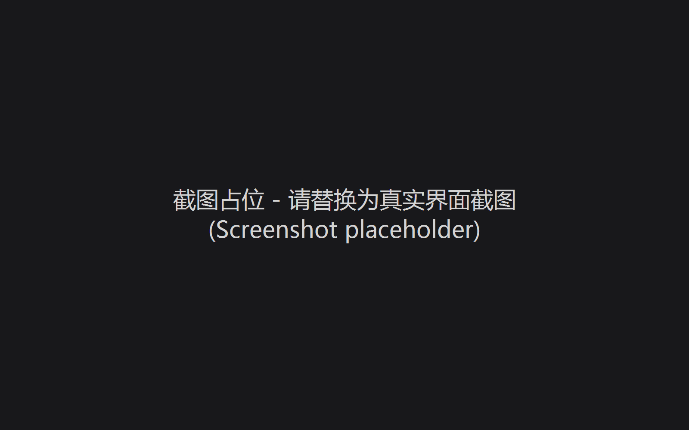
    *图 3-8 MQTT连接参数配置*

#### 3.4.2 吸烟检测参数
提供吸烟检测模型的置信度阈值配置。
*   **功能说明**：
    *   **置信度阈值**：通过滑块设置吸烟检测的置信度阈值（0-1），阈值越高误报越少但漏报风险增加。
*   **操作步骤**：
    1.  在"吸烟检测"分区拖动滑块调整置信度阈值。
    2.  保存配置后AI引擎按新阈值执行检测。
*   **界面展示**：
    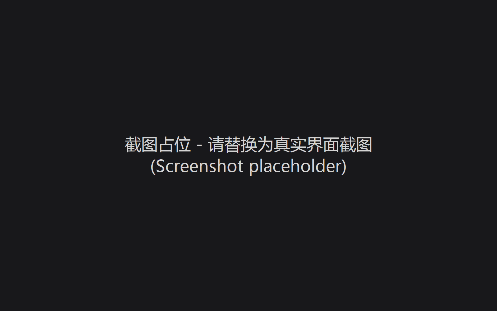
    *图 3-9 吸烟检测置信度配置*

#### 3.4.3 人员感知与占用参数
提供人员存在感知模型的置信度与判定参数配置。
*   **功能说明**：
    *   **人员感知置信度**：设置人体姿态检测的置信度阈值，用于人员占用判定。
*   **操作步骤**：
    1.  在"人员感知"分区调整置信度滑块。
    2.  保存配置，系统按新参数执行占用感知。
*   **界面展示**：
    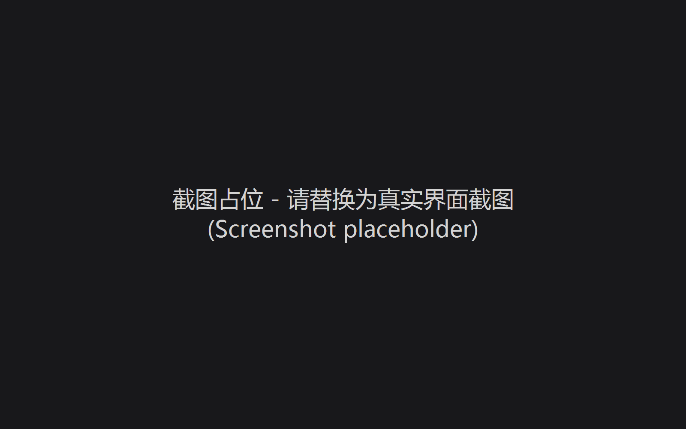
    *图 3-10 人员感知与占用参数配置*

### 3.5 本地大模型复核

#### 3.5.1 提示词模板选择
本地大模型页面支持选择预设提示词模板，用于对图片进行语义复核。
*   **功能说明**：
    *   **模板库**：提供"图片描述""吸烟检测""安全帽检测""人员存在检测"等预设模板。
    *   **自定义模板**：支持选择"自定义"并手动输入提示词。
*   **操作步骤**：
    1.  进入"本地大模型"页面。
    2.  在下拉框中选择提示词模板。
    3.  如需自定义，选择"custom"并输入提示词。
*   **界面展示**：
    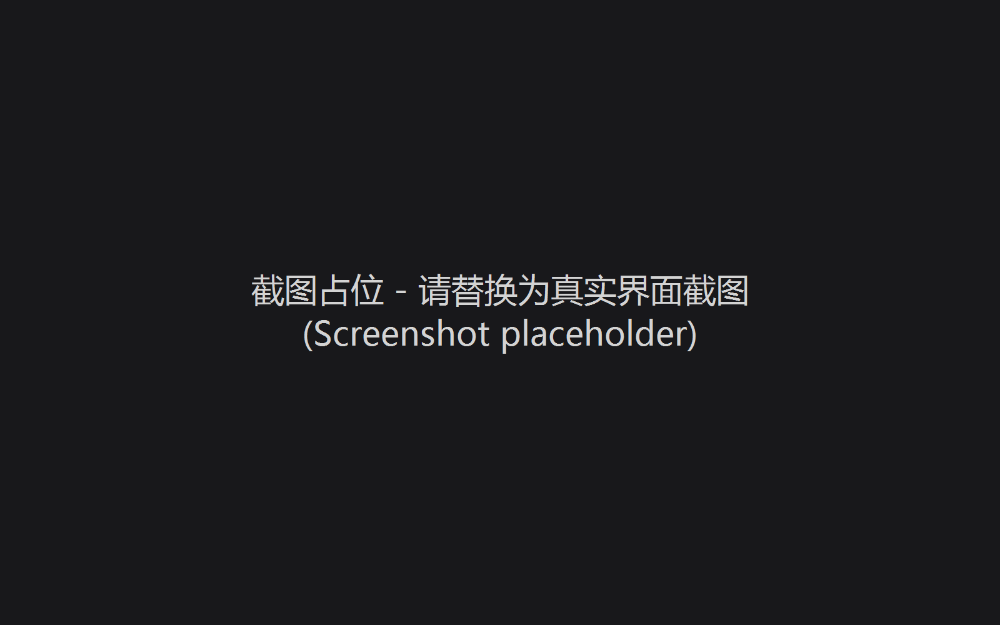
    *图 3-11 本地大模型提示词模板选择*

#### 3.5.2 图片推理测试
上传或选择图片后，系统调用本地多模态大模型进行推理并返回结果。
*   **功能说明**：
    *   **图片输入**：支持上传图片进行单张推理测试。
    *   **推理结果**：展示大模型的判定结论与理由说明。
*   **操作步骤**：
    1.  在本地大模型页面选择或上传图片。
    2.  点击"推理"按钮。
    3.  查看返回的判定结果与理由。
*   **界面展示**：
    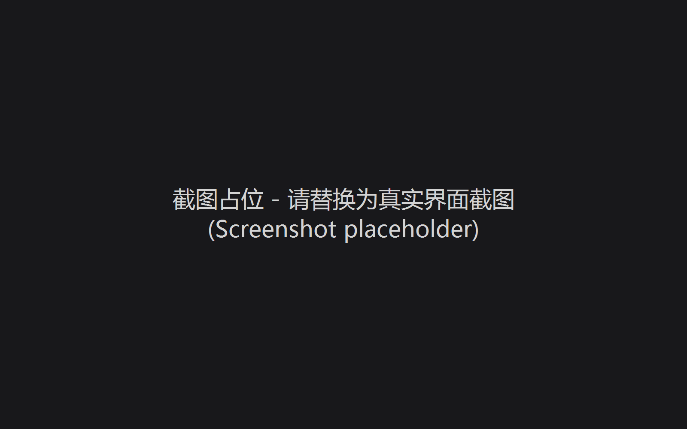
    *图 3-12 本地大模型图片推理测试*

### 3.6 占用日志与热力图

#### 3.6.1 区域与日期筛选
占用日志页面提供区域与日期范围筛选条件。
*   **功能说明**：
    *   **区域筛选**：下拉选择目标区域（如楼层/办公区）。
    *   **日期范围**：通过日期选择器设置查询起止日期。
*   **操作步骤**：
    1.  进入"占用日志"页面。
    2.  选择目标区域与日期范围。
    3.  点击"查询"加载数据。
*   **界面展示**：
    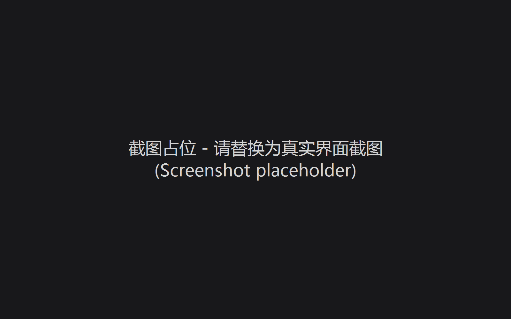
    *图 3-13 占用日志区域与日期筛选*

#### 3.6.2 占用热力图查看
以热力图形式展示各区域、各时段的人员占用情况。
*   **功能说明**：
    *   **热力图**：横轴为时间，纵轴为区域，颜色深浅表示占用程度。
    *   **占用规律**：直观呈现工作日高峰时段与无人时段。
*   **界面展示**：
    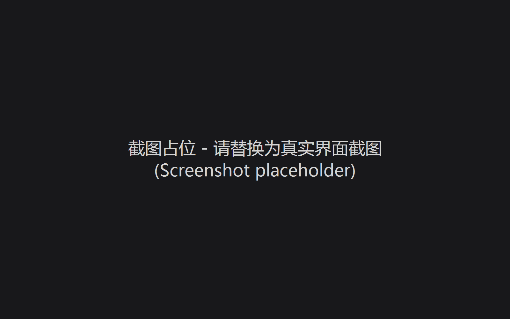
    *图 3-14 人员占用热力图*

#### 3.6.3 日志刷新与导出
支持手动刷新日志数据，并可通过"测试图"按钮验证检测功能。
*   **功能说明**：
    *   **刷新**：点击刷新按钮重新拉取日志数据。
    *   **测试图**：打开测试对话框进行单张图片检测验证。
*   **操作步骤**：
    1.  点击"刷新"按钮更新日志列表。
    2.  点击"测试图"按钮打开测试对话框。
*   **界面展示**：
    
    *图 3-15 占用日志刷新与测试*

### 3.7 网络配置

#### 3.7.1 DHCP/静态IP切换
网络配置页面支持DHCP自动获取与静态IP两种网络模式。
*   **功能说明**：
    *   **DHCP模式**：自动从路由器获取IP地址。
    *   **静态模式**：手动配置IP地址、子网掩码与网关。
*   **操作步骤**：
    1.  进入"网络"页面。
    2.  选择"DHCP"或"静态"模式。
    3.  静态模式下填写IP、掩码、网关并保存。
*   **界面展示**：
    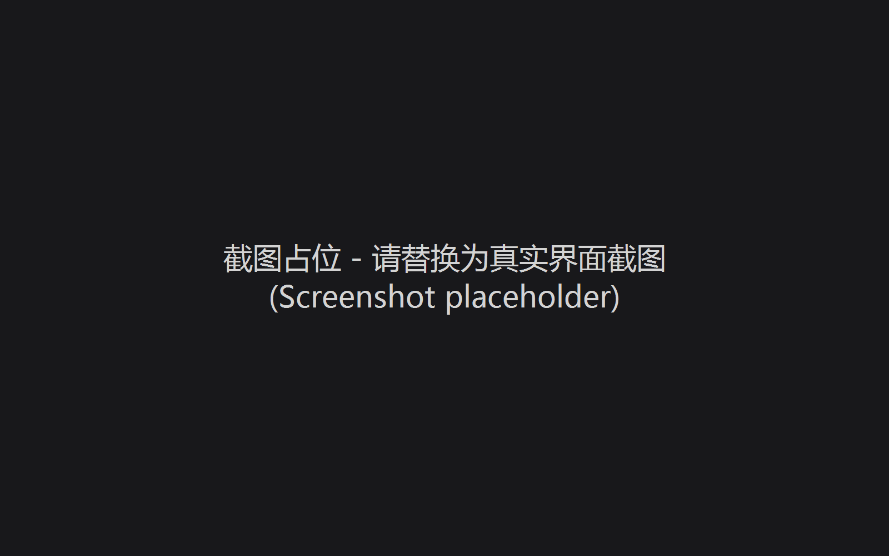
    *图 3-16 网络模式配置*

#### 3.7.2 静态网络参数设置
选择静态模式后可配置详细的网络参数。
*   **功能说明**：
    *   **IP地址**：填写边缘主机的静态IP。
    *   **子网掩码**：填写子网掩码（如255.255.255.0）。
    *   **网关**：填写默认网关地址。
*   **操作步骤**：
    1.  选择"静态"模式。
    2.  填写IP地址、子网掩码与网关。
    3.  点击保存使配置生效。
*   **界面展示**：
    
    *图 3-17 静态网络参数设置*

### 3.8 系统运维管理

#### 3.8.1 系统信息与资源监控
系统运维功能展示边缘主机的系统信息与资源占用情况。
*   **功能说明**：
    *   **系统信息**：展示主板、系统版本、运行时长等信息。
    *   **资源监控**：实时展示CPU、内存、GPU等资源占用率。
*   **操作步骤**：
    1.  进入"系统信息"页面。
    2.  查看边缘主机的资源占用与系统状态。
*   **界面展示**：
    
    *图 3-18 系统信息与资源监控*

#### 3.8.2 服务重启与系统更新
提供AI引擎、后端服务重启及系统更新等运维操作入口。
*   **功能说明**：
    *   **重启AI引擎**：重启AI推理服务。
    *   **重启后端**：重启Web管理后端服务。
    *   **系统更新**：执行系统升级。
*   **操作步骤**：
    1.  进入系统运维页面。
    2.  点击"重启AI引擎"或"重启后端"按钮。
    3.  确认操作后系统自动执行。
*   **界面展示**：
    
    *图 3-19 服务重启与系统更新*

### 3.9 节能联动

#### 3.9.1 无人消抖策略
系统依据人员占用状态与时段权重执行节能联动，通过消抖窗口避免频繁误动作。
*   **功能说明**：
    *   **决策窗口**：上班时段（09:00-19:00）窗口10分钟、加班时段（19:00-23:00）窗口15分钟、深夜时段窗口5分钟。
    *   **降级保护**：AI引擎异常时按时段采用"有人优先/无人优先"保底策略。
*   **操作步骤**：
    1.  确认系统已配置摄像头与联动设备。
    2.  观察系统按占用状态自动执行节能策略。
*   **界面展示**：
    
    *图 3-20 无人消抖节能联动策略*

#### 3.9.2 灯光空调联动控制
系统检测到区域无人持续超过消抖窗口后，通过MQTT下发灯光调暗/关闭与空调关闭指令。
*   **功能说明**：
    *   **灯光联动**：疑似无人5分钟灯光调暗至30%，无人8-10分钟关闭照明。
    *   **空调联动**：无人8-10分钟关闭空调。
*   **界面展示**：
    
    *图 3-21 灯光空调联动控制流程*
