# 操作说明书（智能楼宇访客系统 buildingos.visitor）

## 目录

1. **引言**
    *   1.1 编写目的
    *   1.2 定义
2. **系统概述**
    *   2.1 系统用途
    *   2.2 软件功能概述
    *   2.3 软件运行环境
3. **系统操作使用**
    *   3.1 登录与首页
        *   3.1.1 系统登录
        *   3.1.2 系统首页概览
    *   3.2 访客预约管理
        *   3.2.1 访客申请列表
        *   3.2.2 发起访客邀约/预约
        *   3.2.3 草稿箱管理
    *   3.3 访客状态全流程跟踪
        *   3.3.1 待到访管理
        *   3.3.2 已到访签到
        *   3.3.3 团体访客管理（部分到访）
        *   3.3.4 失效与取消管理
        *   3.3.5 异常监控与处理
    *   3.4 访客详情与审计
        *   3.4.1 申请详情查看
        *   3.4.2 访客通行轨迹
        *   3.4.3 访客评价反馈
    *   3.5 统计分析与系统配置
        *   3.5.1 访客数据统计
        *   3.5.2 全局参数设置

---

## 1. 引言

### 1.1 编写目的
本操作说明书旨在详细阐述《智能楼宇访客系统 buildingos.visitor》的功能架构、操作流程及维护方法。文档面向系统的最终用户（包括企业员工、前台接待人员、安保人员）以及系统管理员，提供标准化的操作指引，帮助用户快速掌握从访客邀约、审批、现场核验到离场注销的全流程操作，确保楼宇访客管理的规范化与安全性。

### 1.2 定义
*   **系统/本系统**：指《智能楼宇访客系统 buildingos.visitor》。
*   **访客单**：指包含访客个人信息、来访事由、被访人信息及预计来访时间等要素的电子单据。
*   **通行凭证**：指访客用于通过门禁闸机的电子媒介，通常为动态二维码、人脸特征或NFC卡片。
*   **签到/核验**：指访客到达现场后，通过自助机或人工台确认身份并激活通行权限的过程。

---

## 2. 系统概述

### 2.1 系统用途
《智能楼宇访客系统 buildingos.visitor》是专为现代化智慧楼宇和园区打造的数字化访客管理平台。系统取代了传统的纸质登记模式，通过微信小程序、Web端等多渠道实现访客的自助预约与邀请。系统与门禁、梯控、停车场系统深度联动，实现“一次登记、全域通行”，在提升访客接待体验的同时，通过实名制核验和黑白名单机制，有效构建楼宇安全防线。

### 2.2 软件功能概述
本系统主要包含以下核心功能模块：
1.  **多渠道预约**：支持员工发起邀约和访客自助申请，支持单人及团体预约。
2.  **智能审批流**：可配置多级审批流程，支持即时消息通知（短信/微信/钉钉）。
3.  **身份核验**：集成OCR证件识别、人证比对技术，确保来访人员身份真实有效。
4.  **通行联动**：自动下发门禁二维码或人脸权限，支持电梯派梯和车牌识别联动。
5.  **全流程状态监控**：实时监控访客从未到访、已签到、部分到访到已离开/失效的完整状态。
6.  **数据统计与审计**：提供可视化的访客数据报表，支持通行轨迹追溯与异常行为审计。

### 2.3 软件运行环境
*   **硬件环境**：
    *   **服务端**：推荐配置 8核 CPU，16GB 内存，512GB SSD 存储。
    *   **客户端**：支持 Windows/macOS 操作系统的 PC 机，建议屏幕分辨率 1920x1080 以上。
    *   **外设支持**：兼容主流身份证阅读器、访客一体机、二维码扫描枪及人脸识别终端。
*   **软件环境**：
    *   **浏览器**：建议使用 Google Chrome 80+、Microsoft Edge 或 Firefox 等现代浏览器。
    *   **服务端系统**：Linux (Ubuntu 20.04+/CentOS 7+) 或 Windows Server 2019。

---

## 3. 系统操作使用

### 3.1 登录与首页

#### 3.1.1 系统登录
系统采用B/S架构，用户通过浏览器访问指定网址即可进入登录界面。界面设计简洁大气，背景展示楼宇数字孪生效果，突显科技感。
*   **操作步骤**：
    1.  输入系统URL地址，回车加载登录页。
    2.  在登录框中输入分配的用户名（Username）和密码（Password）。
    3.  （可选）勾选“记住密码”以便下次快速登录。
    4.  点击“登录”按钮，系统进行身份验证，验证通过后跳转至首页。
*   **界面展示**：
    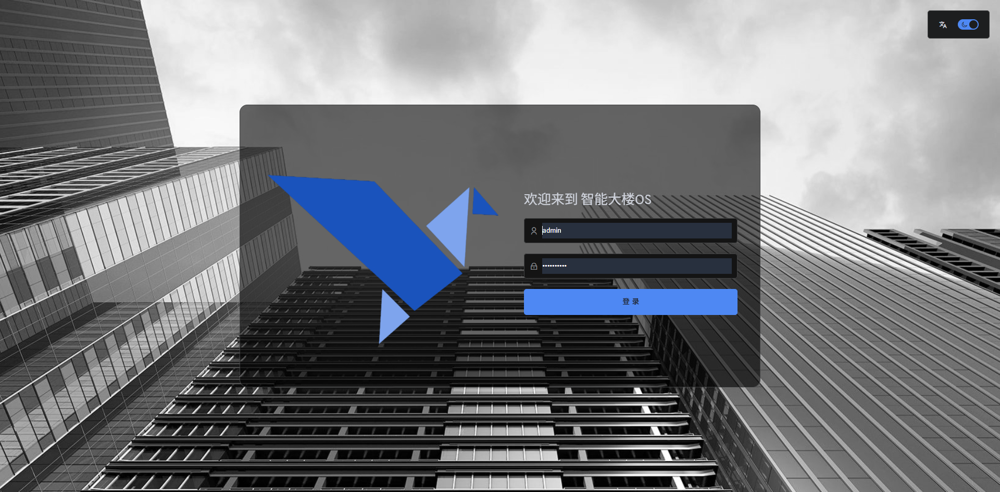
    *图 3-1 系统登录界面*

#### 3.1.2 系统首页概览
登录成功后进入系统首页（Dashboard）。首页作为工作台，聚合了访客管理的核心数据和快捷入口，帮助管理人员一目了然地掌握今日访客动态。
*   **功能说明**：
    *   **数据看板**：顶部卡片显示“今日预约人数”、“今日已到访人数”、“当前在园人数”等关键指标。
    *   **快捷导航**：左侧菜单栏提供“访客申请”、“访客统计”、“访客设置”等功能模块的快速切换。
    *   **待办事项**：展示当前待审批的访客申请，支持点击直接处理。
*   **界面展示**：
    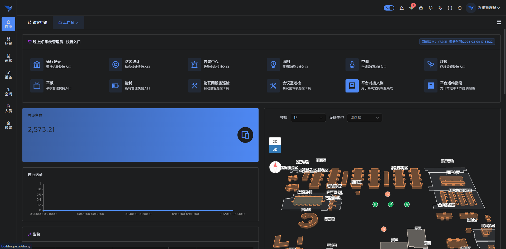
    *图 3-2 系统首页概览*

### 3.2 访客预约管理

#### 3.2.1 访客申请列表
该模块是访客管理的核心入口，集中展示了系统中所有的访客单据，支持多维度的查询与筛选。
*   **功能说明**：
    *   **综合查询**：顶部搜索栏支持按访客姓名、手机号、被访人、来访单位等关键词进行模糊搜索。
    *   **状态筛选**：通过标签页快速切换查看“全部”、“待到访”、“已到访”、“已失效”等不同状态的单据。
    *   **列表展示**：列表详细展示了访客姓名、来访时间、事由、同行人数、车辆信息及当前状态。
    *   **操作入口**：每条记录右侧提供“详情”、“审批”、“取消”等操作按钮。
*   **界面展示**：
    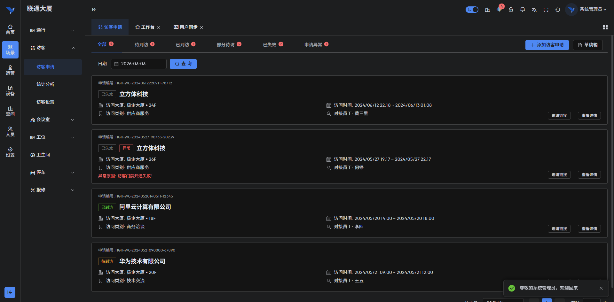
    *图 3-3 访客申请列表（全部）*

#### 3.2.2 发起访客邀约/预约
员工或前台接待人员可通过此功能主动发起访客邀约，或代为录入访客预约信息。
*   **功能说明**：
    *   **基本信息录入**：填写访客姓名、手机号（必填，用于接收通行二维码短信）、来访单位。
    *   **来访详情**：选择预计来访时间段、来访事由（商务/面试/快递等）。
    *   **被访人关联**：选择内部接待员工，系统自动关联其部门和办公楼层。
    *   **附加信息**：支持录入车牌号（联动停车场系统）和同行人员信息（支持批量导入）。
*   **界面展示**：
    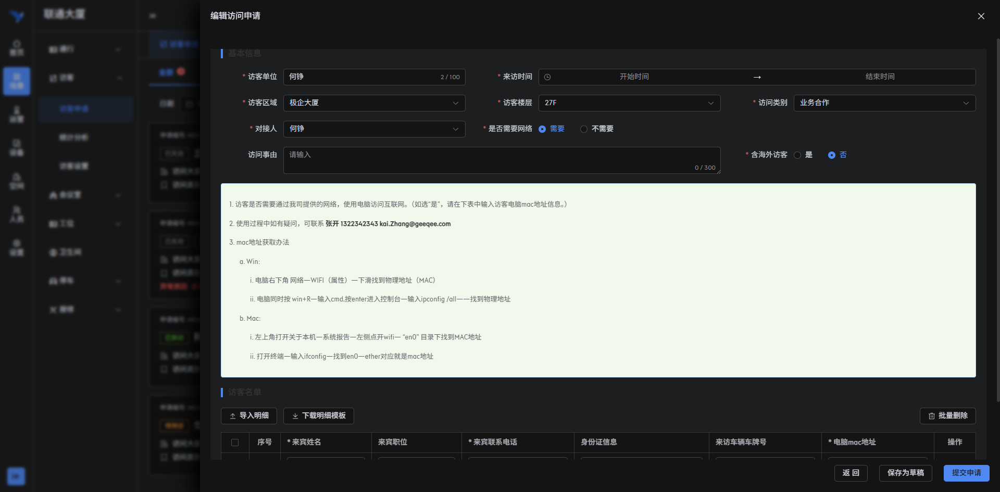
    *图 3-4 发起访客邀约界面*

#### 3.2.3 草稿箱管理
对于未填写完成或暂时不需要提交的访客单，系统自动保存至草稿箱，防止数据丢失。
*   **功能说明**：
    *   **断点续传**：用户在编辑过程中如意外退出，再次进入时可从草稿箱恢复编辑。
    *   **批量操作**：支持对草稿单据进行批量删除或批量提交审批。
*   **界面展示**：
    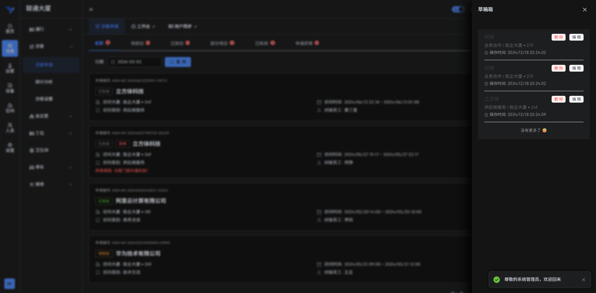
    *图 3-5 访客申请草稿箱*

### 3.3 访客状态全流程跟踪

#### 3.3.1 待到访管理
此列表展示已通过审批但尚未到达现场签到的访客单据。
*   **功能说明**：
    *   **预备状态**：此时系统已生成预访客记录，但尚未激活门禁权限（或仅激活大门权限）。
    *   **二维码重发**：若访客遗失短信，管理员可在此点击“重发短信”再次发送通行二维码。
*   **界面展示**：
    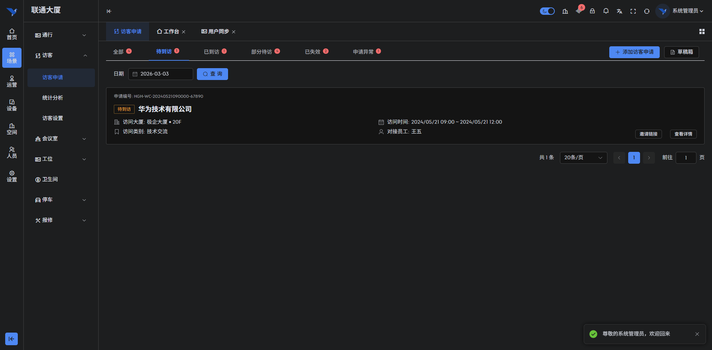
    *图 3-6 待到访访客列表*

#### 3.3.2 已到访签到
当访客在门岗或自助机完成身份核验（刷身份证/二维码/人脸）后，状态自动流转为“已到访”。
*   **功能说明**：
    *   **签到记录**：记录具体的签到时间、签到设备及签到方式。
    *   **权限激活**：系统自动下发梯控和内部区域门禁权限，并在列表中显示“权限已下发”标志。
    *   **离场签退**：管理员可在此手动执行“签退”操作，或由访客刷码离开时自动签退。
*   **界面展示**：
    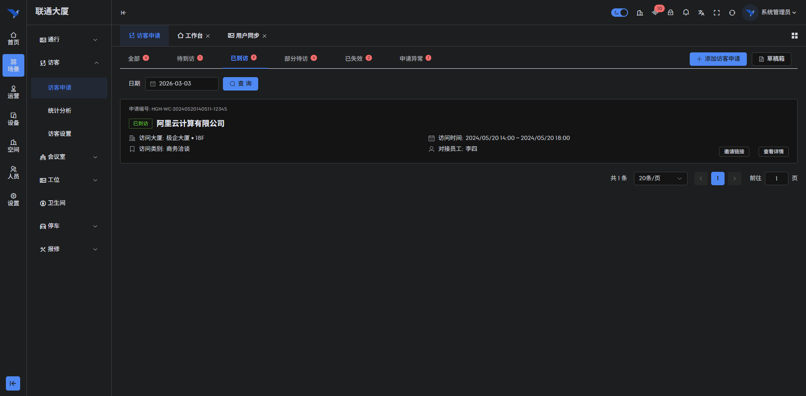
    *图 3-7 已到访访客列表*

#### 3.3.3 团体访客管理（部分到访）
针对多人同行的团体预约（如参观团、会议团），系统支持精细化的“部分到访”状态管理。
*   **功能说明**：
    *   **分批签到**：团体成员可分批次到达，系统实时更新已到访人数和未到访人数。
    *   **独立核验**：每位团员可拥有独立的身份核验记录，确保安防无死角。
*   **界面展示**：
    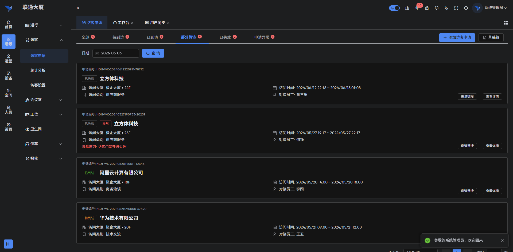
    *图 3-8 团体访客部分到访状态*

#### 3.3.4 失效与取消管理
此列表归档所有未在预约时间内到访（过期自动失效）或被手动取消/拒绝的申请单。
*   **功能说明**：
    *   **原因记录**：显示失效原因（如“超时未到”、“审批拒绝”、“用户取消”）。
    *   **历史追溯**：保留完整的单据快照，便于后续查询和重新发起邀约。
*   **界面展示**：
    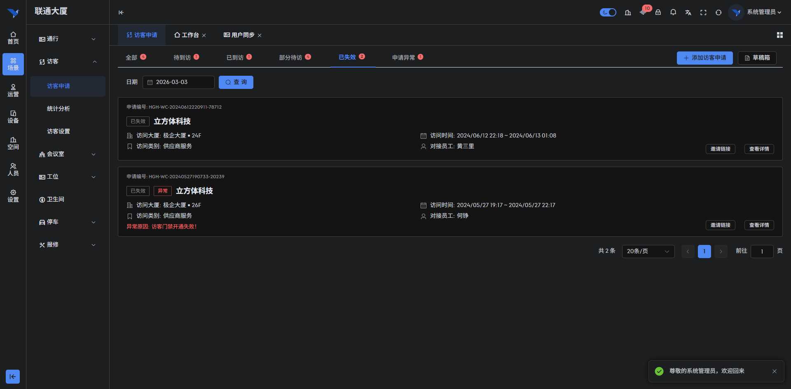
    *图 3-9 已失效/取消访客列表*

#### 3.3.5 异常监控与处理
系统具备智能风控能力，自动捕获并展示异常访客申请。
*   **功能说明**：
    *   **黑名单拦截**：若访客在系统黑名单中，申请将自动被拦截并标记为异常。
    *   **设备下发失败**：若门禁设备离线导致权限下发失败，系统会产生告警，管理员可点击“重试”进行手动补发。
*   **界面展示**：
    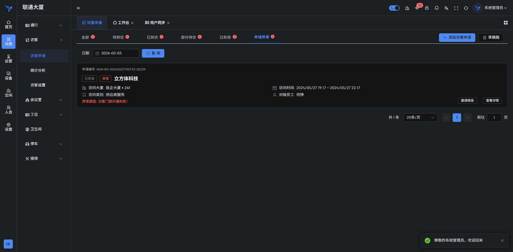
    *图 3-10 异常访客监控列表*

### 3.4 访客详情与审计

#### 3.4.1 申请详情查看
点击任意访客单的“详情”按钮，可查看该单据的全貌信息。
*   **功能说明**：
    *   **基本信息卡片**：展示访客头像、姓名、单位等基础资料。
    *   **业务流转信息**：显示预约时间、被访人、审批状态及当前流程节点。
    *   **权限概览**：列出该访客被授权通行的所有门禁点位和电梯楼层。
*   **界面展示**：
    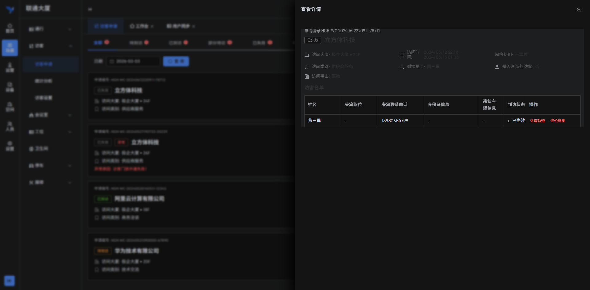
    *图 3-11 访客申请详情页*

#### 3.4.2 访客通行轨迹
系统详细记录访客在楼宇内的每一次通行行为，形成完整的活动轨迹。
*   **功能说明**：
    *   **轨迹时间轴**：以时间轴形式展示访客从入场、过闸、乘梯到出场的全过程。
    *   **抓拍照片**：每次通行均关联现场抓拍照片，点击可放大查看，确保人证合一。
*   **界面展示**：
    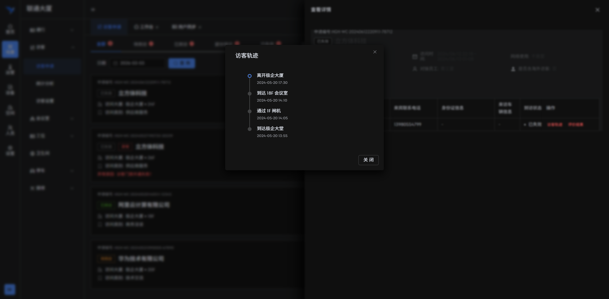
    *图 3-12 访客通行轨迹审计*

#### 3.4.3 访客评价反馈
访客离场后，系统可自动发送评价短信或链接，收集访客对接待服务的反馈。
*   **功能说明**：
    *   **评价维度**：包括接待态度、环境卫生、流程效率等打分项。
    *   **留言查看**：管理员可查看访客的具体文字留言，用于优化接待服务流程。
*   **界面展示**：
    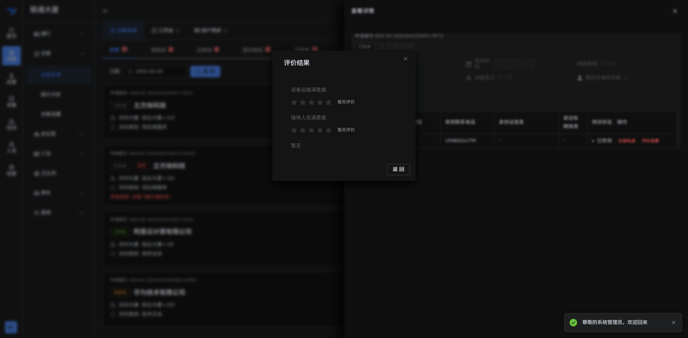
    *图 3-13 访客评价详情*

### 3.5 统计分析与系统配置

#### 3.5.1 访客数据统计
提供多维度的数据报表，辅助管理层进行决策分析。
*   **功能说明**：
    *   **流量趋势图**：展示近7天或30天的访客流量折线图，识别接待高峰期。
    *   **事由分布图**：饼图展示商务、面试、维修等各类来访事由的占比。
    *   **部门排名**：统计各部门的接待访客数量排名，评估部门对外活跃度。
*   **界面展示**：
    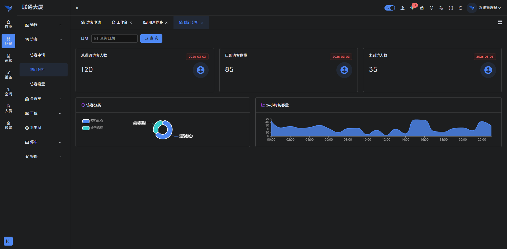
    *图 3-14 访客数据统计报表*

#### 3.5.2 全局参数设置
系统管理员可在此对访客系统的全局运行规则进行配置。
*   **功能说明**：
    *   **审批流配置**：自定义不同类型访客的审批层级（如VIP访客需行政总监审批）。
    *   **必填项设置**：配置预约时哪些字段为必填项（如健康码、车牌号）。
    *   **通知配置**：设置短信/邮件通知的模板和发送触发条件。
    *   **黑白名单**：维护系统的黑名单人员库，禁止特定人员来访。
*   **界面展示**：
    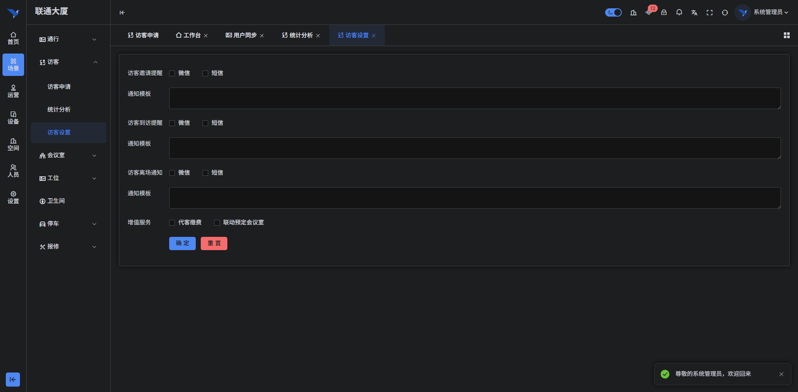
    *图 3-15 访客系统全局设置*
